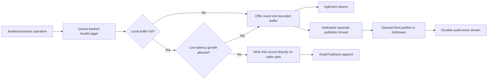
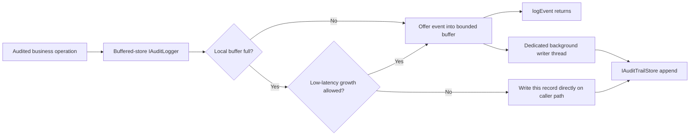

# ADR-0008 — Audit trail delivery mechanism: how a new `IAuditLogger` gets events to a durable, queryable store without adding hot-path latency under normal load, and without ever silently losing one

Created: 2026-09-08  
Last updated: 2026-09-11

**Status:** Accepted — implemented (2026-09-11). See the Implementation Note at the end of this document.

## Context

PayOS already has a regulatory audit-trail abstraction: `ma.s2m.payos.security.IAuditLogger` / `AuditEvent` / `AuditLogger` (static facade, SPI-resolved via `ma.s2m.payos.spi.SingleImplementationResolver`, `payos/src/main/java/ma/s2m/payos/security/`) / `Slf4jAuditLogger` (the kernel's shipped default). This is category 1 of the six dedicated event-category abstractions described in [`developer/event-category-payload-contracts-v7-2026-07-28.md`](../../developer/event-category-payload-contracts-v7-2026-07-28.md) — each category gets its own interface + facade + swappable implementation, never a shared payload-routing logger. 

`Slf4jAuditLogger` writes every `AuditEvent` as one JSON line to the SLF4J `AUDIT` logger category (`Slf4jAuditLogger.java:41-57`); its own class-doc already recommends routing that category to "a separate, protected, append-only appender with a minimum 12-month retention" — but the kernel's shipped `payos/src/main/resources/logback.xml` does not do this today: the `AUDIT` logger has no dedicated appender and falls through to `root`, which only has a synchronous `ConsoleAppender`. So the *reference implementation, as actually configured today*, writes audit events with a **synchronous, unbuffered I/O call on the caller's thread**, and has no independent durable store at all — logs are wherever stdout ends up.

We need a second `IAuditLogger` implementation backed by a real, independent, queryable audit store — most likely for PCI-DSS Req. 10 evidence retention, since `IAuditLogger` is already annotated as PCI-DSS Req. 10 tooling. The non-negotiable constraint driving this ADR: audit events are emitted frequently and some call sites (auth, authorization checks, API execution) sit directly in the request hot path (`AuditLogger.logAuthSuccess`, `logApiExecution`, etc. are called synchronously from request-handling code) — **whatever replaces or augments `Slf4jAuditLogger` must not add caller-blocking latency to that path.**

A proposal already on the table: give the new `IAuditLogger` implementation a configured `IQueueClient` and have it `publish(...)` each `AuditEvent`, with a separate, autonomous process (not embedded in `payos-runtime`) subscribing on the other side and writing to a new pluggable store interface.

A second, equally non-negotiable constraint refines the first, rather than relaxing it: **a business operation must never be allowed to complete without its corresponding audit event at least safely handed off for durable delivery.** Silently losing or dropping an audit event is strictly worse than adding latency to capture it. Put together, the two constraints mean: no added latency under normal load, but a deliberate overflow path when the system genuinely falls behind: the logger must try a non-blocking buffer handoff first and, if the buffer cannot accept the event, synchronously persist that audit record on the caller path rather than dropping it.

One more constraint worth naming explicitly: PayOS core has **no single canonical transactional database**. `$DB` (`IDatabaseService`) is optional, resolved per tenant/per application, and most of today's audit-worthy events (`AUTH_SUCCESS`, `AUTHZ_DENIED`, `SESSION_CREATED`, ...) originate in kernel security code that runs before or independent of any application's `$DB` transaction. This rules out solutions that assume a single local transaction to piggyback on.

## Options considered

### Option A — Keep synchronous local structured logging, fix the async appender, ship logs to a SIEM

Configure the `AUDIT` SLF4J category with a real async, protected appender (Logback `AsyncAppender` or a Log4j2 `AsyncLogger` — published benchmarks show 6–68× the throughput of a synchronous logger with materially lower and less variable latency, because the calling thread only hands the event to a lock-free ring buffer and returns; the actual disk write happens on a separate thread). Pair it with an external log-shipper (Filebeat/Fluent Bit/Vector — standard in PCI-DSS SIEM architectures) that tails the append-only file and forwards to a centralized, access-controlled, long-retention store.

- **Pros:** zero new infrastructure component to run or operate; zero code path added between the audit call and "audit is durable enough to survive the request" (durability moves entirely to the append-only file + shipper, which is the industry-standard PCI-DSS pattern — centralized SIEM ingestion from local logs); genuinely non-blocking once the appender is switched to async — this is the same "decouple producer from I/O via a bounded ring buffer" mechanism the user's queue proposal is reaching for, just applied to a local file instead of a network broker, with a mature, boring, extremely well-tested implementation (Log4j2's own async logger).
- **Cons:** "durable enough" depends on the local disk and the shipper's own reliability — a crash between the ring-buffer write and the fsync, or a shipper outage, can still lose events, with no framework-level retry/replay; the audit store is *whatever the SIEM vendor provides*, not something PayOS defines or owns behind a clean interface — no `IAuditTrailStore` abstraction, so swapping the downstream store means reconfiguring shipper+SIEM, not swapping a Java class; does not give PayOS itself a queryable audit API (`findAttempts`-style access, the way `NotificationStore` does) — consumers of the audit trail are stuck going through whatever the SIEM exposes; introduces an implicit dependency on an *operational* pipeline (log rotation, shipper health, SIEM ingestion) that lives entirely outside this codebase and outside test coverage.

### Option B — Queue-backed `IAuditLogger` with a bounded local buffer, synchronous overflow persistence, autonomous listener, and new `IAuditTrailStore` SPI (refined version of the proposal on the table)

A new `IAuditLogger` implementation (e.g. shipped from a new `audit-service-nats` module, registered via its own `META-INF/services/ma.s2m.payos.security.IAuditLogger` entry — no kernel code change, exactly as the existing SPI governing principle promises) does **not** call `IQueueClient.publish(destination, message)` synchronously from `logEvent(...)`. Instead: `logEvent(...)` attempts to hand the `AuditEvent` to a small in-process bounded queue with non-blocking `offer(...)` semantics and returns after the event is accepted by the buffer; one dedicated background thread drains that queue and performs the actual JetStream `publish(destination, QueueMessage)`, so the broker round-trip never touches the caller's thread under normal load. **If the local buffer cannot accept the event after any configured low-latency growth, `logEvent(...)` synchronously persists that audit record through the configured audit store path on the caller thread — the buffer is not a drop policy, and it should not force indefinite producer blocking.** This is the explicit design response to the second constraint in the Context section: no business operation may complete while silently losing its audit event, so a saturated buffer degrades to direct persistence for that record. Buffer occupancy and overflow direct writes are reported continuously through the existing `IMetricsRecorder`/`Diagnostics` facades so operators get an early warning — rising occupancy and overflow write latency — before saturation becomes a broader runtime problem.

On the other side, a new standalone process — structurally identical to `payos-service-notification`/`NotificationDaemon` — subscribes durably (`queueClient.subscribe(destination, AckMessageListener)`, the same JetStream durable-consumer mechanism `NotificationQueueConsumer` already uses) and writes each event to a new `IAuditTrailStore` interface, implementable by different backends (an append-only/WORM-shaped JDBC table, object storage with retention lock, filesystem, ...) the same way `NotificationStore` has `HibernateNotificationStore` and `FilesystemNotificationStore` today. The listener only acks after a successful store write (at-least-once delivery), so `IAuditTrailStore` implementations must dedupe by `AuditEvent`'s existing `eventId` to tolerate redelivery.

- **Pros:** genuinely zero hot-path network I/O once the publish is moved off the caller's thread under normal load (matches the first constraint exactly, not approximately); satisfies the second constraint by construction — full-buffer overflow becomes explicit synchronous persistence instead of silent discard; gives PayOS an actual owned abstraction for the audit store (`IAuditTrailStore`), independently swappable and independently queryable — unlike Option A, this is a real interface PayOS code can call to answer "show me this tenant's audit trail," not "hope the SIEM has an API"; the listener process is not a new architectural shape — it is the same shape `payos-service-notification` already validates in production-adjacent code (same `IQueueClient` durable-subscribe mechanism, same "own process, own bootstrap, own config" discipline the project's "Externalized Runtime" principle already calls for); durability of what *reaches* the store is strong (JetStream `StorageType.File`, at-least-once, durable consumer).
- **Cons:** a new operational component to deploy, monitor, and keep alive (the listener daemon) — real ops cost, same category of cost `payos-service-notification` already carries; direct overflow persistence means a sufficiently long broker, listener, or store slowdown stops being an isolated audit-subsystem problem and adds storage latency to audited hot-path calls, so overflow thresholds and alerts are safety-critical configuration; the in-process buffer is still not itself durable — a process crash with events already accepted into the buffer but not yet published still loses them, a residual gap overflow persistence alone does not close (see Decision); requires writing new code that does not exist anywhere in the codebase today (`IAuditTrailStore` and at least one real implementation, the buffering `IAuditLogger` implementation itself, the listener daemon) — Option A's core mechanism (async appender) is a configuration change to a mechanism (Log4j2/Logback async logging) that already ships with the logging library.

### Option C — Buffered direct-to-store `IAuditLogger` with no queue and no listener

This option keeps Option B's local buffer and overflow policy, but removes the queue and listener. `logEvent(...)` attempts a non-blocking `offer(...)` into a bounded in-process buffer. A dedicated background writer thread drains that buffer and writes each audit record directly to `IAuditTrailStore`. If the buffer cannot accept an event after any configured low-latency growth, `logEvent(...)` synchronously persists that single overflow record through `IAuditTrailStore` on the caller thread. Under normal load, the caller still avoids store I/O; under saturation, the current audit record is persisted directly rather than dropped or blocked indefinitely.

- **Pros:** simplest owned PayOS design that still satisfies the hot-path goal under normal load and the no-silent-loss goal under saturation; avoids the extra audit listener process; avoids broker availability, durable-consumer, stream-retention, and queue-configuration concerns for the MVP; keeps `IAuditTrailStore` as the single regulated persistence abstraction and query source; makes local filesystem or append-only database storage easier to reason about for single-node and multi-node deployments because audit records are written directly with node/chain-scope metadata rather than first becoming broker messages.
- **Cons:** the background writer and overflow path depend on the audit store being reachable from the runtime process; if the store is slow or unavailable, saturation degrades directly into caller-path storage latency or explicit audit persistence failure; the in-process buffer is still not durable, so a process crash can lose events accepted into the buffer but not yet written; it provides less decoupling than queue-backed delivery for deployments that want a broker as a shock absorber between runtime and storage; store implementations must handle concurrent background writes and caller-path overflow writes safely, including dedupe by `AuditEvent.eventId`.

### Option D — Transactional outbox pattern (write the audit event to a local outbox table in the same transaction as the business write; a relay ships it)

The classic answer to the dual-write problem: instead of "do the business action, then separately publish an event" (which can lose the event if the process crashes in between), write the event to an `outbox` table as part of the *same* database transaction as the business change, and have a separate relay process poll/tail that table and publish from there — turning two independent writes into one atomic one.

- **Pros:** the strongest consistency guarantee of any option here — if the business transaction commits, the audit event is guaranteed to exist and will eventually be published, full stop; well-documented, widely used pattern for exactly the "don't lose the event" problem this ADR is about.
- **Cons:** requires a shared transactional database to write the outbox row into *as part of* the same transaction as the audited action — PayOS core has no such thing (see Context): `$DB` is optional, per-tenant, per-application, and most of the audit events that matter most (`AUTH_SUCCESS`, `AUTHZ_DENIED`, session lifecycle) happen in kernel security code with no application transaction to piggyback on at all. Forcing a mandatory kernel-owned database purely to make audit logging transactional would add a hard infrastructure dependency the kernel does not otherwise require, contradicting "Architectural minimalism" and "Deployment agnostic" (project-context.md design principles) for a compliance feature that Options A, B, and C all satisfy without one. Ruled out for PayOS specifically, not as a pattern in general — it remains the right answer for a service that *does* own a per-request transactional database and needs event delivery to be atomic with a specific row change (e.g., a future payment-state-change → domain-event use case would be a better fit than audit).

### Option E — Treat the NATS JetStream stream itself as the audit trail store (drop the separate `IAuditTrailStore` + listener)

Publish audit events to a JetStream stream configured with the retention the audit trail needs, and treat that stream as the system of record — no downstream listener, no separate store interface.

- **Pros:** fewest moving parts of any durable option — no new process, no new store interface, reuses infrastructure (`queue-service-nats`) already operated for `payos-service-notification` and `QueueServer`.
- **Cons:** conflates "transport" with "regulated long-term store," which is precisely the separation of concerns Option B's `IAuditTrailStore` exists to preserve; JetStream is not a queryable/indexable store — there is no SQL, no search, no per-tenant/per-user query surface, so "show me this tenant's audit trail" has no answer without building exactly the kind of consumer Option B already proposes, just later and under more pressure; PCI-DSS retention (12 months, 3 immediately available) and access-control isolation for the audit store are awkward to enforce on a stream that the same broker also carries every other queue traffic (notifications, connector routing, etc.) through — mixing the regulator-mandated, access-restricted audit trail with general-purpose messaging infrastructure is a weaker isolation story than a dedicated store. Rejected as the end state; the underlying transport (JetStream) is still exactly what Option B uses between the logger and the listener — this option differs only in whether anything durable and queryable exists *behind* the stream.

### Option F — Change-data-capture (CDC) from a central database's write-ahead log

Tail a database's WAL/binlog (e.g. Debezium) and derive audit events from committed row changes, avoiding any explicit "log this" call at the application layer entirely.

- **Pros:** cannot miss an event that was actually committed, by construction — CDC reads what the database itself guarantees was durably written; zero application code has to remember to call an audit API.
- **Cons:** same blocker as Option D — there is no single canonical PayOS database to tail; most audit-worthy events (auth, authorization, session lifecycle) are not row changes in any database at all, so CDC would only ever cover the subset of events backed by `$DB`, missing the kernel security events that are `IAuditLogger`'s primary reason for existing today. Ruled out without further comparison for PayOS's actual event mix.

## Decision

Adopt **Option C**: buffered direct-to-store `IAuditLogger` with no queue and no listener for the MVP.

1. The new `IAuditLogger` implementation must decouple the caller from audit-store I/O under normal load through a bounded local buffer and one dedicated background writer thread draining it into `IAuditTrailStore`. Calling the store inline from every `logEvent(...)` would violate the hot-path constraint this ADR exists to satisfy.
2. The buffer must never drop an event: `logEvent(...)` must use non-blocking `offer(...)` for the normal handoff and, if the buffer cannot accept the event after any configured low-latency growth, synchronously persist that audit record on the caller path. A business operation is not allowed to complete while silently losing its audit event, so overflow storage latency is the accepted cost, not a drop or indefinite producer block.
3. `IAuditTrailStore` is a new interface (mirroring `NotificationStore`'s shape: a narrow, purpose-built contract, not a generic key-value store) with implementations chosen by the operator. Implementations must dedupe by `AuditEvent.eventId` because background writes and caller-path overflow writes may race with retries or repeated submissions.
4. Queue-backed delivery from Option B remains a valid future implementation category for deployments that need broker-mediated decoupling, but it is not the chosen MVP because it adds an audit listener and broker operations that the direct-store option avoids.

Option A is not rejected outright — given the second constraint (no business operation may proceed without a corresponding audit entry), it remains useful as a companion for the *crash-while-buffered* gap: an event already accepted into the in-process buffer, but not yet written to the audit store, is still lost if the process dies at that exact moment. Fixing the missing async `AUDIT`-appender configuration (currently absent from `logback.xml`, contradicting `Slf4jAuditLogger`'s own class-doc guidance) costs little, and keeping `Slf4jAuditLogger` writing in parallel with the new buffered-store implementation can reduce that residual window if the deployment requires local-file evidence in addition to the audit store.

Option D and Option F are rejected for PayOS specifically because the kernel has no canonical transactional database to make either pattern atomic against — this is an architectural fact about PayOS today (`$DB` is optional and per-tenant), not a judgment that outbox/CDC are bad patterns in general; they remain the right tool for a future feature that already owns a per-request transaction and needs atomicity with a specific row change.

Option E is rejected as an end state: it under-delivers on exactly the two properties Options B and C are designed to provide — a queryable, independently-retained, access-isolated regulated store. It is effectively "queue transport as store," not a regulated audit-store design.

## Consequences

- **Positive:** both non-negotiable constraints are satisfied by construction, not by assumption: normal audit capture avoids store and broker round trips on the caller path, and overflow direct persistence makes it structurally impossible for a business operation to proceed while its audit event was silently discarded. PayOS gains an owned, queryable `IAuditTrailStore` abstraction, independently swappable per the same SPI/facade pattern already proven for the other five event categories. The MVP avoids a new listener daemon and avoids making queue infrastructure mandatory for audit trail storage. Fixing the `AUDIT` appender gap in `logback.xml` remains a small, immediately actionable side effect of this ADR.
- **Negative:** overflow direct persistence means a store outage or slowdown long enough to saturate the buffer can add storage latency to audited hot-path calls, so buffer size, overflow thresholds, and alerting are safety-critical configuration, not tuning knobs to leave at defaults. The in-process buffer is still not durable, so an event already accepted but not yet written is lost on a process crash at that exact moment. `IAuditTrailStore` implementations must handle concurrent background and caller-path writes correctly and dedupe by `eventId`.
- **Neutral / open follow-up:** exact module/package layout for the buffered-store `IAuditLogger`, `IAuditTrailStore`, and its first concrete implementation is an implementation-story decision, not fixed by this ADR. Buffer capacity is also left to the implementation story, but must be chosen deliberately: large enough to absorb realistic store hiccups without frequent overflow writes, small enough that the crash-loss window it implies stays acceptable alongside any local-file companion logging. Queue-backed delivery remains a future implementation category if a deployment later needs broker-mediated decoupling.
- See [`developer/event-category-payload-contracts-v7-2026-07-28.md`](../../developer/event-category-payload-contracts-v7-2026-07-28.md) for the governing per-category-abstraction principle this ADR's new `IAuditLogger` implementation must keep following, and [`architecture/queue-architecture.md`](../queue-architecture.md) for the `IQueueClient`/NATS mechanics relevant if the queue-backed category is implemented later.

## Implementation Note (2026-09-11)

Option C was implemented essentially as decided, across `payos-foundation` (contracts), `payos` kernel (SPI resolution/wiring), `payos-buffered-audit-trail` (the `buffered-store` `IAuditLogger`), and `payos-audit-trail-store-filesystem` (the first `IAuditTrailStore` implementation). Operator-facing documentation: [operations/audit-trail.md](../../operations/audit-trail.md) and [configuration/audit-trail.md](../../configuration/audit-trail.md).

- Bounded buffer + background writer + synchronous overflow-on-full, exactly as decided; `append(...)` is idempotent by `eventId` via a bounded per-tenant dedup cache, as required.
- The queue-backed category (Option B) remains an unimplemented future extension point, per the Decision — its structural feasibility (resolvable via the same SPI, can share the same `IAuditTrailStore` without kernel changes) was proven with a test double, not built as a real implementation.
- One correctness detail this ADR's diagrams didn't anticipate: the background writer must poll with a bounded timeout rather than block indefinitely on the buffer, because a buffer-growth swap can otherwise abandon an already-blocked consumer permanently. See the writer's own Javadoc (`BufferedAuditLogger.Writer`) for the race and the fix — a concurrency test caught it during implementation.
- **Not done**: this ADR's own flagged "small, immediately actionable" companion fix — giving the `AUDIT` SLF4J category a real async, protected appender in `logback.xml` — was not part of this implementation and remains exactly the gap this ADR originally described. The buffered-store `IAuditLogger`'s own in-process buffer is also still not durable across a process crash, same residual gap this ADR named for Option C; nothing in the implementation closes it.
- Two capabilities beyond this ADR's original scope were added during implementation, driven by the epics/architecture documents written after this ADR: `businessKeys` (an allowlisted, scalar-only, indexable subset of business context) and integrity verification (a per-partition SHA-256 hash chain with an explicit `verify(...)` operation). Neither changes this ADR's decision, both are additive to `AuditEvent`/`IAuditTrailStore`.
