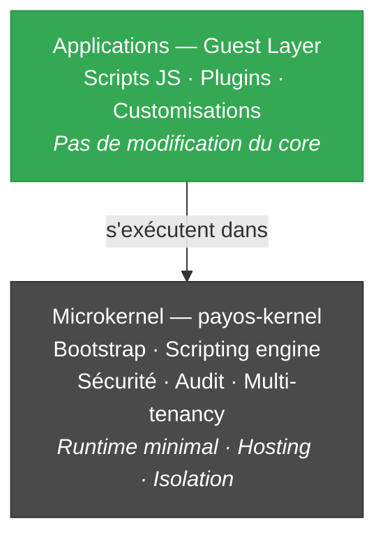
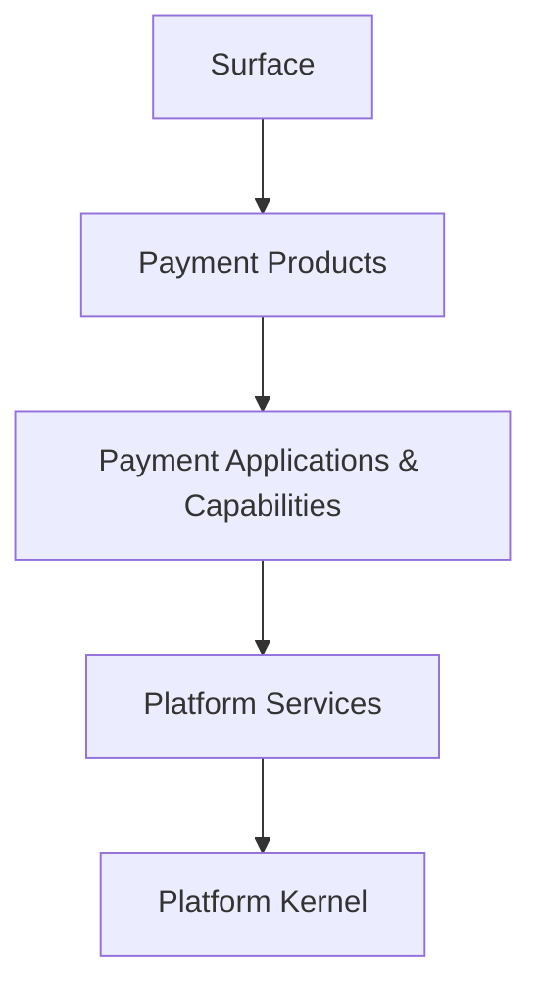

# PayOS — Style d'architecture

## Le style dominant : **Microkernel (Plugin Architecture)**

C'est l'ossature principale de PayOS, explicitement revendiquée :

> *"Rigid Core + Flexible Guest Layer (High performance core, extensibility without modifying the core)"*  
> *"Externalized Runtime (Applications run inside the runtime; app <> server)"*

### Indices structurels

- `BootServer` — kernel minimal qui héberge tout
- Scripts JS (GraalVM Polyglot) = plugins/guests qui s'exécutent dans le runtime
- Découverte runtime de plugins TCP via JAR scanning (`TcpMessageDecoder`, `TcpMessageHandler`)
- Hot-reload de configuration (`ConfigWatcher`)
- Bindings injectés (`$Api`, `$App`, `$DB`, `$Queue`, `$Response`, `$Principal`…) = la seule API exposée aux guests

---

## Les styles complémentaires

### 1. **Modular Monolith**

> *"Modular by design (clear boundaries and replaceable modules, no tight coupling)"*

Modules découplés mais déployables ensemble (dans un runtime) :  
`payos-kernel` · `payos-server-http` · `payos-server-tcp` · `payos-server-queue` · `database-service` · `queue-service-nats` · `webhook-service-http`

Communication par interfaces (`IServer`, `IQueueClient`, `IAuditLogger`, `ISecurityService`, `IScriptingEngine`, ...) — chaque implémentation peut être remplacée sans toucher au kernel.

### 2. **Layered Architecture**

5 couches strictement ordonnées :

Une couche n'appelle que celle du dessous. La surface est la **seule porte d'entrée** légale.

### 3. **Event-Driven (asynchrone)**

> *"Queue/MoM support with NATS client"*

Les flux asynchrones (notifications, webhooks, événements de paiement) passent par NATS via :
- `payos-server-queue` — consommation
- `webhook-service-http` — émission
- `queue-service-nats` — client MoM

Pattern publish/subscribe assumé sur l'ensemble des flux non-bloquants.

### 4. **API-First**

> *"API-First"* — premier principe d'identité plateforme

Le contrat API précède l'implémentation — d'où les headers gouvernés :
- `Authorization: Bearer …` (auth)
- `X-Tenant-Id` (isolation)
- `X-Correlation-Id` (traçabilité)
- Versioning explicite (`/api/v1/…`)

### 5. **Multi-tenant by Architecture**

> *"Native Multi-tenancy (Isolation is enforced by architecture, not configuration)"*

L'isolation tenant n'est pas une option configurable — c'est **structurel** :
- `TenantPolicyService` — validation et quotas
- `TenantScope` — propagation MDC AutoCloseable
- Headers tenant propagés sur toute la chaîne (HTTP, TCP, Queue)

---

## Synthèse

> **PayOS est un microkernel modulaire, multi-tenant natif, layered et API-first, avec une couche d'extension par scripts isolés (sandbox GraalVM) et une intégration event-driven asynchrone via MoM (NATS).**

### Ce qui le distingue

| Comparaison | Différence |
|---|---|
| **Application monolithique** | Séparation kernel/guests, extensibilité sans recompilation |
| **Microservices** | Pas de prolifération de services réseau — runtime unique hébergeant des extensions |

### Le nom révèle l'intention

PayOS est en fait très proche d'un **système d'exploitation** :
- Le **kernel** fournit les primitives : sécurité, runtime, hosting, isolation
- Les **applications de paiement** (Gateway, Switch, Wallet…) sont des **guests** qui tournent dessus
- Les **partenaires/clients** étendent via scripts isolés — comme on installerait des apps sur un OS

D'où le nom : **PayOS = un OS pour applications de paiement**.

---

## Cartographie des styles → décisions d'implémentation

| Style | Conséquence concrète |
|---|---|
| Microkernel | Pas de framework lourd dans le kernel · Scripts JS pour customiser · Plugins TCP par découverte JAR |
| Modular Monolith | Interfaces I-prefixed · Modules sibling avec leurs propres `pom.xml` · `payos-bom` pour aligner versions |
| Layered | Surface = seule entrée · Pas d'accès direct DB/queues/runtime depuis l'externe |
| Event-Driven | NATS pour événements · Webhooks versionnés · Async par défaut sur les flux non-critiques en latence |
| API-First | Headers gouvernés · `/v1/` versioning · OIDC obligatoire · Sandboxes pour onboarding |
| Multi-tenant native | `TenantScope` MDC · Quotas par tenant · Audit avec `tenantId` partout |
