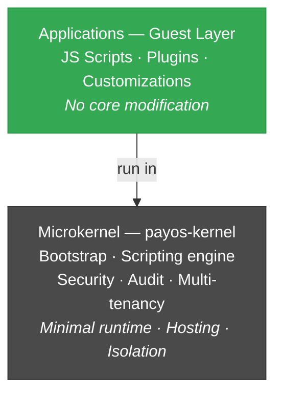
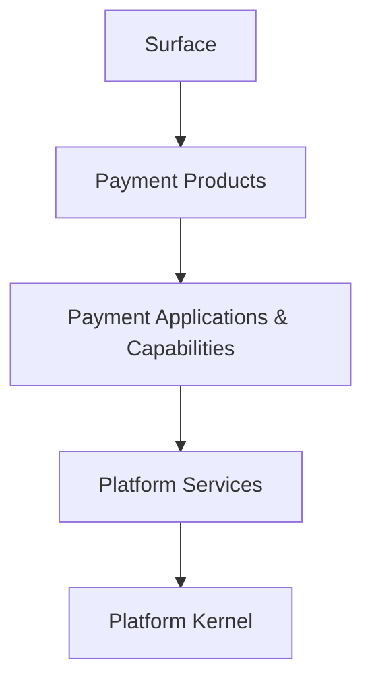

# PayOS — Architecture style

## The dominant style: **Microkernel (Plugin Architecture)**

This is the main backbone of PayOS, explicitly claimed:

> *"Rigid Core + Flexible Guest Layer (High performance core, extensibility without modifying the core)"*  
> *"Externalized Runtime (Applications run inside the runtime; app <> server)"*

### Structural indices

- `BootServer` — minimal kernel that hosts everything
- JS scripts (GraalVM Polyglot) = plugins/guests that run in the runtime
- Runtime discovery of TCP plugins via JAR scanning (`TcpMessageDecoder`, `TcpMessageHandler`)
- Configuration hot-reload (`ConfigWatcher`)
- Injected Bindings (`$Api`, `$App`, `$DB`, `$Queue`, `$Response`, `$Principal`…) = the only API exposed to guests

---

## Complementary styles

### 1. **Modular Monolith**

> *"Modular by design (clear boundaries and replaceable modules, no tight coupling)"*

Decoupled modules but deployable together (in a runtime):  
`payos-kernel` · `payos-server-http` · `payos-server-tcp` · `payos-server-queue` · `database-service` · `queue-service-nats` · `webhook-service-http`

Communication via interfaces (`IServer`, `IQueueClient`, `IAuditLogger`, `ISecurityService`, `IScriptingEngine`, ...) — each implementation can be replaced without touching the kernel.

### 2. **Layered Architecture**

5 strictly ordered layers:

A layer calls only the one below. The surface is the **only legal entry point**.

### 3. **Event-Driven (asynchronous)**

> *"Queue/MoM support with NATS client"*

Asynchronous flows (notifications, webhooks, payment events) pass through NATS via:
- `payos-server-queue` — consumption
- `webhook-service-http` — broadcast
- `queue-service-nats` — MoM client

Pattern publish/subscribe assumed on all non-blocking flows.

### 4. **API-First**

> *"API-First"* — first principle of platform identity

The API contract precedes the implementation — hence the governed headers:
- `Authorization: Bearer …` (auth)
- `X-Tenant-Id` (isolation)
- `X-Correlation-Id` (traceability)
- Explicit versioning (`/api/v1/…`)

### 5. **Multi-tenant by Architecture**

> *"Native Multi-tenancy (Isolation is enforced by architecture, not configuration)"*

Tenant isolation is not a configurable option — it is **structural**:
- `TenantPolicyService` — validation and quotas
- `TenantScope` — MDC AutoCloseable propagation
- Headers held propagated throughout the chain (HTTP, TCP, Queue)

---

## Summary

> **PayOS is a modular, multi-tenant native, layered and API-first microkernel, with an extension layer by isolated scripts (GraalVM sandbox) and asynchronous event-driven integration via MoM (NATS).**

### What sets it apart

| Comparison | Difference |
|---|---|
| **Monolithic application** | Kernel/guest separation, extensibility without recompilation |
| **Microservices** | No proliferation of network services — single runtime hosting extensions |

### The name reveals the intention

PayOS is actually very close to an **operating system**:
- The **kernel** provides the primitives: security, runtime, hosting, isolation
- The **payment applications** (Gateway, Switch, Wallet, etc.) are **guests** that run on them
- **Partners/customers** extend via isolated scripts — like installing apps on an OS

Hence the name: **PayOS = an OS for payment applications**.

---

## Style mapping → implementation decisions

| Style | Concrete consequence |
|---|---|
| Microkernel | No heavy framework in the kernel · JS scripts to customize · TCP plugins by JAR discovery |
| Modular Monolith | I-prefixed interfaces · Sibling modules with their own `pom.xml` · `payos-bom` to align versions |
| Layered | Surface = only entry · No direct access to DB/queues/runtime from external |
| Event-Driven | NATS for events · Versioned webhooks · Async by default on non-latency-critical flows |
| API-First | Governed headers · `/v1/` versioning · Mandatory OIDC · Sandboxes for onboarding |
| Native multi-tenant | `TenantScope` MDC · Quotas per tenant · Audit with `tenantId` everywhere |