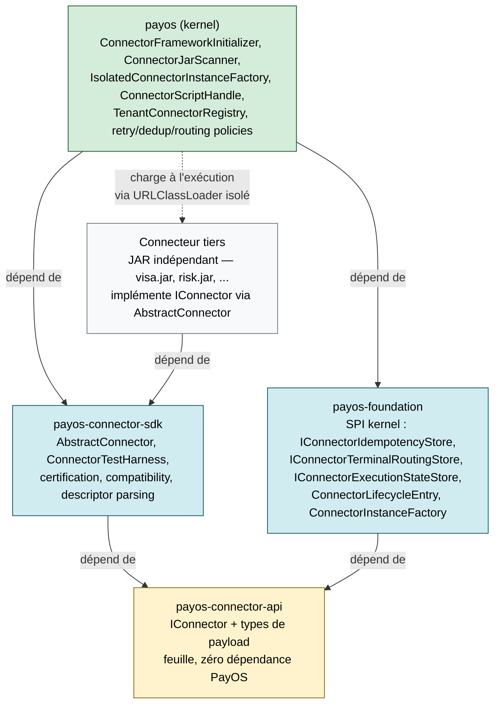
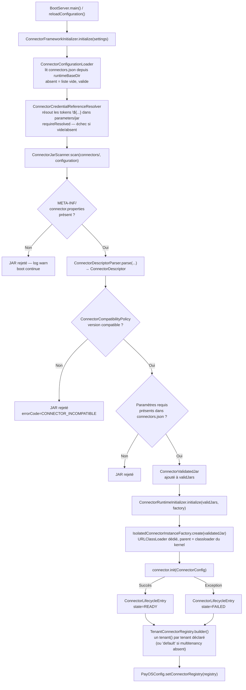
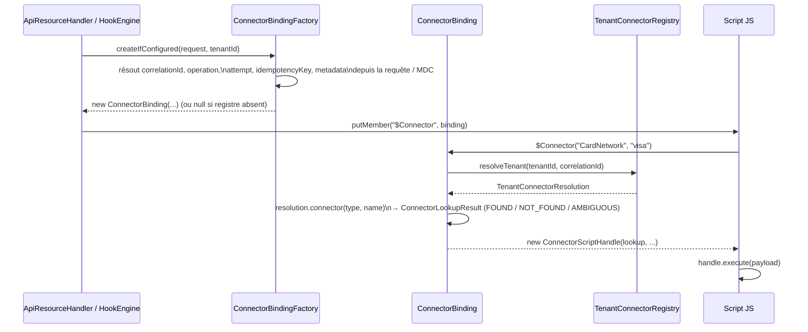
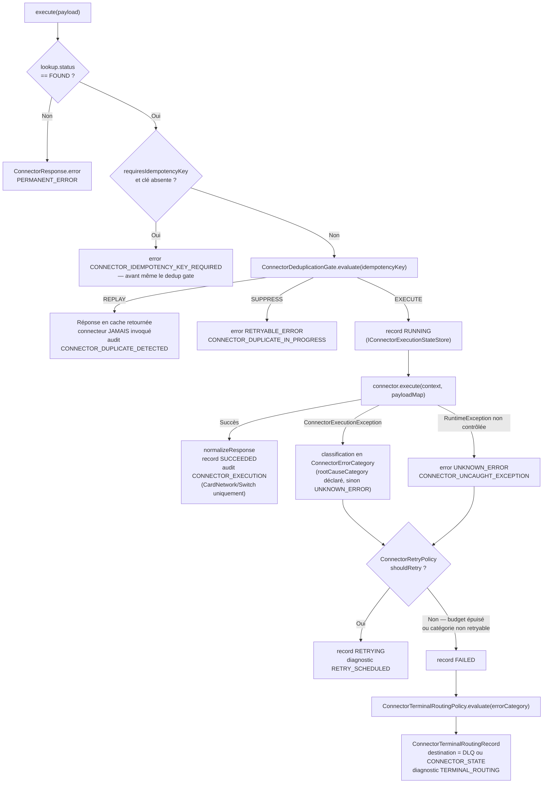
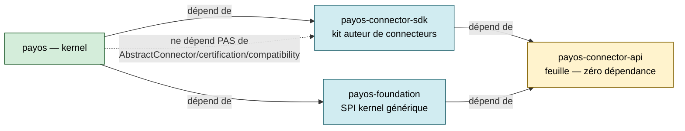

# Architecture — Framework Connector (business/payment)

**Audience :** architectes, tech leads, contributeurs au kernel, auteurs de connecteurs tiers
**Périmètre :** modules `payos-connector-api`, `payos-connector-sdk`, le SPI connecteur de `payos-foundation`, l'intégration runtime dans `payos` (kernel)
**Created :** 2026-08-24
**Dernière mise à jour :** 2026-08-24
**Version :** v1

---

## Table des matières

1. [Contexte et objectif](#1-contexte-et-objectif)
2. [Vue d'ensemble — les quatre couches](#2-vue-densemble--les-quatre-couches)
3. [`payos-connector-api` — le contrat partagé](#3-payos-connector-api--le-contrat-partagé)
4. [`payos-connector-sdk` — le kit pour auteurs de connecteurs](#4-payos-connector-sdk--le-kit-pour-auteurs-de-connecteurs)
5. [`payos-foundation` — le SPI côté kernel pour l'état des connecteurs](#5-payos-foundation--le-spi-côté-kernel-pour-létat-des-connecteurs)
6. [Le kernel (`payos`) — le runtime](#6-le-kernel-payos--le-runtime)
   - [6.1 Chargement au démarrage](#61-chargement-au-démarrage)
   - [6.2 Résolution depuis un script — `$Connector(...)`](#62-résolution-depuis-un-script--connector)
   - [6.3 Le cycle `execute()` complet](#63-le-cycle-execute-complet)
   - [6.4 Hot reload](#64-hot-reload)
   - [6.5 Arrêt](#65-arrêt)
   - [6.6 Health et diagnostics](#66-health-et-diagnostics)
7. [Graphe de dépendances Maven](#7-graphe-de-dépendances-maven)
8. [Écrire un connecteur](#8-écrire-un-connecteur)
9. [Ce framework n'est pas le service-adapter loader](#9-ce-framework-nest-pas-le-service-adapter-loader)
10. [Références](#10-références)

---

## 1. Contexte et objectif

PayOS expose un mécanisme de plugin dédié aux intégrations métier de paiement — réseaux de cartes, switchs, PSP, scoring fraude — invocable depuis les scripts JS via `$Connector(type[, name]).execute(payload)`. Un connecteur est un JAR indépendant, écrit par une équipe qui n'a pas accès au code du kernel, chargé dynamiquement au démarrage et à chaud.

**Ce document décrit uniquement ce mécanisme.** PayOS a un second mécanisme, plus ancien, qui utilise aussi le mot « connecteur » — le chargeur SPI générique pour les backends database/queue/secret/webhook (`ServiceAdapterLoader`, répertoire `service-adapters-dir`, voir [secret-provider-architecture.md](secret-provider-architecture.md) et [ADR-0002](adr/0002-spi-connectors-for-services.md)). Les deux sont indépendants et ne partagent aucun code — la [section 9](#9-ce-framework-nest-pas-le-service-adapter-loader) détaille la distinction.

Quatre contraintes ont façonné l'architecture en quatre modules distincts :

- **Le kernel ne doit dépendre que d'un contrat, jamais d'une implémentation** — un connecteur est un JAR tiers, potentiellement écrit par un partenaire, jamais compilé avec le kernel.
- **Le SDK donné aux auteurs de connecteurs doit rester indépendant du kernel** — un connecteur ne doit jamais avoir accès, même transitivement, aux SPI internes du kernel (secrets, sécurité, scripting). Voir [§3](#3-payos-connector-api--le-contrat-partagé) et [§7](#7-graphe-de-dépendances-maven) pour comment cette contrainte a été obtenue sans dépendance circulaire.
- **La plateforme, jamais le connecteur, décide de la déduplication, du retry et du routing d'erreur** — un connecteur exécute une opération et retourne un résultat ; il ne voit jamais les décisions de la plateforme autour de cette exécution. Voir [connector-framework-parameters-v3-2026-08-11.md](../configuration/connector-framework-parameters-v3-2026-08-11.md) §6–§11 pour le détail exhaustif de ces règles.
- **Le classloading est isolé par connecteur** — un connecteur A ne peut jamais voir les classes d'un connecteur B, même si les deux sont chargés dans le même processus.

---

## 2. Vue d'ensemble — les quatre couches



**Rôle de chaque couche, en une phrase :**

| Module | Rôle | Consommé par |
| --- | --- | --- |
| `payos-connector-api` | Le vocabulaire partagé — `IConnector` et les types qui traversent sa signature | `payos-connector-sdk`, `payos-foundation` |
| `payos-connector-sdk` | Le kit de développement donné aux auteurs de connecteurs — classe de base, tests, certification, compatibilité | Les JARs connecteurs tiers, `payos` (kernel) |
| `payos-foundation` (paquets `config.connector`, `connector.state`, `idempotency`) | Le contrat SPI que le kernel expose à ses propres backends pluggables pour l'état des connecteurs | `payos` (kernel), `idempotency-service-redis` |
| `payos` (kernel) | Le runtime — scan des JARs, cycle de vie, résolution `$Connector`, politiques de retry/dedup/routing, hot reload | Le processus PayOS en production |

Cette structure à 4 modules est le résultat direct d'un refactoring (2026-08-24, voir [§7](#7-graphe-de-dépendances-maven)) qui a extrait `payos-connector-api` de `payos-connector-sdk` : avant ce changement, `payos-foundation` dépendait du SDK complet (y compris `AbstractConnector`, la certification, les outils de compatibilité) juste pour déclarer ses interfaces SPI côté kernel — un couplage qui polluait tous les autres consommateurs de `payos-foundation` (`secret-service-vault`, `secret-service-filesystem`, `payos-notification-connector`) avec des classes qu'ils n'utilisent jamais. Inverser la dépendance (SDK → foundation) aurait résolu ce problème mais en aurait créé un pire : tout connecteur tiers dépendant du SDK aurait alors traîné transitivement la totalité du SPI kernel (`ISecretProvider`, `ISecurityService`, `IScriptingEngine`...), rompant l'indépendance du SDK vis-à-vis du kernel. `payos-connector-api` résout la tension en portant uniquement le sous-ensemble minimal et auto-contenu dont les deux côtés ont besoin.

---

## 3. `payos-connector-api` — le contrat partagé

Module racine du graphe : **aucune dépendance PayOS**, seulement `java.util.*`. C'est ce qui garantit qu'un connecteur tiers ne peut jamais remonter jusqu'au kernel via ce module.

| Package | Classe | Rôle |
| --- | --- | --- |
| `connector.api` | `IConnector` | Le contrat que tout connecteur implémente : `init`, `execute`, `close`, `getType`, `getName`, et la constante `CONNECTOR_API_VERSION` |
| `connector.model` | `ConnectorConfig` | Paramètres de configuration passés à `init(...)` — masque les valeurs sensibles dans `toString()` via `SensitiveFieldMasker` |
| `connector.model` | `ConnectorExecutionContext` | Contexte passé à `execute(...)` : `tenantId`, `correlationId`, `operation`, `attempt`, `idempotencyContext`, `metadata` |
| `connector.model` | `ConnectorResponse` | Le résultat retourné par `execute(...)` — succès ou erreur normalisée |
| `connector.model` | `ConnectorStatus` | `SUCCESS` / `ERROR` |
| `connector.model` | `ConnectorErrorCategory` | `NONE`, `RETRYABLE_ERROR`, `PERMANENT_ERROR`, `TIMEOUT`, `UNKNOWN_ERROR` — voir [config §7](../configuration/connector-framework-parameters-v3-2026-08-11.md#7-normalized-error-categories-epic-53) |
| `connector.model` | `IdempotencyContext` | Clé d'idempotence + métadonnées, propagée au connecteur pour information — le connecteur ne décide jamais de la déduplication |
| `connector.exception` | `ConnectorException` | Classe de base — porte `connectorName`, `connectorType`, `tenantId`, `correlationId`, `errorCode`, `rootCauseCategory` |
| `connector.exception` | `ConnectorExecutionException` | Levée par `execute(...)` |
| `connector.exception` | `ConnectorInitializationException` | Levée par `init(...)` |
| `connector.descriptor` | `ConnectorDescriptor` | Représentation typée du descripteur packagé dans le JAR (voir [§4](#4-payos-connector-sdk--le-kit-pour-auteurs-de-connecteurs)) |
| `connector.util` | `SensitiveFieldMasker` | Masque les clés sensibles (`password`, `secret`, `token`, `pan`, `cvv`, ...) dans les `Map`/`Iterable` imbriqués |

Ces 12 classes forment une fermeture fermée : aucune n'importe quoi que ce soit en dehors de `java.util`/`java.lang` et des autres classes de ce même module — c'est ce qui permet de les extraire sans laisser de dépendance résiduelle vers `payos-connector-sdk`.

---

## 4. `payos-connector-sdk` — le kit pour auteurs de connecteurs

Dépend uniquement de `payos-connector-api`. C'est l'artefact distribué aux équipes qui écrivent un connecteur.

| Package | Classe | Rôle |
| --- | --- | --- |
| `connector.spi` | `AbstractConnector` | Classe de base `implements IConnector` — point de départ recommandé pour tout connecteur |
| `connector.test` | `ConnectorTestHarness` | Harnais de test pour valider un connecteur hors du runtime PayOS |
| `connector.descriptor` | `ConnectorDescriptorKeys` | Noms des clés `META-INF/connector.properties` (`connector.type`, `connector.name`, `connector.api.version`, `connector.required.params`, `connector.requires.idempotency`) |
| `connector.descriptor` | `ConnectorDescriptorParser` | Parse les `Properties` du descripteur en `ConnectorDescriptor` |
| `connector.compatibility` | `ConnectorApiVersion`, `ConnectorCompatibilityPolicy`, `ConnectorCompatibilityResult`, `ConnectorCompatibilityStatus` | Évalue `connector.api.version` du descripteur contre `IConnector.CONNECTOR_API_VERSION` du runtime — voir [config §2](../configuration/connector-framework-parameters-v3-2026-08-11.md#2-api-version-compatibility) |
| `connector.certification` | `ConnectorCertificationGate`, `ConnectorCertificationInput/Report/Finding(Category)`, `DependencyCoordinate` | Outillage de certification d'un connecteur avant livraison (dépendances, conformité du descripteur) |
| `connector.exception` | `ConnectorNotFoundException`, `ConnectorVersionException`, `ConnectorDescriptorValidationException` | Exceptions spécifiques au SDK — étendent `ConnectorException` (venant de `payos-connector-api`) |

`AbstractConnector` est le seul point de contact direct entre un connecteur et `IConnector` — écrire un connecteur revient presque toujours à étendre cette classe plutôt qu'implémenter `IConnector` directement.

---

## 5. `payos-foundation` — le SPI côté kernel pour l'état des connecteurs

`payos-foundation` (description : *« Kernel SPI: interfaces, contracts, and supporting types shared across payos-kernel and its pluggable backend modules »*) porte les contrats que le kernel expose à ses **propres** backends pluggables — pas aux connecteurs eux-mêmes. Le motif est identique à `ISecretProvider`/`ICacheStore` (voir [secret-provider-architecture.md §3](secret-provider-architecture.md#3-module-payos-secret-api--contrat-spi)) : une interface définie une fois, implémentée à la fois par une variante en mémoire dans le kernel et par un module externe (`idempotency-service-redis`).

| Package | Classe | Rôle |
| --- | --- | --- |
| `config.connector` | `ConnectorLifecycleEntry` | État courant d'un connecteur chargé : JAR, type/nom, `ConnectorLifecycleState`, transitions, instance `IConnector`, message, code erreur |
| `config.connector` | `ConnectorLifecycleState` | `VALIDATED → INITIALIZING → READY \| FAILED`, puis `STOPPED`/`FAILED_CLOSE` à l'arrêt |
| `config.connector` | `ConnectorInstanceFactory` | Interface fonctionnelle `IConnector create(ConnectorValidatedJar) throws Exception` — implémentée par `IsolatedConnectorInstanceFactory` dans le kernel |
| `config.connector` | `ConnectorValidatedJar` | JAR validé : chemin, `ConnectorDescriptor`, `ConnectorConfigurationEntry` |
| `config.connector` | `ConnectorConfigurationEntry` | Une entrée de `connectors.json` — `type`, `name`, `jar`, `parameters` (masqués dans `toString()`) |
| `config.connector` | `ConnectorDrainBarrier` | Contrat d'attente de fin d'exécutions en vol, utilisé par le hot reload ([§6.4](#64-hot-reload)) |
| `config.connector` | `ConnectorTerminalDestination` | `DLQ` / `CONNECTOR_STATE` — voir [config §10](../configuration/connector-framework-parameters-v3-2026-08-11.md#10-terminal-routing--dlq-vs-terminal-connector-state-epic-56) |
| `connector.state` | `ConnectorExecutionState`, `ConnectorExecutionStateRecord`, `IConnectorExecutionStateStore` | État persistant d'une tentative d'exécution — `RUNNING`/`SUCCEEDED`/`RETRYING`/`FAILED` |
| `connector.state` | `ConnectorTerminalRoutingRecord`, `IConnectorTerminalRoutingStore` | Trace d'un routage terminal (DLQ ou état terminal) |
| `idempotency` | `IConnectorIdempotencyStore`, `IConnectorIdempotencyStoreFactory` | Store de déduplication au niveau exécution connecteur — distinct de `IIdempotencyStore` (HTTP) |
| `idempotency` | `ConnectorIdempotencyRecord`, `ConnectorIdempotencyOutcome`, `ConnectorIdempotencyStoreException` | Modèle de données et exceptions du store d'idempotence connecteur |

Seuls deux modules implémentent ces interfaces aujourd'hui : `payos` lui-même (implémentations en mémoire, et `DatabaseConnectorExecutionStateStore` pour la persistance) et `idempotency-service-redis` (`RedisConnectorIdempotencyStore`). Les autres consommateurs de `payos-foundation` (`secret-service-vault`, `secret-service-filesystem`, `payos-notification-connector`) n'utilisent aucune de ces classes — elles voyagent avec le module sans jamais être chargées par ces backends.

---

## 6. Le kernel (`payos`) — le runtime

### 6.1 Chargement au démarrage



Points clés :

- Un échec du framework connecteur n'est **jamais fatal au boot** — contrairement au secret service ou à la base de données, `connectors.json` absent, vide, ou entièrement invalide laisse simplement `$Connector` indisponible.
- Chaque connecteur a son propre `URLClassLoader`, créé par `IsolatedConnectorInstanceFactory` avec pour parent le classloader du kernel — un connecteur ne voit jamais les classes d'un autre connecteur, mais tous voient `payos-connector-api`/`payos-connector-sdk` via le parent.
- `IsolatedConnectorInstanceFactory implements ConnectorInstanceFactory` (l'interface définie dans `payos-foundation`, [§5](#5-payos-foundation--le-spi-côté-kernel-pour-létat-des-connecteurs)) — c'est le point où le kernel fournit sa propre implémentation du contrat qu'il a lui-même déclaré.
- **Tous les tenants voient la même liste de connecteurs** — il n'existe aucune restriction par tenant dans `connectors.json` aujourd'hui (voir [config §5](../configuration/connector-framework-parameters-v3-2026-08-11.md#5-tenant-scoping)).

### 6.2 Résolution depuis un script — `$Connector(...)`



`$Connector(typeOrName)` (un seul argument) essaie d'abord une résolution par type par défaut, puis retombe sur une résolution par nom si le type ne correspond à rien — `$Connector(type, name)` cible directement une paire. Le handle retourné reste utilisable même si la résolution a échoué : `execute(...)` retourne alors directement une `ConnectorResponse` d'erreur (`CONNECTOR_NOT_FOUND`/`CONNECTOR_AMBIGUOUS`) sans jamais lever d'exception au niveau du script.

### 6.3 Le cycle `execute()` complet

`ConnectorScriptHandle.execute(Value payload)` est le point de passage unique pour toute exécution — la logique exacte de chaque étape (catégories d'erreur, politique de retry, routage terminal, diagnostics) est documentée exhaustivement dans [connector-framework-parameters-v3-2026-08-11.md §6–§11](../configuration/connector-framework-parameters-v3-2026-08-11.md#6-idempotency-and-platform-owned-deduplication-epic-51-52) ; ce diagramme montre l'enchaînement structurel :



Le connecteur lui-même n'a de visibilité sur **aucune** des étapes en aval de son propre `execute(...)` — dédoublonnage, retry, routage terminal, diagnostics sont entièrement pilotés par la plateforme, jamais par le connecteur. C'est une contrainte de conception délibérée (voir [§1](#1-contexte-et-objectif)), pas une omission.

### 6.4 Hot reload

`ConnectorRuntimeReloader.reload(currentEntry, replacementJar, settings, factory, drainBarrier)` :

1. Refusé immédiatement (`DISABLED`) si `config-hot-reload-enabled=false`.
2. Le JAR de remplacement est initialisé comme au boot ([§6.1](#61-chargement-au-démarrage)) — s'il n'atteint pas `READY`, résultat `REPLACEMENT_NOT_READY`, l'ancien connecteur reste actif.
3. `ConnectorDrainBarrier` attend la fin des exécutions en vol contre le connecteur courant, borné par `DEFAULT_DRAIN_TIMEOUT` = 30 s.
4. Timeout de drain → le **remplacement** est fermé (pas l'ancien) — résultat `DRAIN_TIMEOUT` ; PayOS ne se retrouve jamais sans instance fonctionnelle.
5. Drain réussi → l'ancien connecteur est fermé, le remplacement prend sa place — résultat `SWITCHED`.

### 6.5 Arrêt

`ConnectorFrameworkInitializer.shutdown()` (et l'appel interne `shutdownActive()` avant chaque ré-initialisation) délègue à `ConnectorRuntimeShutdown.shutdown(entries)` — ferme chaque `IConnector` (`ConnectorShutdownEntry`/`ConnectorShutdownReport` capturent le résultat par connecteur), puis ferme les `URLClassLoader` isolés via `IsolatedConnectorInstanceFactory.close()`. N'est câblé sur aucun chemin d'arrêt du process aujourd'hui — exposé pour que les tests libèrent les handles de fichiers JAR sans attendre la sortie de la JVM.

### 6.6 Health et diagnostics

- `ConnectorHealthQuery` / `ConnectorHealthSnapshot` — état courant d'un ou plusieurs connecteurs pour l'observabilité opérationnelle.
- `ConnectorDiagnosticsHelper` — seule classe à importer à la fois `ma.s2m.payos.diagnostics` et `ConnectorTerminalDestination` ; construit les événements `nature="connector"` (`RETRY_SCHEDULED`, `TERMINAL_ROUTING`) loggués par `Diagnostics`/`Slf4jDiagnosticsRecorder` sous la catégorie SLF4J `DIAGNOSTICS` — distincte du canal d'audit PCI-DSS (`AUDIT`). Voir [config §11](../configuration/connector-framework-parameters-v3-2026-08-11.md#11-retrydlq-diagnostics-epic-57).

---

## 7. Graphe de dépendances Maven



Règle structurante : **`payos-connector-api` ne dépend de rien ; tout le reste dépend de lui, jamais l'inverse.** C'est ce qui garantit qu'un connecteur tiers dépendant de `payos-connector-sdk` ne peut jamais remonter jusqu'au kernel ou à `payos-foundation`, tout en permettant à `payos-foundation` de déclarer son SPI sans traîner `AbstractConnector`/la certification/les outils de compatibilité vers ses autres consommateurs (`secret-service-vault`, `secret-service-filesystem`, `payos-notification-connector`).

`payos` (kernel) dépend à la fois de `payos-connector-sdk` (pour `ConnectorDescriptorParser`, `ConnectorCompatibilityPolicy`, utilisés par `ConnectorJarScanner` lors du scan) **et** de `payos-foundation` (pour les interfaces `IConnector*Store`/`ConnectorLifecycleEntry` qu'il implémente). Ce n'est pas redondant : le kernel a besoin des deux rôles — scanner/valider des JARs tiers (rôle du SDK) et fournir sa propre implémentation du SPI qu'il expose à ses backends pluggables (rôle de foundation).

---

## 8. Écrire un connecteur

### 1. Dépendance Maven

```xml
<dependency>
    <groupId>ma.s2m.payos</groupId>
    <artifactId>connector-sdk</artifactId>
    <version>1.2.0-RELEASE</version>
</dependency>
```

Cette seule dépendance suffit — `connector-sdk` amène `payos-connector-api` transitivement, et rien d'autre côté PayOS.

### 2. Implémenter le connecteur

```java
public class VisaConnector extends AbstractConnector {

    @Override
    public void init(ConnectorConfig config) throws ConnectorInitializationException {
        // lire config.parameters() — baseUrl, clientId, clientSecret, ...
    }

    @Override
    public ConnectorResponse execute(ConnectorExecutionContext context, Map<String, Object> payload)
            throws ConnectorExecutionException {
        // appeler l'API du réseau de cartes ; ne jamais gérer soi-même
        // le retry ou la déduplication — la plateforme s'en charge (§6.3)
        return ConnectorResponse.success(result, context.correlationId(), context.tenantId());
    }

    @Override
    public void close() { /* libérer les ressources (connexions HTTP, ...) */ }

    @Override
    public String getType() { return "CardNetwork"; }

    @Override
    public String getName() { return "visa"; }
}
```

### 3. Déclarer le descripteur

`META-INF/connector.properties`, packagé dans le JAR :

```properties
connector.type=CardNetwork
connector.name=visa
connector.api.version=1.0
connector.required.params=baseUrl,clientId,clientSecret
connector.requires.idempotency=true
```

Détail complet de chaque clé : [connector-framework-parameters-v3-2026-08-11.md §1](../configuration/connector-framework-parameters-v3-2026-08-11.md#1-connector-descriptor-metainfconnectorproperties).

### 4. Configurer le déploiement

Ajouter une entrée dans `connectors.json`, à la racine du répertoire runtime (à côté de `bootstrap.json`) :

```json
{
  "connectors": [
    {
      "type": "CardNetwork",
      "name": "visa",
      "jar": "connectors/visa.jar",
      "parameters": {
        "baseUrl": "https://visa.example.internal",
        "clientId": "${VISA_CLIENT_ID}",
        "clientSecret": "${VISA_CLIENT_SECRET}"
      }
    }
  ]
}
```

### 5. Déployer

Déposer `visa.jar` dans `<runtimeBaseDir>/connectors/`. Le kernel le découvre au prochain démarrage ou hot reload ([§6.1](#61-chargement-au-démarrage)/[§6.4](#64-hot-reload)) — aucun redéploiement du kernel n'est nécessaire.

### 6. Tester

`ConnectorTestHarness` (payos-connector-sdk, package `connector.test`) permet de valider le connecteur hors du runtime PayOS, avant packaging.

---

## 9. Ce framework n'est pas le service-adapter loader

PayOS a un second mécanisme, plus ancien, qui utilise aussi le mot « connecteur » — les backends database/queue/secret/webhook chargés par `ServiceAdapterLoader` via `ServiceLoader` Java standard (voir [extensibility.md §4](extensibility.md#4-service-adapters-spi), [secret-provider-architecture.md](secret-provider-architecture.md), [ADR-0002](adr/0002-spi-connectors-for-services.md)). Les deux ne partagent ni code ni configuration :

| | Service-adapter loader | Framework connecteur (ce document) |
| --- | --- | --- |
| Config | `service-adapters-dir` (bootstrap) | `connectors.json` + `META-INF/connector.properties` |
| Découverte | `ServiceLoader<TFactory>` générique | `ConnectorJarScanner` dédié, scan de répertoire |
| Binding script | `$DB`, `$Queue`, `$Secrets`, `$WebHooks` | `$Connector(type, name)` |
| Isolation classloader | Un seul `URLClassLoader` partagé pour tout `service-adapters-dir` | Un `URLClassLoader` **par connecteur** |
| Retry / dedup / routing | Aucun — propre à chaque implémentation | Géré entièrement par la plateforme ([§6.3](#63-le-cycle-execute-complet)) |

Voir [connector-framework-parameters-v3-2026-08-11.md — Distinguishing this from the service-adapter loader](../configuration/connector-framework-parameters-v3-2026-08-11.md#distinguishing-this-from-the-service-adapter-loader) pour l'historique complet de cette distinction (les deux mécanismes s'appelaient tous deux « connector » jusqu'au 2026-08-11).

---

## 10. Références

- [connector-framework-parameters-v3-2026-08-11.md](../configuration/connector-framework-parameters-v3-2026-08-11.md) — référence exhaustive des paramètres de configuration et des règles de comportement (catégories d'erreur, retry, routing terminal, diagnostics).
- [extensibility.md](extensibility.md) — vue d'ensemble des neuf mécanismes d'extension de PayOS, dont celui-ci (ligne « Business/payment connector framework ») et le service-adapter loader.
- [secret-provider-architecture.md](secret-provider-architecture.md) — architecture du mécanisme SPI générique (motif comparable pour `ISecretProvider`/`ICacheStore`, mais indépendant de ce framework).
- [ADR-0002](adr/0002-spi-connectors-for-services.md) — la décision qui a introduit le service-adapter loader (mécanisme distinct, voir [§9](#9-ce-framework-nest-pas-le-service-adapter-loader)).
- Code source : `payos-connector-api/src/main/java/ma/s2m/payos/connector/` ; `payos-connector-sdk/src/main/java/ma/s2m/payos/connector/` ; `payos-foundation/src/main/java/ma/s2m/payos/{config/connector,connector/state,idempotency}/` ; `payos/src/main/java/ma/s2m/payos/{config/connector,connector,scripting,idempotency}/`.

> **Note sur la fraîcheur de ce document :** `payos-connector-api` a été extrait de `payos-connector-sdk` le 2026-08-24 (jour de rédaction de ce document). [connector-framework-parameters-v3-2026-08-11.md](../configuration/connector-framework-parameters-v3-2026-08-11.md), rédigé avant cette extraction, référence encore `payos-connector-sdk` comme porteur direct de classes comme `ConnectorDescriptor`/`ConnectorExecutionContext`/`ConnectorErrorCategory` — toujours vrai transitivement (ces classes restent accessibles via `connector-sdk`), mais leur propriétaire direct est désormais `payos-connector-api`. Ce document fait foi sur la structure des modules ; le document de configuration fait foi sur les paramètres et règles de comportement.
