# Diagramme de classes — Framework Connector (business/payment)

**Audience :** architectes, tech leads, contributeurs au kernel, auteurs de connecteurs tiers
**Périmètre :** toutes les classes Java du framework connector business/payment, à travers les cinq modules qui les portent — `payos-connector-api`, `payos-connector-sdk`, `payos-foundation`, `payos` (kernel), `idempotency-service-redis`
**Created :** 2026-09-02
**Dernière mise à jour :** 2026-09-02
**Version :** v1

---

## Table des matières

1. [Objectif et méthodologie](#1-objectif-et-méthodologie)
2. [Légende](#2-légende)
3. [Vue d'ensemble — les classes pivots](#3-vue-densemble--les-classes-pivots)
4. [`payos-connector-api` — le contrat partagé](#4-payos-connector-api--le-contrat-partagé)
5. [`payos-connector-sdk` — le kit auteur de connecteurs](#5-payos-connector-sdk--le-kit-auteur-de-connecteurs)
6. [`payos-foundation` — le SPI côté kernel](#6-payos-foundation--le-spi-côté-kernel)
7. [`payos` (kernel) — boot, scan des JARs, cycle de vie](#7-payos-kernel--boot-scan-des-jars-cycle-de-vie)
8. [`payos` (kernel) — registre tenant, résolution, santé](#8-payos-kernel--registre-tenant-résolution-santé)
9. [`payos` (kernel) — hot reload, arrêt, réglages runtime](#9-payos-kernel--hot-reload-arrêt-réglages-runtime)
10. [`payos` (kernel) — politiques retry / dédoublonnage / routage terminal](#10-payos-kernel--politiques-retry--dédoublonnage--routage-terminal)
11. [`payos` (kernel) — intégration scripting et points d'entrée](#11-payos-kernel--intégration-scripting-et-points-dentrée)
12. [`payos` (kernel) — implémentations état & idempotence, diagnostics](#12-payos-kernel--implémentations-état--idempotence-diagnostics)
13. [`idempotency-service-redis` — backend Redis](#13-idempotency-service-redis--backend-redis)
14. [Un piège de nommage à connaître](#14-un-piège-de-nommage-à-connaître)
15. [Références](#15-références)

---

## 1. Objectif et méthodologie

Ce document est le complément au niveau classe de [connector-framework-architecture-v1-2026-08-24.md](connector-framework-architecture-v1-2026-08-24.md), qui décrit l'architecture en couches et les flux d'exécution du framework connector business/payment (`IConnector`, `$Connector(...)`, JAR tiers chargés à chaud). Là où ce document narratif explique *pourquoi* le framework est structuré en quatre modules, celui-ci répond à une question différente — *quelles classes existent, où vivent-elles, et comment se relient-elles* — en couvrant l'intégralité des classes/interfaces/enums/records du framework, à travers les cinq modules qui les portent.

Chaque classe listée ici a été localisée par lecture directe du code source (pas d'inférence à partir de noms) dans les répertoires suivants : `payos-connector-api/src/main/java/ma/s2m/payos/connector/`, `payos-connector-sdk/src/main/java/ma/s2m/payos/connector/`, `payos-foundation/src/main/java/ma/s2m/payos/{config/connector,connector/state,idempotency}/`, `payos/src/main/java/ma/s2m/payos/{config/connector,connector,scripting,idempotency}/`, `idempotency-service-redis/src/main/java/ma/s2m/payos/idempotency/redis/`. Les classes de test (`*Test.java`) sont exclues du périmètre — ce document couvre uniquement le code de production. `ApiResourceHandler`, `HookEngine` et `BootServer` apparaissent en [§11](#11-payos-kernel--intégration-scripting-et-points-dentrée) comme points d'entrée de contexte (ils appellent le framework) mais ne sont pas eux-mêmes des classes du framework connector — leurs membres ne sont donc pas détaillés.

Le framework compte **106 classes/interfaces/enums/records** de production (plus 3 types imbriqués privés — `TenantConnectorRegistry.Builder`, `RecordDto`/`ConnectorResponseDto` de `RedisConnectorIdempotencyStore`, `CliArguments` de `ConnectorCertificationCli`). Un unique diagramme mermaid les représentant toutes serait illisible ; ce document les répartit donc en dix diagrammes ciblés par module et par responsabilité (§4 à §13), plus une vue d'ensemble (§3) qui relie les classes pivots de chaque couche. Ensemble, ces dix diagrammes constituent le diagramme de classes complet — chaque classe du périmètre apparaît dans au moins un diagramme, avec ses relations d'héritage (`--|>`), d'implémentation (`..|>`), d'utilisation/dépendance (`..>`) et de composition/agrégation (`*--`/`o--`) réelles, telles que lues dans le code.

Une classe référencée depuis un autre module que celui du diagramme courant est redéclarée en version « allégée » (nom + stéréotype d'origine, sans reprendre tous ses membres, déjà détaillés dans son propre diagramme) — c'est la seule façon de représenter des arêtes inter-modules dans des diagrammes mermaid qui sont sinon indépendants les uns des autres.

---

## 2. Légende

Chaque classe porte un stéréotype de nature (`<<interface>>`, `<<abstract>>`, `<<enumeration>>`, `<<record>>`, `<<exception>>`, aucun pour une classe concrète ordinaire) et un stéréotype de module d'origine, pour repérer immédiatement les arêtes qui traversent une frontière Maven :

| Stéréotype de module | Repository |
| --- | --- |
| `<<connector-api>>` | `payos-connector-api` |
| `<<connector-sdk>>` | `payos-connector-sdk` |
| `<<foundation>>` | `payos-foundation` |
| `<<kernel>>` | `payos` |
| `<<redis-backend>>` | `idempotency-service-redis` |

Relations utilisées :

| Notation mermaid | Signification |
| --- | --- |
| `A --|> B` | `A` hérite de `B` (extends) |
| `A ..|> B` | `A` implémente l'interface `B` |
| `A ..> B : label` | `A` utilise/instancie/dépend de `B` (appel, `new B(...)`, paramètre, valeur de retour) |
| `A *-- B` | `A` possède `B` en composition (champ non partageable, souvent un composant de record) |
| `A o-- B` | `A` possède `B` en agrégation (référence à un objet qui existe indépendamment) |

---

## 3. Vue d'ensemble — les classes pivots

Ce diagramme relie les classes qui forment l'épine dorsale du framework à travers les cinq modules — le détail complet de chacune est dans les sections suivantes.

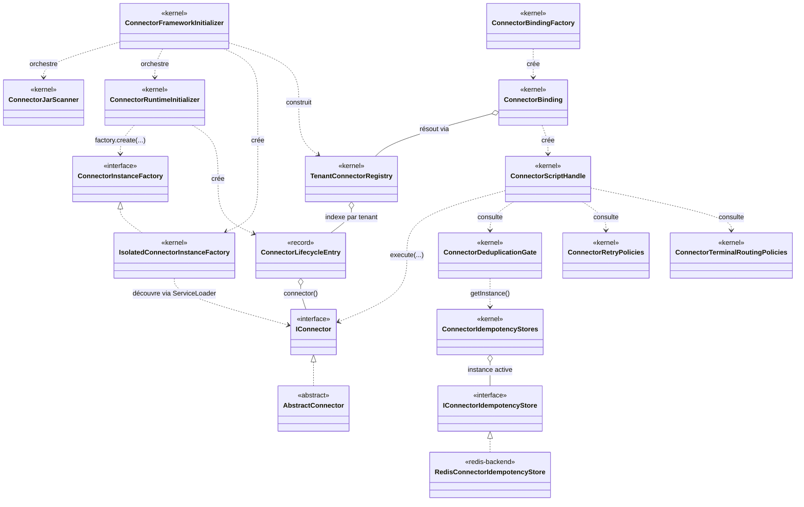

Un connecteur tiers implémente `IConnector` (directement ou, presque toujours, via `AbstractConnector`) ; le kernel le charge, le suit dans un `ConnectorLifecycleEntry`, l'indexe dans un `TenantConnectorRegistry` ; un script y accède via `$Connector(...)` (`ConnectorBindingFactory` → `ConnectorBinding` → `ConnectorScriptHandle`) qui invoque `IConnector.execute(...)` après consultation des politiques de dédoublonnage/retry/routage, elles-mêmes adossées à un `IConnectorIdempotencyStore` — implémenté en mémoire dans le kernel ou par `RedisConnectorIdempotencyStore` dans `idempotency-service-redis`.

---

## 4. `payos-connector-api` — le contrat partagé

Module feuille (12 classes) : zéro dépendance PayOS, seulement `java.util.*`. C'est le vocabulaire que tous les autres modules partagent.

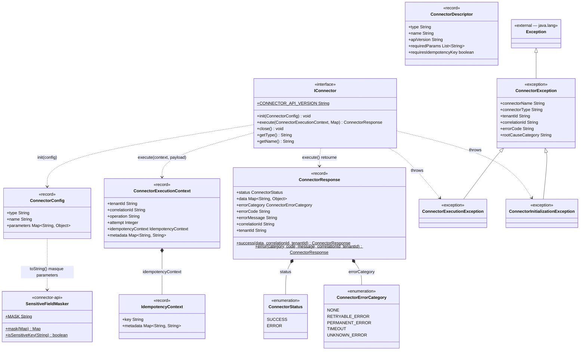

`ConnectorConfig`, `ConnectorExecutionContext`, `ConnectorResponse`, `IdempotencyContext`, `ConnectorDescriptor` sont des Java records avec validation dans le constructeur compact (non représentée ici — voir le code source pour le détail des contraintes `requireNonBlank`/normalisation). `ConnectorException` porte l'identité complète d'une erreur connecteur (`connectorName`, `connectorType`, `tenantId`, `correlationId`, `errorCode`, `rootCauseCategory`) — ses deux sous-classes n'ajoutent aucun champ, seulement une sémantique (levée par `init(...)` vs `execute(...)`).

---

## 5. `payos-connector-sdk` — le kit auteur de connecteurs

24 classes, quatre sous-domaines : le point de départ pour écrire un connecteur (`spi`, `test`), le parsing du descripteur (`descriptor`), la compatibilité de version (`compatibility`), et la certification avant livraison (`certification`, `certification.approval`). Dépend uniquement de `payos-connector-api`.

```mermaid
classDiagram
    class IConnector {
        <<interface>>
        <<connector-api>>
    }
    class ConnectorDescriptor {
        <<record>>
        <<connector-api>>
    }
    class ConnectorConfig {
        <<record>>
        <<connector-api>>
    }
    class ConnectorExecutionContext {
        <<record>>
        <<connector-api>>
    }
    class ConnectorResponse {
        <<record>>
        <<connector-api>>
    }
    class ConnectorErrorCategory {
        <<enumeration>>
        <<connector-api>>
    }
    class ConnectorException {
        <<exception>>
        <<connector-api>>
    }

    class AbstractConnector {
        <<abstract>>
        <<connector-sdk>>
        -descriptor ConnectorDescriptor
        +descriptor() ConnectorDescriptor
        +getType() String
        +getName() String
        #success(context, data) ConnectorResponse
        #error(context, category, code, message) ConnectorResponse
    }
    class ConnectorTestHarness {
        <<connector-sdk>>
        -connector IConnector
        +forConnector(IConnector) ConnectorTestHarness$
        +init(ConnectorConfig) ConnectorTestHarness
        +execute(ConnectorExecutionContext, Map) ConnectorResponse
        +close() void
    }
    class ConnectorDescriptorKeys {
        <<connector-sdk>>
        +DESCRIPTOR_RESOURCE_PATH String$
        +CONNECTOR_TYPE String$
        +CONNECTOR_NAME String$
        +CONNECTOR_API_VERSION String$
        +CONNECTOR_REQUIRED_PARAMS String$
        +CONNECTOR_REQUIRES_IDEMPOTENCY_KEY String$
    }
    class ConnectorDescriptorParser {
        <<connector-sdk>>
        +parse(InputStream) ConnectorDescriptor$
        +parse(Properties) ConnectorDescriptor$
    }
    class ConnectorApiVersion {
        <<record>>
        <<connector-sdk>>
        +major int
        +minor int
        +parse(value, fieldName) ConnectorApiVersion$
    }
    class ConnectorCompatibilityPolicy {
        <<connector-sdk>>
        -runtimeVersion ConnectorApiVersion
        -supportedMajorVersions Set~Integer~
        +forRuntimeVersion(String) ConnectorCompatibilityPolicy$
        +withTransitionWindow(...) ConnectorCompatibilityPolicy$
        +evaluate(ConnectorDescriptor) ConnectorCompatibilityResult
        +evaluate(String) ConnectorCompatibilityResult
    }
    class ConnectorCompatibilityResult {
        <<record>>
        <<connector-sdk>>
        +status ConnectorCompatibilityStatus
        +runtimeApiVersion String
        +connectorApiVersion String
        +errorCode String
        +message String
        +compatible() boolean
    }
    class ConnectorCompatibilityStatus {
        <<enumeration>>
        <<connector-sdk>>
        COMPATIBLE
        COMPATIBLE_WITH_WARNING
        INCOMPATIBLE
    }
    class ConnectorNotFoundException {
        <<exception>>
        <<connector-sdk>>
    }
    class ConnectorVersionException {
        <<exception>>
        <<connector-sdk>>
    }
    class ConnectorDescriptorValidationException {
        <<exception>>
        <<connector-sdk>>
    }

    IConnector <|.. AbstractConnector
    AbstractConnector *-- ConnectorDescriptor
    AbstractConnector ..> ConnectorResponse : success()/error() construit
    AbstractConnector ..> ConnectorErrorCategory
    AbstractConnector ..> ConnectorExecutionContext
    ConnectorTestHarness o-- IConnector : enveloppe
    ConnectorTestHarness ..> ConnectorConfig
    ConnectorTestHarness ..> ConnectorExecutionContext
    ConnectorTestHarness ..> ConnectorResponse
    ConnectorDescriptorParser ..> ConnectorDescriptorKeys : lit les clés
    ConnectorDescriptorParser ..> ConnectorDescriptor : crée
    ConnectorDescriptorParser ..> ConnectorDescriptorValidationException : throws
    ConnectorCompatibilityPolicy *-- ConnectorApiVersion : runtimeVersion
    ConnectorCompatibilityPolicy ..> ConnectorDescriptor : evaluate(descriptor)
    ConnectorCompatibilityPolicy ..> ConnectorCompatibilityResult : crée
    ConnectorCompatibilityResult *-- ConnectorCompatibilityStatus
    ConnectorException <|-- ConnectorNotFoundException
    ConnectorException <|-- ConnectorVersionException
    ConnectorException <|-- ConnectorDescriptorValidationException
```

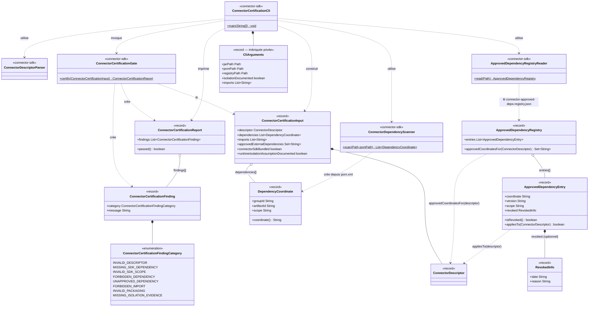

`AbstractConnector` est le seul point de contact direct entre un connecteur tiers et `IConnector` — écrire un connecteur revient presque toujours à l'étendre plutôt qu'implémenter `IConnector` directement. Le sous-domaine `certification`/`certification.approval` (second diagramme) est l'outillage CLI qui vérifie, avant livraison d'un connecteur, qu'il ne dépend que de `connector-sdk` en scope `provided`, qu'il n'importe aucun package interne PayOS, et que ses dépendances externes figurent dans le registre approuvé (`connector-approved-deps-registry.json`) — `ConnectorCertificationCli` est le point d'entrée qui assemble tout ce sous-domaine en un `ConnectorCertificationInput` puis délègue à `ConnectorCertificationGate`.

---

## 6. `payos-foundation` — le SPI côté kernel

18 classes réparties en trois packages : `config.connector` (état du cycle de vie et contrats d'usine), `connector.state` (persistance de l'état d'exécution et du routage terminal), `idempotency` (déduplication au niveau exécution connecteur). Ce sont les interfaces que le kernel expose à ses **propres** backends pluggables — jamais aux connecteurs tiers eux-mêmes.

```mermaid
classDiagram
    class IConnector {
        <<interface>>
        <<connector-api>>
    }
    class ConnectorDescriptor {
        <<record>>
        <<connector-api>>
    }
    class ConnectorErrorCategory {
        <<enumeration>>
        <<connector-api>>
    }
    class ConnectorResponse {
        <<record>>
        <<connector-api>>
    }
    class SensitiveFieldMasker {
        <<connector-api>>
    }

    class ConnectorLifecycleEntry {
        <<record>>
        <<foundation>>
        +jar Path
        +type String
        +name String
        +state ConnectorLifecycleState
        +transitions List~ConnectorLifecycleState~
        +connector IConnector
        +message String
        +errorCode String
        +rootCauseCategory String
        +requiresIdempotencyKey boolean
        +scriptVisible() boolean
    }
    class ConnectorLifecycleState {
        <<enumeration>>
        <<foundation>>
        VALIDATED
        INITIALIZING
        READY
        FAILED
        STOPPED
        FAILED_CLOSE
    }
    class ConnectorInstanceFactory {
        <<interface — @FunctionalInterface>>
        <<foundation>>
        +create(ConnectorValidatedJar) IConnector
    }
    class ConnectorValidatedJar {
        <<record>>
        <<foundation>>
        +jar Path
        +descriptor ConnectorDescriptor
        +configuration ConnectorConfigurationEntry
    }
    class ConnectorConfigurationEntry {
        <<record>>
        <<foundation>>
        +type String
        +name String
        +jar String
        +parameters Map~String, Object~
    }
    class ConnectorDrainBarrier {
        <<interface — @FunctionalInterface>>
        <<foundation>>
        +awaitDrain(ConnectorLifecycleEntry, Duration) boolean
    }
    class ConnectorTerminalDestination {
        <<enumeration>>
        <<foundation>>
        DLQ
        CONNECTOR_STATE
    }

    class ConnectorExecutionState {
        <<enumeration>>
        <<foundation>>
        RUNNING
        SUCCEEDED
        RETRYING
        FAILED
        +isTerminal() boolean
    }
    class ConnectorExecutionStateRecord {
        <<record>>
        <<foundation>>
        +connectorType String
        +connectorName String
        +tenantId String
        +correlationId String
        +operation String
        +attemptCount int
        +idempotencyKey String
        +errorCategory ConnectorErrorCategory
        +state ConnectorExecutionState
        +recordedAt Instant
        +isTerminal() boolean
    }
    class IConnectorExecutionStateStore {
        <<interface>>
        <<foundation>>
        +record(ConnectorExecutionStateRecord) void
        +get(correlationId, type, name) Optional~ConnectorExecutionStateRecord~
        +findByState(ConnectorExecutionState) List~ConnectorExecutionStateRecord~
    }
    class ConnectorTerminalRoutingRecord {
        <<record>>
        <<foundation>>
        +connectorType String
        +connectorName String
        +tenantId String
        +correlationId String
        +idempotencyKey String
        +attemptCount int
        +errorCategory ConnectorErrorCategory
        +destination ConnectorTerminalDestination
        +reason String
        +recordedAt Instant
    }
    class IConnectorTerminalRoutingStore {
        <<interface>>
        <<foundation>>
        +record(ConnectorTerminalRoutingRecord) void
        +get(correlationId, type, name) Optional~ConnectorTerminalRoutingRecord~
        +findByDestination(ConnectorTerminalDestination) List~ConnectorTerminalRoutingRecord~
    }

    class IConnectorIdempotencyStore {
        <<interface>>
        <<foundation>>
        +tryClaim(String key) boolean
        +get(String key) Optional~ConnectorIdempotencyRecord~
        +complete(String key, ConnectorResponse) void
        +release(String key) void
    }
    class IConnectorIdempotencyStoreFactory {
        <<interface>>
        <<foundation>>
        +supports(String type) boolean
        +create(Map) IConnectorIdempotencyStore
    }
    class ConnectorIdempotencyRecord {
        <<record>>
        <<foundation>>
        +outcome ConnectorIdempotencyOutcome
        +response ConnectorResponse
        +recordedAt Instant
        +inProgress() ConnectorIdempotencyRecord$
        +completed(ConnectorResponse) ConnectorIdempotencyRecord$
    }
    class ConnectorIdempotencyOutcome {
        <<enumeration>>
        <<foundation>>
        IN_PROGRESS
        COMPLETED
    }
    class ConnectorIdempotencyStoreException {
        <<exception — RuntimeException>>
        <<foundation>>
    }

    ConnectorLifecycleEntry *-- ConnectorLifecycleState
    ConnectorLifecycleEntry o-- ConnectorLifecycleState : transitions[]
    ConnectorLifecycleEntry o-- IConnector : connector
    ConnectorInstanceFactory ..> IConnector : create() retourne
    ConnectorInstanceFactory ..> ConnectorValidatedJar : create(validatedJar)
    ConnectorValidatedJar *-- ConnectorDescriptor
    ConnectorValidatedJar *-- ConnectorConfigurationEntry
    ConnectorConfigurationEntry ..> SensitiveFieldMasker : toString() masque parameters
    ConnectorDrainBarrier ..> ConnectorLifecycleEntry : awaitDrain(currentEntry, ...)

    ConnectorExecutionStateRecord *-- ConnectorErrorCategory
    ConnectorExecutionStateRecord *-- ConnectorExecutionState
    IConnectorExecutionStateStore ..> ConnectorExecutionStateRecord
    IConnectorExecutionStateStore ..> ConnectorExecutionState
    ConnectorTerminalRoutingRecord *-- ConnectorErrorCategory
    ConnectorTerminalRoutingRecord *-- ConnectorTerminalDestination
    IConnectorTerminalRoutingStore ..> ConnectorTerminalRoutingRecord
    IConnectorTerminalRoutingStore ..> ConnectorTerminalDestination

    IConnectorIdempotencyStore ..> ConnectorIdempotencyRecord
    IConnectorIdempotencyStore ..> ConnectorResponse
    IConnectorIdempotencyStoreFactory ..> IConnectorIdempotencyStore : create() retourne
    IConnectorIdempotencyStoreFactory ..> ConnectorIdempotencyStoreException : throws
    ConnectorIdempotencyRecord *-- ConnectorIdempotencyOutcome
    ConnectorIdempotencyRecord o-- ConnectorResponse : response (nullable)
```

Seuls deux modules implémentent ces interfaces aujourd'hui : `payos` lui-même ([§12](#12-payos-kernel--implémentations-état--idempotence-diagnostics)) et `idempotency-service-redis` ([§13](#13-idempotency-service-redis--backend-redis)). `ConnectorConfigurationEntry` et `ConnectorLifecycleEntry` sont les deux records les plus référencés du framework — le premier porte la configuration déclarée dans `connectors.json`, le second l'état runtime d'un connecteur chargé ; presque toutes les classes d'orchestration du kernel ([§7](#7-payos-kernel--boot-scan-des-jars-cycle-de-vie) à [§10](#10-payos-kernel--politiques-retry--dédoublonnage--routage-terminal)) manipulent l'un ou l'autre.

---

## 7. `payos` (kernel) — boot, scan des JARs, cycle de vie

`ConnectorFrameworkInitializer` est la racine de composition du framework — l'orchestrateur que `BootServer` appelle au démarrage et à chaque hot reload. Ce diagramme couvre 12 classes du package `ma.s2m.payos.config.connector`.

```mermaid
classDiagram
    class IConnector {
        <<interface>>
        <<connector-api>>
    }
    class ConnectorConfig {
        <<record>>
        <<connector-api>>
    }
    class ConnectorDescriptor {
        <<record>>
        <<connector-api>>
    }
    class ConnectorDescriptorParser {
        <<connector-sdk>>
    }
    class ConnectorCompatibilityPolicy {
        <<connector-sdk>>
    }
    class ConnectorDescriptorKeys {
        <<connector-sdk>>
    }
    class ConnectorInstanceFactory {
        <<interface>>
        <<foundation>>
    }
    class ConnectorValidatedJar {
        <<record>>
        <<foundation>>
    }
    class ConnectorConfigurationEntry {
        <<record>>
        <<foundation>>
    }
    class ConnectorLifecycleEntry {
        <<record>>
        <<foundation>>
    }
    class ConnectorLifecycleState {
        <<enumeration>>
        <<foundation>>
    }
    class IConfigSpec {
        <<foundation>>
    }
    class PayOSConfig {
        <<kernel — hors périmètre, référencé>>
    }
    class EnvVarResolver {
        <<foundation — hors périmètre, référencé>>
    }

    class ConnectorConfigurationException {
        <<exception>>
        <<kernel>>
    }
    class ConnectorInitializationException {
        <<exception — DISTINCTE de connector-api, voir §14>>
        <<kernel>>
    }
    class ConnectorConfiguration {
        <<record>>
        <<kernel>>
        +connectors List~ConnectorConfigurationEntry~
    }
    class ConnectorConfigurationLoader {
        <<kernel>>
        +loadFromRuntimeDirectory(Path) ConnectorConfiguration$
        +load(Path connectorsJson) ConnectorConfiguration$
        +fromMap(Map) ConnectorConfiguration$
    }
    class ConnectorCredentialReferenceResolver {
        <<kernel>>
        +resolve(ConnectorConfiguration) ConnectorConfiguration$
        +resolve(ConnectorConfiguration, Map~String,String~) ConnectorConfiguration$
    }
    class ConnectorInvalidJar {
        <<record>>
        <<kernel>>
        +jar Path
        +type String
        +name String
        +message String
    }
    class ConnectorJarValidationReport {
        <<record>>
        <<kernel>>
        +validJars List~ConnectorValidatedJar~
        +invalidJars List~ConnectorInvalidJar~
    }
    class ConnectorJarScanner {
        <<kernel>>
        +scan(Path connectorsDirectory, ConnectorConfiguration) ConnectorJarValidationReport$
    }
    class ConnectorLifecycleInitializationReport {
        <<record>>
        <<kernel>>
        +entries List~ConnectorLifecycleEntry~
        +readyConnectors() List~IConnector~
    }
    class ConnectorRuntimeInitializer {
        <<kernel>>
        +initialize(List~ConnectorValidatedJar~, ConnectorInstanceFactory) ConnectorLifecycleInitializationReport$
    }
    class IsolatedConnectorInstanceFactory {
        <<kernel>>
        -classLoadersByJar Map~Path, URLClassLoader~
        +create(ConnectorValidatedJar) IConnector
        +close() void
    }
    class ConnectorFrameworkInitializer {
        <<kernel>>
        -activeFactory IsolatedConnectorInstanceFactory$
        -activeEntries List~ConnectorLifecycleEntry~$
        +initialize(Map settings) void$
        +shutdown() void$
    }

    ConnectorConfigurationException --|> Exception
    ConnectorInitializationException --|> Exception

    ConnectorConfigurationLoader ..> IConfigSpec : lit ConnectorFramework
    ConnectorConfigurationLoader ..> ConnectorConfiguration : crée
    ConnectorConfigurationLoader ..> ConnectorConfigurationEntry : crée
    ConnectorConfigurationLoader ..> ConnectorConfigurationException : throws
    ConnectorConfiguration o-- ConnectorConfigurationEntry : connectors[]

    ConnectorCredentialReferenceResolver ..> ConnectorConfiguration : résout
    ConnectorCredentialReferenceResolver ..> ConnectorConfigurationEntry : crée (résolu)
    ConnectorCredentialReferenceResolver ..> EnvVarResolver : utilise
    ConnectorCredentialReferenceResolver ..> ConnectorInitializationException : throws

    ConnectorJarScanner ..> ConnectorDescriptorParser : parse le descripteur
    ConnectorJarScanner ..> ConnectorCompatibilityPolicy : vérifie la version
    ConnectorJarScanner ..> ConnectorDescriptorKeys : lit META-INF/connector.properties
    ConnectorJarScanner ..> ConnectorInvalidJar : crée
    ConnectorJarScanner ..> ConnectorValidatedJar : crée
    ConnectorJarScanner ..> ConnectorJarValidationReport : crée
    ConnectorJarValidationReport o-- ConnectorValidatedJar : validJars[]
    ConnectorJarValidationReport o-- ConnectorInvalidJar : invalidJars[]

    ConnectorRuntimeInitializer ..> ConnectorInstanceFactory : factory.create(validatedJar)
    ConnectorRuntimeInitializer ..> ConnectorConfig : construit pour init()
    ConnectorRuntimeInitializer ..> ConnectorLifecycleEntry : crée (READY/FAILED)
    ConnectorRuntimeInitializer ..> ConnectorLifecycleInitializationReport : crée
    ConnectorLifecycleInitializationReport o-- ConnectorLifecycleEntry : entries[]
    ConnectorLifecycleInitializationReport ..> IConnector : readyConnectors()

    ConnectorInstanceFactory <|.. IsolatedConnectorInstanceFactory
    IsolatedConnectorInstanceFactory ..> IConnector : ServiceLoader.load(IConnector.class)
    IsolatedConnectorInstanceFactory ..> ConnectorValidatedJar : create(validatedJar)

    ConnectorFrameworkInitializer ..> ConnectorConfigurationLoader : loadFromRuntimeDirectory(...)
    ConnectorFrameworkInitializer ..> ConnectorCredentialReferenceResolver : resolve(...)
    ConnectorFrameworkInitializer ..> ConnectorJarScanner : scan(...)
    ConnectorFrameworkInitializer ..> ConnectorRuntimeInitializer : initialize(...)
    ConnectorFrameworkInitializer ..> IsolatedConnectorInstanceFactory : new
    ConnectorFrameworkInitializer ..> PayOSConfig : setConnectorRegistry(...)
    ConnectorFrameworkInitializer ..> ConnectorLifecycleState
```

Le flux est linéaire et correspond exactement au diagramme de séquence §6.1 de [connector-framework-architecture-v1-2026-08-24.md](connector-framework-architecture-v1-2026-08-24.md#61-chargement-au-démarrage) : `ConnectorConfigurationLoader` (shape statique de `connectors.json`) → `ConnectorCredentialReferenceResolver` (résolution `${...}`) → `ConnectorJarScanner` (validation par JAR, délègue au SDK pour le parsing/la compatibilité) → `ConnectorRuntimeInitializer` (instanciation via `IsolatedConnectorInstanceFactory`, qui implémente l'interface `ConnectorInstanceFactory` déclarée dans `payos-foundation`) → construction du `TenantConnectorRegistry` ([§8](#8-payos-kernel--registre-tenant-résolution-santé)).

---

## 8. `payos` (kernel) — registre tenant, résolution, santé

8 classes qui indexent les `ConnectorLifecycleEntry` prêts par tenant et exposent la résolution utilisée par `$Connector(...)` ainsi qu'une vue de santé non filtrée par tenant.

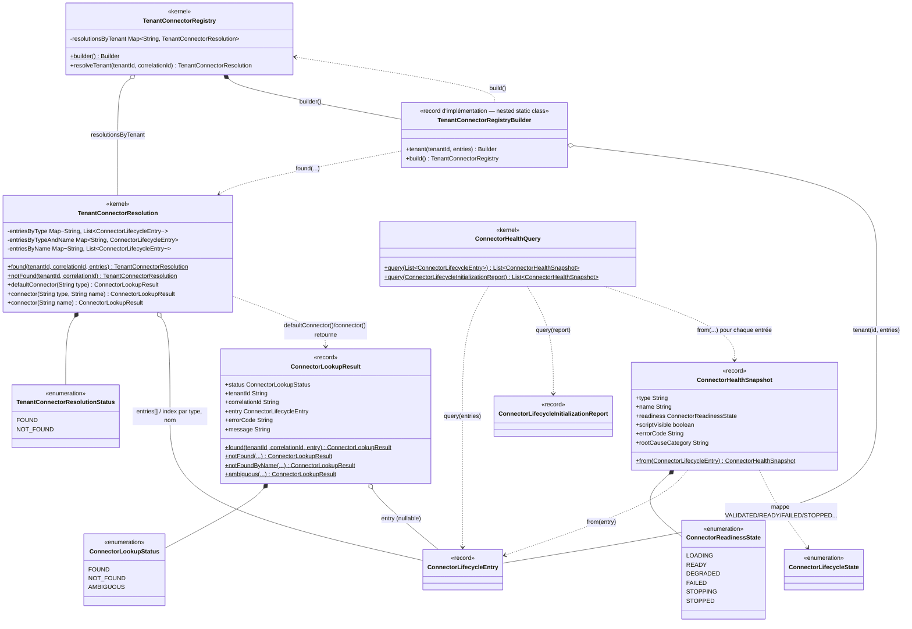

`TenantConnectorRegistry` est immuable et construit une fois par `ConnectorFrameworkInitializer` ([§7](#7-payos-kernel--boot-scan-des-jars-cycle-de-vie)) — son `Builder` (classe statique imbriquée, notée `TenantConnectorRegistryBuilder` ici pour éviter une collision de nom dans le diagramme) rejette les doublons type+nom par tenant. Aujourd'hui tous les tenants voient la même liste de connecteurs ([architecture §6.1](connector-framework-architecture-v1-2026-08-24.md#61-chargement-au-démarrage)), donc `tenant(...)` est appelé soit une fois avec `"default"`, soit une fois par tenant déclaré avec la même liste. `ConnectorHealthQuery`/`ConnectorHealthSnapshot` sont indépendants du registre tenant — ils exposent une vue de diagnostic non filtrée, utile pour l'observabilité opérationnelle.

---

## 9. `payos` (kernel) — hot reload, arrêt, réglages runtime

8 classes qui implémentent le cycle §6.4/§6.5 de l'architecture narrative — remplacement à chaud d'un connecteur avec drain, et fermeture ordonnée à l'arrêt.

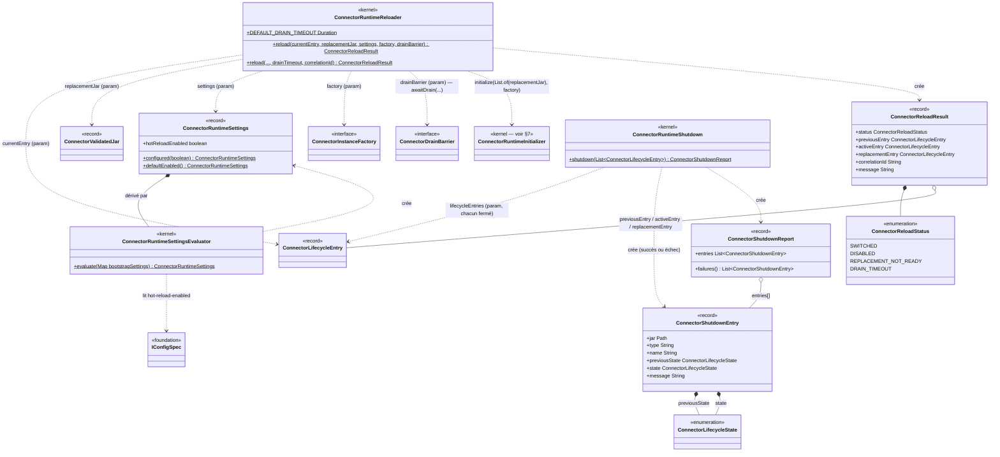

`ConnectorRuntimeReloader.reload(...)` réutilise directement `ConnectorRuntimeInitializer.initialize(...)` ([§7](#7-payos-kernel--boot-scan-des-jars-cycle-de-vie)) pour préparer le remplacement — c'est la même mécanique d'instanciation que celle du boot, appliquée à un seul JAR. `ConnectorDrainBarrier` et `ConnectorInstanceFactory` sont deux interfaces `@FunctionalInterface` de `payos-foundation` reçues en paramètre — le kernel fournit `IsolatedConnectorInstanceFactory` comme implémentation de la seconde, mais aucune classe de production n'implémente `ConnectorDrainBarrier` dans ce périmètre (il est fourni par l'appelant, typiquement câblé côté tests ou par une future intégration opérationnelle).

---

## 10. `payos` (kernel) — politiques retry / dédoublonnage / routage terminal

10 classes qui incarnent la règle centrale du framework : *la plateforme, jamais le connecteur, décide de la déduplication, du retry et du routage d'erreur*. Détail comportemental exhaustif dans [connector-framework-parameters-v3-2026-08-11.md §6–§11](../configuration/connector-framework-parameters-v3-2026-08-11.md#6-idempotency-and-platform-owned-deduplication-epic-51-52) — ce diagramme n'en montre que la structure de classes.

```mermaid
classDiagram
    class ConnectorErrorCategory {
        <<enumeration>>
        <<connector-api>>
    }
    class ConnectorResponse {
        <<record>>
        <<connector-api>>
    }
    class ConnectorTerminalDestination {
        <<enumeration>>
        <<foundation>>
    }
    class IConnectorIdempotencyStore {
        <<interface>>
        <<foundation>>
    }
    class ConnectorIdempotencyRecord {
        <<record>>
        <<foundation>>
    }
    class ConnectorIdempotencyOutcome {
        <<enumeration>>
        <<foundation>>
    }
    class ConnectorIdempotencyStores {
        <<kernel — voir §12>>
    }

    class ConnectorDeduplicationAction {
        <<enumeration>>
        <<kernel>>
        EXECUTE
        REPLAY
        SUPPRESS
    }
    class ConnectorDeduplicationDecision {
        <<record>>
        <<kernel>>
        +action ConnectorDeduplicationAction
        +replayResponse ConnectorResponse
        +execute() ConnectorDeduplicationDecision$
        +replay(ConnectorResponse) ConnectorDeduplicationDecision$
        +suppress() ConnectorDeduplicationDecision$
    }
    class ConnectorDeduplicationGate {
        <<kernel>>
        +evaluate(String idempotencyKey) ConnectorDeduplicationDecision$
        +recordCompletion(String idempotencyKey, ConnectorResponse) void$
    }
    class ConnectorRetryContext {
        <<record>>
        <<kernel>>
        +tenantId String
        +connectorType String
        +operation String
        +errorCategory ConnectorErrorCategory
        +attempt int
    }
    class ConnectorRetryDecision {
        <<record>>
        <<kernel>>
        +shouldRetry boolean
        +nextAttempt int
        +reason String
        +retry(nextAttempt, reason) ConnectorRetryDecision$
        +noRetry(currentAttempt, reason) ConnectorRetryDecision$
    }
    class ConnectorRetryPolicy {
        <<kernel>>
        -maxAttempts int
        -retryableCategories Set~ConnectorErrorCategory~
        +defaultPolicy() ConnectorRetryPolicy$
        +withBudget(maxAttempts, categories) ConnectorRetryPolicy$
        +evaluate(ConnectorRetryContext) ConnectorRetryDecision
    }
    class ConnectorRetryPolicies {
        <<kernel>>
        -instance ConnectorRetryPolicy$
        +getInstance() ConnectorRetryPolicy$
        +setInstance(ConnectorRetryPolicy) void$
    }
    class ConnectorTerminalRoutingDecision {
        <<record>>
        <<kernel>>
        +destination ConnectorTerminalDestination
        +reason String
        +dlq(String reason) ConnectorTerminalRoutingDecision$
        +connectorState(String reason) ConnectorTerminalRoutingDecision$
    }
    class ConnectorTerminalRoutingPolicy {
        <<kernel>>
        -dlqCategories Set~ConnectorErrorCategory~
        +defaultPolicy() ConnectorTerminalRoutingPolicy$
        +withDlqCategories(categories) ConnectorTerminalRoutingPolicy$
        +evaluate(ConnectorErrorCategory) ConnectorTerminalRoutingDecision
    }
    class ConnectorTerminalRoutingPolicies {
        <<kernel>>
        -instance ConnectorTerminalRoutingPolicy$
        +getInstance() ConnectorTerminalRoutingPolicy$
        +setInstance(ConnectorTerminalRoutingPolicy) void$
    }

    ConnectorDeduplicationDecision *-- ConnectorDeduplicationAction
    ConnectorDeduplicationDecision o-- ConnectorResponse : replayResponse (nullable)
    ConnectorDeduplicationGate ..> ConnectorIdempotencyStores : getInstance()
    ConnectorIdempotencyStores o-- IConnectorIdempotencyStore
    ConnectorDeduplicationGate ..> IConnectorIdempotencyStore : tryClaim/get/complete
    ConnectorDeduplicationGate ..> ConnectorIdempotencyRecord
    ConnectorDeduplicationGate ..> ConnectorIdempotencyOutcome
    ConnectorDeduplicationGate ..> ConnectorDeduplicationDecision : crée

    ConnectorRetryContext *-- ConnectorErrorCategory
    ConnectorRetryPolicy ..> ConnectorRetryContext : evaluate(context)
    ConnectorRetryPolicy ..> ConnectorRetryDecision : crée
    ConnectorRetryPolicies o-- ConnectorRetryPolicy : instance active

    ConnectorTerminalRoutingDecision *-- ConnectorTerminalDestination
    ConnectorTerminalRoutingPolicy ..> ConnectorErrorCategory : evaluate(category)
    ConnectorTerminalRoutingPolicy ..> ConnectorTerminalRoutingDecision : crée
    ConnectorTerminalRoutingPolicies o-- ConnectorTerminalRoutingPolicy : instance active
```

Ces trois politiques (`ConnectorDeduplicationGate`, `ConnectorRetryPolicy`, `ConnectorTerminalRoutingPolicy`) sont toutes consultées séquentiellement par `ConnectorScriptHandle.execute(...)` ([§11](#11-payos-kernel--intégration-scripting-et-points-dentrée)), jamais par le connecteur lui-même. `ConnectorRetryPolicies` et `ConnectorTerminalRoutingPolicies` suivent le même patron que `ConnectorIdempotencyStores`/`ConnectorExecutionStateStores`/`ConnectorTerminalRoutingStores` ([§12](#12-payos-kernel--implémentations-état--idempotence-diagnostics)) : une façade statique swappable au-dessus d'une instance mutable, le même style de singleton configurable répété à travers tout le kernel connecteur.

---

## 11. `payos` (kernel) — intégration scripting et points d'entrée

Les 3 classes qui rendent `$Connector(...)` disponible depuis un script JS, plus les 3 points d'entrée kernel qui les câblent (montrés ici pour le lien d'usage demandé, sans détailler leurs membres — ils ne font pas partie du framework connecteur).

```mermaid
classDiagram
    class TenantConnectorRegistry {
        <<kernel — voir §8>>
    }
    class TenantConnectorResolution {
        <<kernel — voir §8>>
    }
    class ConnectorLookupResult {
        <<record>>
        <<kernel — voir §8>>
    }
    class ConnectorExecutionContext {
        <<record>>
        <<connector-api>>
    }
    class IdempotencyContext {
        <<record>>
        <<connector-api>>
    }
    class IConnector {
        <<interface>>
        <<connector-api>>
    }
    class ConnectorRetryContext {
        <<record>>
        <<kernel — voir §10>>
    }
    class ConnectorTerminalRoutingRecord {
        <<record>>
        <<foundation>>
    }
    class ConnectorExecutionStateRecord {
        <<record>>
        <<foundation>>
    }
    class ConnectorDeduplicationGate {
        <<kernel — voir §10>>
    }
    class ConnectorRetryPolicies {
        <<kernel — voir §10>>
    }
    class ConnectorTerminalRoutingPolicies {
        <<kernel — voir §10>>
    }
    class ConnectorTerminalRoutingStores {
        <<kernel — voir §12>>
    }
    class ConnectorExecutionStateStores {
        <<kernel — voir §12>>
    }
    class ConnectorDiagnosticsHelper {
        <<kernel — voir §12>>
    }
    class ConnectorFrameworkInitializer {
        <<kernel — voir §7>>
    }
    class ConnectorIdempotencyStoreInitializer {
        <<kernel — voir §12>>
    }
    class ProxyExecutable {
        <<interface — GraalVM SDK, externe>>
    }

    class ConnectorBinding {
        <<kernel>>
        -registry TenantConnectorRegistry
        -metadata Map~String, String~
    }
    class ConnectorBindingFactory {
        <<kernel>>
        +createIfConfigured(Request, tenantId) ConnectorBinding$
    }
    class ConnectorScriptHandle {
        <<kernel — visibilité package>>
        -lookup ConnectorLookupResult
        -metadata Map~String, String~
        +execute(Value payload) ConnectorResponse
    }
    class ApiResourceHandler {
        <<kernel — point d'entrée, hors périmètre>>
    }
    class HookEngine {
        <<kernel — point d'entrée, hors périmètre>>
    }
    class BootServer {
        <<kernel — point d'entrée, hors périmètre>>
    }

    ProxyExecutable <|.. ConnectorBinding
    ConnectorBindingFactory ..> ConnectorBinding : new (correlationId, operation, attempt, idempotencyKey, metadata dérivés de la requête)
    ConnectorBinding o-- TenantConnectorRegistry : registry
    ConnectorBinding ..> TenantConnectorResolution : registry.resolveTenant(...)
    ConnectorBinding ..> ConnectorScriptHandle : new (sur appel $Connector(...))
    ConnectorScriptHandle o-- ConnectorLookupResult : lookup
    ConnectorScriptHandle ..> ConnectorExecutionContext : new
    ConnectorScriptHandle ..> IdempotencyContext : new
    ConnectorScriptHandle ..> IConnector : lookup.entry().connector().execute(context, payload)
    ConnectorScriptHandle ..> ConnectorDeduplicationGate : evaluate()/recordCompletion()
    ConnectorScriptHandle ..> ConnectorRetryContext : new
    ConnectorScriptHandle ..> ConnectorRetryPolicies : getInstance().evaluate(...)
    ConnectorScriptHandle ..> ConnectorTerminalRoutingPolicies : getInstance().evaluate(...)
    ConnectorScriptHandle ..> ConnectorTerminalRoutingRecord : new
    ConnectorScriptHandle ..> ConnectorTerminalRoutingStores : getInstance().record(...)
    ConnectorScriptHandle ..> ConnectorExecutionStateRecord : new
    ConnectorScriptHandle ..> ConnectorExecutionStateStores : getInstance().record(...)
    ConnectorScriptHandle ..> ConnectorDiagnosticsHelper : logRetryScheduled()/logTerminalRouting()

    ApiResourceHandler ..> ConnectorBindingFactory : createIfConfigured(request, tenantId)
    ApiResourceHandler ..> ConnectorBinding : putMember("$Connector", ...)
    HookEngine ..> ConnectorBindingFactory : createIfConfigured(context.getRequest(), context.getTenantId())
    HookEngine ..> ConnectorBinding : putMember("$Connector", ...)
    BootServer ..> ConnectorFrameworkInitializer : initialize(settings) / shutdown()
    BootServer ..> ConnectorIdempotencyStoreInitializer : initialize(settings)
```

`ConnectorScriptHandle.execute(...)` est le point de passage unique de toute exécution — c'est la classe qui matérialise le diagramme de séquence §6.3 de l'architecture narrative (idempotence → dédoublonnage → invocation → classification d'erreur → retry → routage terminal → diagnostics). `ConnectorBindingFactory` centralise la dérivation de `correlationId`/`operation`/`attempt`/`idempotencyKey`/`metadata` depuis la requête pour que `ApiResourceHandler` et `HookEngine` — les deux seuls points d'entrée qui exposent `$Connector` à un script — n'aient pas à dupliquer cette logique.

---

## 12. `payos` (kernel) — implémentations état & idempotence, diagnostics

Les implémentations concrètes des interfaces `payos-foundation` de [§6](#6-payos-foundation--le-spi-côté-kernel), plus l'aide au diagnostic. 9 classes.

```mermaid
classDiagram
    class IConnectorExecutionStateStore {
        <<interface>>
        <<foundation>>
    }
    class ConnectorExecutionStateRecord {
        <<record>>
        <<foundation>>
    }
    class ConnectorExecutionState {
        <<enumeration>>
        <<foundation>>
    }
    class IConnectorTerminalRoutingStore {
        <<interface>>
        <<foundation>>
    }
    class ConnectorTerminalRoutingRecord {
        <<record>>
        <<foundation>>
    }
    class ConnectorTerminalDestination {
        <<enumeration>>
        <<foundation>>
    }
    class IConnectorIdempotencyStore {
        <<interface>>
        <<foundation>>
    }
    class IConnectorIdempotencyStoreFactory {
        <<interface>>
        <<foundation>>
    }
    class ConnectorIdempotencyRecord {
        <<record>>
        <<foundation>>
    }
    class IDatabaseService {
        <<interface — kernel, hors périmètre>>
    }
    class DiagnosticEvent {
        <<kernel — hors périmètre>>
    }
    class Diagnostics {
        <<kernel — hors périmètre>>
    }

    class DatabaseConnectorExecutionStateStore {
        <<kernel>>
        -databaseService IDatabaseService
    }
    class InMemoryConnectorExecutionStateStore {
        <<kernel>>
        -recordsByKey ConcurrentHashMap~String, ConnectorExecutionStateRecord~
    }
    class ConnectorExecutionStateStores {
        <<kernel>>
        -instance IConnectorExecutionStateStore$
        +getInstance() IConnectorExecutionStateStore$
        +setInstance(IConnectorExecutionStateStore) void$
    }
    class InMemoryConnectorTerminalRoutingStore {
        <<kernel>>
        -recordsByKey ConcurrentHashMap~String, ConnectorTerminalRoutingRecord~
    }
    class ConnectorTerminalRoutingStores {
        <<kernel>>
        -instance IConnectorTerminalRoutingStore$
        +getInstance() IConnectorTerminalRoutingStore$
        +setInstance(IConnectorTerminalRoutingStore) void$
    }
    class ConnectorDiagnosticsHelper {
        <<kernel>>
        +logRetryScheduled(...) void$
        +logTerminalRouting(..., ConnectorTerminalDestination) void$
    }
    class InMemoryConnectorIdempotencyStore {
        <<kernel>>
        -store ConcurrentHashMap~String, ConnectorIdempotencyRecord~
    }
    class ConnectorIdempotencyStores {
        <<kernel>>
        -INSTANCE AtomicReference~IConnectorIdempotencyStore~$
        +getInstance() IConnectorIdempotencyStore$
        +resolve(type, config) IConnectorIdempotencyStore$
        +setInstance(IConnectorIdempotencyStore) void$
    }
    class ConnectorIdempotencyStoreInitializer {
        <<kernel>>
        +initialize(Map settings) void$
    }

    IConnectorExecutionStateStore <|.. DatabaseConnectorExecutionStateStore
    IConnectorExecutionStateStore <|.. InMemoryConnectorExecutionStateStore
    DatabaseConnectorExecutionStateStore o-- IDatabaseService
    DatabaseConnectorExecutionStateStore ..> ConnectorExecutionStateRecord : new (depuis une ligne de payos_connector_execution_state)
    InMemoryConnectorExecutionStateStore o-- ConnectorExecutionStateRecord : recordsByKey
    InMemoryConnectorExecutionStateStore ..> ConnectorExecutionState : findByState(...)
    ConnectorExecutionStateStores o-- IConnectorExecutionStateStore : instance active
    ConnectorExecutionStateStores ..> InMemoryConnectorExecutionStateStore : new (défaut)

    IConnectorTerminalRoutingStore <|.. InMemoryConnectorTerminalRoutingStore
    InMemoryConnectorTerminalRoutingStore o-- ConnectorTerminalRoutingRecord : recordsByKey
    InMemoryConnectorTerminalRoutingStore ..> ConnectorTerminalDestination : findByDestination(...)
    ConnectorTerminalRoutingStores o-- IConnectorTerminalRoutingStore : instance active
    ConnectorTerminalRoutingStores ..> InMemoryConnectorTerminalRoutingStore : new (défaut)

    ConnectorDiagnosticsHelper ..> ConnectorTerminalDestination : logTerminalRouting(destination)
    ConnectorDiagnosticsHelper ..> DiagnosticEvent : new (nature="connector")
    ConnectorDiagnosticsHelper ..> Diagnostics : logEvent(event)

    IConnectorIdempotencyStore <|.. InMemoryConnectorIdempotencyStore
    InMemoryConnectorIdempotencyStore o-- ConnectorIdempotencyRecord : store
    InMemoryConnectorIdempotencyStore ..> ConnectorIdempotencyRecord : inProgress()/completed(response)
    ConnectorIdempotencyStores o-- IConnectorIdempotencyStore : INSTANCE
    ConnectorIdempotencyStores ..> InMemoryConnectorIdempotencyStore : new (défaut "memory")
    ConnectorIdempotencyStores ..> IConnectorIdempotencyStoreFactory : ServiceLoader.load(...) pour tout autre type
    ConnectorIdempotencyStoreInitializer ..> ConnectorIdempotencyStores : resolve(type, config) puis setInstance(store)
```

Trois façades statiques swappables partagent le même patron : `ConnectorExecutionStateStores`, `ConnectorTerminalRoutingStores` et `ConnectorIdempotencyStores` démarrent chacune avec une implémentation en mémoire par défaut, remplaçable via `setInstance(...)`. Seul `ConnectorIdempotencyStores.resolve(...)` a un mécanisme de découverte automatique — `ServiceLoader.load(IConnectorIdempotencyStoreFactory.class)` — c'est ce mécanisme que `RedisConnectorIdempotencyStoreFactory` ([§13](#13-idempotency-service-redis--backend-redis)) enregistre sous `META-INF/services`. `ConnectorExecutionStateStores` et `ConnectorTerminalRoutingStores` n'ont pas d'équivalent découverte-automatique aujourd'hui — passer `DatabaseConnectorExecutionStateStore` en instance active est un choix de câblage laissé à l'appelant, non automatisé par `BootServer`.

---

## 13. `idempotency-service-redis` — backend Redis

2 classes de production (+ 2 records DTO privés imbriqués) qui fournissent l'unique implémentation Redis du SPI `IConnectorIdempotencyStore` de `payos-foundation`.

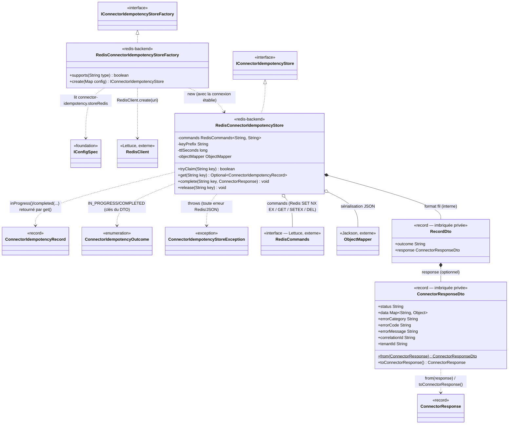

`tryClaim(key)` s'appuie sur un `SET key ... NX EX ttlSeconds` Redis atomique — c'est la garantie native `NX` de Redis, pas un script Lua, qui empêche deux exécutions concurrentes sur la même clé d'idempotence de gagner toutes les deux la réclamation. `RedisConnectorIdempotencyStoreFactory` est découverte par `ConnectorIdempotencyStores.resolve("redis", config)` ([§12](#12-payos-kernel--implémentations-état--idempotence-diagnostics)) via `ServiceLoader` — le mécanisme d'extension standard déjà utilisé par `IIdempotencyStoreFactory` (le store HTTP, hors périmètre de ce document).

---

## 14. Un piège de nommage à connaître

Deux paires de classes portent le **même nom simple** dans des packages différents, avec des hiérarchies totalement indépendantes — un risque de confusion réel si on ne regarde que le nom :

| Nom simple | Occurrence 1 | Occurrence 2 |
| --- | --- | --- |
| `ConnectorInitializationException` | `ma.s2m.payos.connector.exception.ConnectorInitializationException` (`payos-connector-api`), étend `ConnectorException` — levée par `IConnector.init(...)` | `ma.s2m.payos.config.connector.ConnectorInitializationException` (`payos` kernel), étend `java.lang.Exception` directement — levée par `ConnectorCredentialReferenceResolver` pour une référence de credential non résolue |

Aucune relation d'héritage ne relie ces deux classes malgré le nom identique — un import erroné (`connector.exception` au lieu de `config.connector`, ou l'inverse) compile souvent quand même si le code environnant catch `Exception`, ce qui peut masquer une confusion de type au code review. Vérifier systématiquement le package complet dans les imports plutôt que le nom simple de la classe.

---

## 15. Références

- [connector-framework-architecture-v1-2026-08-24.md](connector-framework-architecture-v1-2026-08-24.md) — l'architecture narrative en couches (le document qui explique le *pourquoi* ; celui-ci détaille le *quoi*).
- [connector-framework-parameters-v3-2026-08-11.md](../configuration/connector-framework-parameters-v3-2026-08-11.md) — référence exhaustive des paramètres de configuration et des règles de comportement (catégories d'erreur, retry, routing terminal, diagnostics) derrière les classes du [§10](#10-payos-kernel--politiques-retry--dédoublonnage--routage-terminal).
- [extensibility.md](extensibility.md) — vue d'ensemble des neuf mécanismes d'extension de PayOS.
- Code source : `payos-connector-api/src/main/java/ma/s2m/payos/connector/` ; `payos-connector-sdk/src/main/java/ma/s2m/payos/connector/` ; `payos-foundation/src/main/java/ma/s2m/payos/{config/connector,connector/state,idempotency}/` ; `payos/src/main/java/ma/s2m/payos/{config/connector,connector,scripting,idempotency}/` ; `idempotency-service-redis/src/main/java/ma/s2m/payos/idempotency/redis/`.

> **Note de méthode :** ce document a été produit par lecture exhaustive du code source de production (hors tests) le 2026-09-02. Toute classe ajoutée, renommée ou déplacée dans le framework connecteur après cette date n'y figure pas — recouper avec le code source pour un audit ultérieur plutôt que de considérer ce document comme une source de vérité indéfiniment à jour.
