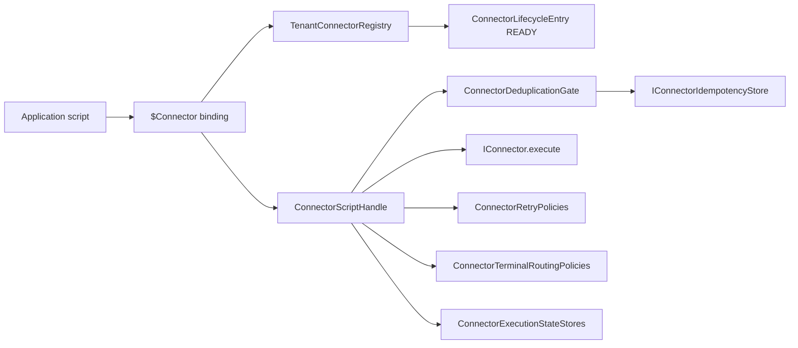
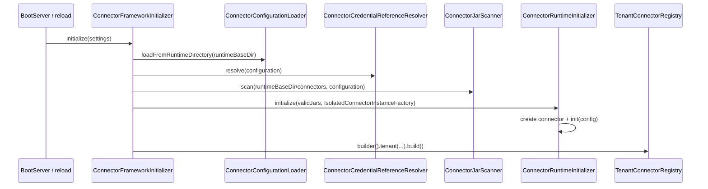
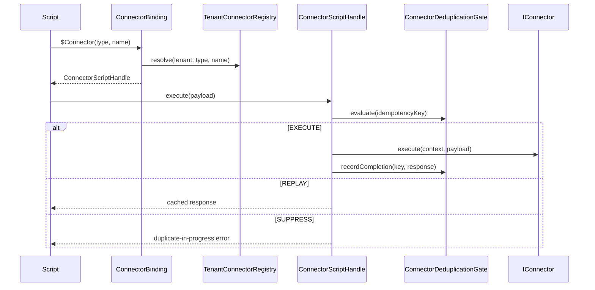

Creation date: 2026-09-07
Last update date: 2026-09-07

# Connector Framework Class Reference

This document is a guided map of the PayOS business/payment connector framework. It explains what each class does, where it lives, who calls it, and which execution phase it belongs to.

Use this when you are lost in the connector classes. Use [connector-framework-class-diagram-v1-2026-09-02.md](connector-framework-class-diagram-v1-2026-09-02.md) when you need the dense UML-style relationship view.

## Scope

This reference covers the business/payment connector framework used by scripts through `$Connector(type[, name]).execute(payload)`. It spans these repositories:

| Repository | Responsibility |
| --- | --- |
| `payos-connector-api` | Stable public contract shared by connector authors and the runtime. |
| `payos-connector-sdk` | Authoring helpers, descriptor parsing, compatibility checks, certification, and test harness. |
| `payos-foundation` | Low-level SPI contracts and portable records for lifecycle, idempotency, and execution state. |
| `payos` | Kernel runtime: boot wiring, config loading, JAR scanning, isolated loading, tenant registry, script binding, deduplication, retry, terminal routing, state, diagnostics. |
| `idempotency-service-redis` | Redis backend for HTTP idempotency and connector idempotency. |

This framework is not the older service-adapter SPI mechanism used for infrastructure modules such as database, queue, secret, or webhook backends.

## Mental Model

Read the framework in this order:

1. Contract: `IConnector` and model records define what a connector can receive and return.
2. Packaging: `META-INF/connector.properties` describes the connector JAR.
3. Boot: the kernel reads `connectors.json`, scans JARs, validates descriptors, creates connector instances, calls `init`, and registers only READY connectors.
4. Invocation: `ApiResourceHandler` injects `$Connector`; scripts call it; `ConnectorScriptHandle` resolves context, deduplication, retry, terminal routing, and metrics around `IConnector.execute`.
5. State: idempotency prevents duplicate external execution; execution-state and terminal-routing stores preserve operational evidence.

## Class Families

| Family | Main classes | Read first when... |
| --- | --- | --- |
| Public API | `IConnector`, `ConnectorConfig`, `ConnectorExecutionContext`, `ConnectorResponse` | You write or review a connector implementation. |
| Descriptor and packaging | `ConnectorDescriptor`, `ConnectorDescriptorParser`, `ConnectorDescriptorKeys`, `ConnectorJarScanner` | A connector JAR is not discovered or is rejected. |
| Boot and lifecycle | `ConnectorFrameworkInitializer`, `ConnectorRuntimeInitializer`, `ConnectorLifecycleEntry`, `ConnectorRuntimeShutdown` | A connector does not reach READY, or reload/shutdown behaves oddly. |
| Tenant resolution | `TenantConnectorRegistry`, `ConnectorLookupResult`, `ConnectorBinding` | `$Connector(...)` cannot find the expected connector or reports ambiguity. |
| Script invocation | `ConnectorBindingFactory`, `ConnectorBinding`, `ConnectorScriptHandle` | You need to understand the request-to-connector execution path. |
| Deduplication | `ConnectorDeduplicationGate`, `ConnectorIdempotencyStores`, `IConnectorIdempotencyStore` | You see `EXECUTE`, `REPLAY`, or `SUPPRESS` decisions. |
| Retry and terminal routing | `ConnectorRetryPolicies`, `ConnectorTerminalRoutingPolicies` | A failure is retried, stored, or routed to DLQ. |
| Operational state | `ConnectorExecutionStateStores`, `IConnectorExecutionStateStore`, `ConnectorDiagnosticsHelper` | You need evidence for failed/retried/terminal executions. |
| Redis backend | `RedisConnectorIdempotencyStore`, `RedisConnectorIdempotencyStoreFactory` | Connector deduplication must survive multiple nodes or restarts. |
| Certification | `ConnectorCertificationGate`, `ConnectorCertificationCli`, approval registry classes | You validate a third-party connector before delivery. |

## `payos-connector-api`

These classes are the narrow public API. Connector implementers should depend on this API only through `payos-connector-sdk`; the runtime also uses these types to call connectors.

| Class | Kind | Role | Used by |
| --- | --- | --- | --- |
| `ma.s2m.payos.connector.api.IConnector` | Interface | The connector contract: `init`, `execute`, `close`, `getType`, `getName`. It intentionally gives the connector no hook to control deduplication, retry, routing, state, or tenant registry. | Implemented by connector JARs and `AbstractConnector`; invoked by `ConnectorRuntimeInitializer` and `ConnectorScriptHandle`. |
| `ConnectorConfig` | Record | Immutable initialization data: descriptor type/name plus resolved parameters from `connectors.json`. Its `toString` masks sensitive values. | Created by `ConnectorRuntimeInitializer`; consumed by `IConnector.init`. |
| `ConnectorExecutionContext` | Record | Runtime context sent to `execute`: tenant, correlation id, operation, attempt, idempotency context, and metadata. `correlationId` is mandatory. | Built by `ConnectorScriptHandle`; consumed by connector code. |
| `ConnectorResponse` | Record | Normalized connector result. Success carries `data`; errors carry category, code, message, tenant, and correlation id. | Returned by connector code; interpreted by retry/routing/state code. |
| `ConnectorStatus` | Enum | `SUCCESS` or `ERROR`. | Stored inside `ConnectorResponse`; used by `ConnectorScriptHandle`. |
| `ConnectorErrorCategory` | Enum | Error classification: `NONE`, `RETRYABLE_ERROR`, `PERMANENT_ERROR`, `TIMEOUT`, `UNKNOWN_ERROR`. | Input for retry and terminal routing decisions. |
| `IdempotencyContext` | Record | The invocation idempotency key plus metadata, visible to connector implementations as context. | Built by `ConnectorScriptHandle` when an idempotency key exists. |
| `ConnectorDescriptor` | Record | JAR-declared identity and requirements: type, name, API version, required params, and whether an idempotency key is required. | Parsed by SDK, validated by `ConnectorJarScanner`, stored in `ConnectorValidatedJar`. |
| `ConnectorException` | Checked exception | Base checked exception carrying connector, tenant, correlation, error code, and root-cause category. | Parent of connector execution/initialization errors. |
| `ConnectorExecutionException` | Checked exception | Failure thrown by `IConnector.execute`. | Caught by `ConnectorScriptHandle` and translated into connector error response/state. |
| `ConnectorInitializationException` | Checked exception | Failure thrown by `IConnector.init`. | Caught by `ConnectorRuntimeInitializer`; connector remains FAILED. |
| `SensitiveFieldMasker` | Utility | Masks sensitive parameter values in logs/string rendering. | Used by config/descriptor-facing records. |

## `payos-connector-sdk`

The SDK is for connector authors and delivery checks. It should not own runtime behavior; it helps authors implement and certify the API contract.

### Authoring Helpers

| Class | Kind | Role | Used by |
| --- | --- | --- | --- |
| `AbstractConnector` | Abstract class | Convenience base class for connector implementations. It stores the descriptor, implements `getType`/`getName`, and provides `success`/`error` helpers that preserve tenant and correlation id. | Optional base class for third-party connector code. |
| `ConnectorTestHarness` | Utility | Lightweight local harness to call `init`, `execute`, and `close` without starting PayOS. | Connector author tests. |

### Descriptor and Compatibility

| Class | Kind | Role | Used by |
| --- | --- | --- | --- |
| `ConnectorDescriptorKeys` | Constants | Canonical descriptor keys, including `META-INF/connector.properties`, `connector.type`, `connector.name`, `connector.api.version`, `connector.required.params`, and `connector.requires.idempotency`. | `ConnectorDescriptorParser`, JAR scanner, packaging docs. |
| `ConnectorDescriptorParser` | Utility | Parses descriptor properties into `ConnectorDescriptor`; validates required fields and required-parameter syntax. | `ConnectorJarScanner`, certification CLI/tests. |
| `ConnectorApiVersion` | Record | Parsed `major.minor` API version. | `ConnectorCompatibilityPolicy`. |
| `ConnectorCompatibilityPolicy` | Policy | Evaluates whether a connector API version is accepted by the runtime API version. Supports strict current major and optional transition windows. | `ConnectorJarScanner`, tests. |
| `ConnectorCompatibilityResult` | Record | Result of version evaluation: status, runtime version, connector version, optional error code, message. | `ConnectorJarScanner`. |
| `ConnectorCompatibilityStatus` | Enum | `COMPATIBLE`, `COMPATIBLE_WITH_WARNING`, or `INCOMPATIBLE`. | `ConnectorCompatibilityResult`. |
| `ConnectorDescriptorValidationException` | Exception | Descriptor parsing/validation failure. | Thrown by `ConnectorDescriptorParser`; caught by scanner/certification code. |
| `ConnectorVersionException` | Exception | Version-related connector exception available to SDK consumers. | Connector/runtime validation paths. |
| `ConnectorNotFoundException` | Exception | Typed exception for missing connector scenarios. | SDK/runtime-facing error vocabulary. |

### Certification and Dependency Approval

| Class | Kind | Role | Used by |
| --- | --- | --- | --- |
| `ConnectorCertificationGate` | Policy | Static certification gate. Rejects missing descriptors, missing/wrong SDK dependency scope, forbidden PayOS dependencies/imports, unapproved external dependencies, bundled SDK, and missing isolation evidence. | Certification CLI and library-level tests. |
| `ConnectorCertificationInput` | Record | Evidence bundle fed into the certification gate. Has `with...` methods for progressive construction. | Certification CLI and tests. |
| `ConnectorCertificationReport` | Record | List of findings plus `passed()`. | Certification CLI, tests, delivery process. |
| `ConnectorCertificationFinding` | Record | One certification finding with category and message. | `ConnectorCertificationReport`. |
| `ConnectorCertificationFindingCategory` | Enum | Finding categories such as `FORBIDDEN_DEPENDENCY`, `UNAPPROVED_DEPENDENCY`, and `INVALID_PACKAGING`. | Certification report consumers. |
| `DependencyCoordinate` | Record | Maven coordinate evidence: groupId, artifactId, scope. Defaults absent scope to `compile`. | Certification gate and dependency scanner. |
| `ConnectorCertificationCli` | CLI | End-to-end command entry point. Reads connector JAR, POM, approval registry, detects bundled SDK, and prints pass/fail. | Delivery and certification automation. |
| `ConnectorDependencyScanner` | Utility | Scans a connector POM's direct dependencies, excluding dependency-management/profile-only blocks. | `ConnectorCertificationCli`. |
| `ApprovedDependencyRegistryReader` | Utility | Reads the JSON registry of approved external connector dependencies. | Certification CLI/tests. |
| `ApprovedDependencyRegistry` | Record/model | Computes approved coordinates for a connector descriptor, respecting global/type/name scope and revoked entries. | Certification workflow. |
| `ApprovedDependencyEntry` | Record | One approved external dependency entry. | Registry reader and registry. |
| `RevokedInfo` | Record | Revocation date and reason for an approved dependency. | Approval registry. |

## `payos-foundation`

Foundation provides small contracts and records intended to be shared by the kernel and pluggable backend modules. In the current workspace, several `ma.s2m.payos.config.connector` types also exist in the `payos` kernel source tree under the same package names. When debugging runtime behavior, open the `payos` copy first; when checking API surface for sibling modules, open the `payos-foundation` copy.

This section contains both direct connector framework contracts and generic HTTP idempotency contracts that are adjacent but distinct.

### Connector Lifecycle Contracts

| Class | Kind | Role | Used by |
| --- | --- | --- | --- |
| `ConnectorInstanceFactory` | Functional interface | Creates an `IConnector` from a validated JAR. | Implemented in the kernel by `IsolatedConnectorInstanceFactory`; called by `ConnectorRuntimeInitializer`. |
| `ConnectorDrainBarrier` | Functional interface | Waits for in-flight calls to drain before switching a connector during reload. | `ConnectorRuntimeReloader`. |
| `ConnectorLifecycleState` | Enum | Lifecycle states: `VALIDATED`, `INITIALIZING`, `READY`, `FAILED`, `STOPPED`, `FAILED_CLOSE`. | `ConnectorLifecycleEntry`, runtime initializer/shutdown/reload. |
| `ConnectorLifecycleEntry` | Record | One connector's lifecycle snapshot: JAR path, type, name, state, transitions, connector instance, message, error details, idempotency requirement. `scriptVisible()` is true only for READY. | Registry, health query, reload, shutdown, script resolution. |
| `ConnectorValidatedJar` | Record | A JAR that passed descriptor/config validation, carrying descriptor and matched config entry. | Produced by scanner; consumed by runtime initializer. |
| `ConnectorConfigurationEntry` | Record | One `connectors.json` entry: type, name, jar, parameters. Masks sensitive parameters in `toString`. | Loader/scanner/initializer. |
| `ConnectorTerminalDestination` | Enum | Terminal outcome destination: `DLQ` or `CONNECTOR_STATE`. | Terminal routing policy and state records. |

### Connector Idempotency Contracts

| Class | Kind | Role | Used by |
| --- | --- | --- | --- |
| `IConnectorIdempotencyStore` | Interface | Atomic connector dedup store: `tryClaim`, `get`, `complete`, `release`. | `ConnectorDeduplicationGate`, in-memory store, Redis store. |
| `IConnectorIdempotencyStoreFactory` | Interface | ServiceLoader factory for non-memory connector idempotency stores. | `ConnectorIdempotencyStores`; implemented by Redis module. |
| `ConnectorIdempotencyRecord` | Record | Stored connector idempotency state: `IN_PROGRESS` or `COMPLETED` plus optional response. | Dedup gate and stores. |
| `ConnectorIdempotencyOutcome` | Enum | `IN_PROGRESS` or `COMPLETED`. | `ConnectorIdempotencyRecord`. |
| `ConnectorIdempotencyStoreException` | Runtime exception | Store resolution/operation failure for connector idempotency. | Connector idempotency stores/facade. |

### Connector Execution State Contracts

| Class | Kind | Role | Used by |
| --- | --- | --- | --- |
| `IConnectorExecutionStateStore` | Interface | Records and queries connector execution state evidence by correlation/type/name and by state. | Kernel memory/database implementations. |
| `ConnectorExecutionState` | Enum | Execution-state vocabulary, including retry and terminal states. | State records and stores. |
| `ConnectorExecutionStateRecord` | Record | One execution-state evidence record with connector identity, tenant/correlation, state, error, attempt, and reason. | `ConnectorScriptHandle`, state stores. |
| `IConnectorTerminalRoutingStore` | Interface | Records and queries terminal routing evidence. | Kernel in-memory implementation. |
| `ConnectorTerminalRoutingRecord` | Record | Terminal routing evidence with connector identity, destination, tenant/correlation, error, attempt, and reason. | Terminal routing store and script handle. |

### Adjacent HTTP Idempotency Contracts

These classes are not the connector deduplication mechanism, but they share the same foundation package and Redis backend module.

| Class | Kind | Role | Connector relationship |
| --- | --- | --- | --- |
| `IIdempotencyStore` | Interface | HTTP request idempotency store. | Separate from `IConnectorIdempotencyStore`. |
| `IIdempotencyStoreFactory` | Interface | ServiceLoader factory for HTTP idempotency stores. | Pattern mirrored by connector idempotency. |
| `IdempotencyRecord` | Class | Cached HTTP response body/status/content-type. | Not used for connector response replay. |
| `IdempotencyStoreException` | Runtime exception | HTTP idempotency store failure. | Not the connector store exception. |

## `payos` Kernel

The kernel owns runtime behavior. Connector JARs are guests; they do not decide how they are loaded, scoped, deduplicated, retried, or routed.

### Boot, Config, Scan, and Initialization

| Class | Kind | Role | Used by |
| --- | --- | --- | --- |
| `ConnectorFrameworkInitializer` | Runtime orchestrator | Boot/hot-reload entry point. Loads `connectors.json`, resolves env/secret references, scans `<runtimeBaseDir>/connectors`, initializes connectors, builds tenant registry, and degrades gracefully when no connectors exist. | `BootServer` and config reload path. |
| `ConnectorConfigurationLoader` | Loader | Reads `connectors.json` and validates static shape only: list, type, name, jar, parameters. | `ConnectorFrameworkInitializer`. |
| `ConnectorConfiguration` | Record | Immutable list of configured connector entries. | Loader and scanner. |
| `ConnectorConfigurationException` | Exception | Malformed/missing connector configuration file content. | Thrown by loader; caught by initializer. |
| `ConnectorCredentialReferenceResolver` | Resolver | Resolves required environment/secret references inside JAR path and parameters. | `ConnectorFrameworkInitializer`. |
| `ConnectorInitializationException` | Exception | Kernel-local initialization/config reference resolution failure. Do not confuse it with API `ConnectorInitializationException`. | Config resolver and initializer. |
| `ConnectorJarScanner` | Scanner/validator | Lists connector JARs, reads descriptors, checks API compatibility, matches config entries, validates required params. | `ConnectorFrameworkInitializer`. |
| `ConnectorJarValidationReport` | Record | Valid and invalid JAR lists. | Initializer logging/flow. |
| `ConnectorInvalidJar` | Record | One rejected JAR with type/name context and reason. | Scanner and initializer logs. |
| `ConnectorValidatedJar` | Record | Valid JAR plus descriptor/config. | Scanner output, runtime initializer input. |
| `IsolatedConnectorInstanceFactory` | Factory | Opens isolated URLClassLoaders for connector JARs and discovers `IConnector` via ServiceLoader. Tracks classloaders for close. | `ConnectorRuntimeInitializer`, `ConnectorFrameworkInitializer.shutdown`. |
| `ConnectorRuntimeInitializer` | Lifecycle orchestrator | Creates connector instance, builds `ConnectorConfig`, calls `init`, records lifecycle transitions, marks READY or FAILED. | `ConnectorFrameworkInitializer`, reloader. |
| `ConnectorLifecycleInitializationReport` | Record | Full lifecycle entries plus convenience access to ready connectors. | Framework initializer, health query. |
| `ConnectorLifecycleEntry` | Record | Runtime lifecycle record carrying active connector instance and state. | Registry, health, reload, shutdown. |
| `ConnectorLifecycleState` | Enum | Runtime lifecycle states. | Initializer/reload/shutdown. |

### Tenant Registry and Lookup

| Class | Kind | Role | Used by |
| --- | --- | --- | --- |
| `TenantConnectorRegistry` | Registry | Indexes READY connectors by tenant, type, and name. Filters out non-script-visible entries. Contains nested `Builder`. | `PayOSConfig`, `ConnectorBinding`, tests. |
| `TenantConnectorResolution` | Record | Result of tenant/type/name resolution against registry. | Registry consumers. |
| `TenantConnectorResolutionStatus` | Enum | Tenant registry resolution status. | `TenantConnectorResolution`. |
| `ConnectorLookupResult` | Record | Script-friendly lookup result: found/not-found/ambiguous plus message/error code. | `ConnectorBinding`, `ConnectorScriptHandle`. |
| `ConnectorLookupStatus` | Enum | `FOUND`, `NOT_FOUND`, `AMBIGUOUS`. | `ConnectorLookupResult`. |
| `ConnectorHealthQuery` | Utility | Converts lifecycle entries or initialization report into health snapshots. Includes failed/stopped entries that registry hides. | Operator/runtime inspection code. |
| `ConnectorHealthSnapshot` | Record | Health/readiness view of one connector: type/name/readiness/scriptVisible/error info. | `ConnectorHealthQuery`. |
| `ConnectorReadinessState` | Enum | Simplified readiness state: loading/ready/failed/stopped. | Health snapshot. |

### Script Binding and Invocation

| Class | Kind | Role | Used by |
| --- | --- | --- | --- |
| `ConnectorBindingFactory` | Factory | Builds `$Connector` binding for one request. Resolves tenant, operation, attempt, correlation id, idempotency key, and metadata from request context/headers/MDC. | `ApiResourceHandler`. |
| `ConnectorBinding` | Script binding | Implements the callable object exposed as `$Connector`. Resolves by type/name and returns a `ConnectorScriptHandle`. | Application scripts. |
| `ConnectorScriptHandle` | Invocation orchestrator | The central execution path. Applies lookup result, descriptor idempotency requirement, dedup decision, connector call, response completion, retry decision, terminal routing, execution-state recording, diagnostics, and metrics. | Returned by `ConnectorBinding`; called from scripts. |

Invocation metadata resolution in `ConnectorBindingFactory`:

| Runtime value | Resolution order |
| --- | --- |
| `operation` | request context key `connector.operation`, then `X-Connector-Operation`, then request method. |
| `attempt` | request context key `connector.attempt`, then `X-Connector-Attempt`; only positive integers are accepted. |
| `correlationId` | request context, then `X-Correlation-Id`, then MDC. |
| `idempotencyKey` | configured idempotency header, then `X-Idempotency-Key`. |
| metadata | current `path` and `method`. |

### Deduplication

| Class | Kind | Role | Used by |
| --- | --- | --- | --- |
| `ConnectorDeduplicationGate` | Policy/orchestrator | Platform-owned deduplication gate. Decides whether to execute, replay a completed response, or suppress an in-progress duplicate. | `ConnectorScriptHandle`. |
| `ConnectorDeduplicationDecision` | Record | Dedup result plus optional replay response. | Dedup gate and script handle. |
| `ConnectorDeduplicationAction` | Enum | `EXECUTE`, `REPLAY`, `SUPPRESS`. | Dedup decision and metrics. |
| `ConnectorIdempotencyStoreInitializer` | Initializer | Initializes connector idempotency store from `connector-idempotency` config. Always installs a store; blank key bypasses dedup. | Boot/reload path. |
| `ConnectorIdempotencyStores` | Static facade | Holds active `IConnectorIdempotencyStore`; resolves `memory` directly and non-memory through ServiceLoader. | Dedup gate and store initializer. |
| `InMemoryConnectorIdempotencyStore` | Store implementation | Single-node in-memory atomic claim/completion store. | Default connector dedup backend. |

Deduplication decision semantics:

| Decision | Meaning | Connector invoked? | Typical response |
| --- | --- | --- | --- |
| `EXECUTE` | No key, no existing record, or this caller won the atomic claim. | Yes | Real connector response. |
| `REPLAY` | A completed record already exists for the same key. | No | Cached connector response. |
| `SUPPRESS` | Another execution already holds the same key and has not completed. | No | Retryable duplicate-in-progress error, e.g. `CONNECTOR_DUPLICATE_IN_PROGRESS`. |

### Retry and Terminal Routing

| Class | Kind | Role | Used by |
| --- | --- | --- | --- |
| `ConnectorRetryContext` | Record | Inputs to retry decision: type, name, category, error code, attempt, max attempts, etc. | Built by `ConnectorScriptHandle`. |
| `ConnectorRetryPolicy` | Policy | Decides whether a failed execution should be retried and why. | `ConnectorRetryPolicies`. |
| `ConnectorRetryPolicies` | Static facade/defaults | Holds/evaluates retry policy defaults. | `ConnectorScriptHandle`. |
| `ConnectorRetryDecision` | Record | Retry yes/no plus reason and attempt information. | Script handle and diagnostics. |
| `ConnectorTerminalRoutingPolicy` | Policy | Chooses terminal destination for failures that will not retry. | `ConnectorTerminalRoutingPolicies`. |
| `ConnectorTerminalRoutingPolicies` | Static facade/defaults | Holds/evaluates terminal routing policy defaults. | `ConnectorScriptHandle`. |
| `ConnectorTerminalRoutingDecision` | Record | Destination plus reason for terminal outcome. | Script handle/state/diagnostics. |
| `ConnectorTerminalDestination` | Enum | `DLQ` or `CONNECTOR_STATE`. | Terminal routing decision and records. |

### Reload and Shutdown

| Class | Kind | Role | Used by |
| --- | --- | --- | --- |
| `ConnectorRuntimeSettings` | Record | Hot-reload setting; `requiresRestartForReplacement()` is inverse of hot reload. | Reload evaluator and reloader. |
| `ConnectorRuntimeSettingsEvaluator` | Utility | Reads runtime settings from PayOS config. | Boot/reload code and tests. |
| `ConnectorRuntimeReloader` | Orchestrator | Initializes replacement connector, drains current calls, switches if replacement is READY and drain completes. | Hot reload flow/tests. |
| `ConnectorReloadResult` | Record | Reload outcome: status, current/replacement entries, active entry, correlation id, message. | Reload flow/tests. |
| `ConnectorReloadStatus` | Enum | Reload statuses such as disabled, replacement not ready, drain timeout, switched. | Reload result. |
| `ConnectorRuntimeShutdown` | Orchestrator | Calls `close` on connector entries and records shutdown outcomes. | Framework initializer shutdown/reload tests. |
| `ConnectorShutdownReport` | Record | Collection of shutdown entries. | Shutdown caller/tests. |
| `ConnectorShutdownEntry` | Record | One shutdown result, including close failure details. | Shutdown report. |

### Execution State, Terminal Routing Store, and Diagnostics

| Class | Kind | Role | Used by |
| --- | --- | --- | --- |
| `ConnectorExecutionStateStoreInitializer` | Initializer | Resolves execution-state store from `connector-execution-state` config. Defaults to memory; database must be explicit. | Boot/reload path. |
| `ConnectorExecutionStateStores` | Static facade | Holds active `IConnectorExecutionStateStore`; resolves memory or database backend. | `ConnectorScriptHandle`. |
| `InMemoryConnectorExecutionStateStore` | Store implementation | In-memory execution-state records keyed by correlation/type/name. | Default execution-state backend. |
| `DatabaseConnectorExecutionStateStore` | Store implementation | Database-backed connector execution-state store, using configured PayOS database service. | Explicit `connector-execution-state.storeType='database'`. |
| `ConnectorExecutionStateStoreException` | Runtime exception | Unsupported/misconfigured state store errors. | State store facade. |
| `ConnectorTerminalRoutingStores` | Static facade | Holds active terminal-routing evidence store. Defaults to in-memory. | `ConnectorScriptHandle`. |
| `InMemoryConnectorTerminalRoutingStore` | Store implementation | In-memory terminal-routing records keyed by correlation/type/name. | Default terminal-routing backend. |
| `ConnectorDiagnosticsHelper` | Utility | Connector-specific wrapper over generic diagnostics. Logs retry scheduled and terminal routing diagnostic events with connector details. | `ConnectorScriptHandle`. |

### Integration Points Outside the Connector Packages

| Class | Role in connector framework |
| --- | --- |
| `BootServer` | Calls initializers during runtime startup and config reload. It is not itself a connector framework class, but it activates the framework. |
| `PayOSConfig` | Holds the active `TenantConnectorRegistry` and runtime/service configuration used by connector initializers. |
| `ApiResourceHandler` | Injects `$Connector` into the script engine for each request, via `ConnectorBindingFactory.createIfConfigured`. |

## `idempotency-service-redis`

This module provides durable Redis-backed stores. Two classes are connector-specific; two are generic HTTP idempotency classes included here only to avoid name confusion.

| Class | Kind | Role | Used by |
| --- | --- | --- | --- |
| `RedisConnectorIdempotencyStoreFactory` | ServiceLoader factory | Builds `RedisConnectorIdempotencyStore` from `connector-idempotency.storeRedis` configuration. | `ConnectorIdempotencyStores.resolve`. |
| `RedisConnectorIdempotencyStore` | Store implementation | Redis-backed `IConnectorIdempotencyStore`. Uses atomic `SET NX EX` claim, stores `IN_PROGRESS` or `COMPLETED` JSON, uses key prefix and TTL. | Connector deduplication in multi-node deployments. |
| `RedisIdempotencyStoreFactory` | ServiceLoader factory | Builds generic HTTP `RedisIdempotencyStore` from `idempotency.storeRedis`. | `IdempotencyStores.resolve`. |
| `RedisIdempotencyStore` | Store implementation | Redis-backed HTTP request idempotency store for cached HTTP responses. | `IdempotencyService`, not connector response replay. |

## Main Execution Flows

### Boot Flow

1. `BootServer` calls connector-related initializers.
2. `ConnectorIdempotencyStoreInitializer` installs the connector idempotency backend.
3. `ConnectorExecutionStateStoreInitializer` installs the connector execution-state backend.
4. `ConnectorFrameworkInitializer` loads and resolves connector configuration.
5. `ConnectorJarScanner` validates JAR descriptors and required parameters.
6. `ConnectorRuntimeInitializer` creates connector instances through `IsolatedConnectorInstanceFactory` and calls `init`.
7. `TenantConnectorRegistry` indexes only READY connectors for script use.

### Script Invocation Flow

1. `ApiResourceHandler` creates a request-specific `ConnectorBinding`.
2. Application JavaScript calls `$Connector('Type', 'name')` or `$Connector('Type')`.
3. `ConnectorBinding` resolves a READY connector in `TenantConnectorRegistry`.
4. `ConnectorScriptHandle.execute(payload)` builds `ConnectorExecutionContext`.
5. `ConnectorDeduplicationGate.evaluate(key)` decides `EXECUTE`, `REPLAY`, or `SUPPRESS`.
6. On `EXECUTE`, `IConnector.execute(context, payload)` runs inside the connector implementation.
7. `ConnectorScriptHandle` records completion, retry/terminal decisions, diagnostics, state, and metrics.

### Failure Flow

1. A connector returns `ConnectorResponse.error(...)` or throws `ConnectorExecutionException`.
2. `ConnectorScriptHandle` classifies the failure from `ConnectorErrorCategory`, error code, attempt, and policy.
3. `ConnectorRetryPolicies` decides whether another attempt should happen.
4. If no retry remains, `ConnectorTerminalRoutingPolicies` routes the terminal outcome to `DLQ` or `CONNECTOR_STATE`.
5. `ConnectorExecutionStateStores` and `ConnectorTerminalRoutingStores` record evidence.
6. `ConnectorDiagnosticsHelper` emits connector diagnostic events.

## Where to Start Debugging

| Symptom | Start with | Then inspect |
| --- | --- | --- |
| `$Connector` is not available in scripts | `ApiResourceHandler`, `ConnectorBindingFactory` | `PayOSConfig.getConnectorRegistry()` and boot logs. |
| Connector JAR is ignored | `ConnectorFrameworkInitializer`, `ConnectorJarScanner` | Runtime directory, `connectors.json`, `<runtimeBaseDir>/connectors`. |
| JAR rejected for descriptor/config | `ConnectorJarScanner`, `ConnectorDescriptorParser`, `ConnectorDescriptorKeys` | `META-INF/connector.properties`, required params, API version. |
| Connector found by type but ambiguous by name | `TenantConnectorRegistry`, `ConnectorLookupResult` | Deployed connectors sharing the same name under different types. |
| Connector never reaches READY | `ConnectorRuntimeInitializer`, `IsolatedConnectorInstanceFactory` | ServiceLoader file, connector constructor, `init` failure. |
| Duplicate request returns `SUPPRESS` | `ConnectorScriptHandle`, `ConnectorDeduplicationGate` | Active `IConnectorIdempotencyStore`, key reuse, unfinished first execution. |
| Duplicate request returns cached response | `ConnectorDeduplicationGate`, connector idempotency store | Completed record for same idempotency key. |
| Retry behavior is surprising | `ConnectorRetryContext`, `ConnectorRetryPolicies`, `ConnectorRetryDecision` | Error category, attempt number, max attempts. |
| Terminal destination is surprising | `ConnectorTerminalRoutingPolicies`, `ConnectorTerminalRoutingDecision` | Error category, retry exhaustion, configured defaults. |
| State is missing after failure | `ConnectorExecutionStateStores`, selected store implementation | `connector-execution-state` config and database service availability. |
| Multi-node duplicate execution occurs | `ConnectorIdempotencyStores`, `RedisConnectorIdempotencyStoreFactory` | Ensure Redis backend module is on classpath and `connector-idempotency.storeType='redis'`. |
| Certification fails before delivery | `ConnectorCertificationCli`, `ConnectorCertificationGate` | POM dependency scopes, forbidden PayOS imports, approved dependency registry. |

## Common Confusions

| Confusion | Correct reading |
| --- | --- |
| `ConnectorInitializationException` exists twice. | API exception is thrown by connector implementations; kernel exception is for runtime/config initialization failures. Use the package name to disambiguate. |
| HTTP idempotency and connector idempotency are the same. | They are separate. HTTP idempotency caches HTTP responses; connector idempotency controls duplicate external connector execution. |
| `SUPPRESS` is a connector decision. | It is a platform decision before `IConnector.execute`; the connector is not called. |
| A configured connector is always script-visible. | Only READY lifecycle entries are script-visible. FAILED/STOPPED entries can appear in health/state evidence but not in registry resolution. |
| Connector name alone is always enough. | Name-only lookup can be ambiguous if several connector types share the same name. Prefer type + name in scripts. |
| `connector.operation` and `X-Connector-Operation` are descriptor keys. | They are invocation metadata for the current call, resolved by `ConnectorBindingFactory`. |
| A connector can choose its retry/dedup/store backend. | No. Those are runtime policies and runtime stores. The connector returns/throws enough structured information for the runtime to decide. |

## Minimal Reading Paths

For connector authors:

1. `IConnector`
2. `ConnectorConfig`
3. `ConnectorExecutionContext`
4. `ConnectorResponse`
5. `AbstractConnector`
6. `ConnectorDescriptorKeys`
7. `ConnectorTestHarness`
8. `ConnectorCertificationCli`

For runtime debugging:

1. `ConnectorFrameworkInitializer`
2. `ConnectorConfigurationLoader`
3. `ConnectorJarScanner`
4. `ConnectorRuntimeInitializer`
5. `TenantConnectorRegistry`
6. `ConnectorBindingFactory`
7. `ConnectorScriptHandle`

For idempotency/retry/routing debugging:

1. `ConnectorScriptHandle`
2. `ConnectorDeduplicationGate`
3. `ConnectorIdempotencyStores`
4. `ConnectorRetryPolicies`
5. `ConnectorTerminalRoutingPolicies`
6. `ConnectorExecutionStateStores`
7. `ConnectorDiagnosticsHelper`

## Related Documents

| Document | Use it for |
| --- | --- |
| [connector-framework-architecture-v1-2026-08-24.md](connector-framework-architecture-v1-2026-08-24.md) | Architecture narrative, module split, runtime responsibilities. |
| [connector-framework-class-diagram-v1-2026-09-02.md](connector-framework-class-diagram-v1-2026-09-02.md) | Dense UML-style class diagrams and relationship details. |
| [../developer/connector-framework-usage.md](../developer/connector-framework-usage.md) | Script-side usage of `$Connector(...)`. |
| [../configuration/connector-framework-parameters-v3-2026-08-11.md](../configuration/connector-framework-parameters-v3-2026-08-11.md) | Operator configuration keys and runtime settings. |
| [../connector-developer/writing-a-connector-v1-2026-07-27.md](../connector-developer/writing-a-connector-v1-2026-07-27.md) | How to write a connector implementation. |
| [../connector-developer/connector-certification-v1-2026-08-29.md](../connector-developer/connector-certification-v1-2026-08-29.md) | Certification rules and CLI usage. |