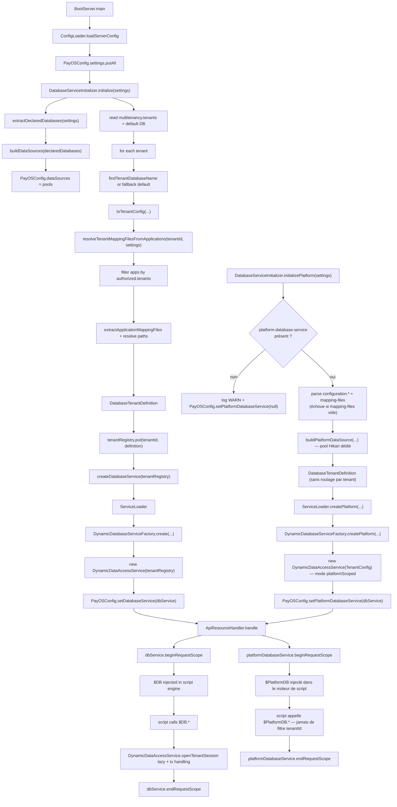

# Schéma d'initialisation du service de base de données

Dernier alignement: 2026-09-22

# Enchaînement des appels importants

- Startup:
  - BootServer.main(...) charge la config puis appelle DatabaseServiceInitializer.initialize(settings).
- Initialisation DB:
  - extractDeclaredDatabases(settings) construit le catalogue des bases déclarées.
  - buildDataSources(...) crée un pool HikariDataSource par base.
  - lecture de multitenancy.tenants + résolution de la DB par défaut.
  - pour chaque tenant:
    - findTenantDatabaseName(...) (ou fallback default)
    - toTenantConfig(...)
    - resolveTenantMappingFilesFromApplications(...) :
      - filtre les apps par authorized.tenants
      - extrait/résout les fichiers mapping
    - construit DatabaseTenantDefinition.
  - createDatabaseService(tenantRegistry) via ServiceLoader<IDatabaseServiceFactory>.
  - factory courante: DynamicDatabaseServiceFactory → DynamicDataAccessService.
  - publication globale: PayOSConfig.setDatabaseService(...).
- Exécution requête API:
  - ApiResourceHandler prend PayOSConfig.getDatabaseService()
  - beginRequestScope() avant script, endRequestScope() en finally
  - le script utilise $DB.
- Côté DynamicDataAccessService:
  - première opération tenant → resolveTenantSessionFactory(...) (lazy cache)
  - crée SessionFactory tenant avec propriétés DB + mappings tenant
  - ouvre Session, applique schema si configuré
  - executeInTransaction(...) commit/rollback seulement si la méthode “possède” la transaction.
- Initialisation Platform DB (optionnelle, backing `$PlatformDB`):
  - BootServer.main(...) (démarrage) et BootServer.reloadConfiguration(...) (hot reload) appellent DatabaseServiceInitializer.initializePlatform(settings) juste après initialize(settings).
  - si le bloc `platform-database-service` est absent: log WARN, PayOSConfig.setPlatformDatabaseService(null), retourne null — pas d'échec du démarrage.
  - si présent: parse `configuration.*` (mêmes clés que `database-service.configuration`) et `mapping-files` (obligatoire — IllegalStateException si vide après résolution).
  - ferme l'éventuel pool Hikari platform précédent (hot reload), puis construit un nouveau pool dédié (`buildPlatformDataSource`).
  - construit un DatabaseTenantDefinition unique (pas de boucle par tenant, pas de tenantRegistry) et appelle IDatabaseServiceFactory.createPlatform(...) via ServiceLoader.
  - DynamicDatabaseServiceFactory.createPlatform(...) → new DynamicDataAccessService(TenantConfig) — le constructeur platform-scoped (pas celui à base de tenantRegistry).
  - publication globale: PayOSConfig.setPlatformDatabaseService(...).
- Exécution requête API (Platform DB):
  - ApiResourceHandler prend aussi PayOSConfig.getPlatformDatabaseService() (indépendamment de databaseService).
  - beginRequestScope()/commitRequestScope()/rollbackRequestScope()/endRequestScope() appelés en parallèle de ceux de $DB — deux transactions indépendantes, jamais partagées.
  - `resolveTenantIdForCurrentPolicy()` retourne toujours `null` pour cette instance (court-circuit avant toute lecture du ThreadLocal CURRENT_TENANT — voir §6 de database-service/docs/DynamicDataAccessService.md), donc aucune des 3 mécaniques d'isolation par tenant ne s'applique.

# Structures de données utilisées

- PayOSConfig.settings : Map<String,Object>
  - config runtime fusionnée (bootstrap + multitenancy + applications…).
- declaredDatabases : Map<String, Map<String,Object>>
  - index des bases déclarées par nom d’instance.
- PayOSConfig.dataSources : Map<String, DataSource>
  - pool JDBC par instance DB (Hikari), partagé globalement.
- tenantRegistry : Map<String, DatabaseTenantDefinition>
  - vue “prête à l’emploi” par tenant: url/user/password/driver/dialect/schema/mappings.
- DatabaseTenantDefinition
  - DTO neutre (contrat interface) pour découpler payos de l’implémentation concrète.
- ServiceLoader<IDatabaseServiceFactory>
  - mécanisme d’injection runtime de l’implémentation DB.
- Dans DynamicDataAccessService:
  - tenantRegistry : Map<String, TenantConfig> interne à l’implémentation.
  - tenantSessionFactories : ConcurrentHashMap<String, SessionFactory>
    - cache lazy des SessionFactory par tenant.
  - requestScopedSession : ThreadLocal<Session>
    - une session réutilisée par requête.
  - requestScopeDepth : ThreadLocal<Integer>
    - profondeur pour gérer les appels imbriqués sans fermer trop tôt.
  - CURRENT_TENANT : ThreadLocal<String> (+ MDC fallback)
    - résolution automatique du tenant courant — statique, partagé par toute instance de DynamicDataAccessService sur le même thread (d'où le besoin du flag platformScoped ci-dessous plutôt que d'une simple absence de tenant ambiant).
  - platformScoped : boolean (final, posé au constructeur)
    - si vrai, resolveTenantIdForCurrentPolicy() retourne null immédiatement, sans lire CURRENT_TENANT/MDC ni consulter tenantRegistry.
- PayOSConfig.platformDatabaseService : IDatabaseService
  - publié par DatabaseServiceInitializer.initializePlatform(...), consommé par ApiResourceHandler pour injecter $PlatformDB — instance séparée de PayOSConfig.databaseService.
- DatabaseServiceInitializer.previousPlatformDataSource : DataSource (static)
  - référence l'ancien pool Hikari platform pour le fermer proprement au prochain appel d'initializePlatform (hot reload).
