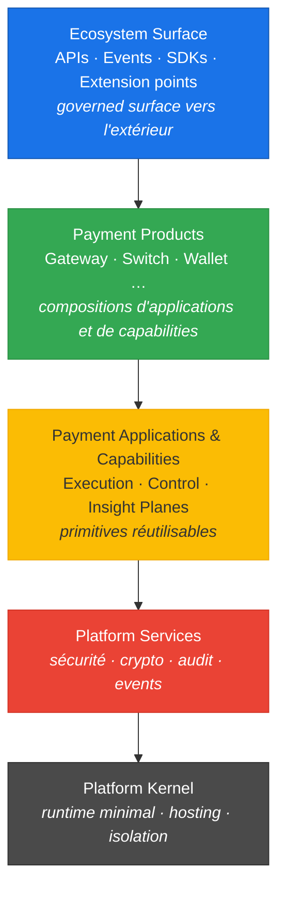
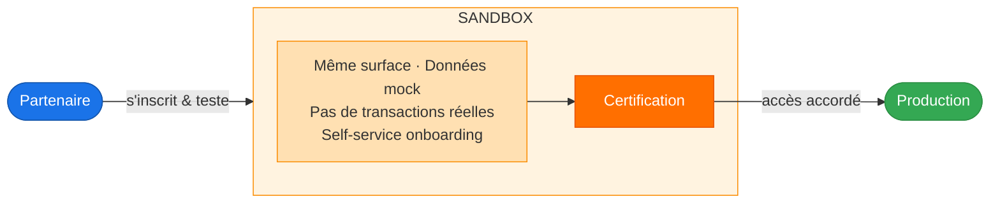

# Ecosystem Surface — Concept, Architecture & Matérialisations

> Source: *Payment Platform Vision 2026 v2* — S2M © 2026  
> Analyse rédigée le 12/05/2026

---

## 1. Introduction

Le document de vision donne la définition suivante de la surface (page 5) :

> *"The platform exposes a **governed surface** that defines how customers and partners build and operate solutions. All access is **authenticated**, **authorized**, **versioned**, and **auditable**. No external actor depends on internal runtime or services."*

la **surface gouvernée** est la **surface d'exposition** de la plateforme. Ce n'est pas juste une API publique — c'est un contrat avec les propriétés suivantes :

| Propriété | Implication concrète |
|---|---|
| **Authenticated** | Aucun accès anonyme, chaque acteur est identifié |
| **Authorized** | Ce qu'un acteur peut faire est borné par ses droits |
| **Versioned** | Aucun breaking change silencieux, les contrats évoluent de manière contrôlée |
| **Auditable** | Toute interaction est traçable pour compliance et investigation |

Règle d'or : **aucun acteur externe ne touche le runtime interne**. L'isolation n'est pas une bonne pratique optionnelle — c'est une contrainte architecturale structurelle.

---

## 2. L'Ecosystem Surface — Vue complète

### 2.1 Définition architecturale de la surface PayOS (page 4)

> *"A governed interface (**APIs, events, SDKs, extension points**) through which external actors interact with the platform **safely**."*

L'Ecosystem Surface est la **couche de contact** entre la plateforme et le monde extérieur. Elle se compose de **4 types de points d'entrée** :

| Type | Rôle |
|---|---|
| **APIs** | Intégrations synchrones (ex. initier un paiement, interroger un solde) |
| **Events** | Intégrations asynchrones (ex. notification de transaction, webhook) |
| **SDK** | Facilitation de l'intégration côté partenaire / développeur |
| **Extension points** | Points d'extensibilité définis par la plateforme (sans modifier le core) |

### 2.2 Qui constitue l'écosystème qui aura à travailler avec la surface (page 5)

> *"The ecosystem includes **banks, fintechs, PSPs, payment facilitators, and integrators**."*

Cinq catégories d'acteurs externes, chacun avec un profil différent :
- **Banks** — clients T1/T2, souvent on-premise, exigences compliance fortes
- **Fintechs** — intégrateurs agiles, attendent des APIs modernes et des sandboxes
- **PSPs** (Payment Service Providers) — opérateurs de paiement, besoin de router et traiter des transactions sur plusieurs réseaux de paiement
- **Payment facilitators** — agrégateurs qui revendent la capacité de la plateforme
- **Integrators** — partenaires techniques tiers qui assemblent des solutions

### 2.3 Ce que l'écosystème permet (page 5)

> *"It enables scalable reach by allowing partners to **build and operate on the platform independently**, within controlled boundaries."*

Les partenaires peuvent **créer et opérer eux-mêmes** sans dépendre d'une prestation de S2M PS. C'est ce qui répond au problème central identifié en page 1 :

> *"High reliance on Professional Services to deliver client-specific adaptations limits scalability and margins."*

### 2.4 Position dans l'architecture de la plateforme



La surface est **la seule porte d'entrée légale**. Un partenaire n'appelle jamais directement une application, capability, un service, ou le kernel.

### 2.5 Lien avec les OKRs business

| OKR Corporate | Mécanisme plateforme |
|---|---|
| Réduire le coût de delivery | Configuration, règles, extensions remplacent le code sur mesure |
| **Développer la capacité de vente** | **Grâce à la Surface → partner-led delivery** |
| Accélérer le TTM | Composition de capabilities |
| Croissance durable | Réutilisation + gouvernance |

---

## 3. Matérialisation concrète — À quoi ressemble la Surface ?

### 3.1 Les 4 formes possibles

#### A. APIs REST / HTTP — Le point d'entrée principal

C'est ce que PayOS expose déjà via `payos-server-http`. Concrètement :

```
POST /api/v1/payments
Authorization: Bearer <token>
X-Tenant-Id: bank-alpha
X-Correlation-Id: uuid

{
  "amount": 10000,
  "currency": "MAD",
  "channel": "POS",
  "merchantId": "M-001"
}
```

La "governed surface" se matérialise ici par :
- `v1` dans l'URL → **versioning**
- `Authorization: Bearer` → **authentication et autorisation**
- `X-Tenant-Id` → **authorization** (isolation tenant)
- `X-Correlation-Id` → **auditability** (traçabilité end-to-end)

#### B. Events / Webhooks — La surface asynchrone

Ce que PayOS expose via `webhook-service-http` et `payos-server-queue` :

```json
// Événement envoyé au partenaire
{
  "eventType": "PAYMENT_AUTHORIZED",
  "version": "1.0",
  "correlationId": "uuid",
  "tenantId": "bank-alpha",
  "timestamp": "2026-05-12T10:30:00Z",
  "payload": {
    "paymentId": "PAY-001",
    "amount": 10000,
    "status": "AUTHORIZED"
  }
}
```

Gouvernée car :
- `version` du schéma d'événement → contrat stable
- `tenantId` → isolation
- `correlationId` → auditabilité

#### C. SDKs — La surface packagée

Une librairie (Java, JS, Python…) distribuée aux partenaires qui encapsule les appels API :

```javascript
// SDK partenaire (côté fintech)
const payos = new PayOSClient({ tenantId: 'bank-alpha', apiKey: '...' });

const payment = await payos.payments.create({
  amount: 10000,
  currency: 'MAD',
  channel: 'ECOM'
});
```

Le SDK **cache** les détails du runtime interne. Il est **versionné** (`payos-sdk:2.1.0`) et **publié** sur un registry contrôlé. Changer l'interne n'impacte pas les partenaires si le SDK maintient son contrat.

#### D. Extension Points — La surface d'extensibilité

C'est le mécanisme le plus structurant pour PayOS. Il se matérialise par les **scripts JS** injectés dans le kernel, qui s'exécutent via GraalVM Polyglot :

```javascript
// Script déposé par le partenaire/client dans l'application PayOS
// Ce script EST l'extension point — il s'exécute dans un sandbox isolé

var result = $Api.call('payment-processor', $Request);
var enriched = {
  ...result,
  customFee: $App.getSetting('custom-fee-rate') * result.amount
};
$Response.send(enriched);
```

Gouverné car :
- Le script n'a accès qu'aux bindings injectés (`$Api`, `$App`, `$DB`, `$Queue`, `$Response`) — jamais aux classes internes
- S'exécute dans le contexte GraalVM Polyglot isolé
- Les APIs disponibles dans `$Api` sont définies et versionnées par la plateforme

### 3.2 La Sandbox — L'entrée sécurisée dans l'écosystème

Avant d'accéder à la surface gouvernée en production, un partenaire passe par la **Sandbox** :



Concrètement : un environnement PayOS dédié, même APIs, même schémas d'événements, mais isolé de la production. Le partenaire s'y connecte avec des credentials sandbox, teste son intégration, obtient une certification, puis est promu en production. Le sandbox devra être construit au fur et à mesure de l'avancement de développement des produits.

### 3.3 Ce que la surface n'est pas

| Ce que ce n'est PAS | Pourquoi |
|---|---|
| Accès direct à la base de données | Non gouverné, non versionné |
| Appel direct au runtime interne (HTTP interne, JMX…) | Contourne l'authentification et le versioning |
| Modification du code du kernel | Viole "extensibility without code forks" |
| Accès aux queues NATS internes directement | Non auditable, couplage fort |

---

## 4. Synthèse

**La surface est le contrat formel et versionné via lequel banques, fintechs, PSPs et intégrateurs construisent et opèrent des solutions sur la plateforme — sans jamais toucher son intérieur.**

La "governed surface" est la propriété de ce contrat : tout accès y est authentifié, autorisé, versionné et auditable.

Dans PayOS, elle se matérialise par :
1. **HTTP REST APIs** (`payos-server-http`) — intégrations synchrones
2. **Events/Webhooks** (`webhook-service-http`, `payos-server-queue`) — intégrations asynchrones
3. **SDKs** versionnés — abstraction partenaire
4. **Scripts JS** (extension points GraalVM) — customisation sans fork de code
5. **Sandboxes** — onboarding sécurisé avant production