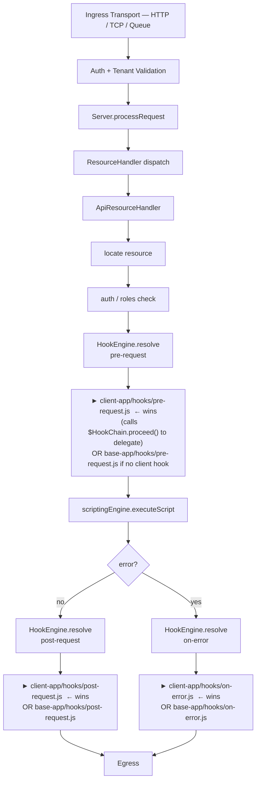
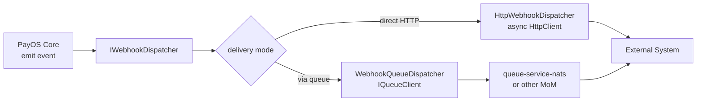
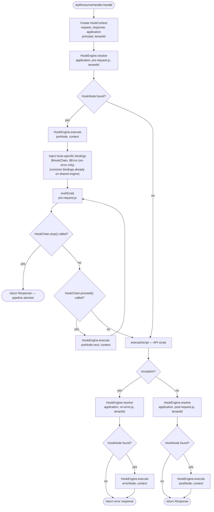
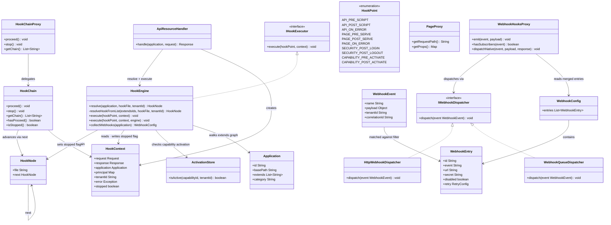

# PayOS — Hooks & Webhooks System

Last Alignment: 2026-05-06 (page hooks, native validation, dedup semantics, i18n binding)  
Status: Implemented

---

## 1. Overview

The PayOS hooks system operates at **two distinct levels**:

| Level | Type | Direction | Execution |
|---|---|---|---|
| **Level 1** | Internal Hooks | In-kernel | Synchronous |
| **Level 2** | Webhooks | Outbound HTTP / Queue | Asynchronous |

Both levels integrate within the existing architecture without breaking the `Server.processRequest` contract or any existing application scripts.

A **key design property** of both levels is alignment with the PayOS application inheritance model (`extends`): a client application can install hooks and webhooks that execute transparently alongside — or instead of — those provided by the publisher's base application, without modifying it.

---

## 2. Level 1 — Internal Hooks

Internal hooks are **synchronous interceptors** injected at well-defined points within the PayOS processing pipeline. They are written as JavaScript files and executed by the same GraalVM scripting engine already in use.

### 2.1 Enriched Processing Pipeline



### 2.2 Hook Points Catalogue

| Hook Point | Trigger | Typical Use Cases |
|---|---|---|
| `api.pre-script` | Before JS script execution | Request enrichment, quota enforcement |
| `api.post-script` | After JS script execution | Response transformation, metrics |
| `api.on-error` | Exception in the API pipeline | Alerting, error tracking |
| `page.pre-serve` | After security check, before Vue page assembly | Request enrichment, access control, A/B routing |
| `page.post-serve` | After Vue page response is fully assembled | Response headers, analytics |
| `page.on-error` | Exception during Vue page serving | Error tracking, fallback pages |
| `security.post-login` | After successful OIDC authentication | Audit log, session enrichment |
| `security.post-logout` | After logout | Audit log, token revocation |
| `capability.pre-activate` | Before capability activation | Validation, resource provisioning |
| `capability.post-activate` | After capability activation | Cache refresh, notifications |
| `capability.pre-deactivate` | Before capability deactivation | Graceful resource teardown |
| `capability.post-deactivate` | After capability deactivation | Cleanup, notifications |

### 2.3 File Convention

Hooks are co-located with the application they belong to, under a `hooks/` subdirectory:

```
apps/
  myapp/
    api/
    hooks/                          ← convention: loaded automatically if present
      pre-request.js                ← runs before every API script
      post-request.js               ← runs after every API script
      on-error.js                   ← runs on any pipeline exception
      page-pre-serve.js             ← runs before a Vue page is assembled (after security check)
      page-post-serve.js            ← runs after a Vue page response is fully assembled
      page-on-error.js              ← runs on any Vue page serving exception

```

## 2a. Hook Inheritance — Extends Chain Resolution

This section describes how hooks interact with the PayOS application inheritance model.

### 2a.1 Resolution Semantics

| Resource type | Behavior across `extends` chain |
|---|---|
| API scripts, pages, components | **Child-first resolution** — most specific match in the chain runs |
| Menu entries | **Aggregated** — entries from all levels are merged |
| **Hooks** | **Child-first resolution** — most specific match runs; parent hook only runs if child calls `$HookChain.proceed()` |

Hook resolution walks the `extends` chain from the most specific application (the client app) toward the root. The **first hook file found** is the one that executes — regardless of whether any parent application defines a hook for the same point. A client application can install a hook that the base application never had, and it will execute normally. If both define the same hook, the child's runs and the parent's is skipped by default. The client can explicitly delegate to the parent by calling `$HookChain.proceed()`.

This is intentional: hooks can short-circuit the pipeline, modify responses, or emit events — running both child and parent hooks implicitly would lead to unpredictable accumulated side effects in a financial platform.

### 2a.2 Resolution and Execution Order

`HookEngine` resolves the effective hook for a given hook point by walking the full `extends` graph **recursively and depth-first**, starting from the called application. There is no fixed "client → base → capability" ordering: capabilities are simply applications that appear in an `extends` list with an activation guard — they are not a special phase.

```
HookEngine.resolve(application, "pre-request.js"):

  1. Check the called application's hooks/ directory.
     → file found: this is the effective hook; stop here.
     → not found: recurse into its extends list (in declaration order).

  2. For each application in the extends list:
     - If it is an inactive capability for the current tenant: skip.
     - Otherwise: recurse — check its hooks/ directory, then its own extends list.
     - The first hook found anywhere in the sub-tree wins.

  3. If no hook is found anywhere in the full extends graph → no hook runs.
```

This mirrors how API script resolution works: the most specific application in the chain wins. The parent hook is not called unless the child explicitly opts in via `$HookChain.proceed()`.

### 2a.3 Delegation Control — `$HookChain`

`$HookChain` is the single place for all pipeline and chain flow control in a hook script.

| Action | Effect |
|---|---|
| Return normally (no explicit call) | Parent hook is **skipped** — child hook has full ownership; API script executes normally |
| `$HookChain.proceed()` | The next hook in the `extends` chain is executed |
| `$HookChain.stop()` | **Aborts API script execution** — the current `$Response` is returned as-is; no further pipeline steps run |

`$HookChain.proceed()` can be called at any point in the hook script — before, after, or conditionally around custom logic — giving fine-grained control over where in the execution flow the parent behaviour is invoked.

`$HookChain.stop()` is the explicit signal to short-circuit the pipeline. Because it is decoupled from the response status code, a hook can stop execution and return any status — including 2xx (e.g. serving a cached response) — without ambiguity.

> Calling `$HookChain.proceed()` more than once in a single hook script has no effect on the second call — the parent executes exactly once.

> `$HookChain.stop()` and `$HookChain.proceed()` are mutually exclusive within a single hook execution. Calling both is a contract violation and results in a pipeline error.

### 2a.4 Practical Scenarios

**Scenario A — Client adds a hook, base app has none**

The publisher's base application has no `hooks/pre-request.js`. The client installs one. It runs normally — no base hook to delegate to.

```
client-app/hooks/pre-request.js   ← effective hook (only one in chain)
        ↓
execute API script
```

**Scenario B — Client overrides a publisher hook entirely**

Both apps have `hooks/on-error.js`. The client's hook runs; the publisher's is skipped.

```javascript
// client-app/hooks/on-error.js
// Publisher's base hook is NOT called — client has full ownership
$Logger.error('Custom error handler: {}', $Error.getMessage());
$WebHooks.emit('api.error', { error: $Error.getMessage(), tenant: $Tenant });
$Response.setStatusCode(500);
$Response.setBody(JSON.stringify({ error: 'Service error' }));
// No $HookChain.proceed() → base-app/hooks/on-error.js is skipped
```

**Scenario C — Client wraps a publisher hook (opt-in delegation)**

The client wants to run custom logic before and after the publisher's `post-request.js`.

```javascript
// client-app/hooks/post-request.js
// Add client-specific header first
$Response.addHeader('X-Client-Processed', 'true');

// Then let the publisher's post-request hook run
$HookChain.proceed();

// Continue after publisher hook (e.g. log the final response state)
$Logger.info('Final status: {}', $Response.getStatusCode());
```

**Scenario D — No client hook, only base app hook**

The client application has no `hooks/pre-request.js`. The publisher's base hook becomes the effective hook and runs automatically.

```
(no client-app hook)
        ↓
base-app/hooks/pre-request.js   ← effective hook (fallback)
        ↓
execute API script
```

**Scenario E — Capability installs a hook**

A `fraud-detection` capability is activated on the `payment` application and contributes `hooks/pre-request.js`. Neither the client app nor the base app have a hook for this point.

```
(no client-app hook)
(no base-app hook)
        ↓
fraud-detection/hooks/pre-request.js   ← effective hook (capability fallback)
        ↓
execute payment script
```

Capability hooks respect the same `ActivationStore` rule as capability resources: they are only considered if the capability is active for the current tenant.

**Scenario F — Client delegates to capability hook, skipping base app**

The client app has a hook and wants to run the capability's hook (positioned after the base app in `extends`), bypassing the base app hook entirely:

```javascript
// client-app/hooks/pre-request.js
// Skip base-app hook, proceed to capability hook
$HookChain.proceed();  // ← will skip base-app and reach fraud-detection hook
                       //    only if client extends both base-app and fraud-detection
```

> `$HookChain.proceed()` advances to the **next hook found** in the `extends` chain in declaration order, skipping levels that have no hook file.

### 2a.5 Hook Resolution Algorithm

The algorithm is a pure recursive depth-first walk of the `extends` graph. Capabilities are treated identically to any other application — the only difference is the activation guard applied at the start of each call:

```
resolveHook(application, hookFile, tenantId):
  // Activation guard — applies to any application, not only capabilities
  if application.category == capability:
    if not ActivationStore.isActive(application.id, tenantId):
      return null   ← inactive: prune this entire sub-tree

  if file exists at application.basePath/hooks/hookFile:
    return HookNode(
      file = application.basePath/hooks/hookFile,
      next = resolveHookFromList(application.extends, hookFile, tenantId)
    )   ← first match: stop here, pre-compute remainder for $HookChain.proceed()

  // No hook at this level — recurse into extends list
  return resolveHookFromList(application.extends, hookFile, tenantId)

resolveHookFromList(extendsIds, hookFile, tenantId):
  for each parentId in extendsIds (in declaration order):
    parentApp = Application.getApplicationById(parentId)
    result    = resolveHook(parentApp, hookFile, tenantId)
    if result != null:
      return result   ← first match in declaration order wins
  return null         ← no hook found in this sub-tree
```

Key properties of this algorithm:
- **Uniform recursion**: every entry in an `extends` list is processed the same way — there is no special "capability phase".
- **Activation guard at entry**: an inactive capability prunes its entire sub-tree (the capability's own `extends` list is also skipped).
- **`HookNode` linked structure**: each node carries `file` (the effective hook) and `next` (the pre-computed remainder of the chain). Executing the chain means running the root node; `$HookChain.proceed()` advances to `next`.

> **`extends` field format**: In `application.json`, the `extends` field accepts both a single string and an array of strings. Both are equivalent — the kernel normalises them at load time. Use whichever is more readable for your use case.
> ```json
> // Single parent (string form — most common)
> { "extends": "base-app" }
>
> // Multiple parents (array form)
> { "extends": ["base-app", "fraud-detection"] }
> ```

### 2a.6 Webhooks Inheritance — `webhooks.json` Merging

Webhook declarations in `webhooks.json` are also **merged across the extends chain**, following the same aggregation rule:

- Entries from the child application are collected first.
- Entries from parent applications (via `extends`) are appended.
- If two entries share the same `id`, the **child entry wins** (override semantics, consistent with resource resolution).

This means a client can:
- **Add** new webhook subscriptions without touching the base app.
- **Override** a specific base-app webhook (same `id`) to change its URL, secret, or retry policy.
- **Remove** a base-app webhook by declaring an entry with the same `id` and `"disabled": true`.

```json
// client-app/webhooks.json
{
  "webhooks": [
    {
      "id": "payment-completed",       ← same id as base-app entry
      "event": "api.post-request",
      "native": true,
      "filter": { "path": "/api/payments/**", "method": "POST", "statusCodes": [200, 201] },
      "url": "${CLIENT_WEBHOOK_URL}",  ← client overrides the delivery URL
      "secret": "${CLIENT_SECRET}"
    },
    {
      "id": "client-audit",            ← new entry, not present in base app
      "event": "api.post-request",
      "native": true,
      "url": "${CLIENT_AUDIT_URL}",
      "secret": "${CLIENT_AUDIT_SECRET}"
    }
  ]
}
```

### 2.4 Script Bindings in Hooks

The same bindings available in API scripts are injected into hook scripts. Additional hook-specific bindings are provided:

| Binding | Available in | Description |
|---|---|---|
| `$Request` | `pre-request`, `on-error`, page hooks | Inbound request |
| `$Response` | all hooks | Current response object (may be modified) |
| `$App` | all hooks | Application proxy |
| `$Principal` | `pre-request`, `post-request`, `on-error` | Authenticated user (may be null) |
| `$Page` | page hooks only | Page proxy — `getRequestPath()`, `getProps()` (resolved route params + query params) |
| `$Tenant` | all hooks | Resolved tenant ID string |
| `$Logger` | all hooks | SLF4J logger |
| `$DB` | all hooks | Database service (optional, if configured) |
| `$Queue` | all hooks | Queue client (optional, if configured) |
| `$I18n` | API hooks; standalone hook execution | Server-side localization proxy — `locale()`, `t(...)`, `exists(...)`, `withLocale(...)` |
| `$WebHooks` | all hooks | `WebhookHooksProxy` — emits webhook events from scripts |
| `$HookChain` | all hooks | Pipeline and chain control — `proceed()` delegates to parent hook; `stop()` aborts pipeline execution |
| `$Error` | `on-error`, `page-on-error` | Exception that triggered the hook |

> **Note**: `$Principal` is **not** available in page hooks. `VueResourceHandler` enforces role-based access via `SecurityServiceFactory.check()` but does not carry an authenticated principal object into the page lifecycle. `$I18n` is installed by `ApiResourceHandler` for API pipelines and by `HookEngine` when a hook runs with its standalone engine.

### 2.5 Hook Examples

**`hooks/pre-request.js`** — Validate a custom header before script execution:
```javascript
// Return without modification to let the pipeline continue normally.
// Call $HookChain.stop() to abort execution and return the current $Response.

var token = $Request.getHeaders().get('X-Custom-Token');
if (token === null || token === undefined) {
  $Response.setStatusCode(400);
  $Response.setBody(JSON.stringify({ error: 'Missing X-Custom-Token header' }));
  $HookChain.stop();  // ← abort: API script will not run
}
```

**`hooks/post-request.js`** — Systematically enrich every response:
```javascript
$Response.addHeader('X-Processed-By', $App.getId());
$Response.addHeader('X-Tenant', $Tenant);
$Logger.info('Request completed: {} {}', $Request.getMethod(), $Request.getPath());
```

**`hooks/on-error.js`** — Emit a webhook on error and standardise the error response:
```javascript
$Logger.error('Pipeline error on {} {}: {}', $Request.getMethod(), $Request.getPath(), $Error.getMessage());

$WebHooks.emit('api.error', {
  path: $Request.getPath(),
  method: $Request.getMethod(),
  error: $Error.getMessage(),
  tenantId: $Tenant
});

$Response.setStatusCode(500);
$Response.setBody(JSON.stringify({ error: 'Internal processing error' }));
```

---

## 3. Level 2 — Webhooks (Outbound)

Webhooks are **asynchronous outbound notifications** sent to external systems when specific events occur inside PayOS. They follow the same standard adopted by Stripe, GitHub, and similar platforms.

### 3.1 Delivery Architecture



### 3.2 Emission Modes — `native` vs `manual`

Each webhook entry carries a `"native"` boolean that determines **who triggers the emission**:

| Mode | `"native"` | Triggered by | Typical use |
|---|---|---|---|
| **Native** | `true` | payos-kernel, automatically at the lifecycle point that matches `event` | Observability, audit, platform integrations |
| **Manual** | `false` *(default)* | Application script via `$WebHooks.emit(event, payload)` | Business events with custom payloads |

#### Native emission dedup rule

If an application script calls `$WebHooks.emit('api.post-request', payload)` explicitly, the kernel's automatic dispatch for matching entries is **conditionally cancelled**. The check is per-entry and filter-aware:

1. `emit()` records the event name in a per-request set.
2. At `dispatchNative()` time, the kernel re-applies the full filter (path + method + `statusCodes`) against the actual request and final response.
3. If the script emitted the event **and** the filter matches: the entry is suppressed (JS took priority).
4. If the filter does **not** match: the entry was never in scope for the script — it fires natively as normal.

This means calling `$WebHooks.emit('api.post-request', payload)` only suppresses native entries whose filter is satisfied by the current request/response. Entries scoped to other paths or status codes are unaffected.

### 3.3 Standard System Events

The following event names are emitted natively by payos-kernel. Use them as the `"event"` value together with `"native": true`.

> **Validation**: Any entry with `"native": true` whose `"event"` value is **not** in the list below is rejected at load time with a WARN log and excluded from active webhooks. This is enforced by `WebhookConfig` using `IConfigSpec.Webhooks.SystemEvents.isKnown()`. Custom event names are only valid for manual-mode (`"native": false` or absent) entries.

| Event | Kernel fires at | Payload fields |
|---|---|---|
| `api.pre-request` | After pre-request hook, before API script | `event`, `path`, `method`, `tenantId` |
| `api.post-request` | After post-request hook, once response is final | `event`, `path`, `method`, `statusCode`, `tenantId` |
| `api.on-error` | After on-error hook when the API pipeline throws | `event`, `path`, `method`, `statusCode`, `error`, `tenantId` |
| `page.pre-serve` | After security check, before Vue page assembly | `event`, `path`, `method`, `tenantId` |
| `page.post-serve` | After Vue page response is fully assembled | `event`, `path`, `method`, `statusCode`, `tenantId` |
| `page.on-error` | Exception during Vue page serving | `event`, `path`, `method`, `statusCode`, `error`, `tenantId` |
| `security.login` | After successful OIDC authentication | *(future — security layer)* |
| `security.logout` | After logout | *(future — security layer)* |
| `capability.activated` | After capability activation for a tenant | *(future — capability registry)* |
| `capability.deactivated` | After capability deactivation | *(future — capability registry)* |
| `capability.installed` | After capability install | *(future — capability registry)* |
| `capability.uninstalled` | After capability uninstall | *(future — capability registry)* |

> **Payload design note**: Native payloads are **metadata envelopes** — they never include request or response bodies. This is a deliberate security constraint (PCI DSS, PII, credential leakage prevention). Body content can be included by using a manual `$WebHooks.emit()` in a hook script, where the developer makes an explicit, auditable choice about what data is shared.

### 3.4 Configuration — `webhooks.json`

Each application declares its outbound webhooks in a `webhooks.json` file at the root of the application directory:

```json
{
  "webhooks": [
    {
      "id": "payment-completed",
      "event": "api.post-request",
      "native": true,
      "filter": {
        "path": "/api/payments/**",
        "method": "POST",
        "statusCodes": [200, 201]
      },
      "url": "${WEBHOOK_PAYMENT_URL}",
      "secret": "${WEBHOOK_SECRET}",
      "method": "POST",
      "headers": {
        "Authorization": "Bearer ${WEBHOOK_TOKEN}"
      },
      "retry": {
        "maxAttempts": 3,
        "backoffMs": 1000
      }
    },
    {
      "id": "payment-failed",
      "event": "api.post-request",
      "native": true,
      "filter": {
        "path": "/api/payments/**",
        "method": "POST",
        "statusCodes": [400, 422, 500]
      },
      "url": "${WEBHOOK_PAYMENT_FAILURE_URL}",
      "secret": "${WEBHOOK_SECRET}"
    },
    {
      "id": "audit-login",
      "event": "security.login",
      "native": true,
      "url": "${AUDIT_SYSTEM_URL}",
      "secret": "${AUDIT_SECRET}",
      "retry": {
        "maxAttempts": 5,
        "backoffMs": 2000
      }
    },
    {
      "id": "custom-business-event",
      "event": "payment.fraud-detected",
      "filter": {
        "path": "/api/payments/**",
        "method": "POST"
      },
      "url": "${FRAUD_ALERT_URL}",
      "secret": "${FRAUD_SECRET}"
    }
  ]
}
```

> `"native": false` (or absent) entries are **only dispatched when a script explicitly calls `$WebHooks.emit(event, payload)`**. Custom event names — i.e. any name **not** in the standard system events catalogue above — are valid and encouraged for business-level events (e.g. `"payment.fraud-detected"`, `"kyc.document-uploaded"`). They are not validated against the system events list.
>
> All `${VAR}` tokens are resolved from environment variables via the existing `EnvVarResolver` mechanism.

#### Filter fields

| Field | Type | Description |
|---|---|---|
| `path` | `string` | Glob or URI-template pattern matched against the request path (e.g. `/api/payments/**`, `/api/users/{id}`) |
| `method` | `string` | HTTP verb (case-insensitive). No filter = match any method |
| `statusCodes` | `integer[]` | List of response status codes. Only evaluated during native auto-dispatch (response is available). Empty or absent = match any status |

### 3.5 Webhook Security — HMAC Signature

Every outbound request includes a cryptographic signature so the receiver can verify its authenticity:

```
POST https://external.system/hooks/payment
Content-Type: application/json; charset=UTF-8
X-Payos-Event:      payment-completed
X-Payos-Signature:  sha256=<HMAC-SHA256(secret, raw-body)>
X-Tenant-Id:        <tenantId>
X-Correlation-Id:   <correlationId>

{ "transactionId": "...", "amount": 1500, "currency": "MAD" }
```

Header notes:
- `X-Payos-Event` carries the event name.
- `X-Correlation-Id` carries the correlation ID (doubles as delivery ID).
- `X-Payos-Signature` is only present when a `secret` is configured on the entry.
- Custom entry-level headers from `webhooks.json` are forwarded before the signature, so they cannot override it.

The receiving system validates the signature using the shared secret before processing the event — this prevents spoofed deliveries.

### 3.6 Retry Strategy

Failed deliveries (non-2xx response or timeout) are retried with **linear back-off**:

```
Attempt 1 — immediate
Attempt 2 — after backoffMs × 1
Attempt 3 — after backoffMs × 2
...
Attempt N — after backoffMs × (N-1)
After maxAttempts — event is dropped; all failed attempts are logged with X-Correlation-Id
```

Defaults: `maxAttempts=3`, `backoffMs=1000` ms. Both are configurable per entry in `webhooks.json`.
Failed events are logged at WARN level per attempt and ERROR level after exhausting all retries.

### 3.7 `$WebHooks` — JS Binding for Application Scripts

The `$WebHooks` proxy is injected into all API scripts and hook scripts. It is used for **manual-mode** (non-native) emissions:

```javascript
// Emit a custom business event with an arbitrary payload
$WebHooks.emit('payment.fraud-detected', {
  transactionId: result.id,
  amount: result.amount,
  currency: 'MAD',
  tenantId: $Tenant
});

// Check whether any subscriber exists before building a heavy payload
if ($WebHooks.hasSubscribers('payment.fraud-detected')) {
  $WebHooks.emit('payment.fraud-detected', buildDetailedPayload(result));
}

// Override kernel payload for a native event (dedup rule applies — kernel auto-dispatch is suppressed)
$WebHooks.emit('api.post-request', {
  transactionId: result.id,
  statusCode: $Response.getStatusCode(),
  tenantId: $Tenant
});
```

---

## 4. Java Module Structure

### 4.1 New package — `ma.s2m.payos.hooks`

```
ma.s2m.payos.hooks/
  IHookExecutor.java          — synchronous: execute(hookPoint, ctx) → void
  IWebhookDispatcher.java     — asynchronous: dispatch(event) → void
  HookContext.java            — request + response + application + principal + error + chain
  HookNode.java               — linked node: hookFile path + reference to next node
  HookPoint.java              — enum of all hook points (API, page, security, capability, server)
  HookEngine.java             — resolve() + execute() + collectWebhooks() via ScriptingEngine
  HttpWebhookDispatcher.java  — default IWebhookDispatcher: java.net.http.HttpClient on virtual threads
  WebhookEvent.java           — event name + payload + tenantId + correlationId + subscribers
  WebhookConfig.java          — merged webhooks.json; validates native=true entries against SystemEvents.ALL
  WebhookEntry.java           — single webhook declaration (id, event, native, filter, url, disabled, retry…)
  proxies/
    WebhookHooksProxy.java    — $WebHooks binding exposed to JS scripts
    HookChainProxy.java       — $HookChain binding exposed to JS scripts
ma.s2m.payos.resources.vue/
  VueResourceHandler.java     — Vue page serving with full hooks + webhooks pipeline
  PageProxy.java              — $Page binding: getRequestPath(), getProps()
```

### 4.2 `HookEngine` — Key Responsibilities

```
HookEngine  (implements IHookExecutor)
  ├── resolve(application, hookFileName, tenantId) → HookNode (nullable)
  │     Mirrors ResourceLocator.locate() — first match wins.
  │     Builds a linked HookNode chain for $HookChain.proceed().
  │     Skips inactive capabilities (ActivationStore check).
  │
  ├── execute(hookPoint, context)               → void
  │     Standalone variant — creates a fresh GraalVM Context.
  │     Injects common bindings + hook-specific bindings ($HookChain, $Error).
  │     $HookChain.proceed() triggers execution of context.getNode().next.
  │     If no hook file is found, the hook point is a no-op.
  │
  ├── execute(hookPoint, context, scriptingEngine) → void
  │     Shared-engine variant called by ApiResourceHandler.
  │     Reuses the same GraalVM Context across pre-hook, API script,
  │     post-hook and on-error hook — avoids repeated Context allocation.
  │     Common bindings are already set; only $HookChain and $Error are injected per node.
  │
  └── collectWebhooks(application)              → WebhookConfig
        Merges webhooks.json entries across extends chain.
        Child entries with same id override parent entries.
        Entries with "disabled": true are excluded from merged result.
```

### 4.3 Module Placement

| Component | Module | Rationale |
|---|---|---|
| `IHookExecutor`, `IWebhookDispatcher` | `payos-kernel` | Core interfaces, no external deps |
| `HookContext`, `HookChain`, `HookPoint`, `WebhookEvent`, `WebhookConfig` | `payos-kernel` | Shared model |
| `HookEngine` | `payos-kernel` | Reuses existing `ScriptingEngine` and `ResourceLocator` traversal |
| `WebhookHooksProxy`, `HookChainProxy` | `payos-kernel` | Injected in `ApiResourceHandler` |
| `HttpWebhookDispatcher` | `payos-kernel` | Uses `java.net.http.HttpClient` (JDK built-in, no external dep) |
| `WebhookQueueDispatcher` | `queue-service-nats` *(future)* | Implements `IWebhookDispatcher` via `IQueueClient` |

This mirrors the existing pattern: `IQueueClient` in the kernel, `NatsQueueClient` in `queue-service-nats`.

### 4.4 Integration Points in Existing Code

| Existing class | Modification |
|---|---|
| `ApiResourceHandler` | Call `HookEngine.resolve` + `execute` for `PRE_SCRIPT`, `POST_SCRIPT`, `ON_ERROR`. Inject `$WebHooks` and `$HookChain` bindings. Fire `dispatchNative()` at each lifecycle point. |
| `VueResourceHandler` | Full hooks + webhooks pipeline: `PAGE_PRE_SERVE`, `PAGE_POST_SERVE`, `PAGE_ON_ERROR`. Injects `$Page` (`PageProxy`) in addition to standard bindings. |
| `PayOSConfig` | Add `setWebhookDispatcher` / `getWebhookDispatcher` (same pattern as `setQueueClient`). |
| `BootServer` | Register `HttpWebhookDispatcher` (default) or `WebhookQueueDispatcher` at startup based on config. |
| `CapabilityRegistry` | Emit `capability.lifecycle` events after INSTALL / ACTIVATE / DEACTIVATE / UNINSTALL. |
| `SecurityService` / `NimbusSecurityService` | Emit `security.login` and `security.logout` events. |

### 4.5 Runtime Architecture — Class and Flow Diagrams

#### 4.5.1 Request Lifecycle Through Hooks



#### 4.5.2 Class Relationships



---

## 5. Configuration in `bootstrap.json`

> **Only `dispatcher` actually exists.** `timeout` and `deadLetterTopic` below are aspirational
> — `IConfigSpec.GlobalWebhooks` defines only `webhooks.dispatcher`; there is no dead-letter
> mechanism in source today (see §7, decisions #1–#4, which are design intent, not shipped
> behavior).

```json
{
  "webhooks": {
    "dispatcher": "http"
  }
}
```

| Key | Values | Description |
|---|---|---|
| `dispatcher` | `http`, `queue` | Delivery mode |

---

## 6. Design Alignment with PayOS Principles

| PayOS Principle | Application |
|---|---|
| **Convention over configuration** | `hooks/pre-request.js` is loaded automatically if present — no explicit registration |
| **Rigid core + flexible guest layer** | Interfaces and engine in kernel; HTTP/Queue dispatchers in separate modules |
| **API-First** | `webhooks.json` is the configuration surface; `$WebHooks` and `$HookChain` are the JavaScript API |
| **Native Multi-tenancy** | `tenantId` propagated in every event payload and outbound header; capability hooks respect per-tenant activation |
| **Secure and compliant by design** | HMAC-SHA256 on all outbound webhooks; correlation IDs on all events |
| **Externalized runtime** | JS hooks run inside the existing GraalVM engine — no new runtime |
| **Deployment agnostic** | HTTP dispatcher for direct mode; Queue dispatcher for MoM-based environments |
| **Modular by design** | `IWebhookDispatcher` is an extension point — any dispatcher can be swapped at startup |
| **Financial data first** | All events carry `correlationId` and `tenantId` for full traceability and audit |

### Alignment with Application Inheritance Model

| Resource behavior | Hook/Webhook behavior |
|---|---|
| API scripts: child-first resolution — most specific match runs | Hooks: child-first resolution — first hook found in the chain runs; parent hook only runs if child calls `$HookChain.proceed()` |
| Menu entries: aggregated across the entire chain | `webhooks.json`: merged across chain, child `id` overrides parent `id` |
| Capability resources: skipped if capability inactive | Capability hooks: skipped if capability inactive (same `ActivationStore` check) |
| No base resource needed for child to provide one | No base hook needed for client to install one |

---

## 7. Decisions

> **Decisions #1–#4 below are design intent, not shipped behavior.** No `IDeadLetterStore`,
> webhook delivery log, tenant-scoped `webhooks.json` override, or `/_system/webhooks/*` admin
> endpoint exists in source today (confirmed by search — zero hits for any of these). Decisions
> #5–#7 are real and verified against source.

1. **Dead-letter persistence** (aspirational): configurable — either file-based (NDJSON, e.g. `events.ndjson`) or queue-based (`IQueueClient`). The delivery mode is set in `bootstrap.json`; both backends implement the same `IDeadLetterStore` interface.

2. **Webhook delivery log** (aspirational): all deliveries (successful and failed) are recorded for audit compliance (PCI-DSS Req 10). Recording is **configurable** — it can be disabled per environment (e.g. dev/test) via `bootstrap.json`.

3. **Tenant-scoped webhook config** (aspirational): `webhooks.json` supports per-tenant override. A tenant-specific file at `config/<tenantId>/webhooks.json` takes precedence over the app-level file, following the same override semantics as other tenant-scoped config.

4. **Admin API** (aspirational): a `GET /_system/webhooks/deliveries` endpoint is exposed to query delivery history. Access is restricted to platform administrators.

5. **Synchronous webhook variant**: not supported. Blocking outbound HTTP calls on the critical path is incompatible with the platform's latency and reliability requirements. Fraud-check and veto scenarios are addressed via **Level 1 internal hooks** (`pre-request`) which are synchronous by design.

6. **Hook chain visibility**: `$HookChain.getChain()` is exposed, returning an ordered list of hook file paths that will execute for the current hook point. Intended for debugging and observability tooling only.

7. **Publisher lock**: a publisher can mark a hook as `locked: true` in a `hooks.json` manifest. A locked hook cannot be stopped by a child hook calling `$HookChain.stop()` — the engine enforces this at resolution time and raises a pipeline error if violated.
