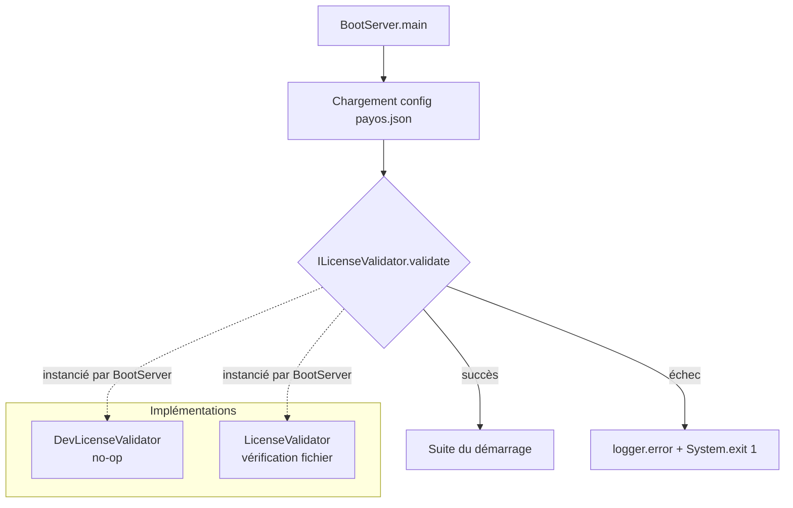

# Architecture — Validation de licence

**Créé le :** 2026-08-19  
**Dernière mise à jour :** 2026-08-19  
**Audience :** architectes, tech leads, contributeurs au kernel  
**Périmètre :** package `ma.s2m.payos.license`, intégration `BootServer`

---

## Table des matières

1. [Contexte et objectif](#1-contexte-et-objectif)
2. [Vue d'ensemble](#2-vue-densemble)
3. [Contrat — interface `ILicenseValidator`](#3-contrat--interface-ilicensevalidator)
4. [Implémentations fournies](#4-implémentations-fournies)
   - [DevLicenseValidator](#develicensevalidator)
   - [LicenseValidator](#licensevalidator)
5. [Exception — `LicenseValidationException`](#5-exception--licensevalidationexception)
6. [Configuration](#6-configuration)
7. [Intégration au démarrage (`BootServer`)](#7-intégration-au-démarrage-bootserver)
8. [Ajouter un validateur custom](#8-ajouter-un-validateur-custom)
9. [Considérations de sécurité](#9-considérations-de-sécurité)

---

## 1. Contexte et objectif

PayOS doit pouvoir conditionner son démarrage à la présence et la validité d'un fichier de licence. Cette contrainte s'applique dans les environnements de production et de staging pour s'assurer que seuls les déploiements autorisés peuvent démarrer.

Le mécanisme est conçu pour être :

- **fail-fast** — la vérification intervient avant toute autre initialisation de services ;
- **pluggable** — le comportement est derrière une interface `ILicenseValidator`, ce qui permet plusieurs implémentations selon l'environnement (dev, production, custom) ;
- **non bloquant en dev** — l'implémentation `DevLicenseValidator` est un no-op complet qui ne ralentit pas le cycle de développement local.

---

## 2. Vue d'ensemble



---

## 3. Contrat — interface `ILicenseValidator`

```java
package ma.s2m.payos.license;

import java.util.Map;

public interface ILicenseValidator {

    /** Valide à partir du chemin de fichier fourni dans la configuration. */
    void validate(Map<String, Object> configuration, String licenseFilePath) throws Exception;

    /** Valide à partir du contenu brut de la licence (bytes). */
    void validate(Map<String, Object> configuration, byte[] licenseData) throws Exception;
}
```

Les deux surcharges permettent de couvrir des modes d'intégration différents :
- **par chemin** — la licence est un fichier sur disque, dont le chemin est lu depuis `payos.json` ;
- **par contenu** — la licence est transmise programmatiquement (ex. bundle, coffre de secrets).

---

## 4. Implémentations fournies

### DevLicenseValidator

Implémentation no-op destinée à l'environnement de développement. Les deux méthodes `validate()` ne font rien et ne lancent aucune exception.

```
Classe  : ma.s2m.payos.license.DevLicenseValidator
Profil  : développement local
Comportement : validation toujours réussie
```

### LicenseValidator

Implémentation de référence pour les environnements nécessitant une licence valide.

Vérifications effectuées par `validate(config, licenseFilePath)` :

| Contrôle | Action en cas d'échec |
|---|---|
| `licenseFilePath` non nul/vide | `logger.error` + `System.exit(1)` |
| Fichier présent sur disque | `logger.error` + `System.exit(1)` |

La surcharge `validate(config, byte[])` est prévue pour les validations avancées (signature, expiration, tenant scope) et peut être complétée selon les besoins.

---

## 5. Exception — `LicenseValidationException`

```java
package ma.s2m.payos.license;

public class LicenseValidationException extends Exception {
    public LicenseValidationException(String message) { ... }
    public LicenseValidationException(String message, Throwable cause) { ... }
}
```

Exception vérifiée, à lever par les implémentations lorsque la validation échoue de façon contrôlée (plutôt que d'appeler `System.exit` directement depuis le validateur).

---

## 6. Configuration

La clé de configuration est définie dans `IConfigSpec` :

```
"license-file-path": "/chemin/vers/licence.lic"
```

Exemple dans `payos.json` :

```json
{
  "license-file-path": "/opt/payos/license/payos.lic"
}
```

Si la clé est absente ou nulle, la méthode `validate` reçoit `null` comme chemin. Le comportement dépend alors de l'implémentation du validateur actif.

---

## 7. Intégration au démarrage (`BootServer`)

La validation de licence est le **premier traitement effectué après le chargement de la configuration**, avant toute initialisation de service (base de données, queue, secrets, etc.). Cela garantit que tout problème de licence arrête le runtime avant que des ressources soient consommées.

```java
// BootServer.main — extrait
ILicenseValidator licenseValidator = new DevLicenseValidator();

try {
    String licenseFilePath = (String) config.get(IConfigSpec.LICENSE_FILE_PATH);
    licenseValidator.validate(config, licenseFilePath);
    logger.info("License validation successful.");
} catch (Exception e) {
    logger.error("License validation failed: {}", e.getMessage());
    System.exit(1);
}
```

> **Note :** `BootServer` instancie actuellement `DevLicenseValidator` en dur. Pour activer la validation en production, remplacer par `LicenseValidator` (ou un custom validator) au moment de l'assemblage du runtime de production.

---

## 8. Ajouter un validateur custom

Pour implémenter une validation avancée (signature cryptographique, expiration, scope tenant) :

1. Créer une classe dans un module séparé ou dans `payos-kernel` selon le périmètre.
2. Implémenter `ILicenseValidator`.
3. Lever `LicenseValidationException` en cas d'échec.
4. Instancier le validateur dans `BootServer` à la place de `DevLicenseValidator`.

```java
ILicenseValidator licenseValidator = new MonValidateurCustom();
```

Le validateur reçoit l'intégralité de la `configuration` (la map `payos.json`) pour accéder à tout paramètre supplémentaire nécessaire (tenant, version, environnement…).

---

## 9. Considérations de sécurité

- Le fichier de licence ne doit pas être accessible en lecture à tous les utilisateurs système — restreindre les permissions OS (ex. `chmod 640`).
- Ne pas logger le contenu du fichier de licence ni les bytes bruts.
- En cas de validation cryptographique, utiliser une clé publique embarquée dans le binaire (et non dans `payos.json`) pour résister à la substitution de config.
- La clé `license-file-path` dans `payos.json` n'est qu'un pointeur — le contenu du fichier doit être opaque (signé, chiffré) pour éviter la falsification.
