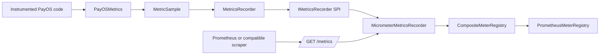
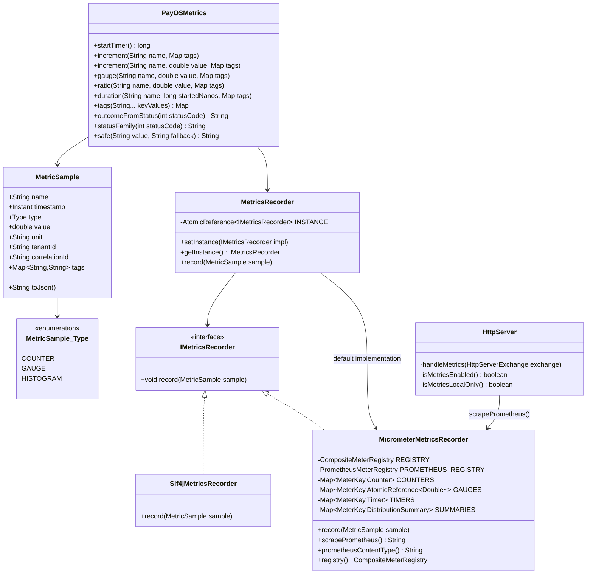
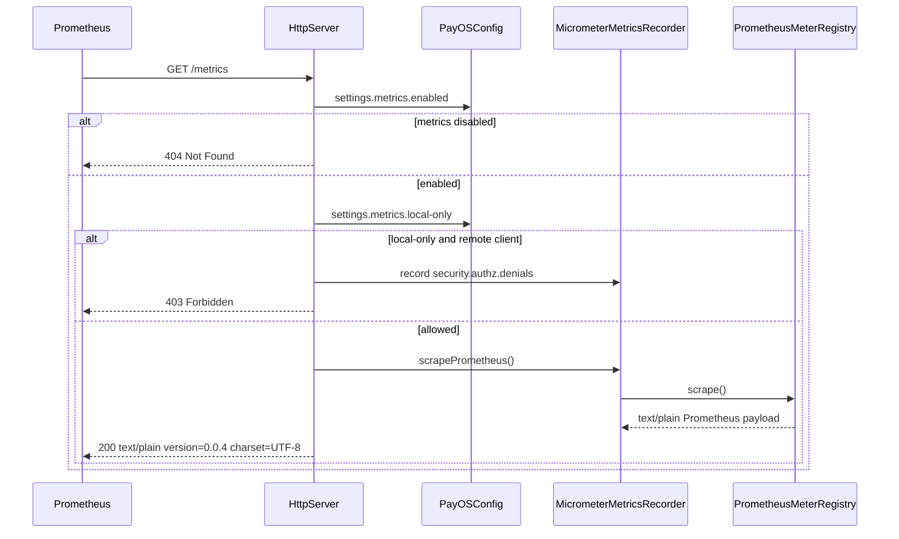
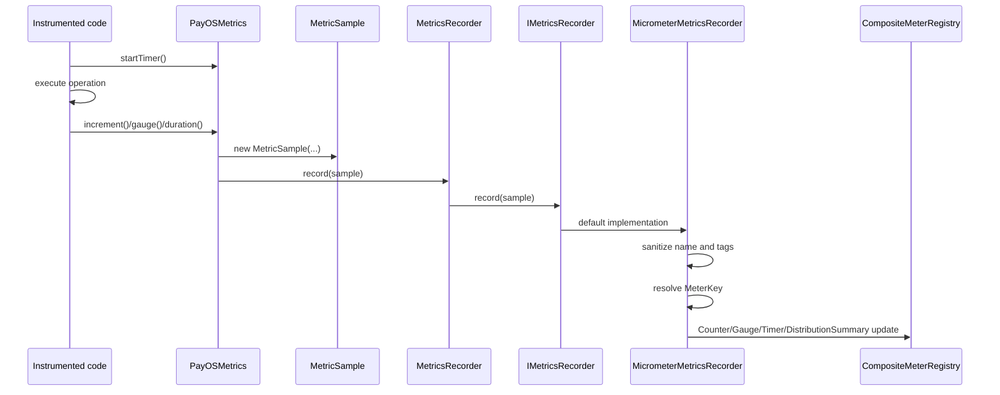
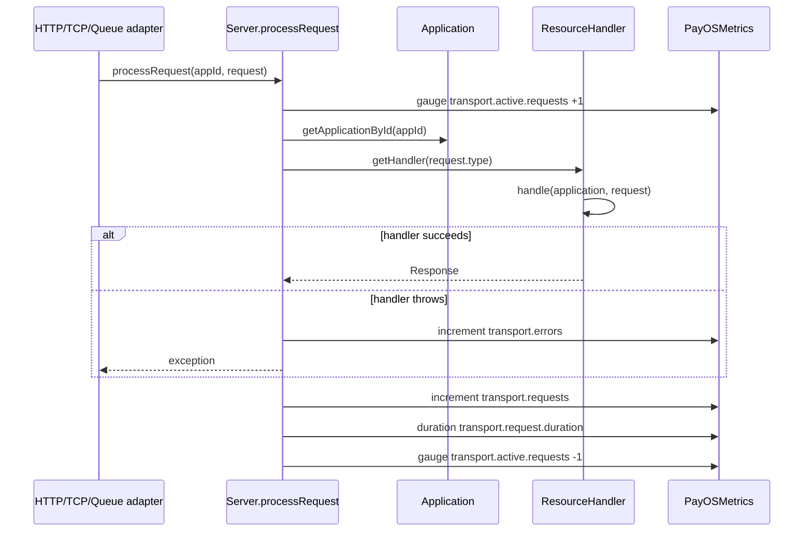
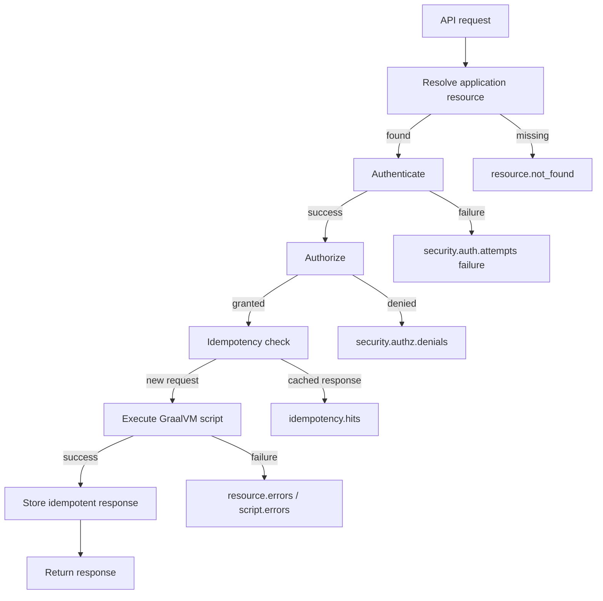
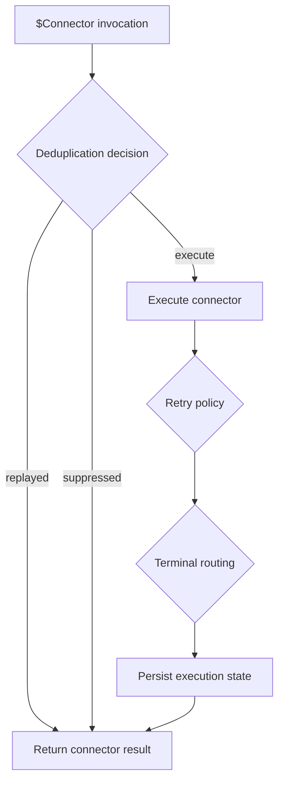

Creation date: 2026-09-06
Last update date: 2026-09-06

# Observability Metrics Architecture

This document describes the Micrometer-based metrics architecture added to PayOS. It covers the runtime design, class responsibilities, execution flows, Prometheus exposure model, tag policy, and the metric families emitted by the kernel and service modules.

The implementation keeps the existing PayOS observability contract as the stable API and uses Micrometer as the default backend adapter. This preserves the platform rule that cross-cutting capabilities live behind PayOS abstractions while still exposing standard Prometheus-compatible metrics.

## Goals

- Expose PayOS runtime, transport, resource, script, connector, queue, database, webhook, session, cache, secret, notification, audit, and rate-limit metrics.
- Keep metric emission available from the kernel and sibling modules without forcing every caller to know Micrometer APIs.
- Export metrics in Prometheus text format through the HTTP server at `/metrics`.
- Preserve low-cardinality labels suitable for Prometheus and similar time-series systems.
- Keep tenant labels opt-in because tenant identifiers can create high-cardinality series in multi-tenant installations.
- Preserve the existing `IMetricsRecorder` SPI so another metrics backend can replace Micrometer without changing business code.

## Modules

| Module | Responsibility |
| --- | --- |
| `payos-foundation` | Owns the stable metrics event model: `MetricSample`, `IMetricsRecorder`, and related contracts. |
| `payos-kernel` | Provides the default Micrometer recorder, the static facade, helper API, runtime instrumentation, API/script instrumentation, and optional script binding instrumentation. |
| `payos-server-http` | Exposes `/metrics` and protects it with local-only access by default. |
| `payos-server-tcp` | Emits TCP connection, decode, encode, and server error metrics. |
| `payos-server-queue` | Emits queue server connection, subscribe, consume, ack, and nack metrics. |
| `queue-service-nats` | Emits NATS and JetStream client metrics. |
| `database-service` | Emits database operation, duration, and error metrics. |
| `webhook-service-http` | Emits webhook submission, delivery, response, retry exhaustion, and serialization metrics. |
| `session-service-redis` | Emits Redis session store operation, hit/miss, error, and active-session metrics. |

## Architectural Shape

Metrics emission has three layers:

1. **Contract layer**: `MetricSample` and `IMetricsRecorder` define a backend-neutral event shape.
2. **Facade/helper layer**: `MetricsRecorder` resolves the active recorder through SPI; `PayOSMetrics` gives internal code a small API for counters, gauges, ratios, timers, tags, and HTTP status classification.
3. **Backend/export layer**: `MicrometerMetricsRecorder` maps PayOS samples to Micrometer meters and exposes the Prometheus registry through the HTTP server.



## Class Diagram



## Recorder Resolution

The active metrics recorder is resolved by `MetricsRecorder` through `SingleImplementationResolver`:

- The default implementation is `MicrometerMetricsRecorder`.
- The kernel registers the default in `META-INF/services/ma.s2m.payos.events.metrics.IMetricsRecorder`.
- External modules can still replace the implementation through the same SPI mechanism.
- Tests or embedded runtimes can override it programmatically with `MetricsRecorder.setInstance(...)`.

This means application code records PayOS metric samples and does not depend on a Prometheus-specific API.

## Micrometer Mapping

`MicrometerMetricsRecorder` translates `MetricSample.Type` into Micrometer meters:

| PayOS type | Micrometer meter | Behavior |
| --- | --- | --- |
| `COUNTER` | `Counter` | Positive values increment a monotonically increasing counter. Non-positive values are ignored. |
| `GAUGE` | `Gauge` backed by `AtomicReference<Double>` | Latest value is retained for the meter key. |
| `HISTOGRAM` with time unit | `Timer` | Duration samples are converted to nanoseconds and recorded as timers. |
| `HISTOGRAM` with non-time unit | `DistributionSummary` | Numeric distribution samples are recorded with the sample unit as base unit. |

Meter keys are cached by metric name plus normalized tag set. Tag entries are sorted so callers can build maps in any order without creating duplicate meters for the same label set.

Metric names are normalized by replacing `-` and `_` with `.` and prefixing every metric with `payos.` unless it is already present. Tag keys are normalized by replacing `-` and `.` with `_`.

## Built-in JVM and System Metrics

`MicrometerMetricsRecorder` binds standard Micrometer binders during class initialization:

- `ClassLoaderMetrics`
- `JvmMemoryMetrics`
- `JvmGcMetrics`
- `JvmThreadMetrics`
- `ProcessorMetrics`
- `UptimeMetrics`
- `LogbackMetrics`

Binder failures are logged at debug level and do not prevent the runtime from starting.

## Prometheus Endpoint

The HTTP server exposes Prometheus text format at `GET /metrics`.



Configuration is read from `PayOSConfig.settings.metrics`:

```json
{
  "metrics": {
    "enabled": true,
    "local-only": true
  }
}
```

Defaults are intentionally conservative:

- `enabled`: `true` when absent.
- `local-only`: `true` when absent.

If `local-only` is enabled and a non-local client requests `/metrics`, PayOS returns `403 Forbidden` and emits `payos.security.authz.denials` with `resource_type=metrics`.

## Tag and Cardinality Policy

PayOS metrics use low-cardinality tags only.

Allowed examples:

- `outcome`: `success`, `rejected`, `error`, `denied`, `unsupported`, `skipped`
- `exception`: simple exception class name or `none`
- `method`: HTTP method or transport operation
- `resource_type`: `api`, `page`, `component`, `file`, `menu`, `metrics`, etc.
- `status_family`: `2xx`, `4xx`, `5xx`, `unknown`
- `operation`: stable operation names such as `load`, `save`, `publish`, `encrypt`, `verify`
- `backend`: `redis`, `nats`, `memory`, etc.

Forbidden examples:

- Raw path or URL
- Correlation ID
- User ID
- Idempotency key
- Secret name
- Payment identifier
- Request body values
- Free-form error messages

`MetricSample` still contains `tenantId` and `correlationId` fields for compatibility with the PayOS event category contract, but `MicrometerMetricsRecorder` only adds the Prometheus `tenant_id` label when the JVM property below is enabled:

```text
-Dpayos.metrics.tenant-tags-enabled=true
```

This opt-in protects high-tenant deployments from uncontrolled series growth.

## Generic Metric Recording Flow



## Request Processing Metrics

All transports that delegate into `Server.processRequest(appId, request)` inherit common transport metrics.



Emitted metrics:

| Metric | Type | Tags | Meaning |
| --- | --- | --- | --- |
| `payos.transport.active.requests` | Gauge | `server`, `app_id`, `method`, `resource_type` | Current in-flight requests handled by the common server pipeline. |
| `payos.transport.requests` | Counter | `server`, `app_id`, `method`, `resource_type`, `outcome`, `status_family` | Completed transport requests. |
| `payos.transport.request.duration` | Timer | same as `transport.requests` | End-to-end common request pipeline duration. |
| `payos.transport.errors` | Counter | `server`, `app_id`, `method`, `resource_type`, `outcome`, `exception` | Exceptions escaping common request processing. |

## API, Security, Resource, and Script Flow

`ApiResourceHandler` instruments the inner API pipeline: resource lookup, authentication, authorization, idempotency behavior, script execution, and resource-level result accounting.



Emitted metric families:

| Metric | Type | Purpose |
| --- | --- | --- |
| `payos.resource.requests` | Counter | Resource handler completions by resource type and outcome. |
| `payos.resource.duration` | Timer | Resource handler latency. |
| `payos.resource.errors` | Counter | Resource handler failures. |
| `payos.resource.not_found` | Counter | Missing application resource lookups. |
| `payos.security.auth.attempts` | Counter | Authentication success/failure accounting. |
| `payos.security.authz.denials` | Counter | Authorization denials, including denied metrics endpoint access. |
| `payos.script.executions` | Counter | Successful script executions. |
| `payos.script.execution.duration` | Timer | Script execution latency. |
| `payos.script.errors` | Counter | Script execution failures. |

## Runtime and Configuration Metrics

Runtime bootstrap and configuration reload emit metrics from `BootServer`.

| Metric | Type | Meaning |
| --- | --- | --- |
| `payos.runtime.info` | Gauge | Runtime metadata gauge with version tag. |
| `payos.runtime.startup.duration` | Timer | Successful runtime startup duration. |
| `payos.runtime.startup.failures` | Counter | Startup failures by stage and exception. |
| `payos.runtime.servers.started` | Counter | Server start attempts by protocol and outcome. |
| `payos.runtime.server.start.duration` | Timer | Per-server startup duration. |
| `payos.runtime.service.initializations` | Counter | Optional service initialization attempts. |
| `payos.runtime.service.initialization.duration` | Timer | Optional service initialization duration. |
| `payos.config.reloads` | Counter | Configuration reload attempts. |
| `payos.config.reload.duration` | Timer | Configuration reload duration. |
| `payos.config.reload.failures` | Counter | Failed configuration reloads. |

## Idempotency Metrics

`IdempotencyService` emits metrics around replay detection, duplicate in-progress rejection, disabled/skipped paths, and response storage.

| Metric | Type | Meaning |
| --- | --- | --- |
| `payos.idempotency.checks` | Counter | Idempotency lookup attempts. |
| `payos.idempotency.hits` | Counter | Cached response replays. |
| `payos.idempotency.misses` | Counter | Requests with no cached response. |
| `payos.idempotency.rejections` | Counter | Duplicate in-progress requests rejected. |
| `payos.idempotency.stores` | Counter | Response persistence attempts. |
| `payos.idempotency.store.duration` | Timer | Lookup/store/idempotency decision duration. |

## Script Binding Metrics

The following bindings are instrumented from the kernel because they are visible to application scripts.

### Queue Binding

| Metric | Type | Meaning |
| --- | --- | --- |
| `payos.queue.publishes` | Counter | Script-level queue publish successes. |
| `payos.queue.publish.duration` | Timer | Script-level queue publish duration. |
| `payos.queue.publish.failures` | Counter | Script-level queue publish failures. |
| `payos.queue.connection.state` | Gauge | Queue connectivity as seen by the script binding. |

### Secrets Binding

| Metric | Type | Meaning |
| --- | --- | --- |
| `payos.secret.operations` | Counter | Secret get/list/tokenize/detokenize/encrypt/decrypt/sign/verify attempts. |
| `payos.secret.operation.duration` | Timer | Secret operation duration. |
| `payos.secret.failures` | Counter | Secret errors and unsupported operations. |

Unsupported crypto operations are counted before throwing `UnsupportedOperationException`, so a provider that does not implement `ICryptoSecretProvider` is observable.

### Cache Binding

| Metric | Type | Meaning |
| --- | --- | --- |
| `payos.cache.operations` | Counter | Cache operation attempts. |
| `payos.cache.operation.duration` | Timer | Cache operation duration. |
| `payos.cache.hit` | Counter | Cache hits. |
| `payos.cache.miss` | Counter | Cache misses. |
| `payos.cache.errors` | Counter | Cache failures. |

### Sliding Window Binding

| Metric | Type | Meaning |
| --- | --- | --- |
| `payos.ratelimit.decisions` | Counter | Rate-limit decisions. |
| `payos.ratelimit.decision.duration` | Timer | Rate-limit decision duration. |
| `payos.ratelimit.errors` | Counter | Rate-limit backend or evaluation failures. |

### Notification Binding

| Metric | Type | Meaning |
| --- | --- | --- |
| `payos.notification.submissions` | Counter | Notification submission successes. |
| `payos.notification.delivery.duration` | Timer | Notification submission/delivery handoff duration. |
| `payos.notification.delivery.failures` | Counter | Notification submission failures. |

## Connector Metrics

`ConnectorScriptHandle` instruments business connector execution and control decisions.



| Metric | Type | Meaning |
| --- | --- | --- |
| `payos.connector.executions` | Counter | Connector execution attempts by outcome. |
| `payos.connector.execution.duration` | Timer | Connector execution duration. |
| `payos.connector.errors` | Counter | Connector execution failures. |
| `payos.connector.deduplication.decisions` | Counter | Replay/suppression/execution decisions. |
| `payos.connector.retry.decisions` | Counter | Retry policy decisions. |
| `payos.connector.terminal_routing` | Counter | Terminal routing decisions. |
| `payos.connector.execution.state` | Counter | Execution state persistence decisions. |

## Audit Metrics

`AuditLogger` records metrics for both explicit `logEvent(AuditEvent)` calls and convenience methods such as authentication success/failure, authorization decisions, session lifecycle, startup/shutdown, API execution, and decryption failure.

| Metric | Type | Meaning |
| --- | --- | --- |
| `payos.audit.events` | Counter | Audit events attempted by event type, result, outcome, and exception where available. |
| `payos.audit.log.duration` | Timer | Audit logging duration. |

Audit metrics are not a replacement for regulatory audit logs. They answer operational questions such as audit logging volume, failures, and latency; the structured audit log remains the source of record.

## Queue and NATS Metrics

There are two queue instrumentation layers:

- `payos-server-queue` measures queue transport server behavior.
- `queue-service-nats` measures NATS/JetStream client behavior.

Dashboards should filter by stable tags such as `operation` and backend-specific tags to avoid mixing server-level and client-level interpretations.

| Metric | Type | Meaning |
| --- | --- | --- |
| `payos.queue.connection.state` | Gauge | Queue/NATS connection state. |
| `payos.queue.connect.duration` | Timer | NATS connection duration. |
| `payos.queue.subscribe.duration` | Timer | Queue subscribe duration. |
| `payos.queue.subscribe.failures` | Counter | Queue subscribe failures. |
| `payos.queue.messages.consumed` | Counter | Queue messages consumed. |
| `payos.queue.consume.duration` | Timer | Message handling duration. |
| `payos.queue.consume.failures` | Counter | Message handling failures. |
| `payos.queue.publishes` | Counter | Queue publish successes. |
| `payos.queue.publish.duration` | Timer | Queue publish duration. |
| `payos.queue.publish.failures` | Counter | Queue publish failures. |
| `payos.queue.acks` | Counter | Queue acknowledgement successes. |
| `payos.queue.nacks` | Counter | Queue negative acknowledgements or failed acknowledgement paths. |

## TCP Metrics

`payos-server-tcp` records metrics around socket accept, active connection count, decode, encode, errors, and connection lifetime.

| Metric | Type | Meaning |
| --- | --- | --- |
| `payos.tcp.connections.accepted` | Counter | Accepted TCP connections. |
| `payos.tcp.connections.active` | Gauge | Current active TCP connections. |
| `payos.tcp.messages.decoded` | Counter | Successfully decoded inbound messages. |
| `payos.tcp.decode.duration` | Timer | Decode latency. |
| `payos.tcp.messages.encoded` | Counter | Successfully encoded outbound messages. |
| `payos.tcp.encode.duration` | Timer | Encode latency. |
| `payos.tcp.connection.errors` | Counter | Connection-level errors. |
| `payos.tcp.connections.closed` | Counter | Closed connections by outcome. |
| `payos.tcp.connection.duration` | Timer | Connection lifetime. |
| `payos.tcp.server.errors` | Counter | TCP server-level failures. |

## Database Metrics

`database-service` wraps public database operations in one recorder helper.

| Metric | Type | Tags | Meaning |
| --- | --- | --- | --- |
| `payos.db.operations` | Counter | `operation`, `outcome`, `exception` | Public database operation attempts. |
| `payos.db.operation.duration` | Timer | `operation`, `outcome`, `exception` | Public database operation latency. |
| `payos.db.errors` | Counter | `operation`, `exception` | Database operation failures. |

The operation tag is a stable method-level category, not a SQL statement or entity identifier.

## Webhook Metrics

`webhook-service-http` instruments serialization, enqueue/submission, delivery attempts, HTTP responses, retry exhaustion, and delivery failures.

| Metric | Type | Meaning |
| --- | --- | --- |
| `payos.webhook.serialization.failures` | Counter | Webhook payload serialization failures. |
| `payos.webhook.submissions` | Counter | Webhook submission attempts. |
| `payos.webhook.delivery.attempts` | Counter | Delivery attempts by dispatcher and outcome. |
| `payos.webhook.delivery.duration` | Timer | Delivery attempt duration. |
| `payos.webhook.delivery.failures` | Counter | Delivery failures. |
| `payos.webhook.delivery.exhausted` | Counter | Events that exhausted retry attempts. |
| `payos.webhook.http.responses` | Counter | HTTP response status families returned by webhook targets. |

## Redis Session Store Metrics

`session-service-redis` instruments the Redis-backed `ISessionStore`.

| Metric | Type | Meaning |
| --- | --- | --- |
| `payos.session.store.operations` | Counter | Session store operation attempts. |
| `payos.session.store.operation.duration` | Timer | Session store operation duration. |
| `payos.session.store.errors` | Counter | Redis/session serialization failures. |
| `payos.session.store.hits` | Counter | Successful session loads. |
| `payos.session.store.misses` | Counter | Missing session loads. |
| `payos.session.store.active` | Gauge | Active session count returned by the store. |

## Metric Naming Inventory

The current implementation emits the following PayOS-specific metric names. Prometheus sees them with Micrometer's Prometheus naming conventions; for example `payos.transport.requests` is exported as a Prometheus-compatible meter name derived from that dotted name.

| Area | Metrics |
| --- | --- |
| Runtime/config | `runtime.info`, `runtime.startup.duration`, `runtime.startup.failures`, `runtime.servers.started`, `runtime.server.start.duration`, `runtime.service.initializations`, `runtime.service.initialization.duration`, `config.reloads`, `config.reload.duration`, `config.reload.failures` |
| Common transport | `transport.active.requests`, `transport.requests`, `transport.request.duration`, `transport.errors` |
| HTTP metrics endpoint/security | `security.authz.denials` |
| API/security/script/resource | `security.auth.attempts`, `security.authz.denials`, `script.execution.duration`, `script.executions`, `script.errors`, `resource.requests`, `resource.duration`, `resource.errors`, `resource.not_found` |
| Idempotency | `idempotency.checks`, `idempotency.hits`, `idempotency.misses`, `idempotency.rejections`, `idempotency.stores`, `idempotency.store.duration` |
| Audit | `audit.events`, `audit.log.duration` |
| Connector | `connector.executions`, `connector.execution.duration`, `connector.errors`, `connector.deduplication.decisions`, `connector.retry.decisions`, `connector.terminal_routing`, `connector.execution.state` |
| Queue/NATS | `queue.connection.state`, `queue.connect.duration`, `queue.subscribe.duration`, `queue.subscribe.failures`, `queue.messages.consumed`, `queue.consume.duration`, `queue.consume.failures`, `queue.publishes`, `queue.publish.duration`, `queue.publish.failures`, `queue.acks`, `queue.nacks` |
| TCP | `tcp.connections.accepted`, `tcp.connections.active`, `tcp.messages.decoded`, `tcp.decode.duration`, `tcp.messages.encoded`, `tcp.encode.duration`, `tcp.connection.errors`, `tcp.connections.closed`, `tcp.connection.duration`, `tcp.server.errors` |
| Database | `db.operations`, `db.operation.duration`, `db.errors` |
| Webhook | `webhook.serialization.failures`, `webhook.submissions`, `webhook.delivery.attempts`, `webhook.delivery.duration`, `webhook.delivery.failures`, `webhook.delivery.exhausted`, `webhook.http.responses` |
| Session store | `session.store.operations`, `session.store.operation.duration`, `session.store.errors`, `session.store.hits`, `session.store.misses`, `session.store.active` |
| Script cache | `cache.operations`, `cache.operation.duration`, `cache.hit`, `cache.miss`, `cache.errors` |
| Script secrets | `secret.operations`, `secret.operation.duration`, `secret.failures` |
| Script rate limit | `ratelimit.decisions`, `ratelimit.decision.duration`, `ratelimit.errors` |
| Script notifications | `notification.submissions`, `notification.delivery.duration`, `notification.delivery.failures` |

All names above are internally emitted without the `payos.` prefix. `MicrometerMetricsRecorder` adds the prefix during meter registration.

## Operational Model

### Scraping

A typical Prometheus scrape configuration for a local deployment is:

```yaml
scrape_configs:
  - job_name: payos
    metrics_path: /metrics
    static_configs:
      - targets:
          - localhost:8080
```

For remote scraping, operators must explicitly set `metrics.local-only` to `false` and protect the endpoint at the deployment boundary. The runtime deliberately does not expose remote metrics by default.

### Dashboards

Recommended dashboard groups:

- Runtime health: startup failures, service initialization failures, config reload failures, JVM memory/GC/thread metrics.
- Traffic: request rate, request duration, active requests, error rate by server/resource/status family.
- API execution: resource errors, script duration, script errors, auth/authz failures.
- Idempotency: hits, misses, rejections, store latency.
- Queue and async: queue connection state, publish/consume rates, ack/nack rates, NATS failures.
- Connectors: connector execution duration, retry decisions, deduplication decisions, terminal routing, error category tags.
- Data/service dependencies: DB latency/errors, Redis session store hit/miss/errors, cache hit/miss/errors.
- Compliance operations: audit event rate, audit logging latency, audit logging errors.

### Alerts

Suggested alert families:

- Metrics endpoint denied remotely: non-zero `payos.security.authz.denials` with `resource_type=metrics` can reveal misconfigured scraping.
- Runtime startup failures: any increment of `payos.runtime.startup.failures`.
- Sustained high request errors: rate of `payos.transport.errors` or `payos.resource.errors` by server/resource type.
- Script failures: high rate of `payos.script.errors`.
- Queue disconnected: `payos.queue.connection.state == 0` for a sustained window.
- Audit logging failures: `payos.audit.events` with `outcome=error`.
- Redis session errors: non-zero rate of `payos.session.store.errors`.
- Webhook exhausted deliveries: non-zero rate of `payos.webhook.delivery.exhausted`.

## Extension Guidance

When adding new metrics:

1. Record through `PayOSMetrics` or `MetricsRecorder`; do not call Micrometer directly from business code.
2. Use stable metric names with nouns and units implied by the meter type.
3. Keep tag values finite and low-cardinality.
4. Use `outcome` and `exception` tags consistently for success/error paths.
5. Use `duration(...)` for elapsed operation time and pass the start value returned by `startTimer()`.
6. Do not put raw identifiers in tags, including tenant IDs unless tenant tags are explicitly enabled through the JVM property.
7. Prefer module-local helper methods when wrapping many operations in the same class.

## Validation Performed

The implementation was validated with Maven using the workspace Maven executable at `C:\tools\maven\bin\mvn.cmd`.

Validated results:

- `payos-kernel` full test suite: 474 tests, 0 failures, 0 errors.
- Focused audit/secrets kernel tests: 10 tests, 0 failures, 0 errors.
- `payos-kernel install -DskipTests`: successful local install with Micrometer dependencies included in the shaded standalone artifact.
- Sibling module validations completed for HTTP server, queue server, NATS queue client, database service, webhook HTTP service, TCP server, and Redis session service.

## Known Boundaries

- Audit buffer metrics are not implemented because the queue-backed audit buffer described in prior architecture discussions is not currently present as a concrete runtime component.
- Queue server and NATS client metrics can both count related operations; dashboards should distinguish server-level and client-level metrics with tags and panels.
- Prometheus label cardinality remains a deployment responsibility when tenant tags are enabled.