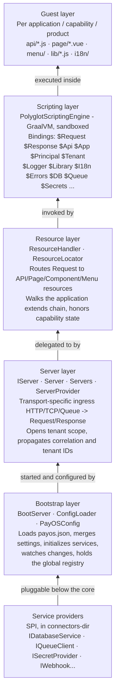

# Platform architecture

This document describes the overall shape of the PayOS runtime: the **rigid core**, the **flexible guest layer**, and the layers in between. It is the conceptual map that the rest of the architecture section fills in.

## The two layers

PayOS is deliberately split into two layers with very different change profiles.

| | Rigid core | Flexible guest layer |
| --- | --- | --- |
| Language | Java 21 | JavaScript (GraalVM) + connector/extension JARs |
| Module | `payos-kernel` (+ transports, services) | Applications, capabilities, products; connectors; extensions |
| Change frequency | Low — stable contracts | High — per business need |
| Performance role | Hot path, shared engine, caches | Business logic, isolated per request |
| Who owns it | Platform team | Application developers / integrators |

The core is **never** modified to add a business feature. New behavior is delivered by:

- writing **JavaScript** application/capability resources (the primary mechanism),
- plugging in **service connectors** (database, queue, secret, webhook) through the SPI,
- dropping in **Java extensions** callable from scripts via `Java.type()`, and
- adding **transport providers** for new protocols.

These mechanisms are detailed in [extensibility.md](extensibility.md).

## Layered view

Each layer is the subject of its own document:

| Layer | Document |
| --- | --- |
| Bootstrap | [runtime-architecture.md](runtime-architecture.md) |
| Server | [request-processing.md](request-processing.md) |
| Resource | [request-processing.md](request-processing.md) |
| Scripting | [scripting-engine.md](scripting-engine.md) |
| Service providers | [extensibility.md](extensibility.md), [data-architecture.md](data-architecture.md) |

## Transport-agnostic request/response model

Whatever the protocol, the kernel works with two transport-neutral objects:

- `ma.s2m.payos.servers.exchanges.Request` — method, type (`api`/`page`/`component`/`menu`),   path, headers, query parameters, body, and a `contextData` map (tenant, correlation,   appId).
- `ma.s2m.payos.servers.exchanges.Response` — status code, message, headers, and a byte
  `body`.

Each transport adapter (`payos-server-http`, `payos-server-tcp`, `payos-server-queue`) converts its wire format into a `Request`, calls the kernel, and serializes the `Response` back. This is what makes PayOS protocol-agnostic: the resource, scripting, and service layers never see HTTP, TCP, or a queue message.

## Separation of identity (app) and execution (server)

The *externalized runtime* principle shows up structurally: an `Application` is a data object resolved by `Application.getApplicationById(appId)`; the active `IServer` is attached to it only for the duration of request processing (`application.setServer(server)`). The same application can therefore be served simultaneously over HTTP, TCP, and a queue.

## Where to go next

- [Runtime architecture](runtime-architecture.md) — how the process boots and stays configured.
- [Request processing](request-processing.md) — the concrete request lifecycle.
