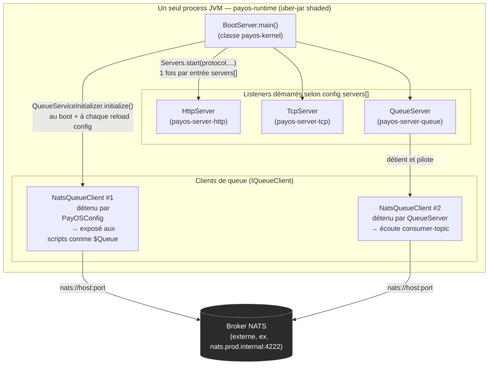
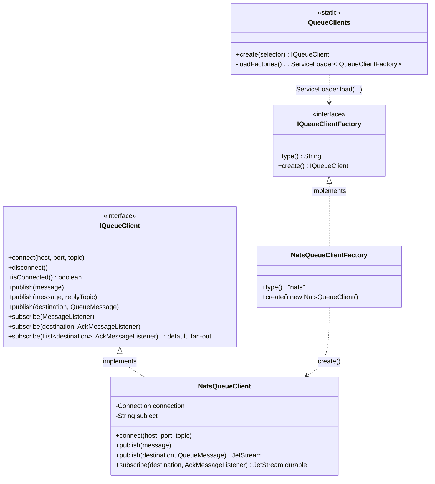
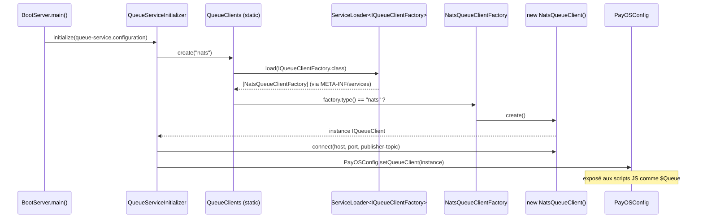
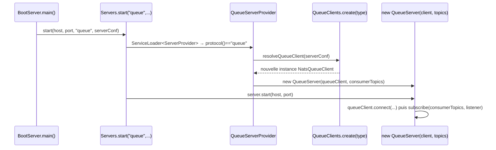
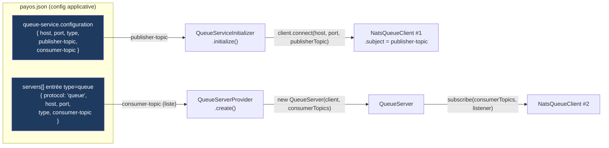
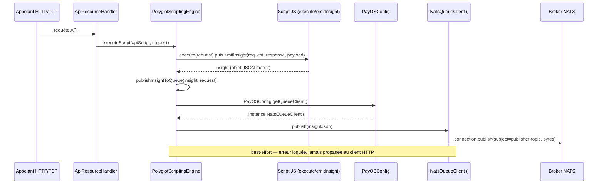
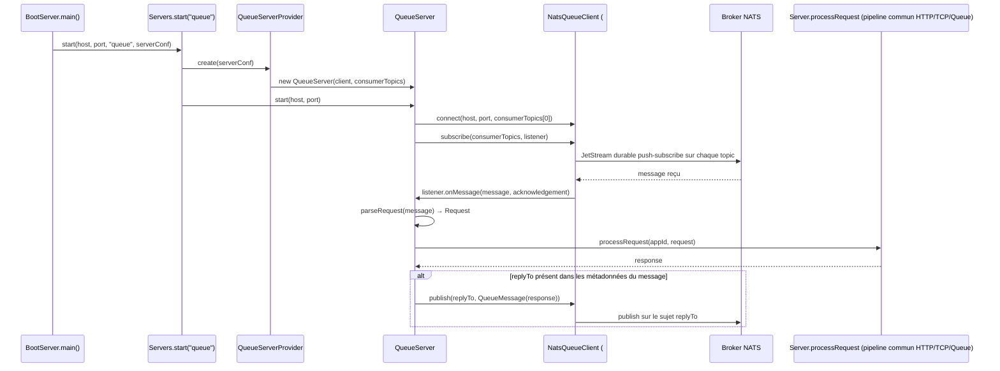

# Architecture de messagerie PayOS (Queue Server / Queue Client / Broker NATS)

> **Source de vérité : le code.** Chaque affirmation ci-dessous est ancrée sur un fichier/ligne précis. Quand la documentation existante (`payos-docs`) contredit le code, c'est signalé explicitement en fin de document (section [Divergences doc/code](#divergences-docscode-à-connaître)).

## 1. Le point clé à retenir

Il n'y a **pas** de serveur HTTP, un serveur TCP et un "Queue Server" qui tournent dans des process séparés qui s'appellent entre eux. Il y a **un seul process JVM** (`payos-runtime`), qui démarre en interne plusieurs "listeners" (HTTP, TCP, Queue) selon la configuration. Le "Queue Server" est juste un de ces listeners.



**Conséquence importante :** il existe généralement **deux instances distinctes** de `NatsQueueClient` dans le même process, chacune avec sa propre connexion et son propre topic :

| Instance | Détenteur | Topic utilisé | Alimenté par |
|---|---|---|---|
| Client "publisher" | `PayOSConfig` (statique) | `publisher-topic` | `queue-service.configuration` (config globale) |
| Client "consumer" | `QueueServer` | `consumer-topic` | l'entrée `servers[]` de type `"queue"` |

Ce sont deux objets `NatsQueueClient` différents, connectés au même broker NATS, mais pas au même sujet — d'où une source fréquente de confusion ("j'ai publié mais mon serveur queue ne reçoit rien" → normal, ce n'est pas la même connexion/sujet).

---

## 2. Qui implémente quoi — le contrat `IQueueClient`



- Interface : `payos/src/main/java/ma/s2m/payos/queue/IQueueClient.java`
- Implémentation NATS : `queue-service-nats/src/main/java/ma/s2m/payos/queue/nats/NatsQueueClient.java:38` — encapsule directement le client Java `io.nats:jnats` (`Nats.connect(...)` ligne 74).
- `NatsQueueClient` expose **deux API** dans la même classe :
  - API "legacy" simple : `publish(String)` / `publish(String, replyTopic)` / `subscribe(MessageListener)` — NATS core, un seul `subject` fixé à la connexion.
  - API "broker-agnostic" plus récente, basée sur **JetStream** : `publish(destination, QueueMessage)` / `subscribe(destination, AckMessageListener)` — crée un flux JetStream par destination, avec un abonnement "durable" nommé `destination + "-durable"`.
- Aucune autre implémentation "de production" de `IQueueClient` n'existe dans les repos actuels (pas de Kafka, pas d'in-memory prod). Seuls des doubles de test existent (`FakeQueueClient` dans `payos-service-notification` et `payos-notification-connector`), ce qui confirme que `IQueueClient` est conçu comme une stratégie interchangeable — NATS est aujourd'hui la seule brique réelle branchée derrière.

---

## 3. Qui instancie qui — mécanisme `ServiceLoader` (SPI), pas de Spring/CDI

Personne n'écrit `new NatsQueueClient()` directement dans le code métier. La création passe par le **Java `ServiceLoader`** :



Et, en parallèle, un **second** chemin de création pour le transport "queue" lui-même :



**Fichiers clés :**
- `payos/src/main/java/ma/s2m/payos/queue/QueueClients.java` — résolution par `ServiceLoader`, fallback sur `"nats"` (`IConfigSpec.DEFAULT_QUEUE_CLIENT_TYPE`).
- `queue-service-nats/src/main/resources/META-INF/services/ma.s2m.payos.queue.IQueueClientFactory` → contient `ma.s2m.payos.queue.nats.NatsQueueClientFactory`.
- `payos/src/main/java/ma/s2m/payos/queue/QueueServiceInitializer.java:70-73` — chemin "publisher" (`$Queue`).
- `payos-server-queue/src/main/java/ma/s2m/payos/servers/providers/QueueServerProvider.java:22-31` — chemin "consumer" (`QueueServer`).
- `payos/src/main/java/ma/s2m/payos/servers/Servers.java` — résout aussi les `ServerProvider` (`http`, `https`, `tcp`, `queue`) via `ServiceLoader`, appelé depuis `BootServer.startServers(...)`.
- `payos-runtime/pom.xml` — assemble tous ces modules (`payos-kernel`, `payos-server-http`, `payos-server-tcp`, `payos-server-queue`, `queue-service-nats`, ...) en un seul jar shaded dont le `mainClass` est `ma.s2m.payos.BootServer`. **`payos-runtime` ne contient aucun code Java propre** — c'est un module d'assemblage Maven.

---

## 4. D'où viennent les noms de topics (sujets NATS) ?

**Il n'existe aucune classe `TopicBuilder`/`TopicNameResolver` dans le code.** Les noms de topics sont des **chaînes de configuration statiques**, pas construites dynamiquement (pas de logique par tenant/type de message).



- Clés de config : `payos/src/main/java/ma/s2m/payos/config/IConfigSpec.java` (bloc `QueueService.Configuration` : `NAME`, `TYPE`, `PUBLISHER_TOPIC`, `CONSUMER_TOPIC`, `HOST`, `PORT`).
- Exemple concret (`payos-docs/configuration/queue-service.md`) :
  ```json
  { "queue-service": { "configuration": {
      "enabled": true, "name": "primary", "type": "nats",
      "host": "localhost", "port": 4222,
      "publisher-topic": "payos.events", "consumer-topic": "payos.requests"
  } } }
  ```
- Pour l'API JetStream "broker-agnostic" (`publish(destination, ...)` / `subscribe(destination, ...)`), la `destination` est une **chaîne fournie littéralement par l'appelant** (script métier ou config), simplement validée par une regex `[A-Za-z0-9_-]+` (pas de points, pas de wildcards). Il n'y a pas de préfixe/convention de nommage imposé par le framework.
- **Par défaut**, si aucun `consumer-topic` n'est configuré : `QueueServer.DEFAULT_TOPIC = "default-topic"`.

---

## 5. Flux de publication — trace complète (cas réel : "insight" auto-publié après chaque script API)



- `PolyglotScriptingEngine.executeScript(...)` exige que le script API définisse trois fonctions JS : `execute`, `loadControlData`, `emitInsight`.
- `publishInsightToQueue(...)` récupère `PayOSConfig.getQueueClient()` puis appelle `queueClient.publish(insightJson)` → `NatsQueueClient.publish(String)` → publie sur le `subject` fixé à la connexion (= `publisher-topic`).
- Un script métier peut aussi publier explicitement via le binding `$Queue.publish(JSON.stringify(...))` (même chemin de code, un seul argument = le message).

---

## 6. Flux de souscription — trace complète (cas réel : `QueueServer` au démarrage)



- Le "listener" est une lambda définie dans `QueueServer.start(...)` — c'est le callback `AckMessageListener` appelé par `NatsQueueClient` à chaque message reçu.
- Le message reçu est parsé en un `Request` canonique et traité par **le même pipeline** que les requêtes HTTP/TCP (`Server.processRequest` → `ResourceHandler`) — la queue est juste un transport de plus pour arriver au même moteur applicatif.
- Le "topic de réponse" (`replyTo`) n'est pas calculé : c'est une métadonnée portée par le message entrant, définie par l'émetteur d'origine (convention "reply-to" classique en messagerie).

---

## 7. Le broker : NATS, hébergé en dehors de ce dépôt

- Dépendance : `queue-service-nats/pom.xml` → `io.nats:jnats`.
- Aucune configuration d'infrastructure NATS (docker-compose, cluster) n'existe dans ces dépôts — le broker est un service externe, dont l'URL est injectée par variable d'environnement, ex. :
  ```
  NATS_URL=nats://nats.staging.internal:4222
  NATS_URL=nats://nats.prod.internal:4222
  ```
- Port par défaut : `4222` (port client standard NATS).
- `payosv2-packer` n'a **aucun rapport** avec la queue : c'est un utilitaire de chiffrement/déchiffrement de bundles de runtime, séparé du chemin de traitement des requêtes.

---

## Divergences doc/code à connaître

Deux endroits de `payos-docs` ne correspondent pas exactement au code réel — à corriger si vous éditez cette doc :

1. **`$Queue.publish(topic, message)` à deux arguments** (vu dans `payos-docs/developer/queue-messaging.md` et `scripting-bindings.md`) laisse penser que le premier argument est un nom de topic. **Ce n'est pas le cas** : la signature réelle est `publish(String message, String replyTopic)` — le premier argument est le **message**, le second un **topic de réponse optionnel** (confirmé par le test `NatsQueueClientLegacyPublishTest`). Seule la forme à un seul argument `$Queue.publish(json)` (documentée dans `javascript-api-endpoint-guide.md`) correspond au comportement réel.
2. **Clés de config `url`/`subject`/`credentials`** dans `payos-docs/configuration/example-multi-env.md` ne correspondent pas aux clés réellement lues par le code (`host`/`port`/`publisher-topic`/`consumer-topic`/`type` dans `IConfigSpec.QueueService.Configuration`). Cet exemple est probablement aspirationnel/obsolète.
