# Architecture — Secret Provider

**Audience :** architectes, tech leads, contributeurs au kernel  
**Périmètre :** modules `payos-secret-api`, `secret-service-filesystem`, intégration kernel  
**Dernière mise à jour :** 2026-05-31

---

## Table des matières

1. [Contexte et objectif](#1-contexte-et-objectif)
2. [Vue d'ensemble](#2-vue-densemble)
3. [Module `payos-secret-api` — contrat SPI](#3-module-payos-secret-api--contrat-spi)
   - [ISecretProvider — interface noyau](#isecretprovider--interface-noyau)
   - [Interfaces de capacités optionnelles](#interfaces-de-capacités-optionnelles)
   - [ISecretProviderFactory — point d'entrée SPI](#isecretproviderfactory--point-dentrée-spi)
4. [Modèle de données](#4-modèle-de-données)
   - [SecretValue — conteneur sécurisé](#secretvalue--conteneur-sécurisé)
   - [SecretMetadata](#secretmetadata)
   - [SecretCapability](#secretcapability)
5. [AbstractSecretProvider — template method et audit intégré](#5-abstractsecretprovider--template-method-et-audit-intégré)
6. [Exceptions](#6-exceptions)
7. [Implémentation de référence : FileSystemSecretProvider](#7-implémentation-de-référence--filesystemsecretprovider)
   - [Structure du répertoire de stockage](#structure-du-répertoire-de-stockage)
   - [Chiffrement AES-GCM](#chiffrement-aes-gcm)
   - [Chargement de la clé maîtresse](#chargement-de-la-clé-maîtresse)
   - [Écriture atomique](#écriture-atomique)
8. [Intégration kernel](#8-intégration-kernel)
   - [Initialisation au démarrage](#initialisation-au-démarrage)
   - [Chargement SPI des providers](#chargement-spi-des-providers)
   - [Injection dans les scripts : SecretsBinding](#injection-dans-les-scripts--secretsbinding)
   - [Hot reload](#hot-reload)
9. [Cycle de vie d'un appel `$Secrets.get()`](#9-cycle-de-vie-dun-appel-secretsget)
10. [Audit log des secrets](#10-audit-log-des-secrets)
11. [Isolation multi-tenant](#11-isolation-multi-tenant)
12. [Créer un provider custom](#12-créer-un-provider-custom)
13. [Opérations courantes — API Java directe](#13-opérations-courantes--api-java-directe)
14. [Considérations de sécurité](#14-considérations-de-sécurité)
15. [Structure des modules Maven](#15-structure-des-modules-maven)

---

## 1. Contexte et objectif

Le Secret Provider résout un problème structurel dans les plateformes de paiement : **les credentials (clés API, mots de passe, certificats, tokens) ne doivent pas être stockés dans les fichiers de configuration ni dans les scripts**.

PayOS intègre un service de secrets au niveau runtime. Ce service :

- est **optionnel** — activé uniquement si configuré ;
- est **pluggable** — l'implémentation est un connecteur chargé via SPI Java ;
- est **scopé par tenant** — un script ne peut accéder qu'aux secrets de son tenant ;
- est **auditable** — chaque accès, écriture, refus et suppression est journalisé ;
- est **sécurisé en mémoire** — les valeurs de secrets sont zeroed après consommation.

---

## 2. Vue d'ensemble

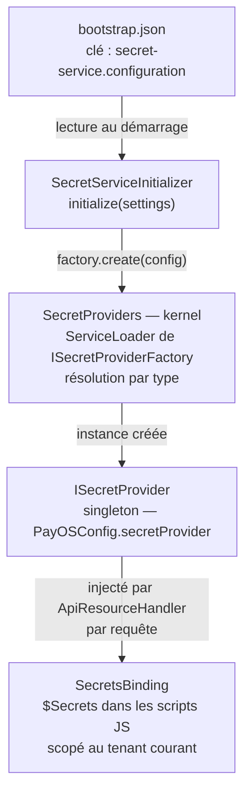

**Points clés de conception :**

- Le kernel ne connaît que `ISecretProvider` et `ISecretProviderFactory` (module `payos-secret-api`).
- L'implémentation concrète vit dans un module séparé et est découverte via `ServiceLoader<ISecretProviderFactory>`.
- En pratique, `SecretProviders` interroge `ServiceLoader` avec `PayOSConfig.getConnectorClassLoader()` : si `connectors-dir` est configuré, ce classloader inclut les JARs du répertoire ; sinon la résolution retombe sur le classloader par défaut.
- La frontière tenant est appliquée à deux niveaux : dans `AbstractSecretProvider` (validation du tenantId) et dans `SecretPath` (résolution des chemins).
- Le binding `$Secrets` expose une API réduite et sûre pour les scripts (lecture + liste uniquement).

---

## 3. Module `payos-secret-api` — contrat SPI

Ce module est la **seule dépendance** que le kernel introduit. Il ne contient aucune implémentation concrète. Les providers le dépendent ; le kernel le dépend. C'est le contrat d'intégration.

### ISecretProvider — interface noyau

```java
public interface ISecretProvider {
    SecretValue getSecret(String tenantId, String name);
    void setSecret(String tenantId, String name, byte[] value, SecretMetadata metadata);
    void deleteSecret(String tenantId, String name);
    List<String> listSecrets(String tenantId);
    SecretMetadata describeSecret(String tenantId, String name);
    Set<SecretCapability> capabilities();
}
```

Toutes les opérations prennent `tenantId` en premier paramètre. C'est **l'invariant d'isolation** : aucune opération ne peut être réalisée sans scope tenant.

`capabilities()` permet à un appelant de tester dynamiquement ce qu'un provider sait faire avant d'invoquer une opération non supportée.

### Interfaces de capacités optionnelles

Un provider peut implémenter une ou plusieurs de ces interfaces en plus de `ISecretProvider` pour exposer des fonctionnalités avancées. L'appelant vérifie via `instanceof` ou `capabilities()`.

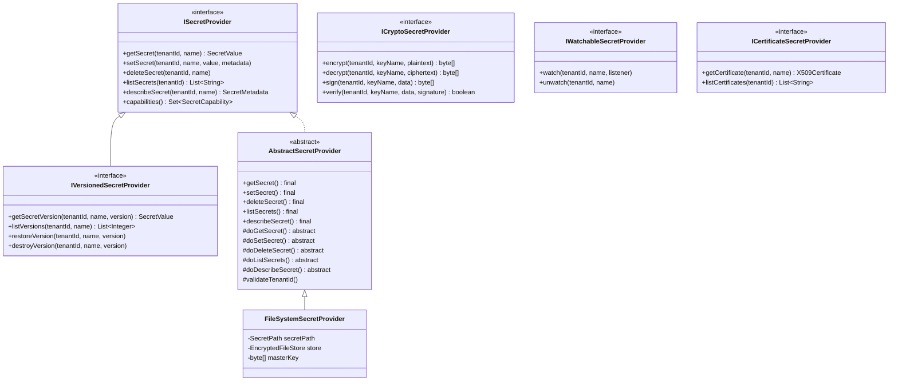

| Interface | Méthodes | Usage |
|-----------|----------|-------|
| `ICryptoSecretProvider` | `encrypt`, `decrypt`, `sign`, `verify` | Chiffrement de données applicatives et signature HMAC via une clé nommée stockée dans le provider |
| `IVersionedSecretProvider` | `getSecretVersion`, `listVersions`, `restoreVersion`, `destroyVersion` | Historique de versions, rollback, conformité PCI Req 3.5 |
| `IWatchableSecretProvider` | `watch`, `unwatch` | Notification sur changement de secret (ex. rotation automatique) |
| `ICertificateSecretProvider` | `getCertificate`, `listCertificates` | Accès à des certificats X.509 stockés dans le provider |

Ces interfaces ne sont pas implémentées par `FileSystemSecretProvider` (référence minimale). Elles sont destinées aux providers HSM, KMS cloud (AWS Secrets Manager, HashiCorp Vault, Azure Key Vault) ou PKCS#11.

### ISecretProviderFactory — point d'entrée SPI

```java
public interface ISecretProviderFactory {
    String type();
    ISecretProvider create(Map<String, Object> configuration);
}
```

`type()` retourne l'identifiant string utilisé dans `bootstrap.json` (`"filesystem"`, `"vault"`, etc.). Le kernel normalise la valeur en minuscules avant comparaison.

---

## 4. Modèle de données

### SecretValue — conteneur sécurisé

`SecretValue` est un `AutoCloseable` qui encapsule les bytes bruts d'un secret avec les garanties suivantes :

| Propriété | Comportement |
|-----------|-------------|
| **Zeroing à la fermeture** | `close()` remplit le tableau interne avec des zéros (`Arrays.fill(bytes, (byte) 0)`) |
| **Copie défensive** | Le constructeur et `exposeBytes()` font `Arrays.copyOf` — aucune référence partagée |
| **toString() opaque** | Retourne `"SecretValue[REDACTED]"` — ne fuite jamais dans les logs |
| **equals/hashCode bloqués** | `UnsupportedOperationException` — empêche les comparaisons accidentelles |
| **État vérifié** | `exposeBytes()` et `exposeChars()` lancent `IllegalStateException` si déjà fermé |

Usage systématique avec try-with-resources :

```java
try (SecretValue value = provider.getSecret(tenantId, name)) {
    String secret = new String(value.exposeBytes(), StandardCharsets.UTF_8);
    // utiliser secret
} // zeroing automatique ici
```

`SecretsBinding.get()` applique ce pattern : le `SecretValue` est fermé avant que la `String` Java soit retournée au script.

### SecretMetadata

```java
public record SecretMetadata(
    String tenantId, String name, String type,
    Instant created, Instant modified, int version
) {}
```

`type` est libre (`"string"`, `"certificate"`, `"api-key"`, etc.). `version` démarre à 1 et est incrémenté à chaque `setSecret`.

### SecretCapability

```java
public enum SecretCapability { GET, SET, DELETE, LIST, DESCRIBE, VERSION }
```

Un provider déclare explicitement ce qu'il supporte via `capabilities()`. Le kernel et les scripts peuvent ainsi détecter les providers en lecture seule (ex. provider qui lit depuis un KMS en mode lecture uniquement) ou les providers sans support de `DESCRIBE`.

---

## 5. AbstractSecretProvider — template method et audit intégré

`AbstractSecretProvider` implémente le pattern **Template Method** : les méthodes publiques sont `final` et orchestrent la validation, l'audit et la délégation. Les implémentations concrètes n'implémentent que les méthodes `doXxx` protégées.

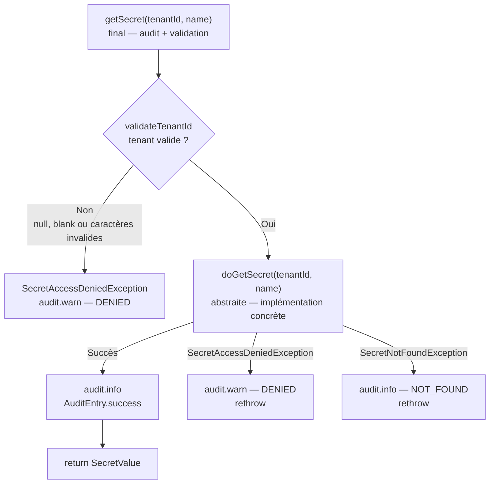

**Validation du tenantId** (dans `AbstractSecretProvider.validateTenantId`) :
- Null ou blank → `SecretAccessDeniedException`
- Caractères non autorisés (regex `[a-zA-Z0-9\-]+`) → `SecretAccessDeniedException`

La même validation est redoublée dans `SecretPath.validateTenantId()` pour protéger la résolution des chemins filesystem (défense en profondeur contre les path traversal).

**Résolution du correlationId** : `AbstractSecretProvider` lit `MDC.get("correlationId")`. Si absent, génère un UUID temporaire. Cela garantit que tous les accès secrets sont corrélables avec la requête HTTP parente.

**callerId** : l'appelant est résolu depuis `MDC.get("callerId")` ou, si absent, depuis la stack trace (`stack[3].getClassName()`).

---

## 6. Exceptions

| Exception | Nature | Cas |
|-----------|--------|-----|
| `SecretNotFoundException` | `RuntimeException` | Secret absent pour ce tenant/nom |
| `SecretAccessDeniedException` | `RuntimeException` | tenantId invalide ou accès refusé |
| `SecretProviderException` | `RuntimeException` | Erreur I/O, chiffrement, config |

Ces exceptions remontent sans wrapping jusqu'au script. Le runtime les traite comme des erreurs 500 (`buildInternalErrorResponse`), à moins qu'un hook `on-error` ne les intercepte.

---

## 7. Implémentation de référence : FileSystemSecretProvider

`FileSystemSecretProvider` est l'implémentation livrée avec le module `secret-service-filesystem`. Elle stocke les secrets chiffrés sur le système de fichiers local. C'est la référence d'implémentation pour les déploiements on-premise ou les environnements sans KMS cloud.

### Structure du répertoire de stockage

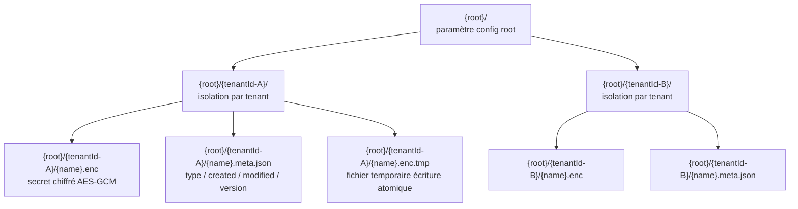

**Validation des noms :**
- `tenantId` : regex `[a-zA-Z0-9\-]+` (pas de `/`, `..`, ni caractères spéciaux)
- `secretName` : regex `[a-zA-Z0-9_.\\-]+` (points et tirets autorisés, pas de slashes)

Cette double validation empêche toute attaque de type path traversal. Le tenantId est utilisé directement comme segment de répertoire, jamais interpolé dans un template de chemin.

### Chiffrement AES-GCM

L'algorithme utilisé est **AES/GCM/NoPadding** (mode authentifié).

**Format de l'enveloppe stockée dans le fichier `.enc` :**

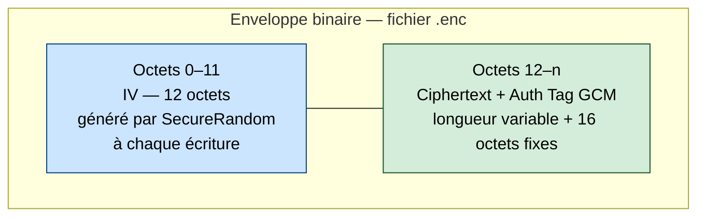

| Paramètre | Valeur |
|-----------|--------|
| Algorithme | AES/GCM/NoPadding |
| Taille de l'IV | 12 octets (standard GCM) |
| Taille du tag d'authentification | 128 bits |
| Clé | AES-256 (32 octets obligatoires) |

**IV et tag GCM — explication simple :**
- **IV (Initialization Vector / nonce)** : valeur de 12 octets, aléatoire et unique par chiffrement. Il n'est pas secret, il est stocké au début du fichier. Son rôle est d'éviter qu'un même plaintext chiffré deux fois avec la même clé produise le même ciphertext.
- **Tag GCM (tag d'authentification)** : valeur de 16 octets calculée par GCM pendant le chiffrement. Il sert à vérifier l'intégrité et l'authenticité des données au déchiffrement.
- **Différence clé** : l'IV rend le chiffrement sûr et non déterministe ; le tag détecte la corruption ou la falsification.
- **Conséquence pratique** : si l'IV est réutilisé avec la même clé, la sécurité chute fortement ; si le tag ne valide pas, le déchiffrement doit échouer.

**Exemple binaire annoté (offsets) :**

```text
Envelope (.enc) = [ IV (12 bytes) | Ciphertext (N bytes) | GCM Tag (16 bytes) ]

Offset 0x00..0x0B   -> IV (12 bytes)
Offset 0x0C..0x(0C+N-1) -> Ciphertext (N bytes)
Offset 0x(0C+N)..0x(0C+N+0F) -> Tag GCM (16 bytes)

Total size = 12 + N + 16 bytes
```

Exemple concret : si le plaintext fait 20 octets, alors en GCM le ciphertext utile fait 20 octets et le tag fait 16 octets.
Le fichier `.enc` fera donc `12 + 20 + 16 = 48` octets.

**Propriétés de sécurité :**
- L'IV est généré par `SecureRandom` à **chaque écriture** : deux écritures du même secret produisent des fichiers différents.
- Le tag GCM garantit l'**authenticité** : toute modification du fichier (même un seul bit) est détectée au déchiffrement.
- La tamper-detection est explicitement retournée dans le message d'erreur : `"Decryption failed (tampered data or wrong key)"`.

### Chargement de la clé maîtresse

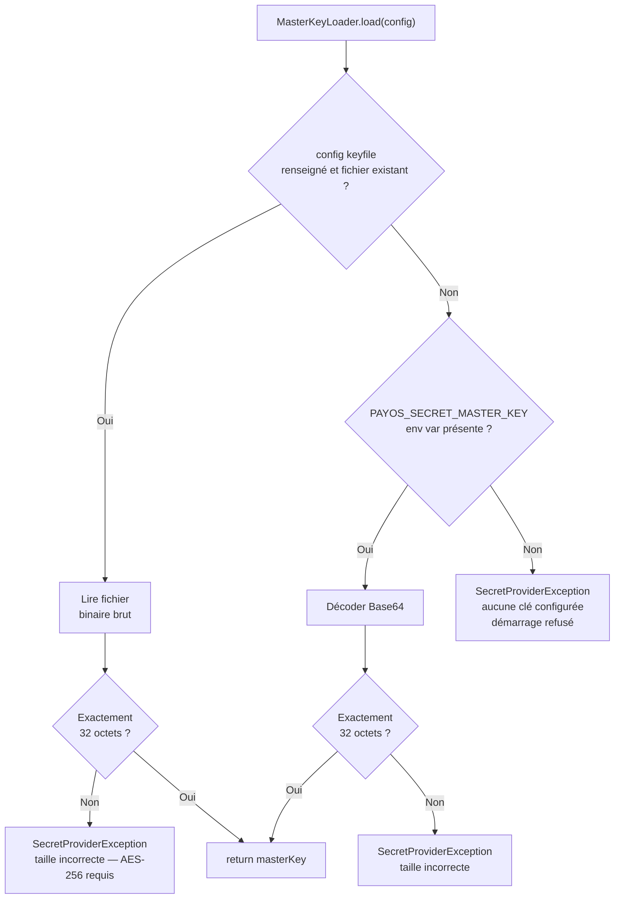

La clé doit faire exactement **32 octets** (AES-256). Toute autre taille échoue au démarrage.

Le keyfile est lu une seule fois à l'initialisation. La clé est conservée en mémoire (dans `FileSystemSecretProvider.masterKey` et `EncryptedFileStore.masterKey`) comme copie défensive. La méthode `close()` du provider zeroe cette copie en mémoire.

> **Recommandation opérationnelle :** préférer le keyfile plutôt que la variable d'environnement. Le keyfile peut être monté depuis un secret Kubernetes ou un volume chiffré sans que la valeur ne transite par l'environnement du processus.

### Écriture atomique

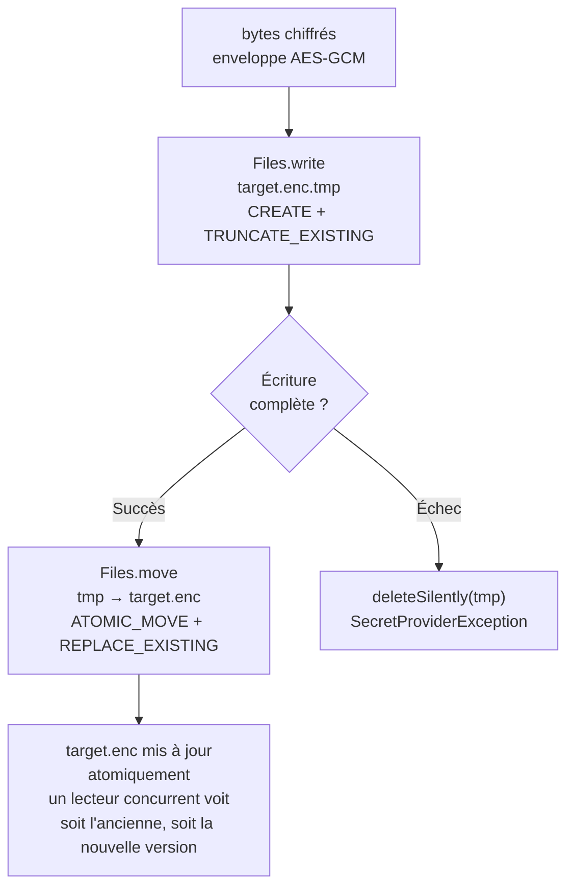

---

## 8. Intégration kernel

### Initialisation au démarrage

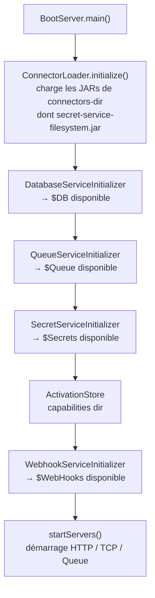

`SecretServiceInitializer.initialize(settings)` :

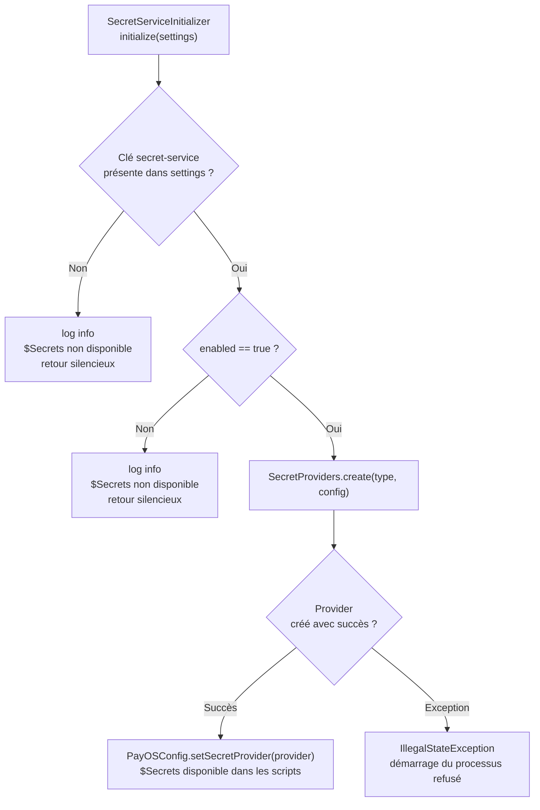

L'échec d'initialisation du secret service est **fatal** : le runtime ne démarre pas si un provider est configuré mais ne peut être créé. Cela évite un démarrage silencieux avec `$Secrets` inopérant.

### Chargement SPI des providers

`SecretProviders` est un singleton qui charge les factories via `ServiceLoader<ISecretProviderFactory>` avec le **connector ClassLoader** (pas le classloader système). Ce classloader inclut les JARs déposés dans `connectors-dir`.

```java
ServiceLoader.load(ISecretProviderFactory.class, PayOSConfig.getConnectorClassLoader())
```

Les factories chargées sont mises en cache dans une `Map<String, ISecretProviderFactory>` immuable. Le cache est invalidé au hot reload (via `SecretServiceInitializer.initialize` dans `reloadConfiguration`).

En cas de deux factories avec le même `type()`, la première enregistrée est conservée et un `WARN` est loggué.

### Injection dans les scripts : SecretsBinding

`ApiResourceHandler` injecte `$Secrets` conditionnellement :

```java
ISecretProvider secretProvider = PayOSConfig.getSecretProvider();
if (secretProvider != null) {
    scriptingEngine.putMember("$Secrets", new SecretsBinding(secretProvider, currentTenantId));
}
```

`SecretsBinding` est instancié **par requête**. Il capture le `tenantId` résolu pour cette requête. Cela garantit qu'un script ne peut jamais accéder aux secrets d'un autre tenant, même s'il connaît son nom.

```java
public class SecretsBinding {
    public String get(String name) {
        try (SecretValue value = provider.getSecret(tenantId, name)) {
            return new String(value.exposeBytes(), StandardCharsets.UTF_8);
        }
    }
    public List<String> list() {
        return provider.listSecrets(tenantId);
    }
}
```

Le pattern try-with-resources assure le zeroing du `SecretValue` avant que la méthode retourne.

### Hot reload

Lors d'un rechargement de configuration, `BootServer.reloadConfiguration()` rappelle `SecretServiceInitializer.initialize(newSettings)`. Si la configuration du secret service a changé (nouveau provider, nouveau keyfile), un nouveau provider est créé et remplace l'ancien dans `PayOSConfig`. Les `SecretsBinding` créés sur les requêtes en cours continuent d'utiliser l'ancienne instance jusqu'à leur fin.

---

## 9. Cycle de vie d'un appel `$Secrets.get()`

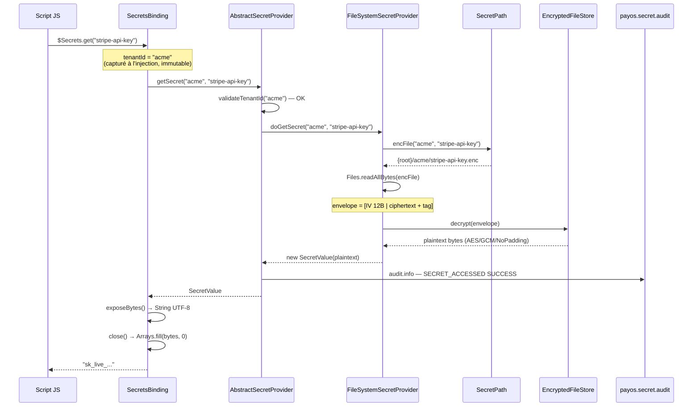

---

## 10. Audit log des secrets

Tout accès, modification ou suppression de secret est journalisé via le logger SLF4J nommé `payos.secret.audit` (dans `AbstractSecretProvider`), configuré indépendamment du logger applicatif.

**Format JSON d'un événement d'audit :**

```json
{
  "event": "SECRET_ACCESSED",
  "tenantId": "acme",
  "secretName": "stripe-api-key",
  "callerId": "ma.s2m.payos.scripting.SecretsBinding",
  "timestamp": "2026-05-31T14:23:01.456Z",
  "correlationId": "a3f7c1d2-...",
  "result": "SUCCESS"
}
```

**Événements couverts :**

| AuditEventType | Déclencheur | Résultat |
|----------------|-------------|---------|
| `SECRET_ACCESSED` | `getSecret` réussi | `SUCCESS` |
| `SECRET_ACCESS_DENIED` | tenantId invalide ou accès refusé | `DENIED` |
| `SECRET_NOT_FOUND` | secret absent | `NOT_FOUND` |
| `SECRET_WRITTEN` | `setSecret` réussi | `SUCCESS` |
| `SECRET_DELETED` | `deleteSecret` réussi | `SUCCESS` |
| `SECRET_LISTED` | `listSecrets` réussi | `SUCCESS` |
| `ADMIN_OPERATION` | opération administrative (non déclenché automatiquement) | — |

> **Configuration Logback recommandée :** router `payos.secret.audit` vers un appender dédié (fichier append-only, SIEM) pour satisfaire PCI DSS Req 10.2.1 (log de tous les accès aux données sensibles).

---

## 11. Isolation multi-tenant

L'isolation tenant est appliquée en **défense en profondeur** à trois niveaux :

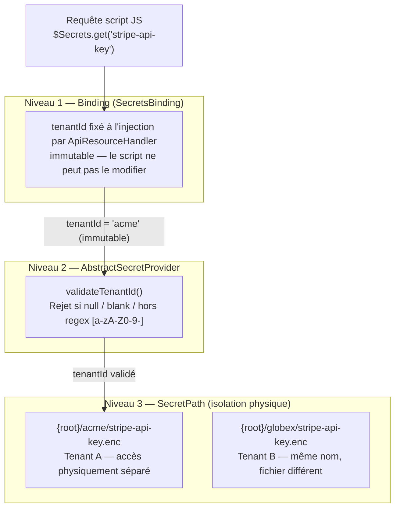

**Niveau 1 — Binding (SecretsBinding)**  
Le `tenantId` est capturé au moment de l'injection par `ApiResourceHandler` et passé au constructeur de `SecretsBinding`. Le script n'a aucun moyen de le modifier : les scripts JavaScript n'ont pas accès à la classe Java du binding.

**Niveau 2 — AbstractSecretProvider (validation)**  
`validateTenantId` rejette les valeurs null, vides ou contenant des caractères hors de `[a-zA-Z0-9\-]`. Toute tentative d'injection est bloquée avant d'atteindre le stockage.

**Niveau 3 — SecretPath (isolation physique)**  
Pour le provider filesystem, chaque tenant dispose d'un répertoire dédié `{root}/{tenantId}/`. La validation du tenantId dans `SecretPath` est redondante mais indépendante, ce qui protège si `AbstractSecretProvider` est contourné (ex. appel direct depuis du code Java).

---

## 12. Créer un provider custom

### 1. Dépendance Maven

```xml
<dependency>
    <groupId>ma.s2m.payos</groupId>
    <artifactId>payos-secret-api</artifactId>
    <version>1.0.0-RELEASE</version>
    <scope>provided</scope>
</dependency>
```

### 2. Implémenter la factory SPI

```java
public class VaultSecretProviderFactory implements ISecretProviderFactory {

    @Override
    public String type() {
        return "vault";
    }

    @Override
    public ISecretProvider create(Map<String, Object> configuration) {
        String address = (String) configuration.getOrDefault("address", "http://127.0.0.1:8200");
        String token   = (String) configuration.get("token");
        return new VaultSecretProvider(address, token);
    }
}
```

### 3. Implémenter le provider via AbstractSecretProvider

```java
public class VaultSecretProvider extends AbstractSecretProvider {

    @Override
    protected SecretValue doGetSecret(String tenantId, String name) {
        // appel Vault API — ne pas implémenter la validation tenantId ici,
        // elle est déjà faite par AbstractSecretProvider.getSecret()
        byte[] value = vaultClient.readSecret(tenantId + "/" + name);
        return new SecretValue(value);
    }

    @Override
    public Set<SecretCapability> capabilities() {
        return EnumSet.of(GET, LIST, DESCRIBE);
    }
    // ... autres méthodes abstraites
}
```

> **Règle :** étendre `AbstractSecretProvider` et non implémenter directement `ISecretProvider`. Cela garantit l'audit et la validation sans code redondant.

### 4. Enregistrement SPI

Créer le fichier `META-INF/services/ma.s2m.payos.secret.api.ISecretProviderFactory` dans les ressources du JAR :

```
com.example.payos.vault.VaultSecretProviderFactory
```

### 5. Déploiement

Déposer le JAR dans `connectors-dir` (défaut `.connectors/`). Le kernel le découvre au démarrage ou au prochain hot reload.

### 6. Configuration

```json
"secret-service": {
  "configuration": {
    "enabled": true,
    "type": "vault",
    "address": "https://vault.internal:8200",
    "token": "s.xxxxxxxx"
  }
}
```

---

## 13. Opérations courantes — API Java directe

Cette section s'adresse aux développeurs qui appellent l'API Java du provider directement : initializers de capabilities, utilitaires d'administration, tests d'intégration.

> **Important** : le binding `$Secrets` exposé dans les scripts JS est **en lecture seule** (`get` et `list` uniquement). Le provisionnement des secrets est une opération administrative réalisée via le CLI `secrets.jar` (module `secret-service-filesystem`) ou directement via l'API Java.

### Obtenir le provider

```java
ISecretProvider provider = PayOSConfig.getSecretProvider();
if (provider == null) {
    throw new IllegalStateException("Secret service non configuré (secret-service.configuration.enabled=false)");
}
```

### Vérifier les capacités du provider

Avant d'appeler une opération d'écriture, vérifier que le provider la supporte :

```java
Set<SecretCapability> caps = provider.capabilities();
if (!caps.contains(SecretCapability.SET)) {
    throw new UnsupportedOperationException("Ce provider est en lecture seule");
}
```

Le `FileSystemSecretProvider` supporte `GET`, `SET`, `DELETE`, `LIST`, `DESCRIBE`.

### Stocker un secret

```java
SecretMetadata meta = new SecretMetadata(
    "api-key",               // type libre : "api-key", "password", "certificate", …
    "Stripe Live API Key",   // description
    null                     // tags optionnels
);
provider.setSecret(
    "acme",                                           // tenantId
    "stripe-api-key",                                 // nom du secret
    "sk_live_xxxx".getBytes(StandardCharsets.UTF_8),  // valeur en bytes
    meta
);
```

À chaque appel de `setSecret` sur le même nom, la version est incrémentée automatiquement (`version` démarre à 1). L'ancien fichier `.enc` est remplacé de façon atomique.

### Lire un secret

```java
try (SecretValue value = provider.getSecret("acme", "stripe-api-key")) {
    String secret = new String(value.exposeBytes(), StandardCharsets.UTF_8);
    // utiliser secret ici uniquement — ne pas le stocker au-delà de ce bloc
} // value.close() → bytes zeroisés automatiquement
```

> **Règle** : toujours utiliser try-with-resources. `SecretValue.close()` zeroe les bytes en mémoire dès la sortie du bloc.

### Lister les secrets d'un tenant

```java
List<String> names = provider.listSecrets("acme");
// → ["stripe-api-key", "db-password", "jwt-signing-key"]
```

### Supprimer un secret

```java
provider.deleteSecret("acme", "stripe-api-key");
// Lève SecretNotFoundException si le secret n'existe pas
```

### Décrire un secret (métadonnées sans valeur)

```java
SecretMetadata meta = provider.describeSecret("acme", "stripe-api-key");
// meta.type()    → "api-key"
// meta.version() → 3
// meta.description() → "Stripe Live API Key"
```

### Séquence d'initialisation complète — provider `filesystem`

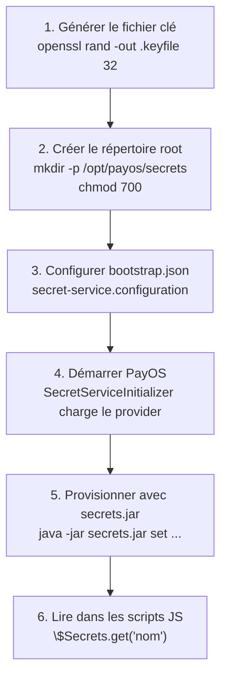

### CLI `secrets` — wrapper et installation

Le module `secret-service-filesystem` fournit, en plus du JAR, des scripts d'intégration système dans `scripts/` :

| Fichier | Rôle |
|---|---|
| `scripts/secrets` | Wrapper Bash — résolution de symlinks, vérification Java, délégation à `secrets.jar` |
| `scripts/secrets.ps1` | Wrapper PowerShell — utilise `$PSScriptRoot` pour localiser `secrets.jar` |
| `scripts/secrets.cmd` | Wrapper cmd.exe — pour les terminaux non-PowerShell sous Windows |
| `scripts/install.sh` | Installeur Linux/macOS — copie JAR + wrapper, met à jour `PATH` dans les profils shell |
| `scripts/install.ps1` | Installeur Windows — copie JAR + wrappers, met à jour le `PATH` utilisateur dans le registre |

**Workflow d'installation :**

```bash
# Linux / macOS
mvn package -DskipTests
cp target/secrets.jar scripts/
./scripts/install.sh              # → ~/.payos/bin (ou $PAYOS_HOME/bin)
source ~/.bashrc
secrets --help
```

```powershell
# Windows
mvn package -DskipTests
Copy-Item target\secrets.jar scripts\
.\scripts\install.ps1             # → %USERPROFILE%\.payos\bin (ou $env:PAYOS_HOME\bin)
secrets --help                    # disponible immédiatement dans la session
```

Les installeurs acceptent un répertoire cible en argument (`./install.sh /usr/local/bin`) et respectent la variable `PAYOS_HOME` si elle est définie.

---

## 14. Considérations de sécurité

| Risque | Mitigation dans l'architecture |
|--------|-------------------------------|
| **Fuite de valeur dans les logs** | `SecretValue.toString()` retourne `"SecretValue[REDACTED]"`. La `String` produite par `SecretsBinding.get()` peut être loguée — c'est la responsabilité du script. |
| **Persistance en mémoire** | `SecretValue` zeroe les bytes à `close()`. La `String` Java reste en mémoire JVM jusqu'au GC — impossibilité de garantir le zeroing d'une `String` en Java. Utiliser `exposeChars()` (→ `CharBuffer`) si zeroing nécessaire en dehors du binding. |
| **Path traversal** | Double validation : `AbstractSecretProvider.validateTenantId` et `SecretPath.validateTenantId`. Regex stricte `[a-zA-Z0-9\-]+`. |
| **Tampering de fichiers** | AES-GCM : authentification intégrée. Toute modification du `.enc` déclenche une `SecretProviderException` au déchiffrement. |
| **IV réutilisation** | IV généré par `SecureRandom` à chaque écriture. Pas de risque de réutilisation même pour le même secret. |
| **Clé maîtresse en mémoire** | Copiée défensivement à l'initialisation. `FileSystemSecretProvider.close()` zeroe la copie. Pas de zeroing automatique en cas d'arrêt brutal du JVM. |
| **Accès cross-tenant par script** | Binding scopé au tenantId de la requête. Le script ne peut pas passer un autre tenantId. |
| **Provider non disponible** | Démarrage refusé si `enabled=true` et initialisation échoue. `$Secrets` simplement absent si `enabled=false`. |

---

## 15. Structure des modules Maven

```
payos-bom/                        ← BOM (gestion des versions)

payos-secret-api/                 ← API / SPI (interfaces, modèles, abstractions)
  ma.s2m.payos.secret.api/
    ISecretProvider               ← contrat noyau
    ISecretProviderFactory        ← point d'entrée SPI
    ICryptoSecretProvider         ← capacité optionnelle
    IVersionedSecretProvider      ← capacité optionnelle
    IWatchableSecretProvider      ← capacité optionnelle
    ICertificateSecretProvider    ← capacité optionnelle
  ma.s2m.payos.secret.model/
    SecretValue                   ← conteneur sécurisé
    SecretMetadata                ← record de métadonnées
    SecretCapability              ← enum des capacités
  ma.s2m.payos.secret.spi/
    AbstractSecretProvider        ← template method + audit
  ma.s2m.payos.secret.audit/
    AuditEntry                    ← record d'événement audit
    AuditEventType                ← enum des types d'événements
  ma.s2m.payos.secret.exception/
    SecretNotFoundException
    SecretAccessDeniedException
    SecretProviderException

secret-service-filesystem/        ← implémentation de référence (connecteur)
  ma.s2m.payos.secret.filesystem/
    FileSystemSecretProviderFactory  ← type="filesystem", SPI entry point
    FileSystemSecretProvider         ← implémentation concrète
    EncryptedFileStore               ← chiffrement AES-GCM
    MasterKeyLoader                  ← chargement clé (keyfile / env var)
    SecretPath                       ← résolution + validation des chemins
    AtomicFileWriter                 ← écriture atomique via temp+move
  META-INF/services/
    ma.s2m.payos.secret.api.ISecretProviderFactory  ← enregistrement SPI

payos/ (kernel)
  ma.s2m.payos.secret/
    SecretServiceInitializer      ← bootstrap
    SecretProviders               ← SPI loader + cache
  ma.s2m.payos.scripting/
    SecretsBinding                ← binding $Secrets pour les scripts JS
```

**Règle de dépendance :**

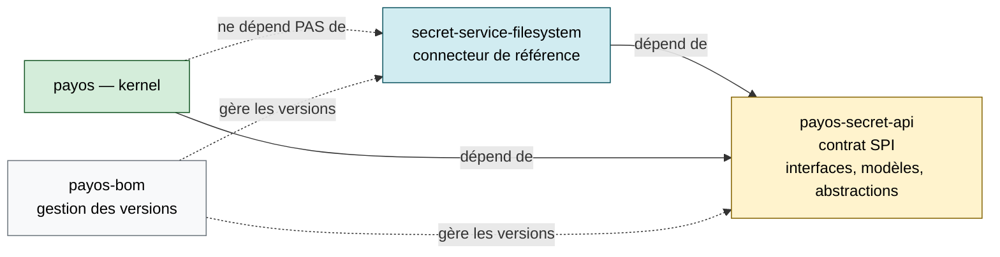

Le kernel et les providers se connaissent uniquement via `payos-secret-api`. Les providers sont des connecteurs externes. Cette séparation garantit que le kernel ne dépend pas d'une implémentation spécifique et que les providers peuvent être déployés indépendamment.
