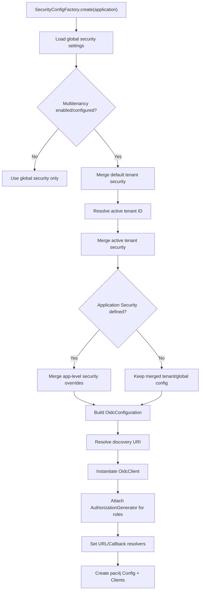
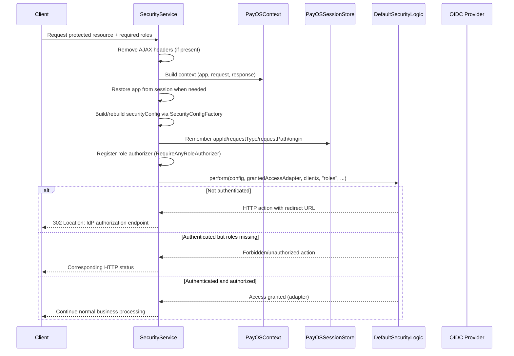
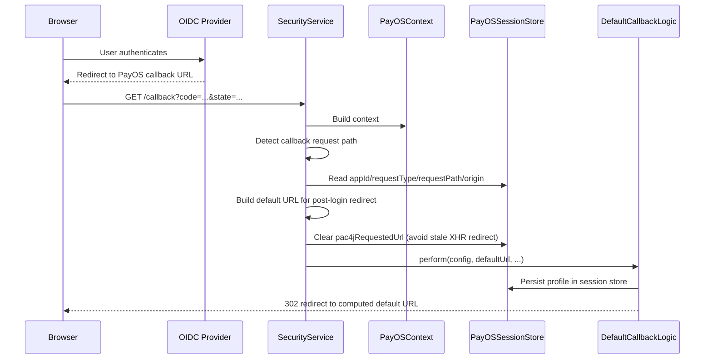
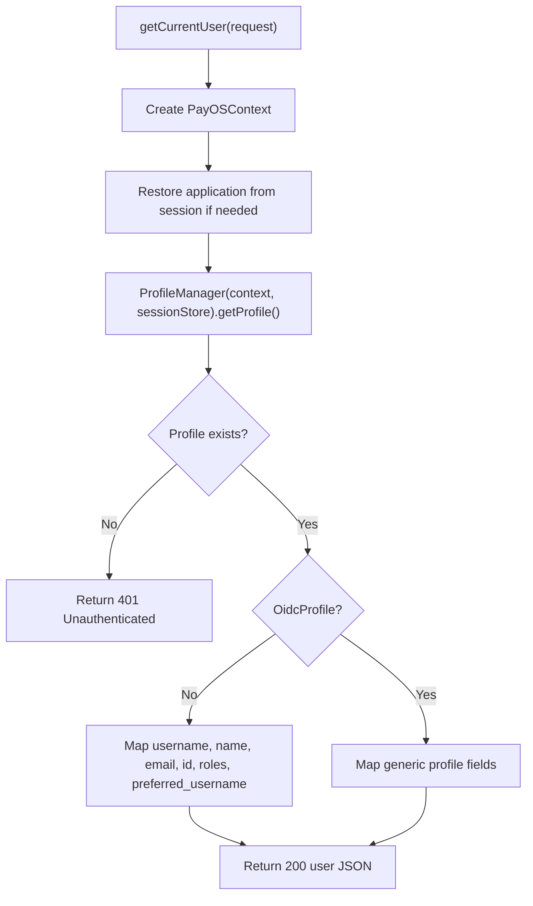
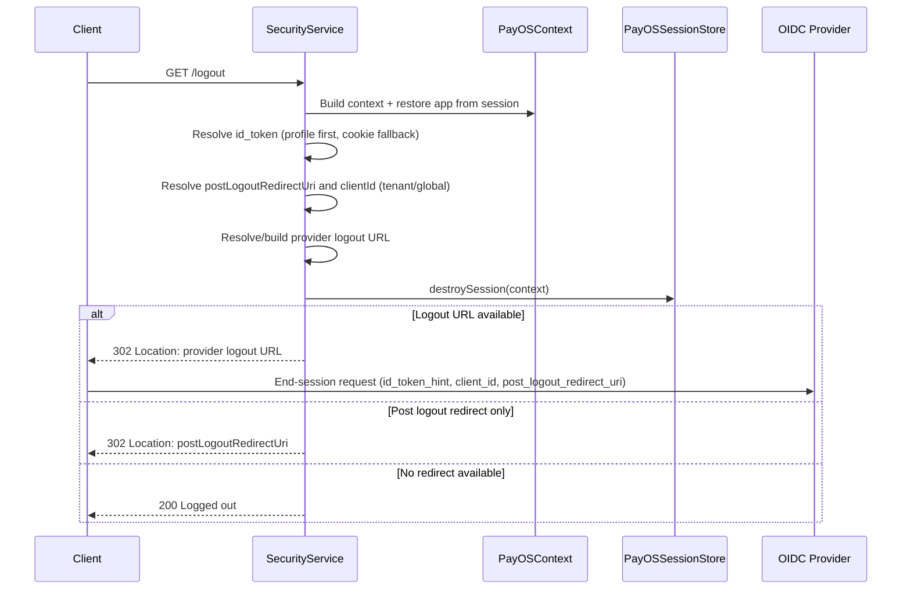

# PayOS — Legacy pac4j/OIDC Security

Last Alignment: 2026-04-22

> **This document covers the legacy pac4j-based security path.**
>
> For the current Nimbus-based implementation, see [nimbus-security-service.md](./nimbus-security-service.md).
> For OIDC configuration keys (both providers), see [oidc-configuration-guide.md](./oidc-configuration-guide.md).

---

## 1. Purpose and scope

Describes the end-to-end OIDC security lifecycle for the legacy pac4j-based implementation: configuration loading, runtime access checks, callback processing, user profile resolution, and logout/session invalidation.

Based on the behavior of:
- `SecurityConfigFactory`
- `SecurityService`
- `PayOSContext`
- `PayOSSessionStore`

---

## 2. Components overview

### `SecurityService`
Orchestrates authentication/authorization through pac4j.

Key responsibilities:
1. Create/restore security context (`PayOSContext`, session metadata).
2. Execute pac4j callback logic for OIDC return (`/callback`).
3. Execute role-based authorization checks through pac4j security logic.
4. Resolve current user profile and expose user details.
5. Handle logout URL construction and session destruction.

Stores original request context in session before redirection:
- `payos.appId`
- `payos.requestType`
- `payos.requestPath`

On callback (`/callback`), restores the application from session and executes pac4j `DefaultCallbackLogic`. Applies role checks with `RequireAnyRoleAuthorizer` when roles are specified.

### `PayOSContext`
Adapter from internal PayOS request/response to pac4j `WebContext`.

Key responsibilities:
1. Expose headers, cookies, parameters, and request attributes in pac4j format.
2. Build proxy-aware request URL parts (scheme, host, port).
3. Reconstruct routing path with app/type prefixes when required.

`getPath()`:
- If current request is a callback, reads `payos.requestPath` from session.
- Restores `application` using `payos.appId` if missing.
- Rebuilds a full path in the form `/appId/type/...` when the request path is relative.

> `WebContext.getPath()` must return the full path (not scheme/host/port). This is why `PayOSContext` rebuilds `/appId/type/...` when needed.

### `PayOSSessionStore`
Shared in-memory pac4j session store.

Key responsibilities:
1. Read/create session ID cookie (`PAYOS_SESSION_ID`).
2. Store pac4j and PayOS security metadata.
3. Enforce TTL (default 30 min) and max session entries (default 10,000).
4. Destroy or renew session and update cookie.

Configurable with:
- `security.sessionTtlSeconds`
- `security.sessionMaxEntries`

> For high traffic or multi-node deployments, consider a distributed session store (e.g., Redis).

### `SecurityConfigFactory`
Builds the pac4j `Config` and OIDC client setup.

Key responsibilities:
1. Resolve security config with precedence:
   - Global security (`settings.security`)
   - Default tenant security (`multitenancy.tenants.default.security`)
   - Active tenant security (`multitenancy.tenants.<tenantId>.security`)
   - Application-level security overrides (`application.appConfig.security`)
2. Build discovery URI from explicit `discoveryUri` or from provider base URL + realm.
3. Configure OIDC client (`clientId`, `secret`, nonce, scope, preferred JWS algorithm).
4. Register an `AuthorizationGenerator` that enriches `OidcProfile` with roles.

Config keys: `clientId`, `discoveryUri`, `realm`, `oidcProviderBaseUrl`, `clientSecret`, `callBackUri`.

---

## 3. High-level flow

```mermaid
flowchart TD
  U[User] -->|GET /{appId}/{type}/...| H[PayOS HTTP Handler]
  H --> S[SecurityService]
  S --> C[PayOSContext]
  S -->|store appId/type/path| SS[PayOSSessionStore]
  S -->|302 Redirect| U
  U -->|Login| KC[Keycloak / OIDC Provider]
  KC -->|Redirect /callback| U
  U -->|GET /callback| H
  H --> S
  S --> C
  C -->|read appId/path| SS
  S -->|DefaultCallbackLogic| KC
  S -->|Redirect /{appId}/{type}/...| U
```

---

## 4. Configuration loading lifecycle



**Key behaviors:**
- Config merge order: `global < default tenant < active tenant < application`.
- Tenant resolution: tries MDC (`TenantScope.MDC_TENANT_ID`), then tenant simulator, else no override.
- Discovery URI: constructed from `realm` + provider base URL → `.../realms/{realm}/.well-known/openid-configuration`, or falls back to explicit `discoveryUri`.
- Role enrichment: reads `realm_access`/`resource_access` claims; if missing, parses access token.

---

## 5. Runtime security check lifecycle (`securityProcessRequest`)



**Step-by-step:**
1. `PayOSContext` is created for pac4j interoperability.
2. Custom `HttpActionAdapter` maps pac4j actions to PayOS `Response` status/headers.
3. Service stores app ID, request type/path, and origin in session for post-login return.
4. If no roles are requested, method returns early (authentication-only path).
5. If roles exist, `RequireAnyRoleAuthorizer` is applied and checked by pac4j.

---

## 6. OIDC callback lifecycle (`/callback`)



**Step-by-step:**
1. Callback detected by comparing current request path with configured callback path.
2. Default URL built from app config and/or remembered request context.
3. Session metadata saved before login is used to restore app/type/path context after login.
4. After callback logic succeeds, profile becomes available via `ProfileManager` + session store.

---

## 7. User profile retrieval lifecycle (`getCurrentUser`)



Profile can only be retrieved in an HTTP request context with access to the same session store/cookie identity.

---

## 8. Logout and session termination lifecycle (`handleLogout`)



**Step-by-step:**
1. Reads `id_token` from profile; if unavailable, tries request cookie.
2. Reads `logoutUrl`, `postLogoutRedirectUri`, `clientId`, discovery URI from tenant/global config.
3. If explicit `logoutUrl` exists, enriches it with OIDC parameters; otherwise derives from discovery base.
4. Session store entry is removed and session cookie is expired.
5. Response: redirect to OIDC provider logout → fallback to post-logout URI → fallback `200 Logged out`.

---

## 9. Security and operational considerations

| Concern | Notes |
|---|---|
| Proxy/header trust | URL/scheme/host/ip resolution depends on forwarded headers in `PayOSContext`. Ensure reverse proxy strips/rebuilds forwarded headers. |
| Session scalability | Current session store is in-memory. Multi-node deployments require a distributed store. |
| Redirect strictness | OIDC provider post-logout redirect URIs must exactly match configured values. |
| Role mapping | Role extraction assumes `realm_access` and `resource_access` claim structure. |
| Tenant consistency | Keep tenant IDs and tenant simulator settings aligned with expected runtime tenant routing. |
