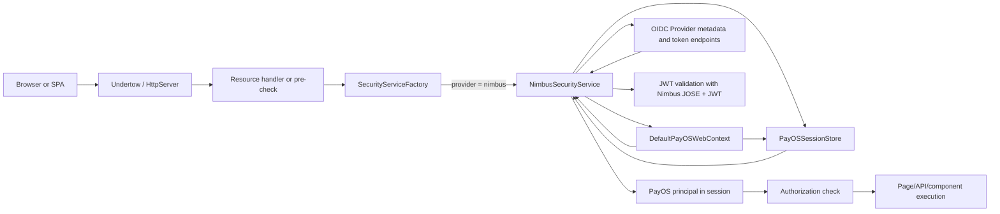
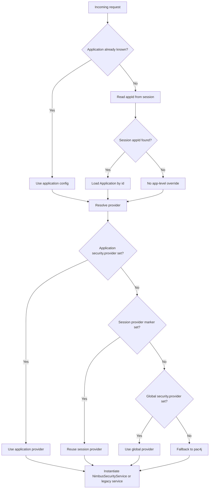
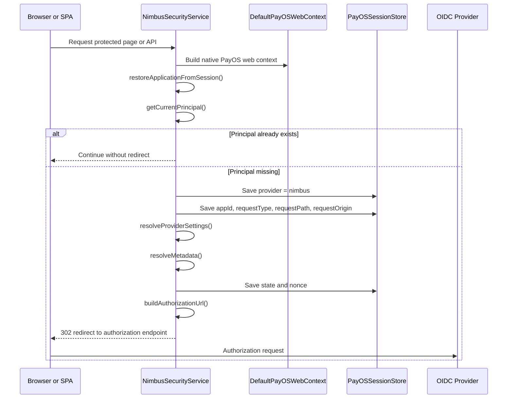
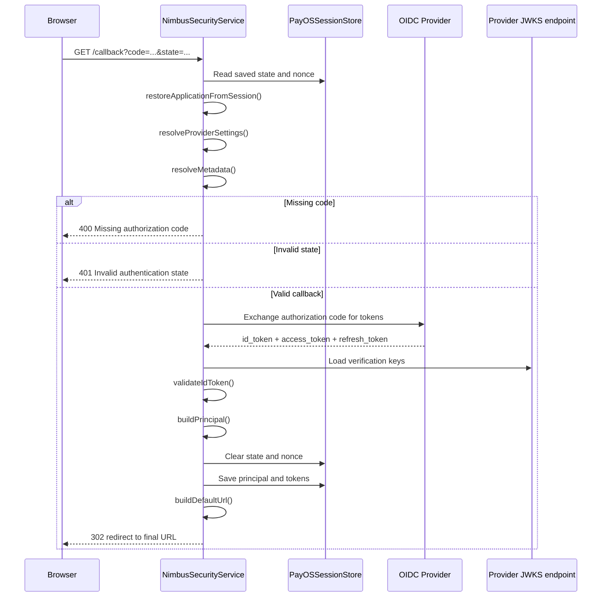
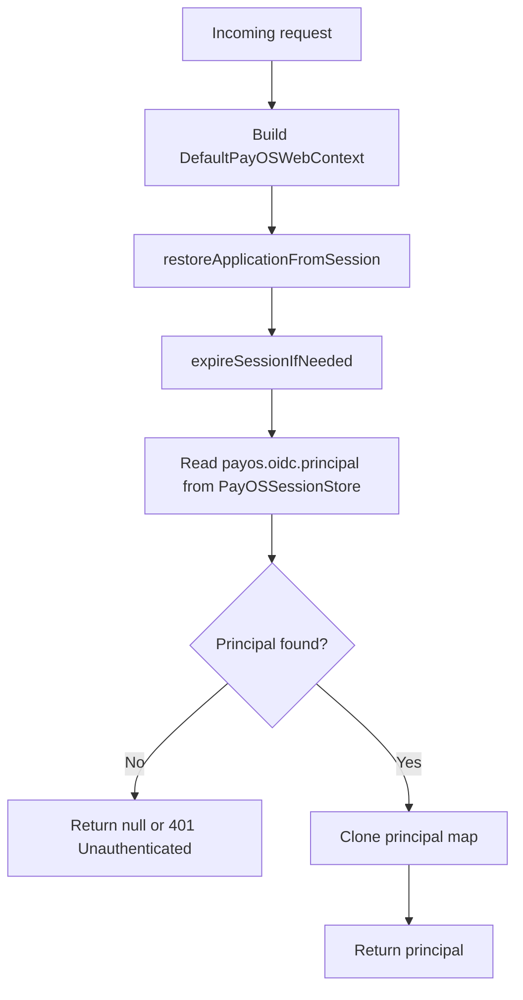
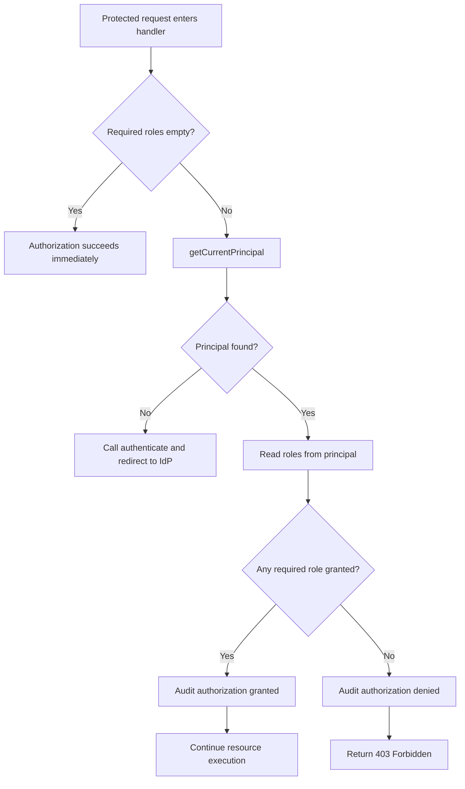
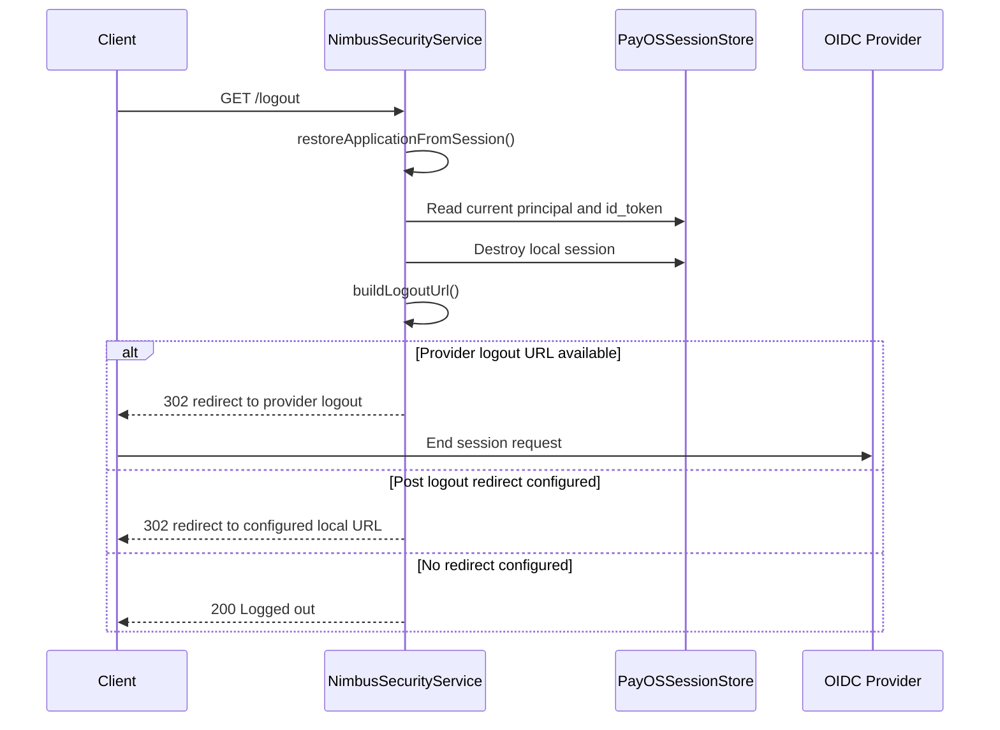

# NimbusSecurityService in PayOS

Last Alignment: 2026-04-01

## 1) Purpose and scope

This document explains the current Nimbus-based OIDC implementation used in PayOS.

It focuses on the classes under the Nimbus path and the shared session/context layer:
- `ma.s2m.payos.security.SecurityServiceFactory`
- `ma.s2m.payos.security.oidc.nimbus.NimbusSecurityService`
- `ma.s2m.payos.security.oidc.nimbus.DefaultPayOSWebContext`
- `ma.s2m.payos.security.oidc.PayOSSessionStore`
- `ma.s2m.payos.security.oidc.OidcSessionKeys`

This is the document to read when `security.provider = "nimbus"` is active.

The legacy pac4j implementation is still documented separately in:
- `SecurityFlow.md`
- `oidc-security-lifecycle.md`
- `AuthnAuthzDetails.md`

---

## 2) Main runtime blocks

### `SecurityServiceFactory`

Chooses which security implementation must handle the request.

Responsibilities:
- Resolve the application from the URI or from the session.
- Read the provider from application config, then from session markers, then from global config.
- Instantiate either `NimbusSecurityService` or the legacy pac4j `SecurityService`.

### `NimbusSecurityService`

Owns the Nimbus authentication and authorization logic.

Responsibilities:
- Start OIDC authentication by redirecting to the provider.
- Process `/callback` by exchanging the authorization code for tokens.
- Validate the `id_token` with Nimbus JWT/JWK primitives.
- Build the PayOS principal stored in session.
- Enforce role-based authorization.
- Expose the authenticated user through `/me`.
- Handle logout.

### `DefaultPayOSWebContext`

Acts as the native PayOS HTTP adapter for the Nimbus flow.

Responsibilities:
- Expose headers, cookies, parameters, request URL parts, and path.
- Rebuild the effective path used by the security flow.
- Restore app-aware path context from session when necessary.
- Emit response headers and cookies.

### `PayOSSessionStore`

Is the shared in-memory session store used by both security implementations.

Responsibilities:
- Create and resolve `PAYOS_SESSION_ID`.
- Store session-scoped context such as app, provider, request path, and OIDC principal.
- Enforce TTL and capacity limits.
- Destroy the session during logout.

### `OidcSessionKeys`

Provides the shared session key names used across the security layer.

Responsibilities:
- Keep provider/app/request metadata keys stable.
- Avoid hard-coded duplication between Nimbus and pac4j code paths.

---

## 3) Global authentication and authorization view

This first diagram shows the global blocks and their interactions.

High-level meaning:
- `SecurityServiceFactory` decides which engine handles the request.
- `NimbusSecurityService` drives the whole OIDC lifecycle.
- `DefaultPayOSWebContext` gives Nimbus a PayOS-native HTTP view.
- `PayOSSessionStore` keeps continuity across requests.
- Token validation and role extraction happen before the request is considered authenticated and authorized.

---

## 4) Zoom 1: provider selection and request bootstrapping

This block explains how the request is associated with Nimbus before any callback or role check is executed.

Important design points:
- The factory intentionally prefers application configuration when the request already targets a specific app.
- Session markers are used to keep `/callback`, `/me`, and `/logout` on the same provider even when the application is not explicit in the route.
- This avoids mixing a Nimbus callback with a pac4j-authenticated session, or the reverse.

---

## 5) Zoom 2: authentication initiation (`authenticate`)

This block explains how Nimbus starts the OIDC flow.

What is persisted before redirect:
- `payos.oidc.provider`
- `payos.appId`
- `payos.requestType`
- `payos.requestPath`
- `payos.requestOrigin`
- `payos.oidc.state`
- `payos.oidc.nonce`

Why this matters:
- the callback must know which app triggered login
- the callback must know which provider initiated the flow
- the user must be redirected back to the correct page/API context after authentication

---

## 6) Zoom 3: callback processing and token validation (`handleCallback`)

This block explains the most critical authentication step.

Stored authentication artifacts after a successful callback:
- `payos.oidc.principal`
- `payos.oidc.idToken`
- `payos.oidc.accessToken`
- `payos.oidc.refreshToken`
- `payos.oidc.expiresAt`
- `payos.oidc.issuer`

Principal content built by Nimbus:
- `id`
- `username`
- `preferred_username`
- `name`
- `email`
- `roles`
- `tenantId`
- `issuer`

Role extraction strategy:
- read `realm_access.roles`
- read `resource_access.{clientId}.roles`
- if needed, parse the access token JWT and retry the same extraction

---

## 7) Zoom 4: authenticated principal resolution (`getCurrentPrincipal`, `getCurrentUser`)

This block shows how later requests reuse the authenticated session.

Key behaviors:
- session expiration is enforced before principal reuse
- the returned principal is copied into a new map to avoid mutating the session object directly
- `/me` is only a thin wrapper around this principal lookup

This block is the bridge between authentication and business execution.

---

## 8) Zoom 5: authorization on protected requests (`check`)

This block explains how Nimbus performs role-based authorization after authentication.

Authorization model:
- role check is `any-match`, not `all-match`
- roles come from the principal already built during callback
- authorization failures are audited with user, tenant, correlation id, path, and requested roles

Why this is separate from callback logic:
- callback only proves identity and builds a principal
- authorization decides whether this principal can access a specific route/resource

---

## 9) Zoom 6: logout flow (`handleLogout`)

Logout is not part of authorization, but it closes the authentication lifecycle.

Important detail:
- local session destruction happens even if the remote IdP logout URL is absent

---

## 10) Configuration precedence for Nimbus

Nimbus resolves effective security settings in this order:

1. global `settings.security`
2. default tenant security
3. active tenant security
4. application-level `appConfig.security`

Important inputs used by Nimbus:
- `provider`
- `clientId`
- `clientSecret`
- `discoveryUri`
- `realm`
- `oidcProviderBaseUrl`
- `callBackUri`
- `scope`
- `logoutUrl`
- `postLogoutRedirectUri`
- `sessionCookieSecure`

---

## 11) Package layout after the split

Current package split:
- `ma.s2m.payos.security.oidc.nimbus` for Nimbus-specific classes
- `ma.s2m.payos.security.oidc.pac4j` for the legacy pac4j implementation
- `ma.s2m.payos.security.oidc` for shared session/context abstractions and keys

This split is intentional:
- Nimbus and pac4j can coexist during migration
- shared session keys remain centralized
- the factory can route requests between implementations without duplicating core session infrastructure

---

## 12) Operational notes

1. A session cookie alone does not prove Nimbus authentication.
   Nimbus requires the Nimbus principal markers in the same session.

2. `/callback`, `/me`, and `/logout` must keep using the same provider that initiated the login flow.
   This is why the session stores a provider marker.

3. `X-Tenant-Id` should remain stable across page and API calls when tenant-specific security settings are used.

4. For local HTTP setups, cookie flags such as `Secure` can prevent session continuity if they do not match the runtime scheme.

5. The intended migration path is:
   - keep pac4j as fallback
   - make Nimbus the explicit provider for selected applications
   - eventually retire the pac4j path when confidence is high enough
