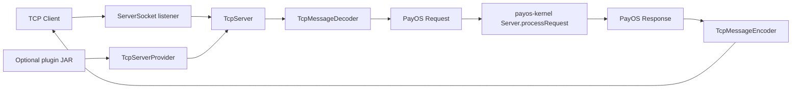

# Architecture

## Module Role in the PayOS Platform

`payos-server-tcp` is a transport adapter. It is responsible for translating raw TCP exchanges into the transport-agnostic `Request` and `Response` model used by `payos-kernel`.

It does not contain business logic. Once a `Request` is decoded, the module delegates processing to the kernel.

## Global View



## Startup Flow

```mermaid
flowchart TD
    Boot[BootServer] --> Servers[Servers.start(host, port, protocol, serverConfig)]
    Servers --> Loader[ServiceLoader<ServerProvider>]
    Loader --> Provider[TcpServerProvider]
    Provider --> PluginScan[Optional plugin directory scan]
    PluginScan --> Server[TcpServer]
    Server --> Start[start(host, port)]
    Start --> Run[run(host, port)]
    Run --> AcceptLoop[accept loop]
```

## Main Classes

| Class | Role |
|---|---|
| `TcpServerProvider` | Declares protocol `tcp` and creates the server instance |
| `TcpServer` | Owns the socket accept loop and per-client processing |
| `TcpMessageDecoder` | Converts inbound bytes into a `Request` |
| `TcpMessageEncoder` | Converts a `Response` into outbound bytes |
| `TcpMessageHandler` | Optional interception point to override default delegation |

## SPI Discovery

The module is registered through Java SPI:

`META-INF/services/ma.s2m.payos.servers.ServerProvider`

The file contains:

```text
ma.s2m.payos.servers.providers.TcpServerProvider
```

At runtime, the kernel loads providers through `ServiceLoader` and maps them by protocol name.

## Concurrency Model

`TcpServer.start()` launches a dedicated background thread named `tcp-server-main`.

Inside `run(host, port)`:
- a `ServerSocket` is created and bound
- the server blocks on `accept()` while the server is marked as running
- each accepted client socket is processed in a Java 21 virtual thread

This keeps the accept loop simple while allowing many concurrent connections without dedicating a platform thread to every client.

## Processing Model

### Default Path

When no plugin handler is supplied:

1. `decoder.decode(in)` creates a `Request`
2. `Application.getAppIdFromUri(request.getPath())` extracts the target application
3. `TenantPolicyService.enforceAndOpenScope(request, appId)` opens tenant scope
4. `super.processRequest(appId, request)` delegates to the kernel
5. the returned `Response` is written with the encoder

### Custom Handler Path

When a plugin provides `TcpMessageHandler`, the handler is called instead of the default `super.processRequest` path. This allows custom protocol-specific routing or preprocessing while still returning a standard PayOS `Response`.

## Default Decoder and Encoder

The module ships with a fallback decoder and encoder.

### Default decoder

- reads the entire input stream using `readAllBytes()`
- decodes bytes as UTF-8
- creates a `POST` request
- targets the API resource type
- uses path `/`

Equivalent shape:

```java
new Request(Request.METHOD_POST, IResource.API_RESOURCE, null, null, "/", body)
```

### Default encoder

- writes `response.getBytesBody()` when present
- otherwise writes `response.getMessage()` as UTF-8 text
- writes nothing when `response` is `null`

These defaults are intentionally minimal and should be treated as a compatibility fallback, not as a full protocol contract.

## Tenant and Correlation Metadata

After request processing, `TcpServer` copies context data from the `Request` into outbound response headers when available:
- `X-Tenant-Id`
- `X-Correlation-Id`

This keeps traceability consistent with the HTTP and queue transports.

## Error Handling

- startup failures are wrapped in `UnableToStartServerException`
- per-client processing errors are logged and the socket is closed
- request-processing errors are converted into `ServerException` when needed
- tenant policy failures are turned into a `Response` with the policy status code and message

## Design Constraints

- TCP framing is not handled by the default decoder
- the default decoder reads the whole stream, so it is not suitable for long-lived multiplexed protocols
- plugin classes are loaded reflectively and must expose a no-argument constructor
- the provider stops scanning once it has found a complete decoder + encoder + handler set, or after all classes have been evaluated
