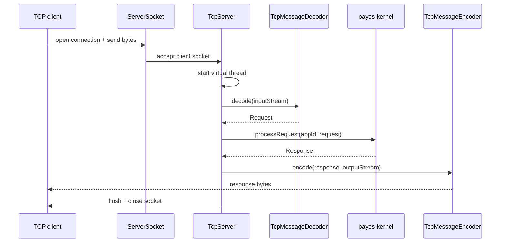
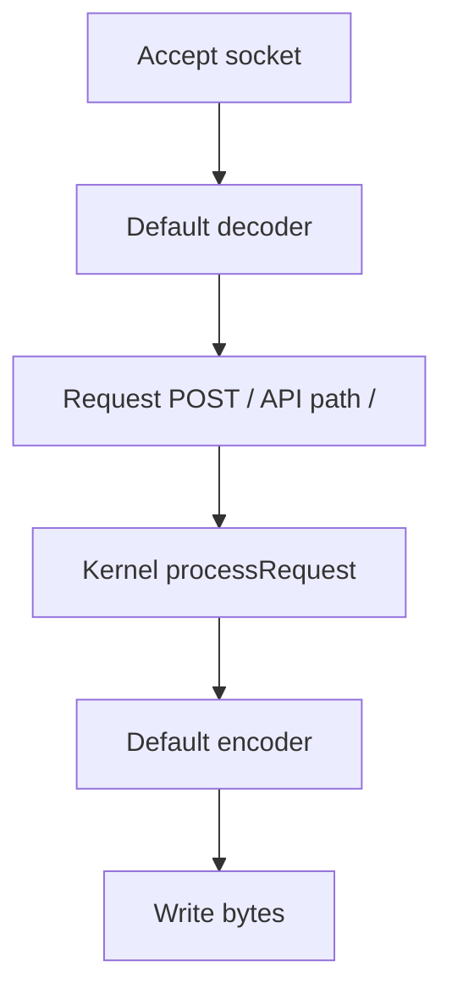
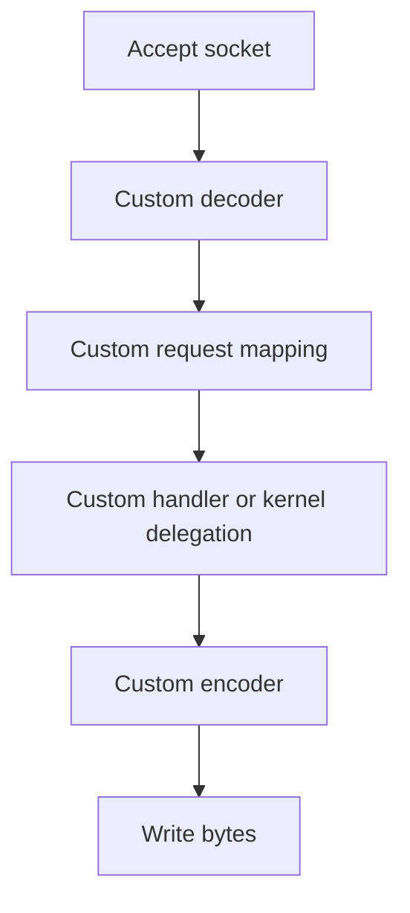

# Request Lifecycle

## End-to-End Flow

This document explains what happens from the moment a TCP client sends bytes to the moment the response is written back.



## Step-by-Step

### 1. Listener accepts the connection

`TcpServer.run(host, port)` binds a `ServerSocket` and blocks on `accept()` while the server is running.

Each accepted connection is handed to:

```java
Thread.startVirtualThread(() -> handleClient(clientSocket))
```

### 2. Decoder creates a PayOS request

`handleClient` opens the socket streams and invokes:

```java
Request request = decoder.decode(in);
```

The decoder is responsible for converting transport-level bytes into a PayOS `Request` object.

With the built-in default decoder:
- the whole stream is read
- data is decoded as UTF-8
- the method becomes `POST`
- the resource type becomes API
- the path becomes `/`

### 3. Application is resolved from the request path

After decoding, the module extracts the target application ID:

```java
String appId = Application.getAppIdFromUri(request.getPath());
```

This means custom decoders must populate a meaningful request path when application routing matters.

### 4. Tenant scope is enforced

Before business execution, the server opens a tenant scope:

```java
try (TenantScope ignored = TenantPolicyService.enforceAndOpenScope(request, appId)) {
    ...
}
```

If tenant policy enforcement fails, the module returns a `Response` with the error status and message instead of throwing the exception to the socket layer.

### 5. Business handling occurs

Two execution paths exist:

#### Default path

If no custom handler is provided, `TcpServer` delegates to the kernel through `super.processRequest(appId, request)`.

#### Custom path

If a plugin supplied a `TcpMessageHandler`, the module calls:

```java
handler.handle(appId, request)
```

This is the extension point for protocol-specific orchestration.

### 6. Transport metadata is added to the response

If the request context contains tenant or correlation information, the module writes them back as headers on the `Response` before encoding.

### 7. Encoder writes bytes back to the client

Finally, the selected encoder serializes the `Response` to the output stream and flushes it.

The default encoder behavior is:
- prefer `response.body`
- otherwise write `response.message` as UTF-8 text

## Lifecycle Variants

### Default fallback flow



### Plugin-enhanced flow



## Important Practical Consequences

- the default decoder is message-oriented, not stream-oriented
- the server assumes one logical request per accepted socket unless your custom decoder/handler implements a richer protocol contract
- malformed protocol parsing should be handled inside the decoder or handler, not in the kernel
- application routing depends on the request path produced by the decoder
