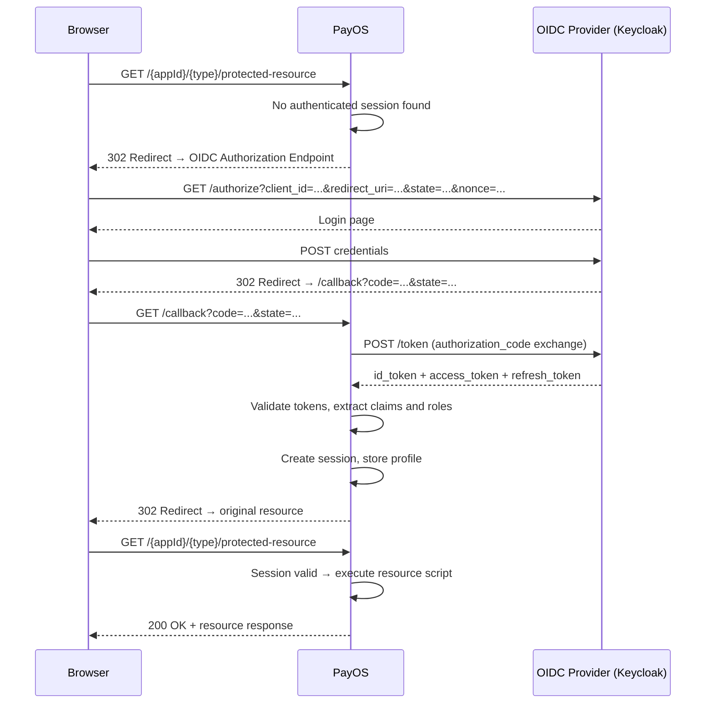

# PayOS — OIDC Security Configuration Guide

Last Updated: 2026-04-15

---

## Table of contents

1. [Overview](#1-overview)
2. [Security providers](#2-security-providers)
3. [Configuration keys reference](#3-configuration-keys-reference)
4. [Configuration precedence](#4-configuration-precedence)
5. [Discovery URI resolution](#5-discovery-uri-resolution)
6. [Quickstart: minimal configuration](#6-quickstart-minimal-configuration)
7. [Global security configuration](#7-global-security-configuration)
8. [Application-level security override](#8-application-level-security-override)
9. [Multi-tenant OIDC configuration](#9-multi-tenant-oidc-configuration)
10. [Session configuration](#10-session-configuration)
11. [Logout configuration](#11-logout-configuration)
12. [Complete example](#12-complete-example)
13. [Authentication flow](#13-authentication-flow)
14. [PCI-DSS compliance notes](#14-pci-dss-compliance-notes)
15. [Troubleshooting](#15-troubleshooting)

---

## 1. Overview

PayOS integrates OIDC authentication via a configurable security provider loaded at runtime. Security configuration is declared in `bootstrap.json` and optionally overridden at the application or tenant level. The runtime supports two providers:

- **`nimbus`** — recommended, built on the Nimbus SDK with no third-party web framework dependency.
- **`pac4j`** — legacy provider, kept for backward compatibility.

Both providers implement `ISecurityService` and are selected transparently by `SecurityServiceFactory`.

---

## 2. Security providers

| Provider | Value | Recommendation |
|----------|-------|----------------|
| Nimbus | `"nimbus"` | ✅ Recommended for all new deployments |
| pac4j | `"pac4j"` | ⚠️ Legacy — kept for backward compatibility |

The active provider is selected in the following order:
1. Application `security.provider` (highest priority)
2. Session-stored provider marker (used during callback to stay consistent)
3. Global `security.provider`
4. Fallback to `pac4j` if none is defined

---

## 3. Configuration keys reference

All keys belong to the `security` block, whether placed globally, per-tenant, or per-application.

| Key | Type | Required | Default | Description |
|-----|------|----------|---------|-------------|
| `provider` | string | No | `"nimbus"` | Security provider: `"nimbus"` (primary) or `"pac4j"` (legacy) |
| `clientId` | string | Yes | — | OIDC client ID registered with the identity provider |
| `clientSecret` | string | Yes | — | OIDC client secret. **PCI-DSS Req 2.1**: default placeholder values are rejected at startup |
| `oidcProviderBaseUrl` | string | Conditional | — | Base URL of the OIDC provider (e.g., Keycloak root URL). Used to auto-build `discoveryUri` when combined with `realm` |
| `realm` | string | Conditional | — | Keycloak realm name. Combined with `oidcProviderBaseUrl` to build `discoveryUri` |
| `discoveryUri` | string | Conditional | `http://localhost:8080/realms/master/.well-known/openid-configuration` | Full OIDC discovery endpoint URI. Overrides the `oidcProviderBaseUrl` + `realm` combination |
| `callBackUri` | string | No | `"/callback"` | OAuth2 redirect URI. Must be registered in the identity provider |
| `scope` | string | No | `"openid profile email"` (nimbus) | OIDC scopes requested during login |
| `preferredJwsAlgorithm` | string | No | Provider default | JWS algorithm for token validation: `"RS256"`, `"HS256"`, etc. |
| `logoutUrl` | string | No | Auto-built from discovery | Custom logout endpoint URL |
| `postLogoutRedirectUri` | string | No | — | URI to redirect to after logout |
| `sessionTtlSeconds` | int | No | `1800` (30 min) | Session lifetime in seconds |
| `sessionMaxEntries` | int | No | `10000` | Maximum number of concurrent sessions held in memory |
| `sessionCookieSecure` | boolean | No | `false` | Set `Secure` flag on session cookie — must be `true` in production HTTPS deployments |
| `allowedOrigins` | array[string] | No | — | Allowed origins for CORS |

---

## 4. Configuration precedence

Security settings are merged in the following order. Later entries override earlier ones.

```
Global security
    ↓  overridden by
Default tenant security  (multitenancy.tenants.default.security)
    ↓  overridden by
Active tenant security   (multitenancy.tenants.<tenantId>.security)
    ↓  overridden by
Application security     (applications[].security)
```

This allows a single global OIDC configuration to be shared across all applications, while individual applications or tenants can selectively override specific keys (e.g., `clientId`, `realm`) without repeating the full configuration.

---

## 5. Discovery URI resolution

PayOS supports three ways to specify the OIDC discovery endpoint, resolved in this priority order:

### Option A — Explicit `discoveryUri` (highest priority)

```json
"security": {
  "discoveryUri": "https://auth.example.com/realms/payos/.well-known/openid-configuration"
}
```

### Option B — `oidcProviderBaseUrl` + `realm` (recommended for Keycloak)

PayOS automatically builds the discovery URI as:
`{oidcProviderBaseUrl}/realms/{realm}/.well-known/openid-configuration`

```json
"security": {
  "oidcProviderBaseUrl": "https://auth.example.com",
  "realm": "payos"
}
```

Resolves to: `https://auth.example.com/realms/payos/.well-known/openid-configuration`

### Option C — Legacy `keycloakBaseUrl` (backward compatibility only)

```json
"security": {
  "keycloakBaseUrl": "https://auth.example.com",
  "realm": "payos"
}
```

Behaves identically to Option B. Prefer `oidcProviderBaseUrl` for new configurations.

---

## 6. Quickstart: minimal configuration

The minimum required configuration to enable OIDC authentication globally:

```json
{
  "servers": [
    { "host": "0.0.0.0", "port": 8080, "protocol": "http" }
  ],
  "applications": [
    { "id": "my-app", "name": "My Application" }
  ],
  "security": {
    "provider": "nimbus",
    "clientId": "my-app-client",
    "clientSecret": "my-client-secret",
    "oidcProviderBaseUrl": "https://auth.example.com",
    "realm": "my-realm",
    "callBackUri": "http://localhost:8080/callback"
  }
}
```

With this configuration:
- All applications protected by this global security block will redirect unauthenticated users to the OIDC provider.
- The callback endpoint `/callback` must be registered in the OIDC provider as a valid redirect URI.

---

## 7. Global security configuration

The global `security` block at the root of `bootstrap.json` applies to all applications unless overridden.

```json
{
  "security": {
    "provider": "nimbus",
    "clientId": "payos-global",
    "clientSecret": "s3cr3t",
    "oidcProviderBaseUrl": "https://auth.example.com",
    "realm": "master",
    "scope": "openid profile email",
    "callBackUri": "/callback",
    "sessionTtlSeconds": 3600,
    "sessionCookieSecure": true,
    "allowedOrigins": ["https://app.example.com"],
    "logoutUrl": "/logout",
    "postLogoutRedirectUri": "https://app.example.com/logged-out"
  }
}
```

---

## 8. Application-level security override

To override security settings for a specific application, add a `security` block inside the application entry. Only the keys you specify are overridden — unset keys fall back to the global or tenant configuration.

```json
{
  "applications": [
    {
      "id": "payment-gateway",
      "name": "Payment Gateway",
      "security": {
        "clientId": "gateway-client",
        "clientSecret": "gateway-secret",
        "realm": "payments",
        "scope": "openid profile email roles",
        "sessionTtlSeconds": 1800,
        "sessionCookieSecure": true
      }
    }
  ]
}
```

---

## 9. Multi-tenant OIDC configuration

In a multi-tenant deployment, each tenant can have its own OIDC configuration. This is useful when different tenants use different identity providers or different realms.

```json
{
  "security": {
    "provider": "nimbus",
    "oidcProviderBaseUrl": "https://auth.internal",
    "scope": "openid profile",
    "sessionCookieSecure": true
  },
  "multitenancy": {
    "requireTenantId": true,
    "tenants": {
      "default": {
        "realm": "default-realm",
        "security": {
          "clientId": "default-client",
          "clientSecret": "default-secret"
        }
      },
      "bank-a": {
        "security": {
          "clientId": "bank-a-client",
          "clientSecret": "bank-a-secret",
          "realm": "bank-a-realm"
        }
      },
      "bank-b": {
        "security": {
          "clientId": "bank-b-client",
          "clientSecret": "bank-b-secret",
          "oidcProviderBaseUrl": "https://auth.bank-b.com",
          "realm": "production"
        }
      }
    }
  }
}
```

**How it works at runtime:**
1. The incoming request is resolved to a tenant via `X-Tenant-Id` header or URI.
2. The security configuration for that tenant is merged on top of the global config.
3. The OIDC flow uses the effective merged configuration for that request.

---

## 10. Session configuration

PayOS maintains an in-memory session store (`PayOSSessionStore`) for OIDC state. Sessions are identified by a cookie named `PAYOS_SESSION_ID`.

| Setting | Default | Notes |
|---------|---------|-------|
| `sessionTtlSeconds` | `1800` | Session expires after 30 minutes of inactivity |
| `sessionMaxEntries` | `10000` | Old sessions are evicted when this cap is reached |
| `sessionCookieSecure` | `false` | Set to `true` for HTTPS-only deployments |

```json
"security": {
  "sessionTtlSeconds": 3600,
  "sessionMaxEntries": 5000,
  "sessionCookieSecure": true
}
```

> For multi-node deployments, the default in-memory store is not shared between nodes. Consider adding a distributed session store (e.g., Redis) for horizontal scalability.

---

## 11. Logout configuration

PayOS supports OIDC front-channel logout. The `handleLogout` endpoint clears the session and redirects to the OIDC provider's end-session endpoint.

```json
"security": {
  "logoutUrl": "https://auth.example.com/realms/payos/protocol/openid-connect/logout",
  "postLogoutRedirectUri": "https://app.example.com/logged-out"
}
```

If `logoutUrl` is not set, PayOS auto-builds it from the discovery document's `end_session_endpoint` field (Nimbus provider) or derives it from `discoveryUri` (pac4j provider).

The logout endpoint in PayOS is served at:
```
GET /{appId}/logout
```

---

## 12. Complete example

Full `bootstrap.json` for a production multi-tenant HTTPS deployment with Keycloak:

```json
{
  "servers": [
    {
      "host": "0.0.0.0",
      "port": 8443,
      "protocol": "http",
      "keystore": "/etc/ssl/payos.p12",
      "keystorePassword": "changeit",
      "keystoreType": "PKCS12"
    }
  ],
  "applications": [
    {
      "id": "gateway",
      "name": "Payment Gateway",
      "base.path": "/opt/payos/apps/gateway",
      "version": "1.0.0"
    }
  ],
  "security": {
    "provider": "nimbus",
    "clientId": "payos-gw",
    "clientSecret": "super-secret",
    "oidcProviderBaseUrl": "https://auth.internal",
    "realm": "payos-prod",
    "scope": "openid profile",
    "callBackUri": "https://payos.internal:8443/callback",
    "postLogoutRedirectUri": "https://payos.internal:8443",
    "sessionCookieSecure": true,
    "sessionTtlSeconds": 3600
  },
  "multitenancy": {
    "requireTenantId": true,
    "default-isolation-mode": "dedicated-schema",
    "tenants": {
      "default": {
        "schema": "public",
        "isolationMode": "shared-schema"
      },
      "bank-a": {
        "schema": "bank_a",
        "isolationMode": "dedicated-schema",
        "security": {
          "clientId": "payos-gw-bank-a",
          "clientSecret": "bank-a-secret",
          "realm": "bank-a"
        }
      }
    }
  }
}
```

---

## 13. Authentication flow



---

## 14. PCI-DSS compliance notes

PayOS enforces the following security controls relevant to PCI-DSS:

- **PCI-DSS Req 2.1 — No default credentials**: If `clientId` or `clientSecret` retain their placeholder default values (`defaultClientId` / `defaultClientSecret`), the runtime will **fail to start** with an explicit error. Replace them before any deployment.
- **Nonce usage**: OIDC nonce is always enabled to prevent replay attacks.
- **State parameter**: A cryptographically random state is generated per login attempt (Nimbus provider) to prevent CSRF.
- **Secure cookie flag**: Set `sessionCookieSecure: true` in all HTTPS deployments to prevent session cookie leakage.
- **Correlation tracing**: `X-Correlation-Id` and `X-Tenant-Id` are propagated across the authentication flow and included in audit logs for regulated incident investigation.
- **Audit logging**: Authentication failures and successful logins are written via `AuditLogger` with user, tenant, and correlation identifiers.

---

## 15. Troubleshooting

| Symptom | Likely cause | Fix |
|---------|-------------|-----|
| Runtime fails to start with "default credentials" error | `clientId` or `clientSecret` still set to placeholder values | Set real OIDC credentials in `bootstrap.json` |
| 302 redirect loops | `callBackUri` not registered in OIDC provider | Register the callback URL in the identity provider's client configuration |
| `401 Unauthorized` after successful login | Roles not mapped in OIDC token | Ensure the identity provider includes roles in the token claims (`realm_access.roles` or `resource_access.<clientId>.roles`) |
| Session lost between nodes | In-memory session store not shared | Use a distributed session store for multi-node deployments |
| `discoveryUri` returns 404 | Wrong provider URL or realm name | Verify the URL: `{oidcProviderBaseUrl}/realms/{realm}/.well-known/openid-configuration` |
| Logout does not redirect | `end_session_endpoint` not in discovery document | Set `logoutUrl` explicitly in the security configuration |
| Cookie not sent over HTTP | `sessionCookieSecure: true` on a non-HTTPS server | Set `sessionCookieSecure: false` for HTTP dev environments |
