# PayOS Runtime — Build Guide

This guide explains how to build the full PayOS runtime from source, respecting the inter-module dependency order. The canonical, machine-enforced version of this build order lives in `payos-parent/scripts/update-payos-version.ps1` (and its bash twin `update-payos-version.sh`) — this document is a human-readable walkthrough of that same sequence.

---

## Prerequisites

| Tool | Minimum version | Notes |
|---|---|---|
| JDK | 21 | `JAVA_HOME` must point to a JDK 21+ installation |
| Maven | 3.9 | `mvn --version` must resolve to 3.9+ |
| Local Maven repository | `~/.m2` | Modules are installed there during build; no remote repository needed for a full local build |

A local Redis instance and/or HashiCorp Vault are only needed at *runtime* if you enable the Redis-backed or Vault-backed pluggable modules (`session-service-redis`, `idempotency-service-redis`, `cache-service-redis`, `sliding-window-counter-redis`, `secret-service-vault`) — they are not required to build.

---

## Dependency Graph

Modules share `payos-parent` and `payos-core-bom`, but each module is built independently from its own Maven project. The dependency graph has **four layers**:

```mermaid
graph TD
    P["<b>payos-parent</b><br/>1.2.0-RELEASE<br/><i>Root POM — conventions only, no code</i>"]
    BOM["<b>payos-core-bom</b><br/>1.10.0-RELEASE<br/><i>folder: payos-bom</i>"]

    CAPI["payos-connector-api<br/>1.0.0-RELEASE"]
    SAPI["payos-secret-api<br/>1.1.0-RELEASE"]
    NAPI["payos-notification-api<br/>1.1.0-RELEASE"]
    SDK["connector-sdk<br/>1.2.0-RELEASE<br/><i>folder: payos-connector-sdk</i>"]
    FOUND["payos-foundation<br/>1.2.0-RELEASE"]

    K["<b>payos-kernel</b><br/>1.12.0-RELEASE<br/><i>folder: payos</i>"]

    SH["payos-server-http<br/>1.2.2-RELEASE"]
    ST["payos-server-tcp<br/>1.0.6-RELEASE"]
    SQ["payos-server-queue<br/>1.1.0-RELEASE"]
    QN["queue-service-nats<br/>1.1.0-RELEASE"]
    DB["dynamic-database-service<br/>1.1.9-RELEASE<br/><i>folder: database-service</i>"]
    WH["webhook-service-http<br/>1.0.4-RELEASE"]
    SECFS["secret-service-filesystem<br/>1.4.0-RELEASE"]
    SECV["secret-service-vault<br/>1.3.0-RELEASE"]
    NOTC["payos-notification-connector<br/>1.2.0-RELEASE"]
    SESS["session-service-redis<br/>1.0.0-RELEASE"]
    IDEMP["idempotency-service-redis<br/>1.0.0-RELEASE"]
    CM["cache-service-memory<br/>1.0.0-RELEASE"]
    CR["cache-service-redis<br/>1.0.0-RELEASE"]
    SWM["sliding-window-counter-memory<br/>1.0.0-RELEASE"]
    SWR["sliding-window-counter-redis<br/>1.0.0-RELEASE"]
    PM["payos-pm<br/>1.5.0-RELEASE<br/><i>CLI tools, optional</i>"]
    NOTIF["payos-service-notification<br/>1.4.3-RELEASE<br/><i>standalone daemon</i>"]

    RT["<b>payos-runtime</b><br/>1.12.0-RELEASE<br/><i>Layer 3 — executable fat JAR</i>"]

    P --> BOM
    BOM --> CAPI
    BOM --> SAPI
    BOM --> NAPI
    CAPI --> SDK
    CAPI --> FOUND

    SDK --> K
    FOUND --> K

    K --> SH
    K --> ST
    K --> SQ
    K --> QN
    K --> DB
    K --> WH
    K --> SESS
    K --> IDEMP
    K --> CM
    K --> CR
    K --> SWM
    K --> SWR
    K --> PM
    K --> NOTC
    K --> NOTIF
    FOUND --> SECFS
    FOUND --> SECV
    FOUND --> NOTC
    QN --> NOTIF
    DB --> NOTIF

    SH --> RT
    ST --> RT
    SQ --> RT
    QN --> RT
    DB --> RT
    WH --> RT
    SESS --> RT
    IDEMP --> RT
    CM --> RT
    CR --> RT
    SWM --> RT
    SWR --> RT
    SECFS --> RT
    SECV --> RT
    NOTC --> RT
    SDK --> RT

    style P    fill:#1e3a5f,color:#fff,stroke:#1e3a5f
    style BOM  fill:#1e3a5f,color:#fff,stroke:#1e3a5f
    style K    fill:#1e3a5f,color:#fff,stroke:#1e3a5f
    style RT   fill:#1e3a5f,color:#fff,stroke:#1e3a5f
    style NOTIF fill:#5a3a1e,color:#fff,stroke:#8f5a2d
    style PM    fill:#5a3a1e,color:#fff,stroke:#8f5a2d
```



`payos-pm` (dark boxes) and `payos-service-notification` are built through the same Maven sequence but are **not** embedded into the `payos-runtime` fat JAR — they ship as their own artifacts (CLI binaries and a standalone daemon JAR, respectively).

---

## Build Order

### Step 0 — Root POM and BOM

```bash
cd payos-parent
mvn -q -DskipTests install
cd ../payos-bom
mvn -q -DskipTests install
```

`payos-parent` carries shared Java/Maven build conventions (compiler target, plugin versions) and has no code of its own. `payos-bom` (artifact `payos-core-bom`) centralizes third-party and internal dependency versions that every other module imports.

---

### Step 1 — API / SPI contracts

These modules depend only on `payos-parent` and `payos-core-bom` (plus, for `connector-sdk` and `payos-foundation`, on `payos-connector-api`). They can be built in the order below, or in parallel once `payos-connector-api` is installed.

#### `payos-connector-api` — connector wire contract

```bash
cd ../payos-connector-api
mvn -q -DskipTests install
```

#### `payos-secret-api` — secret management SPI

```bash
cd ../payos-secret-api
mvn -q -DskipTests install
```

#### `payos-notification-api` — notification publishing SPI

```bash
cd ../payos-notification-api
mvn -q -DskipTests install
```

#### `payos-connector-sdk` (folder) — artifact `connector-sdk`, external connector SDK

```bash
cd ../payos-connector-sdk
mvn -q -DskipTests install
```

#### `payos-foundation` — kernel SPI shared across pluggable backends

```bash
cd ../payos-foundation
mvn -q -DskipTests install
```

---

### Step 2 — Layer 1: `payos-kernel`

```bash
cd ../payos
mvn -q -DskipTests install
```

Produces: `~/.m2/repository/ma/s2m/payos/payos-kernel/1.12.0-RELEASE/payos-kernel-1.12.0-RELEASE.jar`

---

### Step 3 — Layer 2: connectors, transport servers, and pluggable backends

All Layer 2 modules depend on `payos-kernel` (and some also on `payos-foundation`). They can be built **in any order**, or in parallel if your shell supports it.

#### `payos-server-http` — HTTP transport adapter

```bash
cd ../payos-server-http
mvn -q -DskipTests install
```

#### `payos-server-tcp` — TCP transport adapter

```bash
cd ../payos-server-tcp
mvn -q -DskipTests install
```

#### `payos-server-queue` — Queue / MoM transport adapter

```bash
cd ../payos-server-queue
mvn -q -DskipTests install
```

#### `queue-service-nats` — NATS `IQueueClient` implementation

```bash
cd ../queue-service-nats
mvn -q -DskipTests install
```

#### `dynamic-database-service` (folder: `database-service`) — HikariCP + Hibernate connector

```bash
cd ../database-service
mvn -q -DskipTests install
```

#### `webhook-service-http` — HTTP `IWebhookDispatcher` implementation

```bash
cd ../webhook-service-http
mvn -q -DskipTests install
```

#### `secret-service-filesystem` — AES-256-GCM file-based `ISecretProvider` implementation

```bash
cd ../secret-service-filesystem
mvn -q -DskipTests install
```

#### `secret-service-vault` — HashiCorp Vault `ISecretProvider` implementation (KV v2)

```bash
cd ../secret-service-vault
mvn -q -DskipTests install
```

#### `payos-notification-connector` — queue-backed `INotificationServiceFactory` connector

```bash
cd ../payos-notification-connector
mvn -q -DskipTests install
```

#### `session-service-redis` — Redis `ISessionStore` implementation (distributed OIDC session storage)

```bash
cd ../session-service-redis
mvn -q -DskipTests install
```

#### `idempotency-service-redis` — Redis `IIdempotencyStore` implementation (distributed HTTP idempotency cache)

```bash
cd ../idempotency-service-redis
mvn -q -DskipTests install
```

#### `cache-service-memory` — in-memory (single-instance) `ICacheStore` implementation

```bash
cd ../cache-service-memory
mvn -q -DskipTests install
```

#### `cache-service-redis` — Redis `ICacheStore` implementation (shared across instances/bundles)

```bash
cd ../cache-service-redis
mvn -q -DskipTests install
```

#### `sliding-window-counter-memory` — in-memory (single-instance) `ISlidingWindowCounter` implementation

```bash
cd ../sliding-window-counter-memory
mvn -q -DskipTests install
```

#### `sliding-window-counter-redis` — Redis `ISlidingWindowCounter` implementation (shared quota/rate-limit counter)

```bash
cd ../sliding-window-counter-redis
mvn -q -DskipTests install
```

#### `payos-service-notification` — standalone notification daemon — optional, not embedded in the runtime

```bash
cd ../payos-service-notification
mvn -q -DskipTests package
```

Produces its own executable JAR (main class `ma.s2m.payos.notification.NotificationDaemon`); run and deploy it independently of `payos-runtime`.

#### `payos-pm` — CLI tools (`cpm`, `ppm`, `apm`) — optional

Only needed if you use the PayOS CLI toolchain. Can be skipped for a pure runtime build.

```bash
cd ../payos-pm
mvn -q -DskipTests package
chmod +x ./install-payos-tools.sh
./install-payos-tools.sh # Used to copy cpm, apm and ppm JARs and associated shell commands in the OS path so that they are accessible everywhere. Tested on powershell only. Not yet tested on linux.
```

Installs `cpm.jar`, `ppm.jar`, and `apm.jar` to `~/.payos/bin/`.

---

### Step 4 — Layer 3: `payos-runtime` (executable fat JAR)

```bash
cd ../payos-runtime
mvn -q -DskipTests package
```

Produces: `payos-runtime/target/payos-runtime-1.12.0-RELEASE.jar`

---

## Full Build — Script (PowerShell)

```powershell
$root = "C:\Projets\DTS\MedTech@Work\Innovation\PayOS"

Write-Host "--- Building payos-parent ---"
mvn -q -DskipTests install -f "$root\payos-parent\pom.xml"

Write-Host "--- Building payos-core-bom ---"
mvn -q -DskipTests install -f "$root\payos-bom\pom.xml"

foreach ($module in @(
    "payos-connector-api",
    "payos-secret-api",
    "payos-notification-api",
    "payos-connector-sdk",
    "payos-foundation"
)) {
    Write-Host "--- Building $module ---"
    mvn -q -DskipTests install -f "$root\$module\pom.xml"
}

Write-Host "--- Building payos-kernel ---"
mvn -q -DskipTests install -f "$root\payos\pom.xml"

foreach ($module in @(
    "payos-server-http",
    "payos-server-tcp",
    "payos-server-queue",
    "queue-service-nats",
    "database-service",
    "webhook-service-http",
    "secret-service-filesystem",
    "secret-service-vault",
    "payos-notification-connector",
    "session-service-redis",
    "idempotency-service-redis",
    "cache-service-memory",
    "cache-service-redis",
    "sliding-window-counter-memory",
    "sliding-window-counter-redis"
)) {
    Write-Host "--- Building $module ---"
    mvn -q -DskipTests install -f "$root\$module\pom.xml"
}

Write-Host "--- Packaging payos-service-notification (standalone daemon) ---"
mvn -q -DskipTests package -f "$root\payos-service-notification\pom.xml"

Write-Host "--- Packaging package managers (cpm, apm and ppm) ---"
mvn -q -DskipTests package -f "$root\payos-pm\pom.xml"
$root\payos-pm\install-payos-tools.ps1

Write-Host "--- Packaging runtime ---"
mvn -q -DskipTests package -f "$root\payos-runtime\pom.xml"
```

---

## Full Build — Script (Bash / Linux / macOS)

```bash
ROOT="$(dirname "$(pwd)")"   # assumes you are inside one of the module directories

echo "--- Building payos-parent ---"
mvn -q -DskipTests install -f "$ROOT/payos-parent/pom.xml"

echo "--- Building payos-core-bom ---"
mvn -q -DskipTests install -f "$ROOT/payos-bom/pom.xml"

for module in payos-connector-api payos-secret-api payos-notification-api \
              payos-connector-sdk payos-foundation; do
    echo "--- Building $module ---"
    mvn -q -DskipTests install -f "$ROOT/$module/pom.xml"
done

echo "--- Building payos-kernel ---"
mvn -q -DskipTests install -f "$ROOT/payos/pom.xml"

for module in payos-server-http payos-server-tcp payos-server-queue \
              queue-service-nats database-service webhook-service-http \
              secret-service-filesystem secret-service-vault payos-notification-connector \
              session-service-redis idempotency-service-redis \
              cache-service-memory cache-service-redis \
              sliding-window-counter-memory sliding-window-counter-redis; do
    echo "--- Building $module ---"
    mvn -q -DskipTests install -f "$ROOT/$module/pom.xml"
done

echo "--- Packaging payos-service-notification (standalone daemon) ---"
mvn -q -DskipTests package -f "$ROOT/payos-service-notification/pom.xml"

echo "--- Packaging package managers ---"
mvn -q -DskipTests package -f "$ROOT/payos-pm/pom.xml"
chmod +x $ROOT/payos-pm/install-payos-tools.sh
. $ROOT/payos-pm/install-payos-tools.sh

echo "--- Packaging runtime ---"
mvn -q -DskipTests package -f "$ROOT/payos-runtime/pom.xml"
```

---

## Running the Runtime

### Standard launch

```bash
java -jar payos-runtime/target/payos-runtime-1.12.0-RELEASE.jar
```

### With explicit application bundle

```bash
java -jar payos-runtime/target/payos-runtime-1.12.0-RELEASE.jar --bundle-path /path/to/payos.json
```

### Standalone daemon (not part of `payos-runtime`)

```bash
java -jar payos-service-notification/target/payos-service-notification-1.4.3-RELEASE.jar
```

---

## Standalone Tools (outside the runtime build sequence)

These modules exist in the workspace but are not referenced by `update-payos-version.ps1` / `update-payos-version.sh` — they follow their own build and release lifecycle, independent of the runtime chain above.

| Module folder | Maven coordinates | Purpose |
|---|---|---|
| `payosv2-packer` | `ma.s2m:payosv2-packer:1.3.0-RELEASE` | Packaging/migration tool for PayOS v2 bundles |
| `pdoc` | `ma.s2m.payos.pdoc:pdoc:1.0.0-RELEASE` | Standalone PayOS OpenAPI documentation CLI |

---

## Artifact Reference

| Module folder | Maven coordinates | Output artifact | Layer |
|---|---|---|---|
| `payos-parent` | `ma.s2m.payos:payos-parent:1.2.0-RELEASE` | (POM only, no JAR) | Prerequisite |
| `payos-bom` | `ma.s2m.payos:payos-core-bom:1.10.0-RELEASE` | (POM only, no JAR) | Prerequisite |
| `payos-connector-api` | `ma.s2m.payos:payos-connector-api:1.0.0-RELEASE` | `payos-connector-api-1.0.0-RELEASE.jar` | 0 |
| `payos-secret-api` | `ma.s2m.payos:payos-secret-api:1.1.0-RELEASE` | `payos-secret-api-1.1.0-RELEASE.jar` | 0 |
| `payos-notification-api` | `ma.s2m.payos:payos-notification-api:1.1.0-RELEASE` | `payos-notification-api-1.1.0-RELEASE.jar` | 0 |
| `payos-connector-sdk` | `ma.s2m.payos:connector-sdk:1.2.0-RELEASE` | `connector-sdk-1.2.0-RELEASE.jar` | 0 |
| `payos-foundation` | `ma.s2m.payos:payos-foundation:1.2.0-RELEASE` | `payos-foundation-1.2.0-RELEASE.jar` | 0 |
| `payos` | `ma.s2m.payos:payos-kernel:1.12.0-RELEASE` | `payos-kernel-1.12.0-RELEASE.jar` | 1 |
| `payos-server-http` | `ma.s2m.payos:payos-server-http:1.2.2-RELEASE` | `payos-server-http-1.2.2-RELEASE.jar` | 2 |
| `payos-server-tcp` | `ma.s2m.payos:payos-server-tcp:1.0.6-RELEASE` | `payos-server-tcp-1.0.6-RELEASE.jar` | 2 |
| `payos-server-queue` | `ma.s2m.payos:payos-server-queue:1.1.0-RELEASE` | `payos-server-queue-1.1.0-RELEASE.jar` | 2 |
| `queue-service-nats` | `ma.s2m.payos:queue-service-nats:1.1.0-RELEASE` | `queue-service-nats-1.1.0-RELEASE.jar` | 2 |
| `database-service` | `ma.s2m:dynamic-database-service:1.1.9-RELEASE` | `dynamic-database-service-1.1.9-RELEASE.jar` | 2 |
| `webhook-service-http` | `ma.s2m.payos:webhook-service-http:1.0.4-RELEASE` | `webhook-service-http-1.0.4-RELEASE.jar` | 2 |
| `secret-service-filesystem` | `ma.s2m.payos:secret-service-filesystem:1.4.0-RELEASE` | `secret-service-filesystem-1.4.0-RELEASE.jar` | 2 |
| `secret-service-vault` | `ma.s2m.payos:secret-service-vault:1.3.0-RELEASE` | `secret-service-vault-1.3.0-RELEASE.jar` | 2 |
| `payos-notification-connector` | `ma.s2m.payos:payos-notification-connector:1.2.0-RELEASE` | `payos-notification-connector-1.2.0-RELEASE.jar` | 2 |
| `session-service-redis` | `ma.s2m.payos:session-service-redis:1.0.0-RELEASE` | `session-service-redis-1.0.0-RELEASE.jar` | 2 |
| `idempotency-service-redis` | `ma.s2m.payos:idempotency-service-redis:1.0.0-RELEASE` | `idempotency-service-redis-1.0.0-RELEASE.jar` | 2 |
| `cache-service-memory` | `ma.s2m.payos:cache-service-memory:1.0.0-RELEASE` | `cache-service-memory-1.0.0-RELEASE.jar` | 2 |
| `cache-service-redis` | `ma.s2m.payos:cache-service-redis:1.0.0-RELEASE` | `cache-service-redis-1.0.0-RELEASE.jar` | 2 |
| `sliding-window-counter-memory` | `ma.s2m.payos:sliding-window-counter-memory:1.0.0-RELEASE` | `sliding-window-counter-memory-1.0.0-RELEASE.jar` | 2 |
| `sliding-window-counter-redis` | `ma.s2m.payos:sliding-window-counter-redis:1.0.0-RELEASE` | `sliding-window-counter-redis-1.0.0-RELEASE.jar` | 2 |
| `payos-pm` | `ma.s2m.payos:payos-pm:1.5.0-RELEASE` | `cpm.jar`, `ppm.jar`, `apm.jar` | 2 (standalone CLI) |
| `payos-service-notification` | `ma.s2m.payos:payos-service-notification:1.4.3-RELEASE` | `payos-service-notification-1.4.3-RELEASE.jar` | 2 (standalone daemon) |
| `payos-runtime` | `ma.s2m.payos:payos-runtime:1.12.0-RELEASE` | `payos-runtime-1.12.0-RELEASE.jar` | 3 |
