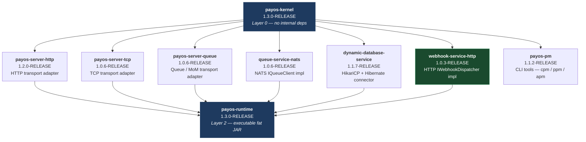

# PayOS Runtime — Build Guide

This guide explains how to build the full PayOS runtime from source, respecting the inter-module dependency order.

---

## Prerequisites

| Tool | Minimum version | Notes |
|---|---|---|
| JDK | 21 | `JAVA_HOME` must point to a JDK 21+ installation |
| Maven | 3.9 | `mvn --version` must resolve to 3.9+ |
| Local Maven repository | `~/.m2` | Modules are installed there during build; no remote repository needed for a full local build |

---

## Dependency Graph

Modules share `payos-parent` and `payos-core-bom`, but each module is built independently from its own Maven project. The dependency graph has **three layers**:



---

## Build Order

### Step 1 — Layer 0: `payos-kernel`

```bash
cd payos
mvn -q -DskipTests install
```

Produces: `~/.m2/repository/ma/s2m/payos/payos-kernel/1.3.0-RELEASE/payos-kernel-1.3.0-RELEASE.jar`

---

### Step 2 — Layer 1: connectors and transport servers

All Layer 1 modules depend only on `payos-kernel`. They can be built **in any order**, or in parallel if your shell supports it.

#### `payos-server-http` — HTTP transport adapter

```bash
cd ../payos-server-http
mvn -q -DskipTests install
```

#### `payos-server-tcp` — TCP transport adapter

```bash
cd ../payos-server-tcp
mvn -q -DskipTests install
```

#### `payos-server-queue` — Queue / MoM transport adapter

```bash
cd ../payos-server-queue
mvn -q -DskipTests install
```

#### `queue-service-nats` — NATS `IQueueClient` implementation

```bash
cd ../queue-service-nats
mvn -q -DskipTests install
```

#### `dynamic-database-service` (folder: `database-service`) — HikariCP + Hibernate connector

```bash
cd ../database-service
mvn -q -DskipTests install
```

#### `webhook-service-http` — HTTP `IWebhookDispatcher` implementation

```bash
cd ../webhook-service-http
mvn -q -DskipTests install
```

#### `payos-pm` — CLI tools (`cpm`, `ppm`, `apm`) — optional

Only needed if you use the PayOS CLI toolchain. Can be skipped for a pure runtime build.

```bash
cd ../payos-pm
mvn -q -DskipTests package
chmod +x ./install-payos-tools.sh
./install-payos-tools.sh # Used to copy cpm, apm and ppm JARs and associated shell commands in the OS path so that they are accessible everywhere. Tested on powershell only. Not yet tested on linux.
```

Installs `cpm.jar`, `ppm.jar`, and `apm.jar` to `~/.payos/bin/`.

---

### Step 3 — Layer 2: `payos-runtime` (executable fat JAR)

```bash
cd ../payos-runtime
mvn -q -DskipTests package
```

Produces: `payos-runtime/target/payos-runtime-1.3.0-RELEASE.jar`

---

## Full Build — Script (PowerShell)

```powershell
$root = "C:\Projets\DTS\MedTech@Work\Innovation\PayOS"

foreach ($module in @(
    "payos",
    "payos-server-http",
    "payos-server-tcp",
    "payos-server-queue",
    "queue-service-nats",
    "database-service",
    "webhook-service-http"
)) {
    Write-Host "--- Building $module ---"
    mvn -q -DskipTests install -f "$root\$module\pom.xml"
}

Write-Host "--- Packaging package managers (cpm, apm and ppm) ---"
mvn -q -DskipTests package -f "$root\payos-pm\pom.xml"
$root\payos-pm\install-payos-tools.ps1

Write-Host "--- Packaging runtime ---"
mvn -q -DskipTests package -f "$root\payos-runtime\pom.xml"
```

---

## Full Build — Script (Bash / Linux / macOS)

```bash
ROOT="$(dirname "$(pwd)")"   # assumes you are inside one of the module directories

for module in payos payos-server-http payos-server-tcp payos-server-queue \
              queue-service-nats database-service webhook-service-http; do
    echo "--- Building $module ---"
    mvn -q -DskipTests install -f "$ROOT/$module/pom.xml"
done

echo "--- Packaging package managers ---"
mvn -q -DskipTests package -f "$ROOT/payos-pm/pom.xml"
chmod +x $ROOT/payos-pm/install-payos-tools.sh
. $ROOT/payos-pm/install-payos-tools.sh

echo "--- Packaging runtime ---"
mvn -q -DskipTests package -f "$ROOT/payos-runtime/pom.xml"
```

---

## Running the Runtime

### Standard launch

```bash
java -jar payos-runtime/target/payos-runtime-1.3.0-RELEASE.jar
```

### With explicit application bundle

```bash
java -jar payos-runtime/target/payos-runtime-1.3.0-RELEASE.jar --bundle-path /path/to/payos.json
```

---

## Artifact Reference

| Module folder | Maven coordinates | Output artifact | Layer |
|---|---|---|---|
| `payos` | `ma.s2m.payos:payos-kernel:1.3.0-RELEASE` | `payos-kernel-1.3.0-RELEASE.jar` | 0 |
| `payos-server-http` | `ma.s2m.payos:payos-server-http:1.2.0-RELEASE` | `payos-server-http-1.2.0-RELEASE.jar` | 1 |
| `payos-server-tcp` | `ma.s2m.payos:payos-server-tcp:1.0.6-RELEASE` | `payos-server-tcp-1.0.6-RELEASE.jar` | 1 |
| `payos-server-queue` | `ma.s2m.payos:payos-server-queue:1.0.6-RELEASE` | `payos-server-queue-1.0.6-RELEASE.jar` | 1 |
| `queue-service-nats` | `ma.s2m.payos:queue-service-nats:1.0.6-RELEASE` | `queue-service-nats-1.0.6-RELEASE.jar` | 1 |
| `database-service` | `ma.s2m:dynamic-database-service:1.1.7-RELEASE` | `dynamic-database-service-1.1.7-RELEASE.jar` | 1 |
| `webhook-service-http` | `ma.s2m.payos:webhook-service-http:1.0.3-RELEASE` | `webhook-service-http-1.0.3-RELEASE.jar` | 1 |
| `payos-pm` | `ma.s2m.payos:payos-pm:1.1.2-RELEASE` | `cpm.jar`, `ppm.jar`, `apm.jar` | 1 |
| `payos-runtime` | `ma.s2m.payos:payos-runtime:1.3.0-RELEASE` | `payos-runtime-1.3.0-RELEASE.jar` | 2 |
