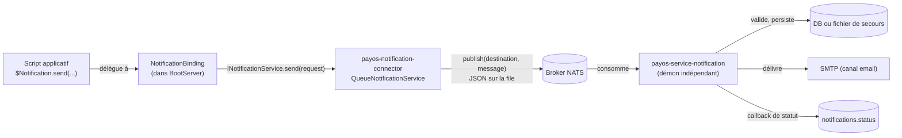

# Guide développeur — Service de notification (de A à Z)

Ce guide couvre le service de notification PayOS de bout en bout pour un développeur : configuration, démarrage local, et utilisation depuis un script applicatif via le binding `$Notification`. Il consolide en un seul parcours ce qui est autrement réparti entre [configuration/notification-service.md](../configuration/notification-service.md) (référence de configuration du connecteur), [operations/notification-service.md](../operations/notification-service.md) (référence opérateur du démon), et [scripting-bindings.md](scripting-bindings.md) (index de tous les bindings `$`) — ces trois pages restent les références détaillées pour chaque sujet ; ce guide en est le fil conducteur pratique.

## 1. Vue d'ensemble — deux composants distincts

Le service de notification est composé de **deux processus indépendants** qui communiquent via une file de messages (NATS par défaut) :



- **Le connecteur** (`payos-notification-connector`) tourne **dans** `BootServer`/`payos-runtime`, aux côtés de vos scripts. Il expose le binding `$Notification` et **publie** les demandes de notification sur la file — il ne les délivre jamais lui-même.
- **Le démon** (`payos-service-notification`) est un **processus séparé**, avec son propre `main()`, sans surface HTTP. Il **consomme** les demandes publiées par le connecteur, les valide, les persiste, puis les délivre (email dans le MVP actuel), avec retry et publication d'un callback de statut en fin de traitement.

Ces deux composants sont configurés indépendamment et doivent être démarrés séparément — voir §3 et §4.

## 2. Prérequis

| Outil | Version / note |
| --- | --- |
| JDK | 21 |
| Maven | 3.9+ |
| Broker NATS | Externe, non fourni par ce workspace — voir [architecture/queue-architecture.md](../architecture/queue-architecture.md). Un `nats-server` local ou `docker run -p 4222:4222 nats` suffit en développement. |
| Serveur SMTP (optionnel en dev) | Le démon a un défaut `localhost:25` ; en local, un relais de test type MailHog/Mailpit sur ce port est suffisant pour visualiser les emails sans SMTP réel. |

## 3. Configurer le connecteur (côté `BootServer`)

Ajoutez le bloc `notification-service` dans le `bootstrap.json` de votre bundle :

```json
{
  "notification-service": {
    "configuration": {
      "type": "nats",
      "host": "localhost",
      "port": 4222,
      "destination": "notifications.inbound"
    }
  }
}
```

| Clé | Défaut | Rôle |
| --- | --- | --- |
| `type` | — | Type de connecteur queue sous-jacent (`nats`), résolu via `IQueueClientFactory`. |
| `host` | `localhost` | Hôte du broker utilisé par **cette** connexion, indépendante de celle de `$Queue`. |
| `port` | `4222` | Port du broker. |
| `destination` | `notifications.inbound` | Destination de publication utilisée par `$Notification.send(...)`. **Doit correspondre** à ce que le démon consomme — voir l'avertissement §4.3. |

Sans ce bloc, ou si aucun connecteur `INotificationServiceFactory` n'est présent sur le classpath, `$Notification` est simplement absent des scripts (voir §6.2) — aucune erreur de démarrage n'est levée.

### 3.1 Le connecteur doit être sur le classpath

Si vous lancez le JAR shadé `payos-runtime`, `payos-notification-connector` y est **déjà inclus** (voir [build-and-release/module-map.md](../build-and-release/module-map.md)) : rien à faire de plus. Si vous lancez le noyau `payos` seul (hors du fat-jar `payos-runtime`), placez `payos-notification-connector-<version>.jar` dans le `connectors-dir` configuré — voir [configuration/extensions-connectors.md](../configuration/extensions-connectors.md).

## 4. Configurer et démarrer le démon (`payos-service-notification`)

Le démon est un module Maven séparé, à builder et lancer indépendamment de `payos-runtime`.

### 4.1 Build

```bash
cd payos-service-notification
mvn clean package
```

Produit `target/payos-service-notification-<version>.jar` (main class `ma.s2m.payos.notification.NotificationDaemon`).

### 4.2 Démarrage local minimal

```bash
java -jar payos-service-notification-<version>.jar
```

Sans configuration, le démon démarre avec des défauts locaux : NATS sur `localhost:4222`, une base H2 en mémoire, et `localhost:25` pour le SMTP — pratique pour un test rapide, à ne jamais utiliser en production. Toutes les clés de configuration (broker, base de données, SMTP, retry, callback de statut) sont détaillées dans [operations/notification-service.md](../operations/notification-service.md) — ce guide n'en reprend que l'essentiel pour un premier démarrage.

Configuration minimale recommandée même en local, via variables d'environnement :

```bash
export NOTIFICATION_QUEUE_HOST=localhost
export NOTIFICATION_QUEUE_PORT=4222
export NOTIFICATION_QUEUE_DESTINATION=notifications.inbound
java -jar payos-service-notification-<version>.jar
```

### 4.3 ⚠️ Piège : la destination par défaut ne correspond pas entre les deux côtés

Les valeurs par défaut du connecteur et du démon **ne pointent pas vers la même destination** si vous ne configurez rien explicitement :

| Côté | Clé | Défaut |
| --- | --- | --- |
| Connecteur (`bootstrap.json`) | `notification-service.configuration.destination` | `notifications.inbound` |
| Démon (env var) | `NOTIFICATION_QUEUE_DESTINATION` | `notifications` |

Si vous laissez les deux à leur défaut, le démon ne recevra **jamais** les messages publiés par `$Notification.send(...)`, sans erreur visible d'aucun côté (le connecteur publie avec succès, personne ne consomme). Alignez toujours explicitement les deux valeurs — l'exemple `notifications.inbound` utilisé dans ce guide fonctionne des deux côtés si vous reprenez également `NOTIFICATION_QUEUE_DESTINATION=notifications.inbound` pour le démon.

## 5. Démarrage complet en local — récapitulatif

1. Démarrer un broker NATS local (`nats-server` ou conteneur Docker), port `4222`.
2. Configurer `bootstrap.json` de votre bundle avec le bloc `notification-service` du §3, `destination: "notifications.inbound"`.
3. Builder et lancer `payos-runtime` avec ce bundle (voir [getting-started.md](getting-started.md)) — le connecteur se connecte au démarrage.
4. Builder `payos-service-notification` (§4.1) et le lancer avec `NOTIFICATION_QUEUE_DESTINATION=notifications.inbound` (et éventuellement un relais SMTP local sur `localhost:25`).
5. Appeler un script qui utilise `$Notification.send(...)` (§7) et observer les logs du démon — il doit journaliser la réception, la validation, puis la tentative de livraison.

## 6. Le binding `$Notification`

`$Notification` est injecté dans le contexte du script **seulement si** un `INotificationServiceFactory` a été résolu au démarrage **et** que le bloc `notification-service` est présent dans `bootstrap.json` (les deux conditions du §3). Il expose une **seule** méthode :

```javascript
var result = $Notification.send(content, recipient, channel);
```

| Paramètre | Type | Description |
| --- | --- | --- |
| `content` | string | Corps du message. |
| `recipient` | string | Adresse de destination (email, numéro, selon le canal). |
| `channel` | string | Canal de livraison — **seul `"email"` est effectivement délivré aujourd'hui**, voir §8. |

`send(...)` est **synchrone** : l'appel bloque jusqu'à ce que la publication sur la file soit acquittée par le broker, puis retourne un objet avec deux champs :

| Champ | Description |
| --- | --- |
| `messageId` | Identifiant généré automatiquement (UUID) pour cette notification — vous n'en fournissez pas vous-même, et il n'y a pas d'overload permettant d'en imposer un. |
| `brokerMessageId` | Identifiant/handle propre au broker de la publication sous-jacente. |

Le `tenantId` n'est **pas** un paramètre de `send(...)` : il est lié automatiquement au tenant courant de la requête (celui déjà porté par `$Tenant`), exactement comme les autres bindings tenant-aware.

### 6.1 Exemple complet dans un script

```javascript
function execute(request, controlData) {
    try {
        var result = $Notification.send(
            "Votre paiement de 100 MAD a été reçu",
            "client@example.com",
            "email"
        );
        return $Response;
    } catch (e) {
        // send() peut lever une exception (ex : file indisponible) — ne jamais laisser
        // remonter une erreur de notification comme un échec de la requête métier elle-même
        // si la notification est secondaire au flux principal.
        $Response.setStatusCode(200);
        return { warning: "notification non envoyée: " + e };
    }
}
```

### 6.2 `$Notification` absent

Si le connecteur n'a pas pu être résolu (JAR absent du classpath) ou si `bootstrap.json` ne déclare pas `notification-service`, `$Notification` n'existe simplement pas dans le contexte du script — pas d'exception au démarrage, juste un binding manquant. Vérifiez sa présence avant de l'utiliser dans du code partagé entre bundles :

```javascript
if (typeof $Notification !== "undefined") {
    $Notification.send(content, recipient, "email");
}
```

## 7. Canaux supportés — email seul dans le MVP actuel

Le modèle `NotificationRequest` (côté connecteur) accepte n'importe quelle chaîne comme `channel`, y compris `"sms"` — l'appel `$Notification.send(...)` avec `"sms"` **compile et publie sans erreur**. Mais le démon rejette silencieusement tout canal hors de la liste `SUPPORTED_CHANNELS = {"email"}` : le message est journalisé en `WARN` (`"unrecognized channel: sms"`), acquitté sur la file, et **jamais persisté ni délivré**. Il n'y a aujourd'hui aucun adaptateur de canal autre qu'email dans `payos-service-notification`. N'utilisez que `"email"` tant qu'un autre canal n'a pas été implémenté côté démon.

Un champ `fallbackChannels` existe dans l'API (`NotificationRequest`) mais n'est exposé par aucun overload de `$Notification.send(...)` aujourd'hui — il n'est donc pas utilisable depuis un script sans passer par l'API Java directement.

## 8. Cycle de vie complet d'une notification

1. Le script appelle `$Notification.send(content, recipient, "email")`.
2. `NotificationBinding` génère un `messageId` (UUID), construit un `NotificationRequest` avec le `tenantId` courant, et appelle `INotificationService.send(request)`.
3. `QueueNotificationService` valide les champs requis (`messageId`, `tenantId`, `content`, `recipient`, `channel`), sérialise la requête en JSON, et la publie sur la `destination` configurée.
4. Le démon (`NotificationQueueConsumer`) consomme le message, le valide à nouveau (`MessageValidator` : mêmes champs requis, plus `schemaVersion == "1.0"` et `channel` dans la liste supportée) — un message invalide est acquitté et abandonné sans persistance, sans retry.
5. Un message valide est persisté (base de données par défaut ; bascule automatique vers un stockage fichier si la base est indisponible au démarrage — voir [operations/notification-service.md §Filesystem storage fallback](../operations/notification-service.md#filesystem-storage-fallback)).
6. Le canal email tente la livraison via SMTP, avec retry et backoff exponentiel selon `NOTIFICATION_RETRY_MAX_ATTEMPTS`/`NOTIFICATION_RETRY_INITIAL_BACKOFF_SECONDS`.
7. À l'issue (succès `delivered` ou échec terminal `failed`), le démon publie **exactement un** callback de statut sur la destination fixe `notifications.status` (§9).

## 9. Recevoir le statut de livraison

Il n'existe **aucun binding dédié** pour recevoir le callback de statut — ni sur `$Notification`, ni ailleurs. Un développeur qui veut réagir à la livraison (mise à jour d'un statut métier, notification secondaire, etc.) doit **s'abonner lui-même** à la destination `notifications.status` via `$Queue`, et filtrer côté application par `tenantId`/`messageId` (voir [queue-messaging.md](queue-messaging.md) pour l'API `$Queue.subscribe(...)`).

Forme du message reçu :

```json
{
  "messageId": "msg-1",
  "tenantId": "tenant-a",
  "status": "delivered",
  "channel": "email",
  "attemptHistory": [
    { "channel": "email", "outcome": "failed", "timestamp": "2026-06-24T10:00:00Z" },
    { "channel": "email", "outcome": "delivered", "timestamp": "2026-06-24T10:00:05Z" }
  ]
}
```

Cette destination est unique et partagée par tous les publishers/tenants — il n'y a pas de destination de callback par tenant ou par application dans le MVP actuel ; le filtrage est entièrement à la charge du consommateur.

## 10. Dépannage

| Symptôme | Cause probable | Action |
| --- | --- | --- |
| `$Notification` est `undefined` dans le script | Bloc `notification-service` absent de `bootstrap.json`, ou connecteur absent du classpath | Vérifier §3 et §3.1 ; vérifier les logs de démarrage de `BootServer` pour un message indiquant qu'aucun `INotificationServiceFactory` n'a été trouvé. |
| Le démon ne reçoit jamais rien alors que `send(...)` retourne un `messageId` | Destination différente entre connecteur et démon | Vérifier §4.3 — c'est la cause la plus fréquente. |
| Le démon journalise `unrecognized channel` et rien ne se passe ensuite | Canal envoyé différent de `"email"` | N'utiliser que `"email"` (§7). |
| Le message est reçu mais jamais persisté/livré, avec un `WARN` de validation | Champ requis manquant ou `schemaVersion` incorrect | Ces cas ne devraient pas se produire via `$Notification.send(...)` (le binding remplit tous les champs requis) — un `schemaVersion` incorrect indiquerait un connecteur d'une version incompatible avec le démon. |
| Erreur `send()` levée depuis le script | Broker NATS injoignable au moment de l'appel (le publish est synchrone) | Vérifier la connectivité au broker configuré en §3 ; encapsuler l'appel dans un `try/catch` si la notification ne doit pas faire échouer la requête métier (§6.1). |

## 11. Multi-tenance

`tenantId` est un champ obligatoire sur chaque notification publiée — le démon ne l'infère jamais d'une connexion ou d'un identifiant partagé. Côté script, ce champ est rempli automatiquement par `NotificationBinding` à partir du tenant courant : vous n'avez rien à faire de spécifique pour que l'isolation multi-tenant soit respectée en écriture. L'isolation des données persistées (base ou fichier de secours) est documentée dans [operations/notification-service.md §Multi-tenancy](../operations/notification-service.md#multi-tenancy).

## 12. Références

- [configuration/notification-service.md](../configuration/notification-service.md) — référence complète de la configuration côté connecteur (`bootstrap.json`).
- [operations/notification-service.md](../operations/notification-service.md) — référence complète de la configuration et de l'exploitation du démon.
- [scripting-bindings.md](scripting-bindings.md) — index de tous les bindings `$`, y compris `$Notification` et `$Queue`.
- [queue-messaging.md](queue-messaging.md) — utilisation de `$Queue`, nécessaire pour s'abonner au callback de statut (§9).
