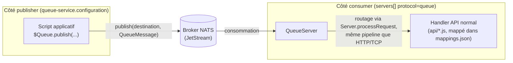

# Guide développeur — Queues PayOS : configurer et utiliser publisher et consumer (de A à Z)

Ce guide couvre la messagerie par file (queue) PayOS de bout en bout pour un développeur : configuration du côté **publisher** (publier des messages depuis un script via `$Queue`) et du côté **consumer** (recevoir des messages via le transport `queue` et les traiter comme une requête normale), avec un exemple complet pour chaque côté. Il consolide en un seul parcours ce qui est autrement réparti entre [architecture/queue-architecture.md](../architecture/queue-architecture.md) (architecture interne, deux instances `NatsQueueClient` distinctes, traces de code), [configuration/queue-service.md](../configuration/queue-service.md) et [configuration/servers.md](../configuration/servers.md) (référence de configuration), et [queue-messaging.md](queue-messaging.md) (référence de l'API `$Queue`) — ces pages restent les références détaillées ; ce guide en est le fil conducteur pratique.

## 1. Vue d'ensemble — deux rôles indépendants

Publier et consommer sont **deux configurations séparées**, chacune optionnelle, qui peuvent être activées seules ou ensemble sur une même instance `payos-runtime` :



- **Publier** (§3) : activé par le bloc de configuration `queue-service`, qui enregistre un `IQueueClient` exposé aux scripts comme `$Queue`. Un script publie explicitement un message ; personne n'écoute une réponse synchrone.
- **Consommer** (§4) : activé par une entrée `protocol: "queue"` dans `servers[]`. `QueueServer` transforme chaque message reçu en `Request` canonique et le fait passer par **le même pipeline** que les requêtes HTTP/TCP (`Server.processRequest`) — vous écrivez un handler d'API normal, pas un script « consumer » à part.
- Ces deux configurations utilisent deux connexions `NatsQueueClient` **distinctes**, même au sein du même process — voir le piège classique en §6.1.

Un exemple complet déjà en production combinant les deux côtés (un connecteur publisher dans `payos-runtime`, un démon consumer séparé) est documenté dans [notification-service-guide.md](notification-service-guide.md) ; ce guide-ci reste générique et ne présuppose pas ce cas précis.

## 2. Prérequis

| Outil | Version / note |
| --- | --- |
| JDK | 21 |
| Maven | 3.9+ |
| Broker NATS avec JetStream activé | Externe, non fourni par ce workspace. `nats-server -js` en local, ou `docker run -p 4222:4222 nats -js`. **Le flag `-js` est requis** : le transport « destination-based » (`publish(destination, ...)` / `subscribe(destination, ...)`) repose sur JetStream, dont le stream sous-jacent est créé automatiquement au premier `publish`/`subscribe` sur une destination — mais uniquement si JetStream est activé côté serveur. |
| Connecteur `queue-service-nats` | Déjà inclus dans le JAR shadé `payos-runtime` (dépendance directe de son `pom.xml`) — rien à installer pour un build standard. Voir [configuration/extensions-connectors.md](../configuration/extensions-connectors.md) si vous lancez le noyau `payos` seul, hors du fat-jar. |

## 3. Configurer et utiliser le côté publisher

### 3.1 Configuration

Ajoutez le bloc `queue-service` dans le `bootstrap.json` de votre bundle :

```json
{
  "queue-service": {
    "configuration": {
      "enabled": true,
      "name": "primary",
      "type": "nats",
      "host": "localhost",
      "port": 4222,
      "publisher-topic": "payos.events"
    }
  }
}
```

| Clé | Défaut | Rôle |
| --- | --- | --- |
| `enabled` | `false` | Doit être `true` pour que le client soit initialisé au démarrage. |
| `type` | — | Type de connecteur (`nats`), résolu via `IQueueClientFactory`/`ServiceLoader`. |
| `host` | — | Hôte du broker. **Obligatoire** — son absence lève une `IllegalStateException` au démarrage. |
| `port` | — | Port du broker. **Obligatoire** au même titre que `host`. |
| `publisher-topic` | — | Sujet legacy fixé à la connexion, utilisé par `publish(message)`/`publish(message, replyTopic)`. **Obligatoire** même si vous n'utilisez que l'API broker-agnostique par destination — son absence lève aussi une `IllegalStateException`. |

Sans ce bloc (ou avec `enabled: false`), `$Queue` est simplement absent des scripts — aucune erreur de démarrage n'est levée dans ce cas.

### 3.2 Publier un message

Deux familles d'API coexistent sur `$Queue` (voir [queue-messaging.md](queue-messaging.md) pour la référence complète) :

```javascript
function execute(request, controlData) {
    var event = {
        type: "order-created",
        orderId: controlData.orderId,
        tenant: $Tenant,
        correlationId: $Request.getContextData().get("correlationId")
    };

    // API broker-agnostique par destination — celle à privilégier : cible une destination
    // explicite, indépendante du sujet fixé à la connexion, et retourne un MessageHandle.
    var message = new (Java.type("ma.s2m.payos.queue.QueueMessage"))(
        controlData.orderId, JSON.stringify(event), {}, "orders-created");
    $Queue.publish("orders-created", message);

    return { orderId: controlData.orderId, status: "queued" };
}

function loadControlData(request) {
    var body = request.getJsonBody();
    return { orderId: body.orderId };
}

function emitInsight(request, response, payload) { return null; }
```

- `publish(destination, QueueMessage)` est **asynchrone du point de vue métier** (aucune réponse du consommateur n'est attendue) mais l'appel lui-même bloque jusqu'à l'acquittement de la publication par le broker.
- Toujours propager `tenantId`/`correlationId` dans le payload publié — un consommateur asynchrone n'a aucun autre moyen de les retrouver (voir [operations/observability.md](../operations/observability.md)).
- `publish(message)` (un seul argument, sujet legacy) reste disponible pour des usages plus simples, mais ne permet pas de cibler une destination arbitraire — préférez la forme par destination pour tout nouveau code.

### 3.3 Publier un message consommé par un `payos-server-queue` (QueueServer)

L'exemple du §3.2 publie un événement métier arbitraire (`{type, orderId, tenant, correlationId}`) — un payload dont la forme est entièrement libre, **à condition que le consommateur sache le désérialiser lui-même** (un autre `IQueueClient.subscribe(...)` côté Java, un système tiers, etc.).

Si en revanche la destination que vous ciblez est consommée par un `payos-server-queue` (une entrée `protocol: "queue"` dans `servers[]`, §4), le payload **doit** être l'enveloppe JSON décrite en [§4.2](#42-ce-qui-arrive-quand-un-message-est-reçu) — `method`/`type`/`path`/`appId`/`body`/`headers`/`parameters`/`tenantId`/`correlationId` — et rien d'autre : `QueueServer.parseRequest(...)` désérialise strictement cette forme pour reconstruire un `Request` canonique et router le message vers un handler d'API, exactement comme pour une requête HTTP entrante. Un payload métier brut (comme celui du §3.2) ferait échouer ce parsing (`IllegalArgumentException: Invalid queue request payload`, voir §6).

Exemple : publier vers la destination `orders.created`, consommée par le handler `/orders/on-created` du §4.3 :

```javascript
function loadControlData(request) {
    var body = request.getJsonBody();
    return { orderId: body.orderId, amount: body.amount };
}

function execute(request, controlData) {
    var envelope = {
        method: "POST",
        type: "api",
        path: "/orders/on-created",         // doit correspondre à un chemin mappé côté consumer
        appId: "orders",                     // préférez le fournir explicitement (voir §4.2)
        body: JSON.stringify({ orderId: controlData.orderId, amount: controlData.amount }),
        headers: { "Content-Type": "application/json" },
        tenantId: $Tenant,
        correlationId: $Request.getContextData().get("correlationId")
    };

    var message = new (Java.type("ma.s2m.payos.queue.QueueMessage"))(
        controlData.orderId, JSON.stringify(envelope), {}, "orders.created");
    $Queue.publish("orders.created", message);

    return { orderId: controlData.orderId, status: "queued" };
}

function emitInsight(request, response, payload) { return null; }
```

Notez que c'est le **payload JSON** (`envelope`) qui porte `method`/`path`/`appId`/etc. — pas les métadonnées du `QueueMessage` (4ᵉ position du constructeur, réservées à des clés techniques comme `replyTo`, voir §4.4).

## 4. Configurer et utiliser le côté consumer

### 4.1 Configuration

Ajoutez une entrée `protocol: "queue"` dans `servers[]` du `bootstrap.json` :

```json
{
  "servers": [
    { "protocol": "queue", "host": "localhost", "port": 4222,
      "type": "nats", "consumer-topic": "orders.created" }
  ]
}
```

| Clé | Rôle |
| --- | --- |
| `type` | Type de connecteur queue (`nats`), résolu via `IQueueClientFactory`. |
| `consumer-topic` | Destination(s) consommée(s). Accepte **une chaîne unique ou une liste** (`["orders.created", "orders.updated"]`) — dans ce dernier cas, un seul listener est abonné à toutes les destinations, et `QueueMessage.getDestination()` permet de savoir laquelle a livré un message donné. Par défaut `default-topic` si absent. |

Cette entrée démarre une instance `QueueServer` **indépendante** du client publisher du §3 — même broker, connexion et sujet différents.

### 4.2 Ce qui arrive quand un message est reçu

`QueueServer` attend un **envelope JSON**, pas un payload métier brut :

```json
{
  "method": "POST",
  "type": "api",
  "path": "/orders/on-created",
  "appId": "orders",
  "body": "{\"orderId\":\"o-123\",\"amount\":42.5}",
  "headers": { "Content-Type": "application/json" },
  "parameters": {},
  "tenantId": "tenant-a",
  "correlationId": "corr-abc"
}
```

| Champ | Défaut si absent | Note |
| --- | --- | --- |
| `method` | `POST` | |
| `type` | `api` | Insensible à la casse (`API`/`api`). |
| `path` | `/` | Doit correspondre à un chemin mappé dans `mappings.json` de l'application ciblée, exactement comme pour une requête HTTP. |
| `appId` | dérivé de `path` | Si absent, extrait du chemin via `Application.getAppIdFromUri(...)` — préférez le fournir explicitement pour éviter toute ambiguïté. |
| `tenantId` | — | Repris depuis le header `X-Tenant-Id` si absent du corps de l'envelope. |
| `correlationId` | UUID généré | Repris depuis le header `X-Correlation-Id` si absent. |

Le message est ensuite routé exactement comme une requête HTTP/TCP : `Server.processRequest` résout `appId` + `path` + `method`, exécute le handler d'API correspondant, puis (si une réponse est attendue, voir §4.4) sérialise le `Response` retourné.

### 4.3 Écrire le handler

Aucun script « spécial consumer » n'existe : déclarez et écrivez un handler d'API tout à fait normal.

```json
// apps/orders/config/mappings.json
{
  "mappings": {
    "api": {
      "/orders/on-created": {
        "POST": { "handler": "orders/on-created" }
      }
    }
  }
}
```

```javascript
// apps/orders/api/orders/on-created.js
function loadControlData(request) {
    return { body: request.getJsonBody() };
}

function execute(request, controlData) {
    $Logger.info("order received from queue: " + controlData.body.orderId);
    // ... traitement métier (persistance, appel $Api, etc.) ...
    $Response.setStatusCode(200);
    return { received: true };
}

function emitInsight(request, response, payload) { return null; }
```

> ⚠️ **Ne déclarez pas `roles` sur ce mapping.** Le transport queue ne porte aucun cookie de session OIDC — `SecurityServiceFactory`/`$Principal` n'ont rien à authentifier. Un mapping avec des `roles` non vides renverra systématiquement un échec d'authentification pour tout message reçu par la queue, exactement comme une requête HTTP sans session valide. Réservez les endpoints protégés par rôle au transport HTTP, ou dupliquez la logique métier dans un handler séparé, non protégé, dédié à la queue.

### 4.4 Réponse et pattern requête/réponse (optionnel)

Si le message entrant porte une métadonnée `replyTo` non vide, `QueueServer` publie automatiquement la réponse du handler (sérialisée en JSON : `statusCode`, `message`, `body`, `headers`, `tenantId`, `correlationId`) sur ce sujet, via `publish(replyTo, ...)`. Ce n'est **pas** calculé — c'est à l'émetteur de la définir explicitement dans les métadonnées du `QueueMessage` publié :

```javascript
var message = new (Java.type("ma.s2m.payos.queue.QueueMessage"))(
    controlData.orderId, JSON.stringify(envelope),
    { "replyTo": "orders.created.replies" }, "orders.created");
$Queue.publish("orders.created", message);
```

> ⚠️ **`$Queue.subscribe(...)` n'existe plus — ce n'est pas qu'une question de style, c'est structurel.** Une version antérieure de ce guide montrait un script s'abonnant lui-même via `$Queue.subscribe(...)` pour récupérer la réponse ; c'était incorrect, pas juste déconseillé, donc `$Queue` (`QueueBinding`, repo `payos`) n'expose plus que `publish(...)`/`isConnected()` — `subscribe(...)`/`connect(...)`/`disconnect()` ne sont plus accessibles depuis un script du tout :
>
> - Rien ne garantit que la fonction JS passée en callback reste utilisable après la fin de l'exécution du script qui l'a créée (aucune borne claire n'existe dans le runtime aujourd'hui : le `Context` GraalVM par requête n'est jamais explicitement fermé, donc plutôt qu'une erreur immédiate à l'appel suivant, ce qui se produirait réellement est une **fuite** — `NatsQueueClient` conserverait le callback indéfiniment dans son `Dispatcher` JetStream pour l'invoquer plus tard, de manière asynchrone, sur un thread NATS, ce qui épinglerait en mémoire tout le `Context` de la requête d'origine pour le reste de la vie du process).
> - L'abonnement JetStream sous-jacent est **durable**, nommé `destination + "-durable"` — un deuxième appel au même endpoint (donc au même script, donc un deuxième `subscribe(...)` sur la même destination) échouerait très probablement côté client NATS, puisqu'on ne peut pas avoir deux push-subscriptions concurrentes sur le même nom durable.
>
> `subscribe(...)` n'a de sens que pour un abonnement **dont la durée de vie est celle du process**, jamais celle d'une seule exécution de script — exactement ce que fait `QueueServer` (§4.1), en Java, une seule fois au démarrage.

**Comment recevoir la réponse correctement : un deuxième `payos-server-queue`.** Recevoir une réponse n'est pas différent de consommer n'importe quel autre message de queue (§4) : il faut qu'un `payos-server-queue` **déjà démarré** soit abonné à la destination de réponse, avec son propre handler d'API normal — pas un abonnement improvisé dans le script émetteur.

```json
{
  "servers": [
    { "protocol": "queue", "host": "localhost", "port": 4222,
      "type": "nats", "consumer-topic": "orders.created" },
    { "protocol": "queue", "host": "localhost", "port": 4222,
      "type": "nats", "consumer-topic": "orders.created.replies" }
  ]
}
```

```json
// apps/orders/config/mappings.json (ajout)
{
  "mappings": {
    "api": {
      "/orders/on-created-reply": {
        "POST": { "handler": "orders/on-created-reply" }
      }
    }
  }
}
```

```javascript
// apps/orders/api/orders/on-created-reply.js
function loadControlData(request) {
    return { body: request.getJsonBody() };
}

function execute(request, controlData) {
    $Logger.info("order-created reply: statusCode=" + controlData.body.statusCode
        + " correlationId=" + controlData.body.correlationId);
    // ... traitement métier (rapprochement par correlationId, mise à jour d'un statut, etc.) ...
    $Response.setStatusCode(200);
    return { received: true };
}

function emitInsight(request, response, payload) { return null; }
```

Cela suppose bien sûr que le payload de la réponse route, lui aussi, vers un chemin mappé (`QueueServer.buildResponseMessage` sérialise `statusCode`/`message`/`body`/`headers`/`tenantId`/`correlationId`, mais pas de champ `path` — le handler ci-dessus doit donc être mappé explicitement sur la destination de réponse, pas déduit du contenu du message).

Ce pattern reste **asynchrone de bout en bout** : le script émetteur ne bloque jamais en attendant la réponse — celle-ci est traitée plus tard, indépendamment, par son propre handler. La plupart des usages restent en « fire-and-forget » (pas de `replyTo`) — n'introduisez ce pattern que si un accusé de traitement métier est réellement nécessaire.

## 5. Démarrage complet en local — récapitulatif

1. Démarrer un broker NATS local avec JetStream (`nats-server -js`, port `4222`).
2. Configurer le bloc `queue-service` du §3.1 dans le bundle qui publie, et l'entrée `servers[]` du §4.1 dans le bundle qui consomme (le même bundle peut faire les deux).
3. Déclarer le mapping et le handler du §4.3 dans l'application ciblée.
4. Lancer `payos-runtime` avec ce bundle (voir [getting-started.md](getting-started.md)) — les deux connexions (publisher et consumer) s'établissent indépendamment au démarrage.
5. Appeler un script qui publie (§3.2) et observer les logs : réception par `QueueServer`, résolution du handler, exécution.

## 6. Dépannage

| Symptôme | Cause probable | Action |
| --- | --- | --- |
| `$Queue` est `undefined` dans le script | Bloc `queue-service` absent ou `enabled: false` | Vérifier §3.1 ; vérifier les logs de démarrage pour un message d'initialisation du client queue. |
| Le message est publié sans erreur mais jamais reçu côté consumer | Publisher et consumer utilisent des destinations différentes, ou (legacy) des sujets différents — ce sont deux connexions `NatsQueueClient` distinctes | Vérifier que `publisher-topic`/la destination utilisée en `publish(...)` correspond exactement à `consumer-topic`. Voir [architecture/queue-architecture.md §1](../architecture/queue-architecture.md#1-le-point-clé-à-retenir) pour le détail de cette confusion classique. |
| Erreur au démarrage `Queue configuration is missing required key 'host'/'port'/'publisher-topic'` | Clé obligatoire absente du bloc `queue-service.configuration` | Compléter la configuration — ces trois clés ne sont **pas** optionnelles malgré l'absence de valeur par défaut affichée ailleurs. |
| `IllegalArgumentException: Invalid queue request payload` côté consumer | Le message reçu n'est pas un JSON valide, ou ne respecte pas l'enveloppe attendue (§4.2) | Vérifier que l'émetteur publie bien l'enveloppe complète (`method`/`type`/`path`/`body`/...), pas un payload métier brut. |
| Le handler renvoie systématiquement un échec d'authentification | Le mapping ciblé déclare `roles` | Retirer `roles` du mapping utilisé par la queue — voir l'avertissement du §4.3. |
| `destinations must not be null or empty` | `consumer-topic` configuré comme liste vide, ou `subscribe(List, ...)` appelé directement avec une liste vide côté script Java | Fournir au moins une destination. |
| `TypeError: $Queue.subscribe is not a function` (ou équivalent) dans un script | `$Queue` (`QueueBinding`) n'expose que `publish(...)`/`isConnected()` — `subscribe(...)` n'est plus accessible depuis un script, volontairement (voir l'avertissement du §4.4) | Déployer un deuxième `payos-server-queue` abonné à la destination concernée, au lieu de tenter un abonnement inline dans le script. |

## 7. Références

- [architecture/queue-architecture.md](../architecture/queue-architecture.md) — architecture interne complète (deux instances `NatsQueueClient`, mécanisme `ServiceLoader`, traces de séquence publish/subscribe, divergences doc/code connues).
- [queue-messaging.md](queue-messaging.md) — référence complète de l'API `$Queue` (`QueueBinding`, publish-only — toutes les surcharges `publish`).
- [configuration/queue-service.md](../configuration/queue-service.md) — référence de configuration du côté publisher.
- [configuration/servers.md](../configuration/servers.md) — référence de configuration du transport `queue` (côté consumer), et des autres transports (`http`, `https`, `tcp`).
- [notification-service-guide.md](notification-service-guide.md) — exemple complet déjà en production combinant les deux côtés (connecteur publisher intégré à `payos-runtime` + démon consumer séparé).
