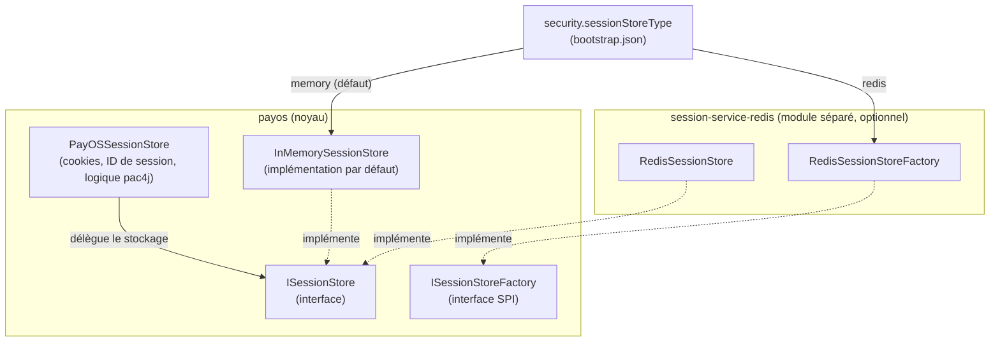

# Conception — store de session distribué (Redis)

> Document de conception pour lever la limitation "sessions OIDC en mémoire, non partagées entre nœuds" identifiée dans [`deployment-topologies.md` §2/§9.1](deployment-topologies.md). Décrit l'abstraction introduite dans le noyau (`payos`) et son implémentation Redis (`session-service-redis`), ainsi que le raisonnement derrière chaque choix. État d'avancement et fichiers concernés en fin de document.

## Objectifs de conception

Le design suit délibérément le même patron que tous les backends pluggables déjà présents dans PayOS (`IQueueClient`/`queue-service-nats`, `ISecretProvider`/`secret-service-filesystem`/`secret-service-vault`, `INotificationService`/`payos-notification-connector`) : une interface étroite dans le noyau, une découverte SPI standard (`ServiceLoader`), et un module séparé par backend concret. Quatre propriétés recherchées explicitement :

- **Ouvert** : n'importe qui peut fournir un backend de session (Redis, Hazelcast, Memcached, une table SQL, etc.) sans modifier le noyau `payos`, en implémentant deux interfaces et en publiant un fichier SPI.
- **Évolutif** : l'interface doit pouvoir grandir plus tard (une méthode de comptage, une capacité de scan, etc.) sans casser les implémentations déjà écrites — via des méthodes `default` plutôt qu'un contrat entièrement figé.
- **Rétrocompatible** : le comportement actuel (en mémoire, zéro configuration) reste le comportement par défaut si rien n'est configuré — aucun déploiement existant ne doit se casser.
- **Cohérent** : mêmes conventions de nommage, de packaging et de câblage que les autres SPI déjà présentes dans le runtime, pour qu'un développeur familier avec `queue-service-nats` reconnaisse immédiatement le patron.

## Vue d'ensemble



`PayOSSessionStore` conserve toute sa logique actuelle (construction des cookies, génération d'ID de session, adaptation pac4j) — seul le stockage brut de la donnée de session est extrait derrière `ISessionStore`.

## L'interface `ISessionStore`

```java
public interface ISessionStore {
    void save(String sessionId, SessionData data, long ttlSeconds) throws SessionStoreException;
    Optional<SessionData> load(String sessionId) throws SessionStoreException;
    void delete(String sessionId) throws SessionStoreException;
    void touch(String sessionId, long ttlSeconds) throws SessionStoreException;
    default long countActive() { return -1; }
}
```

Contrat volontairement étroit : uniquement la persistance de la donnée de session, indexée par identifiant de session. `countActive()` est une méthode `default` retournant `-1` ("non supporté") plutôt qu'abstraite — un choix d'évolutivité délibéré : ajouter une capacité optionnelle à l'interface plus tard n'oblige pas à modifier toutes les implémentations existantes. `touch()` existe séparément de `save()` pour que les backends dotés d'un rafraîchissement de TTL natif et peu coûteux (la commande `EXPIRE` de Redis) n'aient pas à resérialiser toute la donnée juste pour prolonger sa durée de vie. `SessionStoreException` est une exception **non contrôlée** (`RuntimeException`) : `PayOSSessionStore` implémente l'interface pac4j `SessionStore`, dont les méthodes ont une signature figée par la bibliothèque pac4j et ne peuvent pas déclarer de nouvelle exception contrôlée.

`SessionData` devient une classe publique sérialisable en JSON (Jackson) plutôt qu'une classe interne à `PayOSSessionStore` — nécessaire pour qu'un backend externe comme Redis puisse la stocker, avec l'avantage annexe de rester lisible directement dans Redis (`GET` renvoie du JSON humainement lisible, pas un blob binaire opaque).

## La SPI `ISessionStoreFactory`

```java
public interface ISessionStoreFactory {
    boolean supports(String type);
    ISessionStore create(java.util.Map<String, Object> config) throws SessionStoreException;
}
```

Découverte via `ServiceLoader.load(ISessionStoreFactory.class)`, exactement comme `IQueueClientFactory`. La résolution (`SessionStores.resolve(type, config)`) essaie d'abord le type intégré `"memory"` (zéro dépendance externe, vit dans le noyau), puis les factories découvertes par SPI pour tout autre type — si aucune factory ne supporte le type demandé, une erreur explicite est levée plutôt que de retomber silencieusement sur la mémoire (un mauvais `sessionStoreType: "redis"` sans le module Redis sur le classpath doit être visible au démarrage, pas masqué).

## Clé de configuration

`security.sessionStoreType` (nouvelle clé dans `IConfigSpec.Security`), valeur par défaut `"memory"` si absente — aucun changement de comportement pour les déploiements existants qui ne la renseignent pas. Résolution **une seule fois, au premier accès** à `PayOSSessionStore.getInstance()` (initialisation paresseuse classique d'un singleton) — changer ce type à chaud (`ConfigWatcher`) n'est pas câblé dans cette première itération : changer de backend de session est une opération rare qui invalide de toute façon les sessions actives (une bascule mémoire → Redis ou inversement ne peut pas migrer les sessions déjà ouvertes), un redémarrage du processus est donc jugé acceptable pour ce cas précis plutôt que d'ajouter de la complexité de rechargement à chaud pour un scénario rare.

## Module `session-service-redis`

Sibling de `queue-service-nats`/`secret-service-filesystem`, dépendance `payos-kernel` en `provided`, client [Lettuce](https://lettuce.io/) (moderne, thread-safe, supporte nativement le mode cluster Redis si besoin plus tard).

- `RedisSessionStore implements ISessionStore` : `save` → `SET <préfixe><sessionId> <json> EX <ttl>` ; `load` → `GET` + désérialisation Jackson ; `delete` → `DEL` ; `touch` → `EXPIRE` natif (pas de resérialisation).
- `RedisSessionStoreFactory implements ISessionStoreFactory`, enregistrée via `META-INF/services/ma.s2m.payos.security.oidc.session.ISessionStoreFactory`.
- Configuration : un bloc imbriqué `security.sessionStoreRedis` (`host`/`port`/`password`/`database`/`tls`/`keyPrefix`), cohérent avec le style JSON imbriqué déjà utilisé partout ailleurs dans la config PayOS plutôt que des clés à points. **`keyPrefix`** (défaut `payos:session:`) permet de partager plus tard la même instance Redis avec de futurs stores d'idempotence/quotas (voir `deployment-topologies.md` §9.2/§9.3) sans collision de clés, sans provisionner une instance Redis distincte par usage. Détail complet dans [`oidc-configuration-guide.md` §10](../../../../payos-docs/configuration/oidc-configuration-guide.md#10-session-configuration).

## Garde-fou de qualité : test de contrat

`ISessionStoreContractTest` (dans `payos`, exécuté contre `InMemorySessionStore`, et destiné à être réutilisé par `session-service-redis` contre `RedisSessionStore`) vérifie le comportement observable commun à toute implémentation : une donnée sauvegardée est relisible, `load` après `delete` est vide, le TTL est respecté, `touch` prolonge bien la durée de vie. Toute nouvelle implémentation future sait immédiatement si elle respecte le contrat en faisant passer cette même suite.

## État d'avancement

| Étape | Fichier(s) | État |
|---|---|---|
| Clé de config `security.sessionStoreType` | `payos/src/main/java/ma/s2m/payos/config/IConfigSpec.java` | Fait |
| `SessionData` (extraite, sérialisable) | `payos/src/main/java/ma/s2m/payos/security/oidc/session/SessionData.java` | Fait |
| `SessionStoreException` | `payos/src/main/java/ma/s2m/payos/security/oidc/session/SessionStoreException.java` | Fait |
| `ISessionStore` | `payos/src/main/java/ma/s2m/payos/security/oidc/session/ISessionStore.java` | Fait |
| `InMemorySessionStore` | `payos/src/main/java/ma/s2m/payos/security/oidc/session/InMemorySessionStore.java` | Fait |
| `ISessionStoreFactory` + `SessionStores` (résolution SPI) | `payos/src/main/java/ma/s2m/payos/security/oidc/session/` | Fait |
| Refactor `PayOSSessionStore` (délégation à `ISessionStore`) | `payos/src/main/java/ma/s2m/payos/security/oidc/PayOSSessionStore.java` | Fait |
| Test de contrat | `payos/src/test/java/ma/s2m/payos/security/oidc/session/ISessionStoreContractTest.java` | Fait |
| Module `session-service-redis` | `session-service-redis/` (nouveau module) | Fait — `RedisSessionStore`/`RedisSessionStoreFactory`, compile et tests unitaires (Mockito, sans Redis réel requis) au vert |
| Intégration à `payos-runtime` | `payos-runtime/pom.xml` | Fait — dépendance ajoutée, jar shadé reconstruit et vérifié (classes + `META-INF/services/...ISessionStoreFactory` présents dans le jar) |
| Documentation opérateur (`oidc-configuration-guide.md`) | `payos-docs/configuration/oidc-configuration-guide.md` | Fait — §3 et §10 mis à jour, entrée troubleshooting §15 mise à jour |

## Configuration

```json
"security": {
    "sessionStoreType": "redis",
    "sessionStoreRedis": {
        "host": "127.0.0.1",
        "port": 6379,
        "password": "...",
        "database": 0,
        "tls": false,
        "keyPrefix": "payos:session:"
    }
}
```

`sessionStoreType` absent ou égal à `"memory"` conserve le comportement actuel (zéro dépendance externe). Le module `session-service-redis` doit être sur le classpath du runtime (ajouté comme dépendance de `payos-runtime`) pour que le type `"redis"` soit reconnu — sinon `SessionStores.resolve(...)` échoue explicitement au démarrage plutôt que de retomber silencieusement sur la mémoire.

`session-service-redis` est intégré à `payos-runtime` (jar shadé reconstruit et vérifié) et documenté côté opérateur — voir [`oidc-configuration-guide.md` §10](../../../../payos-docs/configuration/oidc-configuration-guide.md#10-session-configuration). Reste à faire, hors scope de cette itération : tests d'intégration contre un vrai Redis (aucune infrastructure Testcontainers n'existe encore dans ce workspace — les tests actuels de `RedisSessionStore` mockent `RedisCommands` et valident les commandes émises, pas le comportement réel d'un serveur Redis).

`deployment-topologies.md` §2/§9.1 a été mis à jour pour refléter que cette limitation est désormais levée.
