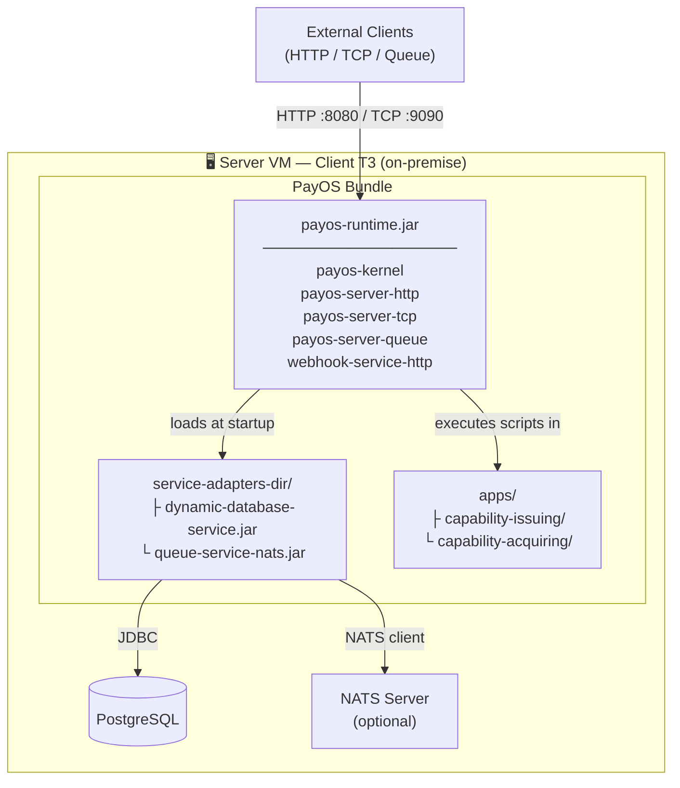
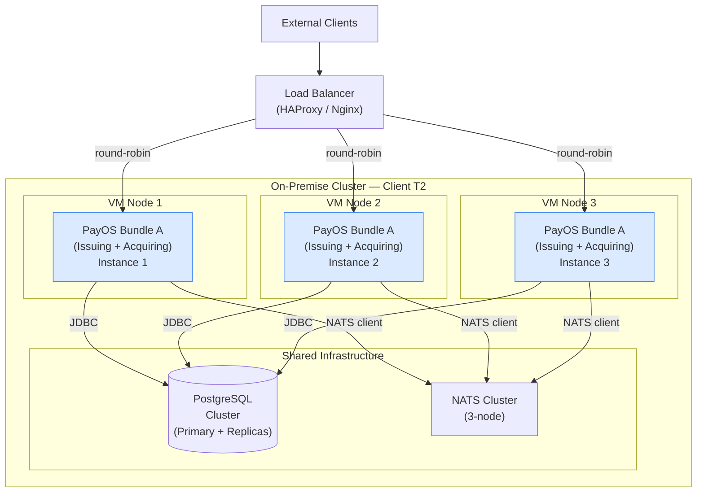
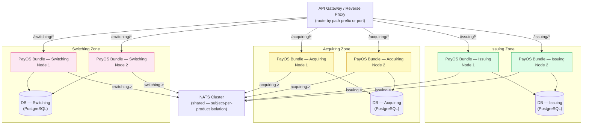
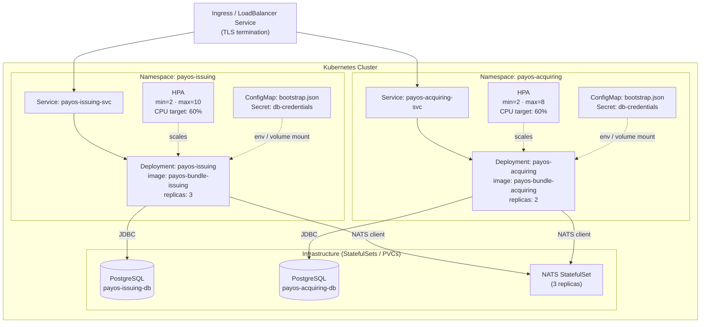
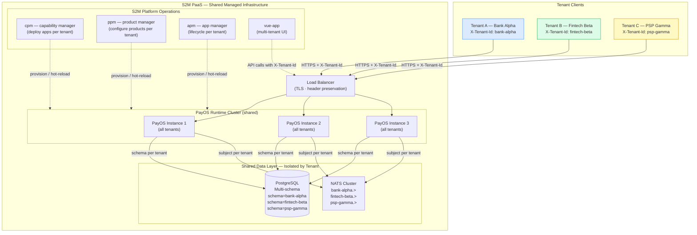

# PayOS Platform - Technology Stack

## Platform Overview

PayOS v2 is a capability-driven payment platform runtime built in Java. It hosts Payment Capabilities as independently deployable Apps, each encapsulating execution, control, and insight planes. The runtime provides kernel-level isolation, pluggable server modules, and managed connectivity toward external systems — enabling payment products to be assembled from reusable capabilities without code duplication.

The stack is governed by a **4 dimensions, 1 core stack** model: one codebase, one core technology baseline, and multiple deployment profiles. The platform adapts to customer constraints; customer constraints must not fork the platform.

Supported deployment profiles are **on-prem**, **public cloud**, and **S2M PaaS / self-managed PaaS**.

---

## Stack Decision Model

The technology stack is not selected only by library preference. Every technical choice must be valid across four simultaneous dimensions.

| Dimension | Scope | Meaning |
|---|---|---|
| **D1. Customer segment / business tier** | T1, T2, T3 | Independent from deployment choice. A T1 customer may run on-prem or cloud; a T3 customer may run on PaaS or self-managed cloud. |
| **D2. Deployment mode / infrastructure model** | On-prem, public cloud, S2M PaaS, self-managed PaaS | Any segment can use any deployment mode. A bank may run production on-prem and pilot tests on PaaS. |
| **D3. Data path / temporal capability** | Hot path < 200 ms, warm path in seconds, cold path in minutes to hours | Latency-based decomposition of the architecture. Hot/warm/cold paths can coexist in every deployment mode. |
| **D4. Technical layer / stack component** | UI, compute, data, observability, messaging, security, tooling | The concrete technology layer being chosen. |

The **core stack** is common across all dimensions. Variation is introduced through protocol modules, connector services, runtime configuration, and packaging profiles rather than through divergent codebases.

---

## Dimension-To-Stack Mapping

| Technical Layer | Core Stack | Hot Path Fit | Warm Path Fit | Cold Path Fit | Deployment Notes |
|---|---|---|---|---|---|
| UI | Plain Vue 3 runtime shell (no build step, `vue3-sfc-loader`) | No hot path role | Workflow screens, asynchronous status views | Reporting/admin views | Part of the UI is hosted on the backend application (asynchronous components), and the static part can be hosted with the runtime or separately depending on customer deployment profile. |
| Compute runtime | Java 21 + payos-kernel + GraalVM JS | API script execution and request dispatch | Queue/message handlers and webhook callbacks | Batch-like application scripts and tools | Same kernel contracts across on-prem, cloud, and PaaS. |
| Transport | Undertow HTTP, TCP server, Queue server | HTTP/TCP synchronous exchange | Queue-backed processing and callbacks | Batch/event ingestion (like POS EOD downloads) | Transport modules adapt communication without changing business scripts. |
| Data | HikariCP + database-service + Hibernate | Business JDBC-backed queries | Transaction state (e.g. authorization → capture → settlement), idempotency (checking DB to see if an event was already handled), reconciliation support | Historical/reporting/demo storage | Real production database choice is deployment-specific; H2 remains demo/test in database-service. |
| Messaging | IQueueClient + queue-service-nats / jnats | no hot-path role mechanism | Main warm-path integration mechanism (Queue consumers receive messages, execute JS scripts, persist state, and may fire webhooks — all within a seconds-scale window) | Batch/event (the queue is used to broadcast a single trigger to multiple consumers for bulk or deferred processing) | Queue implementation is a service adapter and should remain swappable. |
| Security | Nimbus implementation docs + legacy pac4j dependencies | Token validation and principal resolution | Secured async callbacks and hooks | Audit/replay authorization checks (e.g. After a transaction has settled, a compliance or fraud investigation tool needs to verify who was authorized at the time of the operation) | T1 deployments require strongest hardening and tenant isolation controls. |
| Observability | SLF4J + Logback + correlation/tenant metadata (additional metrics should be added later on) | Request tracing, error correlation | Async processing correlation | Batch/audit traceability | Deployment mode decides sink/exporter at deployment time|
| Tooling | payos-pm CLI + Maven packaging | No hot path role | No warm path role | Package/install apps and capabilities, Activate/deactivate capabilities, Build/release/report automation | Supports one codebase across customer and deployment profiles. |

---

## Deployment Profile Reading

| Profile | Typical Constraints | Stack Interpretation |
|---|---|---|
| On-prem | Air-gap, customer-managed infrastructure, strict network/security controls, constrained managed services | Prefer self-contained shaded JARs, explicit configuration, local connectors, operator-managed DB/queue/log sinks. |
| Public cloud | Managed infrastructure available, cloud IAM/secrets/observability possible, elastic capacity | Same runtime and modules, with cloud-managed DB/queue/observability bindings where approved. |
| S2M PaaS / self-managed PaaS | Platform-managed operational baseline, faster provisioning, pilot/productized deployments | Same application model, standardized runtime packaging, managed connector choices, reduced customer-side operations. |

---

## Customer Segment Reading

| Segment | Expected Stack Emphasis |
|---|---|
| T1 | Strongest SLA, PCI/security posture, strongest security compliance, auditability, multi-node readiness, deep observability, strict tenant isolation, explicit operational runbooks. |
| T2 | Balanced resiliency and cost profile; same core runtime with deployment-specific connector and observability choices. |
| T3 | Lower operational burden, more managed defaults, stronger preference for PaaS/self-managed cloud, async/warm/cold processing where latency allows. |

---

## Data Path Reading

| Data Path | Latency Target | Runtime Shape | Relevant Stack Components |
|---|---|---|---|
| Hot path | < 200 ms | Direct request/response, minimal indirection, deterministic error handling | Undertow/TCP, `Server.processRequest`, GraalVM JS, Jackson, security, correlation metadata |
| Warm path | Seconds | Asynchronous or eventually consistent processing | Queue server, `IQueueClient`, queue-service-nats, webhooks, idempotency, correlation propagation |
| Cold path | Minutes to hours | Batch, reporting, reconciliation, delayed processing | Database-service, persistence, reporting jobs/tools, queuing |

---

## Technology Layer Reading

| Layer | Primary Technologies | Design Rule |
|---|---|---|
| UI | Vue 3 (no build step, `vue3-sfc-loader`) | UI is a technical layer, not a separate platform fork. It must consume runtime capabilities through stable contracts. |
| Compute | Java 21, GraalVM JS, kernel/server modules | Keep business execution behind stable kernel and resource APIs. |
| Data | HikariCP, database-service, Hibernate, production DB binding | Keep concrete database choices outside the kernel when possible. |
| Messaging | IQueueClient, queue-service-nats, jnats | Keep MoM implementations as connectors or proxies, not kernel embedded. |
| Security | Nimbus implementation, legacy pac4j dependencies, tenant/correlation metadata | Security scales by segment (How strict the security is varies by customer tier: MFA, OS hardening, audit trail deepness) |
| Observability | SLF4J, Logback, correlation/tenant IDs (other metrics to be added later on) | The logging API is common; sinks/exporters are deployment-profile choices (prometheus, ...). |
| Tooling | Maven, Shade, payos-pm CLI | Tooling exists to preserve one codebase and repeatable packaging. |

---

## Repository Inventory & Stack

### 1. `payos-kernel` — Core Runtime Kernel

| Property | Value |
|---|---|
| **Artifact** | `ma.s2m.payos:payos-kernel:1.8.0-RELEASE` |
| **Language** | Java 21 |
| **Build** | Maven + `maven-shade-plugin:3.5.1` |
| **Entry Point** | `ma.s2m.payos.BootServer` |

**Dependencies:**

| Library | Version | Role |
|---|---|---|
| `org.graalvm.polyglot:polyglot` | 24.1.1 | JS scripting engine host |
| `org.graalvm.polyglot:js` | 24.1.1 | GraalVM JavaScript language |
| `org.graalvm.tools:chromeinspector-tool` | 24.1.1 | GraalVM JavaScript inspector support (runtime scope) |
| `com.fasterxml.jackson.core:jackson-databind` | 2.17.2 | JSON serialization / deserialization |
| `org.glassfish.jersey.core:jersey-common` | 3.1.3 | URI / media-type utilities |
| `org.pac4j:pac4j-core` | 6.0.0 | Authentication framework core |
| `org.pac4j:pac4j-oidc` | 6.0.0 | OIDC / JWT security |
| `com.zaxxer:HikariCP` | 5.1.0 | JDBC connection pool |
| `org.slf4j:slf4j-api` | 2.0.12 | Logging facade |
| `ch.qos.logback:logback-classic` | 1.5.13 | Logging implementation (SLF4J backend) |
| `org.junit.jupiter:junit-jupiter` | 5.10.2 | Test framework (scope: test) |
| `org.assertj:assertj-core` | 3.25.3 | Fluent assertions (scope: test) |

**Build plugins:**

| Plugin | Version |
|---|---|
| `maven-surefire-plugin` | 3.2.5 |
| `maven-shade-plugin` | 3.5.1 |

---

### 2. `payos-server-http` — HTTP Server Module

| Property | Value |
|---|---|
| **Artifact** | `ma.s2m.payos:payos-server-http:1.2.0-RELEASE` |
| **Language** | Java 21 |
| **Build** | Maven |

**Dependencies:**

| Library | Version | Role |
|---|---|---|
| `ma.s2m.payos:payos-kernel` | 1.8.0-RELEASE | Platform kernel contracts |
| `io.undertow:undertow-core` | 2.3.18.Final | Undertow HTTP listener |

**SPI registration:** `HttpServerProvider` implements `ServerProvider` → registered via `META-INF/services`.

---

### 3. `payos-server-tcp` — TCP Server Module

| Property | Value |
|---|---|
| **Artifact** | `ma.s2m.payos:payos-server-tcp:1.0.6-RELEASE` |
| **Language** | Java 21 |
| **Build** | Maven |

**Dependencies:**

| Library | Version | Role |
|---|---|---|
| `ma.s2m.payos:payos-kernel` | 1.8.0-RELEASE | Platform kernel contracts |

**Plugin loading:** `TcpServerProvider` scans a configurable directory (`tcp-handlers-dir`) for JAR files at runtime using `URLClassLoader` + reflection. Implementations of `TcpMessageDecoder`, `TcpMessageEncoder`, and `TcpMessageHandler` are discovered dynamically — **no compile-time dependency on plugin JARs**.

**SPI registration:** `TcpServerProvider` implements `ServerProvider` → registered via `META-INF/services`.

---

### 4. `payos-server-queue` — Queue Server Module

| Property | Value |
|---|---|
| **Artifact** | `ma.s2m.payos:payos-server-queue:1.1.0-RELEASE` |
| **Language** | Java 21 |
| **Build** | Maven |

**Dependencies:**

| Library | Version | Role |
|---|---|---|
| `ma.s2m.payos:payos-kernel` | 1.8.0-RELEASE | Platform kernel contracts |
| `com.fasterxml.jackson.core:jackson-databind` | 2.17.2 | Queue message serialization |

**SPI registration:** `QueueServerProvider` implements `ServerProvider` → registered via `META-INF/services`.

---

### 5. `queue-service-nats` — NATS Queue Connector

| Property | Value |
|---|---|
| **Artifact** | `ma.s2m.payos:queue-service-nats:1.1.0-RELEASE` |
| **Language** | Java 21 |
| **Build** | Maven + `maven-surefire-plugin:3.2.5` |

**Dependencies:**

| Library | Version | Role |
|---|---|---|
| `ma.s2m.payos:payos-kernel` | 1.8.0-RELEASE | Kernel interfaces (scope: provided) |
| `io.nats:jnats` | 2.17.0 | NATS JVM client |
| `org.slf4j:slf4j-api` | 2.0.12 | Logging (scope: provided) |
| `org.junit.jupiter:junit-jupiter` | 5.10.2 | Tests (scope: test) |
| `org.assertj:assertj-core` | 3.25.3 | Assertions (scope: test) |

**SPI registration:** `NatsQueueClientFactory` implements `IQueueClientFactory` → registered via `META-INF/services`.

---

### 6. `webhook-service-http` — HTTP Webhook Dispatcher

| Property | Value |
|---|---|
| **Artifact** | `ma.s2m.payos:webhook-service-http:1.0.4-RELEASE` |
| **Language** | Java 21 |
| **Build** | Maven + `maven-surefire-plugin:3.2.5` |

**Dependencies:**

| Library | Version | Role |
|---|---|---|
| `ma.s2m.payos:payos-kernel` | 1.8.0-RELEASE | Kernel interfaces (scope: provided) |
| `com.fasterxml.jackson.core:jackson-databind` | 2.17.2 | Webhook payload JSON mapping (scope: provided) |
| `org.slf4j:slf4j-api` | 2.0.12 | Logging API (scope: provided) |
| `org.junit.jupiter:junit-jupiter` | 5.10.2 | Tests (scope: test) |
| `org.assertj:assertj-core` | 3.25.3 | Assertions (scope: test) |
| `ch.qos.logback:logback-classic` | 1.5.13 | Test logging backend (scope: test) |

**SPI registration:** HTTP implementation of `IWebhookDispatcher` packaged as a standalone connector for webhook delivery.

---

### 7. `database-service` (`dynamic-database-service`) — Database Connector

| Property | Value |
|---|---|
| **Artifact** | `ma.s2m:dynamic-database-service:1.1.9-RELEASE` |
| **Language** | Java 21 |
| **Build** | Maven + `maven-surefire-plugin:3.2.5`, `exec-maven-plugin:3.3.0` |

**Dependencies:**

| Library | Version | Role |
|---|---|---|
| `ma.s2m.payos:payos-kernel` | 1.8.0-RELEASE | Kernel interfaces (scope: provided) |
| `org.hibernate:hibernate-core` | 5.6.15.Final | ORM — dynamic map entity mode (HBM XML) |
| `com.h2database:h2` | 2.3.232 | H2 embedded DB (scope: test) |
| `org.postgresql:postgresql` | 42.7.3 | PostgreSQL JDBC driver |
| `ch.qos.logback:logback-classic` | 1.5.13 | Logging |
| `com.fasterxml.jackson.core:jackson-databind` | 2.17.2 | JSON mapping |
| `org.junit.jupiter:junit-jupiter` | 5.10.2 | Tests (scope: test) |
| `org.assertj:assertj-core` | 3.25.3 | Assertions (scope: test) |

---

### 8. `payos-runtime` — Assembled Runtime Distribution

| Property | Value |
|---|---|
| **Artifact** | `ma.s2m.payos:payos-runtime:1.8.0-RELEASE` |
| **Language** | Java 21 |
| **Build** | Maven + `maven-shade-plugin:3.5.1` (fat JAR) |
| **Entry Point** | `ma.s2m.payos.BootServer` |

**Assembled modules (all shaded in):**

| Module | Version |
|---|---|
| `payos-kernel` | 1.8.0-RELEASE |
| `payos-server-http` | 1.2.0-RELEASE |
| `payos-server-tcp` | 1.0.6-RELEASE |
| `payos-server-queue` | 1.1.0-RELEASE |
| `webhook-service-http` | 1.0.4-RELEASE |

**Shade transformers:** `ManifestResourceTransformer` (main class), `ServicesResourceTransformer` (merges SPI `META-INF/services` files).

**Connector deployment:** `queue-service-nats` and `dynamic-database-service` will **not** be shaded into the runtime JAR in the future (they are currently). They will be placed as self-contained fat JARs in the operator-configured `service-adapters-dir` directory (resolved from system property `service-adapters-dir`, env var `PAYOS_SERVICE_ADAPTERS_DIR`, or bootstrap setting `service-adapters-dir`). The runtime scans this directory at startup and loads connector implementations via a `URLClassLoader` before initializing the database and queue services.

---

### 9. `payos-pm` — Platform Manager CLI

| Property | Value |
|---|---|
| **Artifact** | `ma.s2m.payos:payos-pm:1.3.0-RELEASE` |
| **Language** | Java 21 |
| **Build** | Maven + `maven-shade-plugin:3.5.1` (produces `cpm.jar`, `ppm.jar`, and `apm.jar`) |
| **Entry Points** | `ma.s2m.payos.pm.cpm.Cpm`, `ma.s2m.payos.pm.ppm.Ppm`, `ma.s2m.payos.pm.apm.Apm` |

**Dependencies:**

| Library | Version | Role |
|---|---|---|
| `ma.s2m.payos:payos-kernel` | 1.8.0-RELEASE | Platform kernel |
| `com.fasterxml.jackson.core:jackson-databind` | 2.17.2 | JSON processing |
| `org.graalvm.polyglot:polyglot` | 24.1.1 | Scripting (re-declared explicitly) |
| `org.graalvm.polyglot:js` | 24.1.1 | GraalVM JS (re-declared explicitly) |
| `org.slf4j:slf4j-api` | 2.0.12 | Logging |
| `info.picocli:picocli` | 4.7.5 | CLI argument parsing |
| `ch.qos.logback:logback-classic` | 1.5.13 | Logging implementation |
| `org.junit.jupiter:junit-jupiter` | 5.10.2 | Tests (scope: test) |
| `org.assertj:assertj-core` | 3.25.3 | Assertions (scope: test) |

---

### 10. `payosv2-packer` — File Encryption Utility

| Property | Value |
|---|---|
| **Artifact** | `ma.s2m:payosv2-packer:1.2.0-RELEASE` |
| **Language** | Java 21 |
| **Build** | Maven (no shade plugin, no extra dependencies) |
| **Crypto** | AES via JCE (ECB/PKCS5Padding), magic header `P8OS` |

### 11. `vue-app` — Frontend Template (PayOS UI)

| Property | Value |
|---|---|
| **Framework** | Plain Vue 3 — no bundler, no build step |
| **Rendering** | Client-side; `.vue` SFCs (`AppRoot`, `AppMenu`, `CustomLink`, `PlayfulCheckbox`) compiled at runtime in the browser by `vue3-sfc-loader` (vendored) |
| **Language** | JavaScript / Vue 3 |
| **Serving** | Any static HTTP server (`npx serve`, `python3 -m http.server`, …) — no dev server |

**Runtime config (`page/app/src/config.js`):**

| Key | Default |
|---|---|
| `appBase` | set to the target application's id |
| `basePath` | `""` (same origin as the page; set only if the frontend is served from a different origin than the PayOS backend) |
| `componentDirectory` | `component` |
| `tenantId` | `""` (resolved per-request — query param, then `sessionStorage`, then `localStorage`) |

**Key modules:** `runtime.js` (fetches pages/components from the backend, evaluates their script via `new Function()`, session via `/me`), `AppRoot.vue`, `AppMenu.vue`, `CustomLink.vue`, `PlayfulCheckbox.vue` — real `.vue` SFCs, compiled in-browser via `vue3-sfc-loader`, never through a bundler. `generate_app.ps1`/`generate_app.sh --template ui` vendors this shell into `payos/templates/vue-ui/` and copies it into generated applications.

---

### 12. `payos-secret-api` — Secret Provider SPI

| Property | Value |
|---|---|
| **Artifact** | `ma.s2m.payos:payos-secret-api:1.0.0-RELEASE` |
| **Language** | Java 21 |
| **Build** | Maven + `maven-surefire-plugin` |

**Dependencies:**

| Library | Version | Role |
|---|---|---|
| `org.slf4j:slf4j-api` | 2.0.12 | Logging facade (scope: provided) |
| `ch.qos.logback:logback-classic` | 1.5.13 | Logging backend (scope: test) |
| `org.junit.jupiter:junit-jupiter` | 5.10.2 | Tests (scope: test) |
| `org.assertj:assertj-core` | 3.25.3 | Assertions (scope: test) |

**Role:** Defines `ISecretProvider`, `ISecretProviderFactory`, and secret model/exception types consumed by all secret provider connectors.

---

### 13. `secret-service-filesystem` — Filesystem Secret Provider

| Property | Value |
|---|---|
| **Artifact** | `ma.s2m.payos:secret-service-filesystem:1.1.0-RELEASE` |
| **Language** | Java 21 |
| **Build** | Maven + `maven-shade-plugin` (produces `spm.jar`) |
| **Entry Point** | `ma.s2m.payos.secret.filesystem.cli.SecretsCli` |

**Dependencies:**

| Library | Version | Role |
|---|---|---|
| `ma.s2m.payos:payos-kernel` | 1.8.0-RELEASE | Kernel interfaces (scope: provided) |
| `ma.s2m.payos:payos-secret-api` | 1.0.0-RELEASE | Secret provider SPI |
| `org.slf4j:slf4j-api` | 2.0.12 | Logging (optional; shaded into `spm.jar`) |
| `info.picocli:picocli` | 4.7.5 | CLI parsing (optional; shaded into `spm.jar`) |
| `ch.qos.logback:logback-classic` | 1.5.13 | Logging backend (optional; shaded into `spm.jar`) |

**Role:** AES-256-GCM file-based `ISecretProvider` implementation; also ships the `spm` CLI.

---

### 14. `secret-service-vault` — HashiCorp Vault Secret Provider

| Property | Value |
|---|---|
| **Artifact** | `ma.s2m.payos:secret-service-vault:1.1.0-RELEASE` |
| **Language** | Java 21 |
| **Build** | Maven + `maven-shade-plugin:3.5.1` |

**Dependencies:**

| Library | Version | Role |
|---|---|---|
| `ma.s2m.payos:payos-kernel` | 1.8.0-RELEASE | Kernel interfaces (scope: provided) |
| `ma.s2m.payos:payos-secret-api` | 1.0.0-RELEASE | Secret provider SPI |
| `com.fasterxml.jackson.core:jackson-databind` | 2.17.2 | JSON processing |
| `org.slf4j:slf4j-api` | 2.0.12 | Logging (optional) |

**Role:** `ISecretProvider` implementation backed by HashiCorp Vault KV v2; shaded directly into `payos-runtime`.

---

### 15. `payos-notification-api` — Notification Publishing SPI

| Property | Value |
|---|---|
| **Artifact** | `ma.s2m.payos:payos-notification-api:1.1.0-RELEASE` |
| **Language** | Java 21 |
| **Build** | Maven + `maven-surefire-plugin` |

**Dependencies:**

| Library | Version | Role |
|---|---|---|
| `org.junit.jupiter:junit-jupiter` | 5.10.2 | Tests (scope: test) |
| `org.assertj:assertj-core` | 3.25.3 | Assertions (scope: test) |

**Role:** Dependency-light notification publishing SPI contract; `payos-runtime` embeds this at `1.0.0-RELEASE` (an explicit pin, not the module's own current version).

---

### 16. `payos-service-notification` — Notification Daemon

| Property | Value |
|---|---|
| **Artifact** | `ma.s2m.payos:payos-service-notification:1.2.0-RELEASE` |
| **Language** | Java 21 |
| **Build** | Maven + `maven-shade-plugin` (standalone daemon jar) |
| **Entry Point** | `ma.s2m.payos.notification.NotificationDaemon` |

**Dependencies:**

| Library | Version | Role |
|---|---|---|
| `ma.s2m.payos:payos-kernel` | 1.8.0-RELEASE | `IQueueClient`/`IDatabaseService` contracts |
| `ma.s2m.payos:queue-service-nats` | 1.1.0-RELEASE | Broker adapter |
| `ma.s2m:dynamic-database-service` | 1.1.7-RELEASE | DB adapter (module-pinned; not yet aligned to `1.1.9-RELEASE`) |
| `org.slf4j:slf4j-api` / `ch.qos.logback:logback-classic` | 2.0.12 / 1.5.13 | Standalone logging (own JVM, not hosted in `payos-runtime`) |
| `org.eclipse.angus:angus-mail` | 2.0.3 | Email channel adapter |

**Role:** Standalone process (own JVM) that consumes queued notification requests and dispatches them across channels.

---

### 17. `connector-sdk` (`payos-connector-sdk`) — Connector SDK Contract

| Property | Value |
|---|---|
| **Artifact** | `ma.s2m.payos:connector-sdk:1.2.0-RELEASE` |
| **Language** | Java 21 |
| **Build** | Maven + `maven-surefire-plugin` |

**Dependencies:**

| Library | Version | Role |
|---|---|---|
| `org.junit.jupiter:junit-jupiter` | 5.10.2 | Tests (scope: test) |
| `org.assertj:assertj-core` | 3.25.3 | Assertions (scope: test) |

**Role:** Connector SDK contract for PayOS external integration plugins; shaded into `payos-runtime`.

---

## Cross-Cutting Technology Summary

| Concern | Technology | Version |
|---|---|---|
| Language (backend) | Java | 21 |
| Build system | Apache Maven | 3.x |
| HTTP server | Undertow | 2.3.18.Final |
| Scripting engine | GraalVM Polyglot (JS) | 24.1.1 |
| JSON | Jackson Databind | 2.17.2 |
| Security / OIDC | pac4j-core + pac4j-oidc | 6.0.0 |
| Connection pooling | HikariCP | 5.1.0 |
| ORM | Hibernate Core | 5.6.15.Final |
| Message broker client | NATS jnats | 2.17.0 |
| Logging API | SLF4J | 2.0.12 |
| Logging impl | Logback Classic | 1.5.13 |
| CLI framework | picocli | 4.7.5 |
| Test framework | JUnit Jupiter | 5.10.2 |
| Assertions | AssertJ | 3.25.3 |
| Test DB | H2 | 2.3.232 |
| Production DB driver | PostgreSQL JDBC | 42.7.3 |
| Frontend framework | Vue 3 (no build step) | `vue3-sfc-loader` for in-browser SFC compilation |
| Frontend language | JavaScript | — |
| Package (fat JAR) | maven-shade-plugin | 3.5.1 |
| SPI merging | ServicesResourceTransformer | (shade plugin built-in) |

---

## Deployment Architecture Scenarios

> **Reading guide — what is a PayOS bundle?**
> A *bundle* is a self-contained runtime unit composed of:
> - `payos-runtime.jar` — the fat JAR (kernel + all server modules shaded in)
> - `service-adapters-dir/` — `dynamic-database-service.jar`, `queue-service-nats.jar` (loaded at startup via `URLClassLoader`)
> - `apps/` — one or more products. Each product is a composition of one or more applications and capabilities ( with HBM models, Pages, Components, JS endpoints / API, ...)
> - one `bootstrap.json`
>
> **Horizontal scaling** → several instances of the *same* bundle behind a load balancer.
> **Product isolation** → several *different* bundles, each embedding a distinct set of capabilities (Issuing, Acquiring, Switching …).

---

### Scenario 1 — Tier 3 · On-Premise · Single VM

Smallest footprint. One node, one bundle, all capabilities co-located. Suitable for SMB / T3 clients running a single payment product.

---

### Scenario 2 — Tier 2 · On-Premise · Horizontal Scaling (same bundle)

Multiple instances of **the same bundle** behind a load balancer. All nodes share the same database cluster. Suitable for T2 clients requiring high availability and throughput on a single product portfolio.

---

### Scenario 3 — Tier 1 · On-Premise · Product Isolation (different bundles)

Each payment product runs in a **dedicated bundle** with its own database and scaling policy. Bundles share only the NATS messaging cluster for inter-product events. Suitable for T1 banks requiring strict product / data boundary isolation.

---

### Scenario 4 — Tier 1 / Tier 2 · Kubernetes · Auto-scaling per product

Each product bundle is a Kubernetes `Deployment` in its own namespace. A `HorizontalPodAutoscaler` scales pods based on CPU/memory. `ConfigMap` and `Secret` inject `bootstrap.json` and credentials at pod startup. Suitable for T1 cloud-native clients or T2 clients using managed Kubernetes (AKS, EKS, GKE, OpenShift).

---

### Scenario 5 — S2M PaaS · Multi-tenant Shared Platform

A single PayOS runtime cluster serves **multiple tenants simultaneously**. Tenant isolation is enforced at the kernel level via the `X-Tenant-Id` header, MDC, .... Each tenant's data lives in a dedicated database, dedicated schema or shared schema depending on configuration. NATS subjects sould be namespaced per tenant. The S2M platform management CLI (`cpm`, `ppm`, `apm`) provisions capabilities and products per tenant without restarting the cluster.

> **Tenant isolation guarantees in PaaS mode:**
> - `X-Tenant-Id` extracted at ingress and injected into every `$DB` query and NATS publish as a mandatory filter.
> - Kernel enforces tenant filter on all read/write HQL queries — bypass is not possible at the scripting layer.
> - `X-Correlation-Id` is generated per request and propagated through all async events for incident tracing.
> - Hot-reload via `ConfigWatcher` — adding a new tenant or deploying a new capability does not require a cluster restart.

