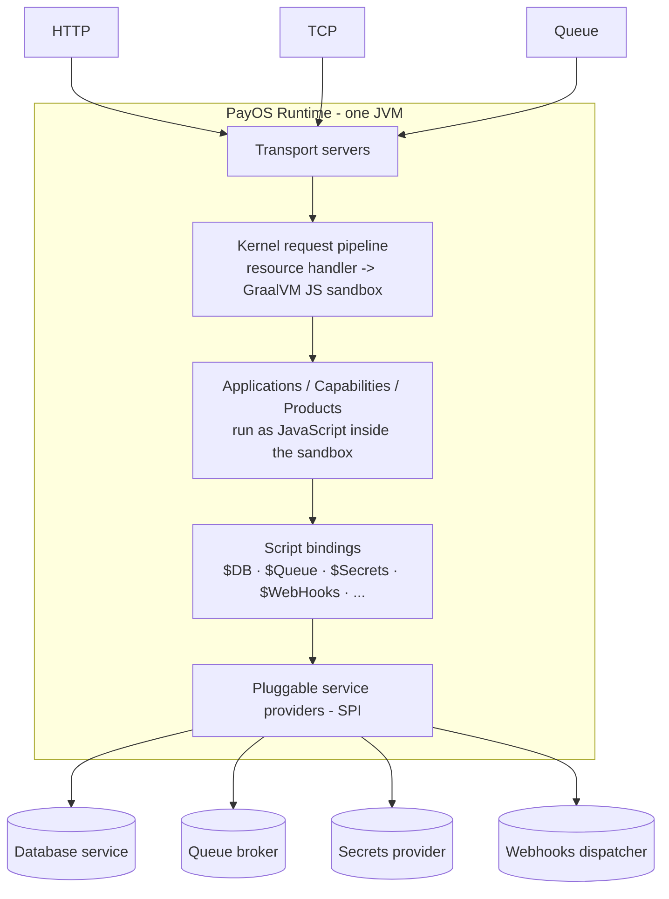

# What is PayOS

PayOS is an **API-first, multi-tenant runtime platform** for building and operating financial applications. Business logic is written as **JavaScript** that runs inside a sandboxed engine on top of a high-performance Java core. Applications are deployed *into* the runtime rather than each being its own server, so a single PayOS process can host many applications, capabilities, and products for many tenants at once.

PayOS targets a demanding enterprise environment:

- A multi-product ecosystem (gateway, issuing, acquiring, switching, analytics). - Multi-tenant by design, serving Tier 1–3 financial institutions and SMB segments. 
- Deployable on-premise, as PaaS, and on public cloud — from the **same** artifact.
- Operating under regulatory constraints, in particular **PCI DSS**.

## The mental model

The Java core is **rigid and high-performance**; the JavaScript applications are the **flexible guest layer**. The core is never modified to add a feature — extensibility happens through the guest layer, service-provider connectors, and Java extensions.

## Design principles

PayOS organizes its design principles into a hierarchy. They are reproduced here because every other document in this set is an application of one or more of them.

### Platform identity — *what PayOS fundamentally is*

| Principle | Meaning |
| --- | --- |
| **API-First** | Every capability is exposed through APIs before anything else. |
| **Rigid Core + Flexible Guest Layer** | A high-performance core stays stable; extensibility happens without modifying it. |
| **Externalized Runtime** | Applications run *inside* the runtime; the app is decoupled from the server. |
| **Financial data first** | Data integrity, traceability, and reconciliation drive design decisions. |
| **Platform first** | Capabilities are built once and reused across products. |
| **Secure & compliant by design** | Security and regulatory constraints (notably PCI DSS) are embedded structurally. |
| **Native multi-tenancy** | Isolation is enforced by architecture, not by applications. |
| **Modular by design** | Clear boundaries and replaceable modules; no tight coupling. |
| **Deployment agnostic** | The same product runs on-prem, private cloud, and public cloud. |

### Structural design — *shapes system architecture and evolution*

These principles materialize in the [architecture](../architecture/README.md): the kernel / guest-layer, the SPI connector model, the transport abstraction, and the tenant scope mechanism.

### Engineering discipline — *ensures sustainability and productivity*

| Principle | Meaning |
| --- | --- |
| **Convention over configuration** | Standardized defaults reduce variability and onboarding time. |
| **Architectural minimalism** | Avoid unnecessary layers and complexity. |
| **Low cognitive load** | Architecture and tooling reduce friction and onboarding effort. |

## Where to go next

- Architects: [Architecture](../architecture/README.md).
- Developers: [Developer guide](../developer/README.md).
- Operators: [Operations guide](../operations/README.md).
- Everyone: continue with the [Ecosystem & module map](ecosystem.md).
